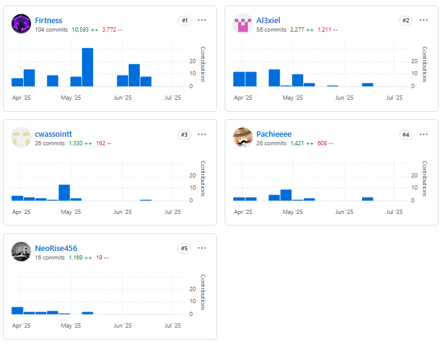
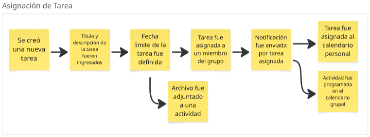
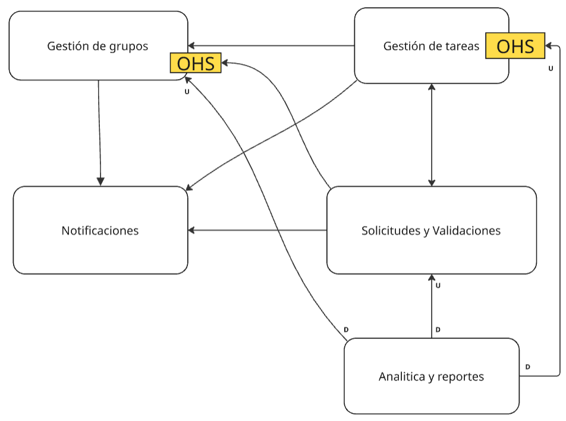
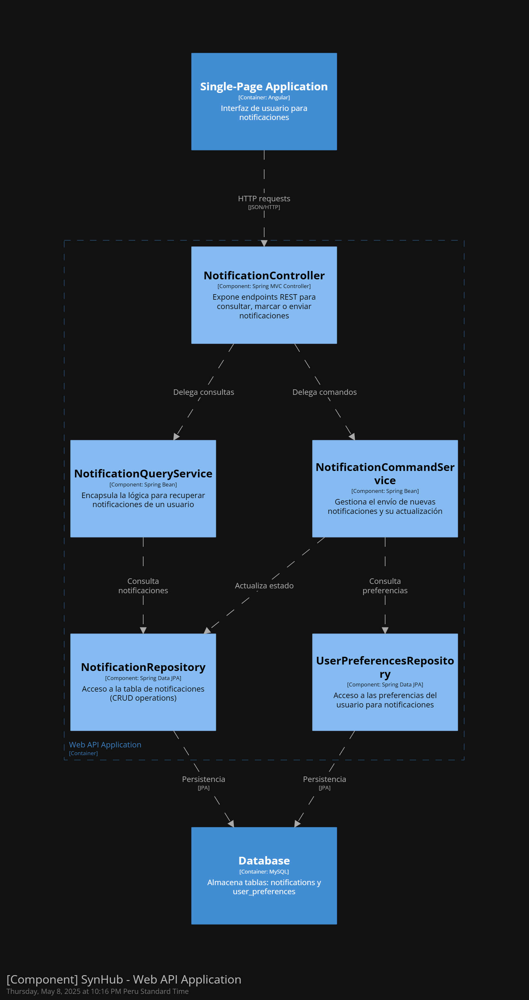
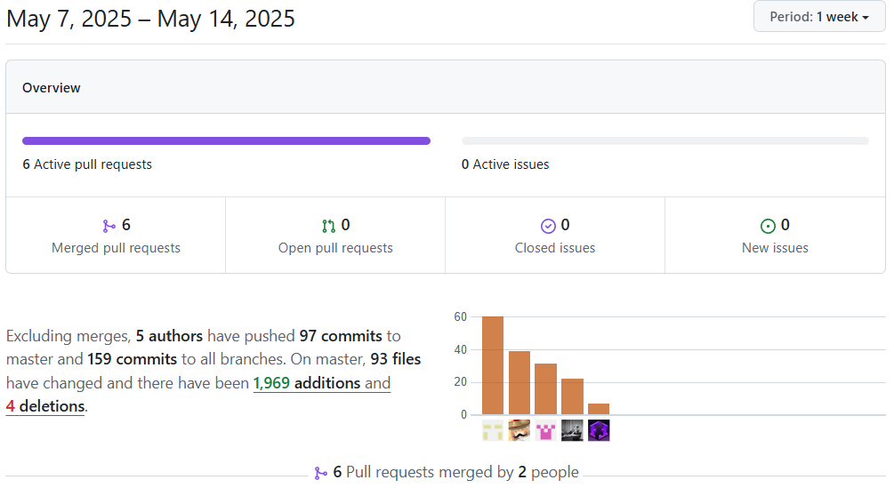

# Universidad Peruana de Ciencias Aplicadas

### **CURSO:** Aplicaciones para Dispositivos Moviles

### **NRC**: 358

### **Profesor:** Eduardo Martin Reyes Rodriguez

### **Ingeniería de software**

## Informe de Trabajo Final

### **Nombre del startup:** NRG4

### **Nombre del producto:** SynHome

## **Integrantes**


| **Nombre**                                | **Codigo** |
| ----------------------------------------- | ---------- |
| **Alejo Cardenas Jose Antonio**           | U202122484 |
| **Astonitas Díaz Juan Diego**            | U202110237 |
| **Casas Sanchez Gabriel Alexander**       | U202220033 |
| **Pacheco Astiguetta Sebastian**          | U202110291 |
| **Pasquale Barrenechea Gianluca Santino** | U202112078 |

**Abril 2025**

## Registro de Versiones del Informe

<table>
  <thead>
    <tr>
      <th>Versión</th>
      <th>Fecha</th>
      <th>Autor</th>
      <th>Descripción de modificación</th>
    </tr>
  </thead>
  <tbody>
    <tr>
      <td>0.1</td>
      <td>2025-04-02</td>
      <td>Casas Sanchez Gabriel Alexander, Astonitas Díaz Juan Diego y Pacheco Astiguetta Sebastian</td>
      <td>Desarrollo de los ítems: 1.1. Startup Profile, que incluye los subítems 1.1.1. Descripción de la Startup y 1.1.2. Perfiles de integrantes del equipo. Luego se presenta el 1.2. Solution Profile, que contiene los apartados 1.2.1. Antecedentes y problemática y 1.2.2. Lean UX Process, el cual se desglosa en 1.2.2.1. Lean UX Problem Statements, 1.2.2.2, 1.2.2.3 y 1.2.2.4. Finalmente, se desarrolla la sección 1.3. Lean UX Assumptions, que incluye los ítems Lean UX Hypothesis Statements, Lean UX Canvas y Segmentos objetivo.</td>
    </tr>
    <tr>
      <td>0.2</td>
      <td>2025-04-07</td>
      <td>Pasquale Barrenechea Gianluca Santino y Alejo Cardenas Jose Antonio</td>
      <td>Desarrollo de los ítems: La sección 2 del informe está compuesta por varios apartados clave, comenzando con el 2.1. Competidores, que abarca los subítems 2.1.1. Análisis competitivo y 2.1.2. Estrategias y tácticas frente a competidores. Luego se desarrolla el 2.2. Entrevistas, que incluye 2.2.1. Diseño de entrevistas, 2.2.2. Registro de entrevistas y 2.2.3. Análisis de entrevistas. A continuación, se presenta el 2.3. Needfinding, compuesto por 2.3.1. User Personas, 2.3.2. User Task Matrix, 2.3.3. User Journey Mapping, 2.3.4. Empathy Mapping y 2.3.5. As-is Scenario Mapping. Finalmente, se cierra esta parte del informe con el apartado 2.4. Ubiquitous Language.</td>
    </tr>
    <tr>
      <td>0.3</td>
      <td>2025-04-18</td>
      <td>Alejo Cardenas Jose Antonio, Astonitas Díaz Juan Diego</td>
      <td>Desarrollo de los ítems: 3.1. To-Be Scenario Mapping, 3.2. Avance de las User Stories, 3.3. Impact Mapping y 3.4. Avance del Product Backlog.</td>
    </tr>
    <tr>
      <td>0.4</td>
      <td>2025-04-21</td>
      <td>Casas Sanchez Gabriel Alexander, Alejo Cardenas Jose Antonio, Astonitas Díaz Juan Diego, Pasquale Barrenechea Gianluca Santino y Pacheco Astiguetta Sebastian</td>
      <td>Desarrollo de los ítems: 3.2. Finalizacion de las User Stories, 3.4. Finalizacion del Product Backlog, 4.1. Strategic-Level Domain-Driven Design y comprende los siguientes subítems: 4.1.1. EventStorming, que a su vez incluye 4.1.1.1. Candidate Context Discovery, 4.1.1.2, 4.1.1.3. Domain Message Flows Modeling y Bounded Context Canvases. También se desarrolla el apartado 4.1.2. Context Mapping y 4.1.3. Software Architecture, que contiene 4.1.3.1. Software Architecture Context Level Diagrams, 4.1.3.2. Software Architecture Container Level Diagrams y 4.1.3.3 Software Architecture Deployment Diagrams.  </td>
    </tr>
    <tr>
      <td>1.0</td>
      <td>2025-04-22</td>
      <td>Casas Sanchez Gabriel Alexander, Astonitas Díaz Juan Diego y Alejo Cardenas Jose Antonio</td>
      <td>Revisión completa hasta el capitulo 4, corrección ortográfica y coherencia global del reporte.</td>
    </tr>
<tr>
      <td>1.1</td>
      <td>2025-05-07</td>
      <td>Casas Sanchez Gabriel Alexander, Alejo Cardenas Jose Antonio</td>
      <td>General Style Guidelines,Organization Systems,Labelling Systems ,SEO Tags and Meta Tags ,Searching Systems ,Navigation Systems,Landing Page Wireframe ,Landing Page Mock-up ,Mobile Applications Wireframes ,Mobile Applications Wireflow Diagrams ,Mobile Applications Mock-ups ,Mobile Applications User Flow Diagrams y Mobile Applications Prototyping .</td>
    </tr>
<tr>
      <td>1.2</td>
      <td>2025-05-10</td>
      <td>Alejo Cardenas Jose Antonio, Astonitas Díaz Juan Diego, Pasquale Barrenechea Gianluca Santino y Pacheco Astiguetta Sebastian</td>
      <td>Bounded Context: Solicitudes y Validaciones,Bounded Context: Gestión de tareas,Bounded Context: Notificaciones,Bounded context: Analitica y Reportes,Bounded Context: Gestión de grupos.</td>
    </tr>
<tr>
      <td>2.0</td>
      <td>2025-05-14</td>
      <td>Casas Sanchez Gabriel Alexander y Alejo Cardenas Jose Antonio</td>
      <td>Software Development Environment Configuration , Source Code Management ,Source Code Style Guide & Conventions ,Software Deployment Configuration,Sprint Planning 1 ,Sprint Backlog 1,Development Evidence for Sprint Review ,Testing Suite Evidence for Sprint Review ,Execution Evidence for Sprint Review ,Services Documentation Evidence for Sprint Review ,Software Deployment Evidence for Sprint Review ,Team Collaboration Insights during Sprint</td>
    </tr>
<tr>
  <td>2.1</td>
  <td>2025-06-04</td>
  <td>Casas Sanchez Gabriel Alexander</td>
  <td>Desarrollo del ítem 6.2.2.1. Sprint Planning 2.</td>
</tr>
<tr>
  <td>2.2</td>
  <td>2025-06-09</td>
  <td>Alejo Cardenas Jose Antonio y Casas Sanchez Gabriel Alexander</td>
  <td>Desarrollo del ítem 6.2.2.2. Sprint Backlog 2.</td>
</tr>
<tr>
  <td>2.3</td>
  <td>2025-06-10</td>
  <td>Alejo Cardenas Jose Antonio</td>
  <td>Desarrollo de los ítems: 6.2.2.3. Development Evidence for Sprint Review, 6.2.2.4. Testing Suite Evidence for Sprint Review, 6.2.2.5. Execution Evidence for Sprint Review, 6.2.2.6. Services Documentation Evidence for Sprint Review, 6.2.2.7. Software Deployment Evidence for Sprint Review, 6.2.2.8. Team Collaboration Insights during Sprint.</td>
</tr>
<tr>
  <td>2.4</td>
  <td>2025-06-12</td>
  <td>Casas Sanchez Gabriel Alexander, Astonitas Díaz Juan Diego, Pacheco Astiguetta Sebastian y Pasquale Barrenechea Gianluca Santino</td>
  <td>Desarrollo del ítem 6.3.1. Diseño de Entrevistas.</td>
</tr>
<tr>
  <td>2.5</td>
  <td>2025-06-14</td>
  <td>Casas Sanchez Gabriel Alexander, Alejo Cardenas Jose Antonio, Astonitas Díaz Juan Diego, Pacheco Astiguetta Sebastian y Pasquale Barrenechea Gianluca Santino</td>
  <td>Desarrollo del ítem 6.3.2. Registro de Entrevistas.</td>
</tr>
<tr>
  <td>2.6</td>
  <td>2025-06-15</td>
  <td>Casas Sanchez Gabriel Alexander, Astonitas Díaz Juan Diego, Pacheco Astiguetta Sebastian y Pasquale Barrenechea Gianluca Santino</td>
  <td>Desarrollo del ítem 6.3.3. Evaluaciones según heurísticas.</td>
</tr>
<tr>
  <td>2.7</td>
  <td>2025-06-16</td>
  <td>Casas Sanchez Gabriel Alexander</td>
  <td>Desarrollo del ítem 6.4. Video About-the-Product.</td>
</tr>
<tr>
  <td>3.0</td>
  <td>2025-06-17</td>
  <td>Alejo Cardenas Jose Antonio</td>
  <td>Avance de ítems: Conclusiones, Bibliografía y Anexos.</td>
</tr>
<tr>
  <td>3.1</td>
  <td>2025-06-20</td>
  <td>Casas Sanchez Gabriel Alexander</td>
  <td>Desarrollo del ítem 6.2.3.1. Sprint Planning 3.</td>
</tr>
<tr>
  <td>3.2</td>
  <td>2025-06-21</td>
  <td>Casas Sanchez Gabriel Alexander</td>
  <td>Desarrollo del ítem 6.2.3.2. Sprint Backlog 3.</td>
</tr>
<tr>
  <td>3.3</td>
  <td>2025-06-22</td>
  <td>Alejo Cardenas Jose Antonio</td>
  <td>Desarrollo de los ítems: 6.2.3.3. Development Evidence for Sprint Review, 6.2.3.4. Testing Suite Evidence for Sprint Review, 6.2.3.8. Team Collaboration Insights during Sprint.</td>
</tr>
<tr>
  <td>3.4</td>
  <td>2025-06-23</td>
  <td>Pasquale Barrenechea Gianluca Santino, Pacheco Astiguetta Sebastian, Astonitas Díaz Juan Diego</td>
  <td>Desarrollo de los ítems: 6.2.3.5. Execution Evidence for Sprint Review, 6.2.3.6. Services Documentation Evidence for Sprint Review, 6.2.3.7. Software Deployment Evidence for Sprint Review.</td>
</tr>
<tr>
  <td>4.0</td>
  <td>2025-06-24</td>
  <td>Alejo Cardenas Jose Antonio</td>
  <td>Finalización de Conclusiones, Bibliografía y Anexos.</td>
</tr>
  </tbody>
</table>

## Project Report Collaboration Insights

El enlace a github del reporte del proyecto es el siguiente: [https://github.com/NRG-4/report](https://github.com/NRG-4/report).

Entrega TB1 (23/04/2025):


Para esta primera entrega se desarollaron los cpaítulos del 1 al 4, en la captura adjuntada se evidencia del trabajo colaborativo de github. Todos los integrantes del grupo trabajaron en el proyecto.

Recapitulando los commits se dividieron de la siguiente manera:

* Alejo Cardenas Jose Antonio (Firtness): 30 commits
* Astonitas Díaz Juan Diego (NeoRise456): 13 commits
* Casas Sanchez Gabriel Alexander (Al3xiel): 31 commits
* Pacheco Astiguetta Sebastian (Pachieeee): 11 commits
* Pasquale Barrenechea Gianluca Santino (cwassointt): 10 commits

Entrega TP (14/05/2025):


Para esta entrega se desarollo el capitulo 5, en la captura adjuntada se evidencia del trabajo colaborativo de github. Todos los integrantes del grupo trabajaron en el proyecto.

Recapitulando los commits se dividieron de la siguiente manera:

* Alejo Cardenas Jose Antonio (Firtness): 48 commits
* Astonitas Díaz Juan Diego (NeoRise456): 8 commits
* Casas Sanchez Gabriel Alexander (Al3xiel): 27 commits
* Pacheco Astiguetta Sebastian (Pachieeee): 17 commits
* Pasquale Barrenechea Gianluca Santino (cwassointt): 18 commits


Entrega TB2 (19/06/2025):





Para esta entrega se desarollo el capitulo 6, en la captura adjuntada se evidencia del trabajo colaborativo de github. Todos los integrantes del grupo trabajaron en el proyecto.

Recapitulando los commits se dividieron de la siguiente manera:

* Alejo Cardenas Jose Antonio (Firtness): 104 commits
* Astonitas Díaz Juan Diego (NeoRise456): 16 commits
* Casas Sanchez Gabriel Alexander (Al3xiel): 56 commits
* Pacheco Astiguetta Sebastian (Pachieeee): 26 commits
* Pasquale Barrenechea Gianluca Santino (cwassointt): 26 commits

Entrega TF (9/07/2025):


Para esta entrega se desarollo el capitulo 6, en la captura adjuntada se evidencia del trabajo colaborativo de github. Todos los integrantes del grupo trabajaron en el proyecto.

Recapitulando los commits se dividieron de la siguiente manera:

* Alejo Cardenas Jose Antonio (Firtness): 104 commits
* Astonitas Díaz Juan Diego (NeoRise456): 16 commits
* Casas Sanchez Gabriel Alexander (Al3xiel): 56 commits
* Pacheco Astiguetta Sebastian (Pachieeee): 26 commits
* Pasquale Barrenechea Gianluca Santino (cwassointt): 26 commits

## Contenido

- [Universidad Peruana de Ciencias Aplicadas](#universidad-peruana-de-ciencias-aplicadas)
    - [**CURSO:** Aplicaciones para Dispositivos Moviles](#curso-aplicaciones-para-dispositivos-moviles)
    - [**NRC**: 358](#nrc-358)
    - [**Profesor:** Eduardo Martin Reyes Rodriguez](#profesor-eduardo-martin-reyes-rodriguez)
    - [**Ingeniería de software**](#ingeniería-de-software)
  - [Informe de Trabajo Final](#informe-de-trabajo-final)
    - [**Nombre del startup:** NRG4](#nombre-del-startup-nrg4)
    - [**Nombre del producto:** SynHome](#nombre-del-producto-synhome)
  - [**Integrantes**](#integrantes)
  - [Registro de Versiones del Informe](#registro-de-versiones-del-informe)
  - [Project Report Collaboration Insights](#project-report-collaboration-insights)
  - [Contenido](#contenido)
  - [Student Outcome](#student-outcome)
  - [Objetivos SMART](#objetivos-smart)
      - [1.1.2. Perfiles de integrantes del equipo](#112-perfiles-de-integrantes-del-equipo)
    - [1.2. Solution Profile](#12-solution-profile)
      - [1.2.1. Antecedentes y problemática](#121-antecedentes-y-problemática)
      - [1.2.2. Lean UX Process](#122-lean-ux-process)
        - [1.2.2.1. Lean UX Problem Statements](#1221-lean-ux-problem-statements)
        - [1.2.2.2. Lean UX Assumptions](#1222-lean-ux-assumptions)
        - [1.2.2.3. Lean UX Hypothesis Statements](#1223-lean-ux-hypothesis-statements)
        - [1.2.2.4. Lean UX Canvas](#1224-lean-ux-canvas)
    - [1.3. Segmentos Objetivo](#13-segmentos-objetivo)
  - [Capítulo II: Requirements Elicitation \& Analysis](#capítulo-ii-requirements-elicitation--analysis)
    - [2.1. Competidores](#21-competidores)
      - [2.1.1. Análisis competitivo](#211-análisis-competitivo)
      - [2.1.2. Estrategias y tácticas frente a competidores](#212-estrategias-y-tácticas-frente-a-competidores)
    - [2.2. Entrevistas](#22-entrevistas)
      - [2.2.1. Diseño de entrevistas](#221-diseño-de-entrevistas)
      - [2.2.2. Registro de entrevistas](#222-registro-de-entrevistas)
      - [2.2.3. Análisis de entrevistas](#223-análisis-de-entrevistas)
    - [2.3. Needfinding](#23-needfinding)
      - [2.3.1. User Personas](#231-user-personas)
      - [2.3.2. User Task Matrix](#232-user-task-matrix)
      - [2.3.3. User Journey Mapping](#233-user-journey-mapping)
      - [2.3.4. Empathy Mapping](#234-empathy-mapping)
      - [2.3.5. As-is Scenario Mapping](#235-as-is-scenario-mapping)
    - [2.4. Ubiquitous Language](#24-ubiquitous-language)
  - [Capítulo III: Requirements specification](#capítulo-iii-requirements-specification)
    - [3.1. To-Be Scenario Mapping](#31-to-be-scenario-mapping)
    - [3.2. User Stories](#32-user-stories)
    - [3.3. Impact Mapping](#33-impact-mapping)
    - [3.4. Product Backlog](#34-product-backlog)
  - [Capítulo IV: Solution Software Design](#capítulo-iv-solution-software-design)
    - [4.1. Strategic-Level Domain-Driven Design](#41-strategic-level-domain-driven-design)
      - [4.1.1. EventStorming](#411-eventstorming)
        - [4.1.1.1. Candidate Context Discovery](#4111-candidate-context-discovery)
        - [4.1.1.2. Domain Message Flows Modeling](#4112-domain-message-flows-modeling)
        - [4.1.1.3. Bounded Context Canvases](#4113-bounded-context-canvases)
      - [4.1.2. Context Mapping](#412-context-mapping)
      - [4.1.3. Software Architecture](#413-software-architecture)
        - [4.1.3.1. Software Architecture Context Level Diagrams](#4131-software-architecture-context-level-diagrams)
        - [4.1.3.2. Software Architecture Container Level Diagrams](#4132-software-architecture-container-level-diagrams)
        - [4.1.3.3. Software Architecture Deployment Diagrams](#4133-software-architecture-deployment-diagrams)
    - [4.2. Tactical-Level Domain-Driven Design](#42-tactical-level-domain-driven-design)
      - [4.2.1. Bounded Context: Analítica y Reportes](#421-bounded-context-analítica-y-reportes)
        - [4.2.1.1. Domain Layer](#4211-domain-layer)
        - [4.2.1.2. Interface Layer](#4212-interface-layer)
        - [4.2.1.3. Application Layer](#4213-application-layer)
        - [4.2.1.4. Infrastructure Layer](#4214-infrastructure-layer)
        - [4.2.1.5. Bounded Context Software Architecture Component Level Diagrams](#4215-bounded-context-software-architecture-component-level-diagrams)
        - [4.2.1.6. Bounded Context Software Architecture Code Level Diagrams](#4216-bounded-context-software-architecture-code-level-diagrams)
        - [4.2.1.6.1. Bounded Context Domain Layer Class Diagrams](#42161-bounded-context-domain-layer-class-diagrams)
      - [4.2.2. Bounded Context: Notificaciones](#422-bounded-context-notificaciones)
        - [4.2.2.1. Domain Layer](#4221-domain-layer)
        - [4.2.2.2. Interface Layer](#4222-interface-layer)
        - [4.2.2.3. Application Layer](#4223-application-layer)
        - [4.2.2.4. Infrastructure Layer](#4224-infrastructure-layer)
        - [4.2.2.5. Bounded Context Software Architecture Component Level Diagrams](#4225-bounded-context-software-architecture-component-level-diagrams)
        - [4.2.2.6. Bounded Context Software Architecture Code Level Diagrams](#4226-bounded-context-software-architecture-code-level-diagrams)
        - [4.2.2.6.1. Bounded Context Domain Layer Class Diagrams](#42261-bounded-context-domain-layer-class-diagrams)
      - [4.2.3. Bounded Context: Gestión de grupos](#423-bounded-context-gestión-de-grupos)
        - [4.2.3.1. Domain Layer](#4231-domain-layer)
        - [4.2.3.2. Interface Layer](#4232-interface-layer)
        - [4.2.3.3. Application Layer](#4233-application-layer)
        - [4.2.3.4. Infrastructure Layer](#4234-infrastructure-layer)
        - [4.2.3.5. Bounded Context Software Architecture Component Level Diagrams](#4235-bounded-context-software-architecture-component-level-diagrams)
        - [4.2.3.6. Bounded Context Software Architecture Code Level Diagrams](#4236-bounded-context-software-architecture-code-level-diagrams)
          - [4.2.3.6.1. Bounded Context Domain Layer Class Diagrams](#42361-bounded-context-domain-layer-class-diagrams)
          - [4.2.3.6.2. Bounded Context Database Design Diagram](#42362-bounded-context-database-design-diagram)
      - [4.2.4. Bounded Context: Solicitudes y Validaciones](#424-bounded-context-solicitudes-y-validaciones)
        - [4.2.4.1. Domain Layer](#4241-domain-layer)
        - [4.2.4.2. Interface Layer](#4242-interface-layer)
        - [4.2.4.3. Application Layer](#4243-application-layer)
        - [4.2.4.4. Infrastructure Layer](#4244-infrastructure-layer)
        - [4.2.4.5. Bounded Context Software Architecture Component Level Diagrams](#4245-bounded-context-software-architecture-component-level-diagrams)
        - [4.2.4.6. Bounded Context Software Architecture Code Level Diagrams](#4246-bounded-context-software-architecture-code-level-diagrams)
          - [4.2.4.6.1. Bounded Context Domain Layer Class Diagrams](#42461-bounded-context-domain-layer-class-diagrams)
          - [4.2.4.6.2. Bounded Context Database Design Diagram](#42462-bounded-context-database-design-diagram)
        - [4.2.5.1. Domain Layer](#4251-domain-layer)
    - [**Aggregate: `TaskAggregate`**](#aggregate-taskaggregate)
    - [**Entities:**](#entities)
    - [**Value Objects**](#value-objects)
    - [**Factories**](#factories)
    - [**Domain Services**](#domain-services)
        - [4.2.5.2. Interface Layer](#4252-interface-layer)
    - [**Controllers**](#controllers)
        - [4.2.5.3. Application Layer](#4253-application-layer)
    - [**Command Handlers**](#command-handlers)
    - [**Event Handlers**](#event-handlers)
        - [4.2.5.4. Infrastructure Layer](#4254-infrastructure-layer)
    - [**Repositories**](#repositories)
        - [4.2.5.5. Bounded Context Software Architecture Component Level Diagrams](#4255-bounded-context-software-architecture-component-level-diagrams)
        - [4.2.5.6. Bounded Context Software Architecture Code Level Diagrams](#4256-bounded-context-software-architecture-code-level-diagrams)
          - [4.2.5.6.1. Bounded Context Domain Layer Class Diagrams](#42561-bounded-context-domain-layer-class-diagrams)
          - [4.2.5.6.2. Bounded Context Database Design Diagram](#42562-bounded-context-database-design-diagram)
  - [Capítulo V: Solution UI/UX Design](#capítulo-v-solution-uiux-design)
    - [5.1. Product Design](#51-product-design)
      - [5.1.1. Style Guidelines](#511-style-guidelines)
        - [5.1.1.1. General Style Guidelines](#5111-general-style-guidelines)
      - [5.1.2. Information Architecture](#512-information-architecture)
        - [5.1.2.1. Organization Systems](#5121-organization-systems)
        - [5.1.2.2. Labeling Systems](#5122-labeling-systems)
        - [5.1.2.3. SEO Tags and Meta Tags](#5123-seo-tags-and-meta-tags)
        - [5.1.2.4. Searching Systems](#5124-searching-systems)
        - [5.1.2.5. Navigation Systems](#5125-navigation-systems)
      - [5.1.3. Landing Page UI Design](#513-landing-page-ui-design)
        - [5.1.3.1. Landing Page Wireframe](#5131-landing-page-wireframe)
        - [5.1.3.2. Landing Page Mock-up](#5132-landing-page-mock-up)
      - [5.1.4. Mobile Applications UX/UI Design](#514-mobile-applications-uxui-design)
        - [5.1.4.1. Mobile Applications Wireframes](#5141-mobile-applications-wireframes)
        - [5.1.4.2. Mobile Applications Wireflow Diagrams](#5142-mobile-applications-wireflow-diagrams)
        - [5.1.4.3. Mobile Applications Mock-ups](#5143-mobile-applications-mock-ups)
        - [5.1.4.4. Mobile Applications User Flow Diagrams](#5144-mobile-applications-user-flow-diagrams)
        - [5.1.4.5. Mobile Applications Prototyping](#5145-mobile-applications-prototyping)
  - [Capítulo VI: Product Implementation, Validation \& Deployment](#capítulo-vi-product-implementation-validation--deployment)
    - [6.1. Software Configuration Management](#61-software-configuration-management)
      - [6.1.1. Software Development Environment Configuration](#611-software-development-environment-configuration)
      - [6.1.2. Source Code Management](#612-source-code-management)
      - [6.1.3. Source Code Style Guide \& Conventions](#613-source-code-style-guide--conventions)
      - [6.1.4. Software Deployment Configuration](#614-software-deployment-configuration)
    - [6.2. Landing Page \& Mobile Application Implementation](#62-landing-page--mobile-application-implementation)
      - [6.2.1. Sprint 1](#621-sprint-1)
        - [6.2.1.1. Sprint Planning 1](#6211-sprint-planning-1)
        - [6.2.1.2. Sprint Backlog 1](#6212-sprint-backlog-1)
        - [6.2.1.3. Development Evidence for Sprint Review](#6213-development-evidence-for-sprint-review)
        - [6.2.1.4. Testing Suite Evidence for Sprint Review](#6214-testing-suite-evidence-for-sprint-review)
        - [6.2.1.5. Execution Evidence for Sprint Review](#6215-execution-evidence-for-sprint-review)
        - [6.2.1.6. Services Documentation Evidence for Sprint Review](#6216-services-documentation-evidence-for-sprint-review)
        - [6.2.1.7. Software Deployment Evidence for Sprint Review](#6217-software-deployment-evidence-for-sprint-review)
        - [6.2.1.8. Team Collaboration Insights during Sprint](#6218-team-collaboration-insights-during-sprint)
    - [6.2.1. Sprint 2](#621-sprint-2)
      - [6.2.2.1. Sprint Planning 2.](#6221-sprint-planning-2)
      - [6.2.2.2. Sprint Backlog 2.](#6222-sprint-backlog-2)
      - [6.2.2.3. Development Evidence for Sprint Review.](#6223-development-evidence-for-sprint-review)
      - [6.2.2.4. Testing Suite Evidence for Sprint Review.](#6224-testing-suite-evidence-for-sprint-review)
      - [6.2.2.5. Execution Evidence for Sprint Review.](#6225-execution-evidence-for-sprint-review)
      - [6.2.2.6. Services Documentation Evidence for Sprint Review.](#6226-services-documentation-evidence-for-sprint-review)
      - [6.2.2.7. Software Deployment Evidence for Sprint Review.](#6227-software-deployment-evidence-for-sprint-review)
      - [6.2.2.8. Team Collaboration Insights during Sprint.](#6228-team-collaboration-insights-during-sprint)
    - [6.2.3. Sprint 3](#623-sprint-3)
      - [6.2.3.1. Sprint Planning 3.](#6231-sprint-planning-3)
      - [6.2.3.2. Sprint Backlog 3.](#6232-sprint-backlog-3)
      - [6.2.3.3. Development Evidence for Sprint Review.](#6233-development-evidence-for-sprint-review)
      - [6.2.3.4. Testing Suite Evidence for Sprint Review.](#6234-testing-suite-evidence-for-sprint-review)
      - [6.2.3.5. Execution Evidence for Sprint Review.](#6235-execution-evidence-for-sprint-review)
      - [6.2.3.6. Services Documentation Evidence for Sprint Review.](#6236-services-documentation-evidence-for-sprint-review)
      - [6.2.3.7. Software Deployment Evidence for Sprint Review.](#6237-software-deployment-evidence-for-sprint-review)
      - [6.2.3.8. Team Collaboration Insights during Sprint.](#6238-team-collaboration-insights-during-sprint)
    - [6.3. Validation Interviews](#63-validation-interviews)
      - [6.3.1. Diseño de entrevistas](#631-diseño-de-entrevistas)
        - [Objetivo de la Entrevista](#objetivo-de-la-entrevista)
        - [Elementos de Validación](#elementos-de-validación)
        - [User Flows a Validar](#user-flows-a-validar)
        - [Formato de Registro de la Entrevista](#formato-de-registro-de-la-entrevista)
      - [6.3.2. Registro de entrevistas](#632-registro-de-entrevistas)
      - [6.3.3. Evaluaciones según heurísticas](#633-evaluaciones-según-heurísticas)
    - [6.4.  Video About-the-Product.](#64--video-about-the-product)
  - [Conclusiones](#conclusiones)
  - [Bibliografía](#bibliografía)
  - [Anexos](#anexos)

## Student Outcome

El curso contribuye al cumplimiento del Student Outcome ABET:

**ABET – EAC - Student Outcome 7**

Criterio: *La capacidad de adquirir y aplicar nuevos conocimientos según sea
necesario, utilizando estrategias deaprendizaje apropiadas.*

En el siguiente cuadro se describe las accionesrealizadas y enunciados de conclusiones
por parte del grupo, que permiten sustentar el haber alcanzado el logro del ABET –
EAC - Student Outcome 7.

<table>
  <thead>
    <tr>
      <th style="text-align: left;">Criterio específico</th>
      <th style="text-align: left;">Acciones realizadas</th>
      <th style="text-align: left;">Conclusiones</th>
    </tr>
  </thead>
  <tbody>
    <tr>
      <td>1. Actualiza conceptos y conocimientos necesarios para su desarrollo profesional y en especial para su proyecto en soluciones de software.</td>
      <td>
        <br> TB1: <br>Casas Sanchez Gabriel Alexander-TB1: Desarrollo de secciones clave como Startup Profile, Problem Statement, Business Canvas, Segmentos Objetivos y Solution Profile. Participó activamente en el modelado estratégico mediante Event Storming, desarrollando Candidate Context Discovery, Domain Message Flows Modeling, Bounded Context Canvases y Context Mapping.<br>  Alejo Cardenas Jose Antonio-TB1: Encargado del Análisis Competitivo y la definición de Estrategias y Tácticas frente a Competidores. Elaboró artefactos de investigación y diseño como la User Task Matrix, el As-is Scenario Mapping y Ubiquitous Language. Participó en la proyección del producto con To-Be Scenario Mapping, Impact Mapping, Software Architecture, User Stories y el Diseño de Entrevistas.<br> Astonitas Díaz Juan Diego-TB1: Responsable de la redacción de los Antecedentes y Problemática. Contribuyó con la definición de User Stories, la elaboración y registro de Entrevistas, así como el diseño de la Base de Datos (Database Design).<br> Pasquale Barrenechea Gianluca Santino-TB1: Desarrolló herramientas clave de diseño centradas en el usuario como User Personas, User Journey Mapping y Empathy Mapping. También participó en la definición de User Stories, el armado del Product Backlog y la realización de Entrevistas.<br> Pacheco Astiguetta Sebastian-TB1: Encargado del análisis de Assumptions y la formulación de Hypothesis Statements. Además, colaboró en la definición de User Stories y en la ejecución de Entrevistas.<br><br> TP: <br> <br>Casas Sanchez Gabriel Alexander-TP:General Style Guidelines,Organization Systems,Labelling Systems ,SEO Tags and Meta Tags ,Searching Systems ,Navigation Systems,Mobile Applications Wireframes ,Mobile Applications Wireflow Diagrams ,Mobile Applications User Flow Diagrams,Software Development Environment Configuration , Source Code Management ,Source Code Style Guide & Conventions ,Software Deployment Configuration
<br>Pacheco Astiguetta Sebastian-TP: Bounded Context: Solicitudes y Validaciones
<br>Astonitas Díaz Juan Diego-TP: Bounded Context: Gestión de grupos,Landing Page Wireframe y Landing Page Mock-up 
<br>Pasquale Barrenechea Gianluca Santino-TP: Bounded context: Analitica y Reportes y Bounded Context: Notificaciones
<br>Alejo Cardenas Jose Antonio-TP: Bounded Context: Gestión de tareas,Mobile Applications Mock-ups ,Mobile Applications Prototyping,Sprint Planning 1 ,Sprint Backlog 1,Development Evidence for Sprint Review ,Testing Suite Evidence for Sprint Review ,Execution Evidence for Sprint Review ,Services Documentation Evidence for Sprint Review ,Software Deployment Evidence for Sprint Review ,Team Collaboration Insights during Sprint.<br><br>TB2:<br>
Casas Sanchez Gabriel Alexander - TB2: Responsable de la planificación del Sprint 2 (Sprint Planning 2), contribuyó en la elaboración del Sprint Backlog 2. También lideró el diseño de entrevistas, participó en el registro de entrevistas y fue parte clave en las evaluaciones según heurísticas. Finalmente, elaboró el Video About-the-Product, destacando su aporte en planificación, investigación y comunicación del producto.<br>
Alejo Cardenas Jose Antonio - TB2: Encargado de la elaboración del Sprint Backlog 2 y principal responsable del desarrollo técnico durante el Sprint 2. Documentó evidencias de desarrollo, pruebas, ejecución, servicios y despliegue. Además, analizó la colaboración del equipo y registró entrevistas, asumiendo un rol clave en la ejecución técnica y la organización del proyecto. También lideró el avance de conclusiones, bibliografía y anexos del informe.<br>
Astonitas Díaz Juan Diego - TB2: Participó activamente en el diseño de entrevistas y su registro, además de contribuir en las evaluaciones según heurísticas, fortaleciendo el proceso de validación y recolección de feedback del producto.<br>
Pasquale Barrenechea Gianluca Santino - TB2: Colaboró en el diseño y registro de entrevistas, así como en la evaluación heurística, demostrando enfoque en la experiencia de usuario y validación del diseño.<br>
Pacheco Astiguetta Sebastian - TB2: Participó en el diseño y registro de entrevistas, y en las evaluaciones según heurísticas, aportando en la etapa de recolección de información y refinamiento de la solución desde la perspectiva del usuario.<br>
<br>TF:<br>
Casas Sanchez Gabriel Alexander - TF: Responsable de la planificación de actividades clave para actualizar conocimientos técnicos y metodológicos. Coordinó reuniones de revisión, fomentó el uso de metodologías ágiles y documentó aprendizajes aplicados al proyecto.<br>
Alejo Cardenas Jose Antonio - TF: Encargado principal de investigar y aplicar conceptos avanzados en arquitectura y desarrollo de software. Desarrolló mejoras en la estructura de servicios y controladores, asegurando buenas prácticas de codificación.<br>
Astonitas Díaz Juan Diego - TF: Colaboró en la integración de herramientas de validación de interfaces y testing, aportando a la actualización de procesos para garantizar la calidad técnica del proyecto.<br>
Pasquale Barrenechea Gianluca Santino - TF: Aplicó nuevos enfoques para optimizar la experiencia de usuario. Realizó pruebas de usabilidad y propuso mejoras basadas en tendencias actuales en diseño centrado en el usuario.<br>
Pacheco Astiguetta Sebastian - TF: Contribuyó en la revisión de prácticas de documentación técnica y despliegue, ayudando a estandarizar procesos y garantizar la calidad de la solución.<br>
      </td>
      <td>
        TB1:Durante el desarrollo del trabajo final, cada integrante del equipo actualizó y fortaleció sus conocimientos en metodologías ágiles, diseño centrado en el usuario, modelado estratégico y arquitectura de software. A través de la aplicación práctica de herramientas como Lean UX Canvas, Event Storming, Context Mapping y desarrollo de User Stories, logramos conectar la teoría con la ejecución de un proyecto real. Esta experiencia no solo nos permitió comprender mejor los conceptos aprendidos en clase, sino también integrarlos en la solución propuesta, elevando así nuestra preparación profesional y nuestra capacidad de enfrentar retos en el desarrollo de soluciones de software.<br>TP:El equipo ha demostrado una actualización efectiva de conceptos clave en diversas áreas del desarrollo de software, abordando tanto aspectos técnicos como de diseño y gestión. Desde la configuración del entorno de desarrollo, el manejo de código fuente y buenas prácticas de estilo, hasta la implementación de sistemas de navegación, etiquetado, SEO y diseño de interfaces móviles, se evidencia un dominio creciente de herramientas y metodologías actuales. Esta amplitud de conocimientos refleja una preparación profesional alineada con los requerimientos del proyecto y las demandas del sector tecnológico.<br>TB2:Durante el desarrollo del TB2, el equipo fortaleció y actualizó sus conocimientos en áreas clave del ciclo de vida del software, como la planificación de sprints, la elaboración de backlogs y la ejecución técnica utilizando Spring Boot y Kotlin. Se aplicaron conceptos esenciales sobre arquitectura, documentación de servicios, despliegue y validación de interfaces mediante entrevistas y evaluaciones heurísticas. Este proceso permitió afianzar buenas prácticas de ingeniería de software y consolidar competencias fundamentales para el desarrollo de soluciones tecnológicas reales y de calidad profesional.<br>
        TF: Durante este ciclo, el equipo actualizó y reforzó conocimientos clave para el desarrollo de software, aplicando buenas prácticas de planificación ágil, arquitectura limpia y validación de interfaces. Esta experiencia fortaleció sus capacidades técnicas y consolidó aprendizajes prácticos alineados a las necesidades reales del sector.  
      </td>
    </tr>
    <tr>
      <td>2. Reconoce la necesidad del aprendizaje permanente para el desempeño profesional y el desarrollo de proyectos en soluciones de software.</td>
      <td>
        <br> TB1: <br>Casas Sanchez Gabriel Alexander-TB1: Desarrollo de secciones clave como Startup Profile, Problem Statement, Business Canvas, Segmentos Objetivos y Solution Profile. Participó activamente en el modelado estratégico mediante Event Storming, desarrollando Candidate Context Discovery, Domain Message Flows Modeling, Bounded Context Canvases y Context Mapping.<br>  Alejo Cardenas Jose Antonio-TB1: Encargado del Análisis Competitivo y la definición de Estrategias y Tácticas frente a Competidores. Elaboró artefactos de investigación y diseño como la User Task Matrix, el As-is Scenario Mapping y Ubiquitous Language. Participó en la proyección del producto con To-Be Scenario Mapping, Impact Mapping, Software Architecture, User Stories y el Diseño de Entrevistas.<br> Astonitas Díaz Juan Diego-TB1: Responsable de la redacción de los Antecedentes y Problemática. Contribuyó con la definición de User Stories, la elaboración y registro de Entrevistas, así como el diseño de la Base de Datos (Database Design).<br> Pasquale Barrenechea Gianluca Santino-TB1: Desarrolló herramientas clave de diseño centradas en el usuario como User Personas, User Journey Mapping y Empathy Mapping. También participó en la definición de User Stories, el armado del Product Backlog y la realización de Entrevistas.<br> Pacheco Astiguetta Sebastian-TB1: Encargado del análisis de Assumptions y la formulación de Hypothesis Statements. Además, colaboró en la definición de User Stories y en la ejecución de Entrevistas.<br><br> TP: <br><br>Casas Sanchez Gabriel Alexander-TP:General Style Guidelines,Organization Systems,Labelling Systems ,SEO Tags and Meta Tags ,Searching Systems ,Navigation Systems,Mobile Applications Wireframes ,Mobile Applications Wireflow Diagrams ,Mobile Applications User Flow Diagrams,Software Development Environment Configuration , Source Code Management ,Source Code Style Guide & Conventions ,Software Deployment Configuration
<br>Pacheco Astiguetta Sebastian-TP: Bounded Context: Solicitudes y Validaciones
<br>Astonitas Díaz Juan Diego-TP: Bounded Context: Gestión de grupos,Landing Page Wireframe y Landing Page Mock-up 
<br>Pasquale Barrenechea Gianluca Santino-TP: Bounded context: Analitica y Reportes y Bounded Context: Notificaciones
<br>Alejo Cardenas Jose Antonio-TP: Bounded Context: Gestión de tareas,Mobile Applications Mock-ups ,Mobile Applications Prototyping,Sprint Planning 1 ,Sprint Backlog 1,Development Evidence for Sprint Review ,Testing Suite Evidence for Sprint Review ,Execution Evidence for Sprint Review ,Services Documentation Evidence for Sprint Review ,Software Deployment Evidence for Sprint Review ,Team Collaboration Insights during Sprint <br><br>TB2:<br>
Casas Sanchez Gabriel Alexander - TB2: Responsable de la planificación del Sprint 2 (Sprint Planning 2), contribuyó en la elaboración del Sprint Backlog 2. También lideró el diseño de entrevistas, participó en el registro de entrevistas y fue parte clave en las evaluaciones según heurísticas. Finalmente, elaboró el Video About-the-Product, destacando su aporte en planificación, investigación y comunicación del producto.<br>
Alejo Cardenas Jose Antonio - TB2: Encargado de la elaboración del Sprint Backlog 2 y principal responsable del desarrollo técnico durante el Sprint 2. Documentó evidencias de desarrollo, pruebas, ejecución, servicios y despliegue. Además, analizó la colaboración del equipo y registró entrevistas, asumiendo un rol clave en la ejecución técnica y la organización del proyecto. También lideró el avance de conclusiones, bibliografía y anexos del informe.<br>
Astonitas Díaz Juan Diego - TB2: Participó activamente en el diseño de entrevistas y su registro, además de contribuir en las evaluaciones según heurísticas, fortaleciendo el proceso de validación y recolección de feedback del producto.<br>
Pasquale Barrenechea Gianluca Santino - TB2: Colaboró en el diseño y registro de entrevistas, así como en la evaluación heurística, demostrando enfoque en la experiencia de usuario y validación del diseño.<br>
Pacheco Astiguetta Sebastian - TB2: Participó en el diseño y registro de entrevistas, y en las evaluaciones según heurísticas, aportando en la etapa de recolección de información y refinamiento de la solución desde la perspectiva del usuario.<br>
<br>TF:<br>
Casas Sanchez Gabriel Alexander - TF: Promovió sesiones de retroalimentación y aprendizaje colaborativo para identificar oportunidades de mejora continua. Fomentó la búsqueda de recursos actualizados para mantener la vigencia del conocimiento técnico.<br>
Alejo Cardenas Jose Antonio - TF: Impulsó la adopción de nuevas tecnologías y herramientas, motivando la autoformación y la documentación de buenas prácticas para fortalecer el aprendizaje permanente.<br>
Astonitas Díaz Juan Diego - TF: Contribuyó con la actualización de procesos de pruebas y validación, buscando optimizar la eficiencia del equipo mediante el aprendizaje constante.<br>
Pasquale Barrenechea Gianluca Santino - TF: Investigó tendencias de diseño centrado en el usuario y compartió recursos útiles para mantener al equipo alineado a estándares actuales de experiencia de usuario.<br>
Pacheco Astiguetta Sebastian - TF: Colaboró en la mejora de procesos de despliegue y mantenimiento, aplicando nuevas prácticas para garantizar la evolución continua del proyecto.<br>
      </td>
      <td>
        TB1:El trabajo realizado evidenció la importancia del aprendizaje constante en el ámbito profesional. A lo largo del proyecto, nos enfrentamos a desafíos que requerían investigar nuevas herramientas, adoptar enfoques colaborativos y profundizar en técnicas no vistas previamente. Este proceso nos mostró que el conocimiento adquirido no es estático, sino que debe complementarse con una actitud activa hacia la mejora continua. Reconocemos que en un entorno tecnológico en constante evolución, solo mediante el aprendizaje permanente se puede ofrecer soluciones de calidad, adaptarse a las necesidades del usuario y desenvolverse de manera efectiva en el desarrollo profesional y de proyectos.<br>TP:Cada integrante ha asumido tareas que implican el uso de tecnologías y enfoques actualizados, lo cual demuestra una actitud activa hacia el aprendizaje continuo. La ejecución de entregables como wireflows, prototipos móviles, planificación ágil, documentación de servicios y evidencias de pruebas revela una disposición a explorar y aplicar nuevos conocimientos. Esta mentalidad de mejora constante y autoformación es esencial para afrontar los retos cambiantes del desarrollo de software y garantizar la evolución profesional a largo plazo.<br>TB2:La experiencia adquirida en el TB2 evidenció la importancia del aprendizaje continuo como elemento esencial para adaptarse a los desafíos tecnológicos. Los integrantes del equipo no solo aplicaron conocimientos previos, sino que también se enfrentaron a nuevas herramientas y técnicas, desarrollando habilidades mediante la investigación, la experimentación y el trabajo colaborativo. Esta dinámica reafirmó la necesidad de mantenerse en constante actualización para enfrentar con éxito la evolución de los lenguajes, metodologías y entornos en el ámbito del desarrollo de software.<br>
        TF: Durante el desarrollo del TF, el equipo reconoció la importancia del aprendizaje permanente como pilar para el desempeño profesional. Cada integrante fortaleció su capacidad de autoaprendizaje y adaptación, incorporando nuevas herramientas y enfoques para enfrentar retos tecnológicos cambiantes.<br>
      </td>
    </tr>
  </tbody>
</table>

## Objetivos SMART

**Casas Sánchez Gabriel Alexander**

Objetivo 1:
Desarrollar competencias avanzadas en backend mediante la obtención de una certificación oficial en Node.js dentro de los primeros 12 meses posteriores a la graduación, con el fin de calificar para roles como desarrollador fullstack en empresas tecnológicas.

Objetivo 2:
Colaborar activamente en al menos dos proyectos open source en GitHub dentro del primer año después de egresar, para fortalecer habilidades técnicas, manejo de control de versiones y trabajo en equipo remoto.

**Alejo Cárdenas José Antonio**

Objetivo 1:
Finalizar un diplomado especializado en frontend con React y fundamentos de UX/UI dentro de los primeros 10 meses tras culminar la carrera, para postular a posiciones como frontend developer.

Objetivo 2:
Diseñar y lanzar un portafolio web personal con mínimo tres proyectos reales antes de los primeros seis meses de egresado, que evidencie mis conocimientos en interfaces modernas, accesibilidad y diseño adaptable.

**Astonitas Díaz Juan Diego**

Objetivo 1:
Aplicar a programas de prácticas preprofesionales o puestos junior como backend developer en empresas de tecnología dentro de los seis meses posteriores a mi egreso, aprovechando mis conocimientos en bases de datos y APIs.

Objetivo 2:
Crear un proyecto personal funcional basado en microservicios usando Spring Boot y Docker dentro de los primeros ocho meses después de egresar, que pueda integrar a mi portafolio como evidencia de competencias técnicas.

**Pasquale Barrenechea Gianluca Santino**

Objetivo 1:
Participar en un bootcamp intensivo de desarrollo fullstack MERN en los primeros seis meses luego de la graduación, con el objetivo de dominar tanto el frontend como el backend en JavaScript.

Objetivo 2:
Publicar dos artículos técnicos en plataformas como Medium o Dev.to en el primer año tras egresar, compartiendo aprendizajes sobre desarrollo de software y buenas prácticas en proyectos web.

**Pacheco Astiguetta Sebastián**

Objetivo 1:
Postular a programas de talento junior o trainee en desarrollo fullstack dentro de los primeros siete meses tras finalizar la carrera, con enfoque en empresas tecnológicas emergentes.

Objetivo 2:
Finalizar un curso especializado en testing automatizado con Jest o Cypress antes de cumplir un año de egresado, con el fin de asegurar la calidad del software en proyectos reales.

#### 1.1.2. Perfiles de integrantes del equipo

<table>
  <tr>
    <th colspan="2"> Juan Diego Astonitas </th>
  </tr>
  <tr>
    <td>  </td>
    <td> Mi nombre es Juan Diego Astonitas Diaz, mi código de estudiante es u202110237 ,tengo 21 años, actualmente curso el 6to ciclo de la carrera de Ingeniería de Software, en la UPC en la sede San Miguel. Mis principales cualidades son el liderazgo y el dominio de NextJS. Haré todo lo que esté a mi alcance para respaldar al equipo en la finalización oportuna y efectiva de las tareas asignadas. </td>
  </tr>
  <tr>
    <th colspan="2"> Casas Sanchez Gabriel Alexander </th>
  </tr>
  <tr>
    <td>  </td>
    <td> Soy estudiante de Ingeniería de Software en sexto ciclo, con habilidades para dirigir y trabajar bien bajo presión. Aunque no disfruto mucho de los trabajos grupales, siempre asumo un rol destacado y sobresaliente en ellos, aprovechando mi capacidad académica y versatilidad. </td>
  </tr>
  <tr>
    <th colspan="2"> Gianluca Santino Pasquale Barrenechea </th>
  </tr>
  <tr>
    <td>  </td>
    <td> Me llamo Gianluca Santino Pasquale Barrenechea, estudiante de Ingeniería de Software (código u202112078). En nuestra Startup, me enfoco en el desarrollo frontend y backend, utilizando C++, C#, Python, Java, HTML y JavaScript. Mi objetivo es crear soluciones escalables y eficientes, mejorando la experiencia del usuario y optimizando la operación de la plataforma, siempre aplicando metodologías ágiles como Scrum. </td>
  </tr>
  <tr>
    <th colspan="2">Jose Antonio Alejo Cardenas</th>
  </tr>
  <tr>
    <td>  </td>
    <td> Soy José Alejo Cárdenas, estudiante de la carrera de Ingeniería de Software del sexto ciclo. Desde pequeño he sentido facinacion por la tecnologia en general sobretodo por el funcionamiento, desarrollo y proteccion del software en el ambito de ciberseguridad. He estudiado lenguajes de programacion (javascript, python y C++), bases de datos (Microsoft SQL Server y Mongo DB) y Sistemas Operativos (Kali Linux y Windows). Asi mismo, tengo experiencia con hardware a nivel de esamblamiento de equipos y funcionamiento del mismo con sus especificaciones tecnicas. Además, mi constante comunicacion y organizacion durante cualquier trabajo grupal aportara mucho dinamismo al proyecto. Mis principales hobbies son entrenar en el gimnasio, jugar videojuegos con mis amigos y salir a conversar con estos ultimos durante algun almuerzo o cena. Para el proyecto aportare organizacion, comunicacion e inspiracion durante todo el transcurso del mismo. </td>
  </tr>
  <tr>
    <th colspan="2">Sebastian Pacheco Astiguetta</th>
  </tr>
  <tr>
    <td>  </td>
    <td> Soy Sebastian Pacheco, tengo 22 años y soy alumno de Ingeniería de Software en la UPC. Me considero una persona trabajadora y activa, priorizando las responsabilidades ante todo, pero también destaco en trabajo en equipo, permitiendo a todos que participen. Tengo conocimiento de C++ y Python, los cuales pongo en práctica mediante proyectos personales. </td>
  </tr>
</table>

### 1.2. Solution Profile

**Problema identificado:** En el entorno actual, muchos equipos y grupos de trabajo, ya sean laborales, académicos o comunitarios, enfrentan dificultades para organizar sus actividades, distribuir responsabilidades de manera equitativa y mantener una comunicación clara entre sus integrantes. Esto puede provocar una sobrecarga en ciertos miembros del grupo, falta de coordinación, tareas duplicadas o abandonadas, y una caída general en la productividad y el bienestar del equipo. Aunque existen múltiples herramientas digitales, pocas han sido diseñadas específicamente para facilitar una gestión integral y colaborativa que se adapte a diferentes dinámicas grupales.

**Solución propuesta:**

La plataforma SynHub ofrece un entorno digital intuitivo y multifuncional que permite a los equipos gestionar sus actividades de forma colaborativa y eficiente:

- Desde el rol organizador o administrador:crear grupos,asignar miembros a los grupos, asignar tareas, hacer seguimiento del cumplimiento de responsabilidades y facilitar la organización interna del equipo.
- Desde el rol de integrante del equipo: consultar responsabilidades asignadas, recibir notificaciones y recordatorios, y proponer ajustes en tareas según el avance del grupo, visualizar responsabilidades asignadas y conocer la disponibilidad de otros miembros.

Gracias a funcionalidades como la personalización de tareas, historial de cumplimiento, objetos o recursos compartidos, y una interfaz clara para visualizar la carga del equipo, la plataforma impulsa la organización eficiente, la corresponsabilidad y una comunicación más fluida dentro de cualquier tipo de grupo.

#### 1.2.1. Antecedentes y problemática

**What**

- ¿Cuál es el problema?

El problema radica en la baja adopción de aplicaciones móviles diseñadas para la organización colaborativa. A pesar de la disponibilidad de diversas herramientas digitales, muchas personas y grupos siguen recurriendo a métodos improvisados o poco eficientes para coordinar actividades, lo que genera distribución desigual de tareas, falta de seguimiento, comunicación fragmentada y pérdida de productividad.

- ¿Cuál es la relación con la persona en cuestión?

La relación es ofrecer a los miembros de equipos o grupos una herramienta móvil accesible y centrada en sus necesidades reales, que facilite una organización más clara, una distribución de tareas efectiva y una comunicación más fluida, promoviendo así su uso y adopción en el día a día.

**When**

- ¿Cuándo sucede el problema?

El problema surge cuando los equipos y grupos deben coordinar actividades, repartir responsabilidades o mantener una comunicación constante para alcanzar objetivos comunes.

- ¿Cuándo utiliza el cliente el producto?

El cliente utiliza SynHub cuando necesita organizar, coordinar o participar en actividades grupales de manera eficiente, ya sea al inicio de un proyecto, durante la planificación de tareas o en el seguimiento de responsabilidades.

**Where**

- ¿Dónde está el cliente cuando usa el producto?

El cliente utiliza SynHub desde cualquier lugar con acceso a Internet, ya sea en su hogar, en la oficina, en el aula o incluso mientras se traslada.

- ¿Dónde surge el problema?

El problema surge dentro de los propios entornos donde se desarrollan actividades grupales, como oficinas, instituciones educativas, organizaciones comunitarias o espacios colaborativos, en los que la coordinación efectiva es clave para lograr objetivos comunes.

**Who**

- ¿Quienes se ven involucrados en el problema?

Se ven involucrados tanto los organizadores o coordinadores de equipos (como líderes de proyecto, docentes, jefes de área o representantes comunitarios) miembros de equipos de trabajo (como estudiantes, colaboradores, voluntarios o participantes) que enfrentan dificultades para organizarse, distribuir responsabilidades y comunicarse eficazmente.
**Why**

- ¿Cuáles son las causas del problema?

Las causas del problema radican en la falta de adopción de aplicaciones móviles para la organización de equipos. Esto se debe, en gran parte, a la resistencia al cambio, la baja percepción de valor inmediato y la falta de hábitos digitales consolidados en ciertos grupos. Aunque existen herramientas disponibles, muchas personas prefieren métodos tradicionales como chats informales, hojas de cálculo o notas físicas, ya que perciben las apps como innecesarias, complicadas o poco integradas a su rutina diaria. Además, la escasa promoción interna o el desconocimiento de las funcionalidades clave también limitan su uso efectivo.

**How**

- ¿En qué condiciones los clientes usan nuestro producto?

Los clientes usan SynHub cuando forman parte de equipos o grupos que necesitan coordinar actividades de manera organizada y colaborativa, especialmente en contextos donde hay múltiples tareas, horarios variables y responsabilidades compartidas.

**How Much**

- ¿Cuál es la magnitud del problema?

La magnitud del problema de desorganización y comunicación ineficaz en equipos es considerable. Según el State of Teams Report de Atlassian (2021), solo el 17% de los equipos se consideran "saludables", mientras que el 54% son parcialmente saludables y el 29% directamente insalubres (p. 12). Además, el 57% de los participantes admitió que sus equipos no operan con la eficiencia necesaria, lo que genera retrasos y afecta la productividad (Atlassian, 2021, p. 18). Esto se agrava por la falta de conexión interpersonal: el 56% de los miembros reportó sentirse poco vinculado con sus compañeros, y el 37% mencionó que no puede expresar ideas libremente por falta de seguridad psicológica (Atlassian, 2021, p. 24).

#### 1.2.2. Lean UX Process

El lean UX process es un enfoque iterativo centrado en el usuario para el diseño de proyectos y productos. Este enfoque se base en ciclos rápidos (sprints) de investigación, diseño y pruebas para validar la propuesta o ideas planteadas por el equipo. Estas propuestas estarán siempre orientadas a satisfacer las necesidades de los usuarios.

##### 1.2.2.1. Lean UX Problem Statements

En el entorno actual, tanto en contextos familiares como laborales y comunitarios, los grupos enfrentan grandes desafíos para coordinar tareas y mantener una comunicación fluida y estructurada entre sus miembros. Aunque existen herramientas digitales como aplicaciones de mensajería o tableros de tareas, muchas de estas soluciones son fragmentadas, poco integradas o carecen de una lógica colaborativa adaptada al trabajo en equipo cotidiano.

Esta falta de soluciones centralizadas y personalizables genera desorganización, distribución desigual de responsabilidades, olvidos, retrasos y fricciones entre los integrantes de un grupo. Ya sea en un entorno familiar, una oficina, un equipo de voluntariado o un pequeño negocio, la necesidad de una herramienta unificada que facilite la colaboración, la planificación y el seguimiento de actividades es cada vez más evidente.

SynHub nace como una plataforma digital diseñada para cubrir esta brecha: una solución integral para la gestión de grupos que permite distribuir tareas, visualizar reportes, recibir recordatorios y mejorar la eficiencia del trabajo en conjunto.

##### 1.2.2.2. Lean UX Assumptions

**User Assumptions (Suposiciones de Usuario)**

- ¿Quién es el usuario?: El usuario es alguien que busca una solución para organizar las tareas en un equipo y mejorar la comunicación entre los miembros.
- ¿Dónde encaja nuestro producto en su trabajo o vida?: Nuestro producto encaja en actividades grupales donde el usuario es partícipe junto a otros miembros, facilitando la gestión de tareas y responsabilidades dentro del equipo.
- ¿Qué problemas resuelve nuestro producto?: Nuestro producto resuelve problemas de desorganización y falta de comunicación dentro del equipo.
- ¿Cuándo y cómo se usa nuestro producto?: Nuestro producto se usa cuando hay necesidad de organización en actividades grupales, especialmente en momentos de planificación, seguimiento de tareas y coordinación entre miembros del equipo.
- ¿Qué características son importantes?: Las características importantes incluyen la asignación de tareas, el seguimiento del avance del equipo, la visualizacion de horarios del equipo, la comunicación estructurada y la posibilidad de adaptar la herramienta a diferentes dinámicas de grupo.
- ¿Cómo debe verse y comportarse nuestro producto?: Nuestro producto debe tener una interfaz intuitiva y amigable, que permita a los usuarios navegar fácilmente entre las distintas funcionalidades.

**Business Assumptions (Suposiciones de Negocio)**

- Necesidades y problemas: Creemos que los equipos de trabajo tienen la necesidad de organizar sus tareas de manera eficiente y mejorar la comunicación entre sus miembros.
- Plataforma: Estas necesidades se pueden resolver a través de una aplicación móvil que ofrezca herramientas para la gestión de tareas y la comunicación, proporcionando una experiencia fluida y accesible.
- Segmentación: Los usuarios de la aplicación serán coordinadores de equipos e integrantes de esos equipos que buscan una forma accesible de organizar sus responsabilidades.
- Comportamientos: El valor principal que un usuario quiere obtener de nuestro servicio es la facilidad de uso y la mejora en la organización y comunicación dentro del equipo.
- Beneficios: Los usuarios obtendrán beneficios como una mejor organización personal, mayor claridad sobre sus responsabilidades dentro del equipo, y una sensación de logro al completar tareas.
- Captación de clientes: Adquiriremos la mayoría de nuestros usuarios a través de campañas de marketing digital y recomendaciones de usuarios actuales en el ámbito laboral y educativo.
- Modelo de ingresos: Generaremos ingresos a través de la clasificación de la aplicación como uno de pago.
- Competencia: Nuestra principal competencia en el mercado serán aplicaciones similares que ofrecen funciones de organización y gestión de tareas.
- Ventaja competitiva: Superaremos a la competencia gracias a nuestro enfoque en la personalización, la facilidad de uso y la integración de funciones específicas para la gestión de equipos.

**Technical Assumptions (Suposiciones Técnicas)**

- Tecnología utilizada: Podemos utilizar tecnologías móviles actuales para desarrollar la aplicación.
- Integraciones: La aplicación se integrará con plataformas de comunicación utilizadas por los usuarios.
- Escalabilidad: La aplicación podrá escalar para soportar un número creciente de usuarios y datos.

**Market Assumptions (Suposiciones de Mercado)**

- Tamaño del mercado: Existe un mercado significativo de equipos que buscan soluciones para la organización y coordinación.
- Competencia: Las aplicaciones similares son los principales competidores.
- Tendencias: El mercado de aplicaciones de organización y productividad está en crecimiento, impulsado por la necesidad de soluciones digitales en entornos laborales y educativos.

**Design Assumptions (Suposiciones de Diseño)**

- Interacción del usuario: Los usuarios interactuarán con la aplicación con mayor facilidad si implementamos funciones de asignación de tareas claras, visualización del avance y recordatorios automáticos.
- Experiencia del usuario: Los usuarios valorarán una experiencia de organización simple, flexible, colaborativa y motivadora.
- Colores y la tipografía: Los usuarios prefieren una paleta de colores pastel y una tipografía moderna y legible.
- Preferencias visuales: Los usuarios consideran atractivo un diseño simple con íconos intuitivos.
- Prototipos y pruebas: Necesitamos validar la facilidad de uso y la efectividad del diseño a través de pruebas de usabilidad.

##### 1.2.2.3. Lean UX Hypothesis Statements

**Hypothesis Statement 01:**

- Creemos que el usuario es alguien que busca una solución para organizar las tareas en un equipo y mejorar la comunicación entre los miembros.
- Sabremos que estamos en lo correcto cuando veamos comentarios positivos de los usuarios sobre la efectividad de la aplicación y un aumento de usuarios registrados.

**Hypothesis Stamenent 02:**

- Creemos que el producto encaja en actividades grupales donde el usuario es partícipe junto a otros miembros, facilitando la gestión de tareas y responsabilidades dentro del equipo.
- Sabremos que estamos en lo correcto cuando veamos comentarios positivos sobre la facilidad de uso y la integración del producto en la dinámica de equipo.

**Hypothesis Stamenent 03:**

- Creemos que el producto resuelve problemas de desorganización y falta de comunicación dentro del equipo.
- Sabremos que estamos en lo correcto cuando los usuarios reporten una mejora en la organización y coordinación de su equipo mediante encuestas o reseñas.

**Hypothesis Stamenent 04:**

- Creemos que el producto se usa cuando hay necesidad de organización en actividades grupales, especialmente en momentos de planificación, seguimiento de tareas y coordinación.
- Sabremos que estamos en lo correcto cuando veamos un aumento en la frecuencia de uso de la aplicación.

**Hypothesis Stamenent 05:**

- Creemos que las características importantes incluyen la asignación de tareas, la visualización de horarios del equipo, conocer la disponibilidad de los miembros y la posibilidad de personalizar roles y permisos.
- Sabremos que estamos en lo correcto cuando veamos comentarios positivos de los usuarios sobre estas características y un aumento en la satisfacción del usuario.

**Hypothesis Stamenent 06:**

- Creemos que el producto debe tener una interfaz intuitiva y amigable, que permita a los usuarios navegar fácilmente entre las distintas funcionalidades.
- Sabremos que estamos en lo correcto cuando los usuarios reporten una experiencia de navegación fluida y fácil en pruebas de usabilidad y comentarios.

**Hypothesis Stamenent 07:**

- Creemos que los equipos de trabajo tienen la necesidad de organizar sus tareas de manera eficiente y mejorar la comunicación entre sus miembros.
- Sabremos que estamos en lo correcto cuando veamos un aumento en la adopción del producto por parte de equipos y comentarios positivos sobre su utilidad.

**Hypothesis Stamenent 08:**

- Creemos que estas necesidades se pueden resolver a través de una aplicación móvil que ofrezca herramientas para la gestión de tareas y la comunicación, proporcionando una experiencia fluida y accesible.
- Sabremos que estamos en lo correcto cuando la aplicación tenga una alta tasa de retención y satisfacción del usuario.

**Hypothesis Stamenent 09:**

- Creemos que los usuarios serán coordinadores de equipos e integrantes que buscan una forma accesible de organizar sus responsabilidades.
- Sabremos que estamos en lo correcto cuando la mayoría de los registros y perfiles de usuario coincidan con estos perfiles y necesidades.

**Hypothesis Stamenent 10:**

- Creemos que el valor principal que un usuario quiere obtener de nuestro servicio es la facilidad de uso y la mejora en la organización y comunicación dentro del equipo.
- Sabremos que estamos en lo correcto cuando veamos comentarios positivos sobre la facilidad de uso y la efectividad de la aplicación en la organización de tareas.

**Hypothesis Stamenent 11:**

- Creemos que los usuarios obtendrán beneficios como una mejor organización personal, mayor claridad sobre sus responsabilidades dentro del equipo, y una sensación de logro al completar tareas.
- Sabremos que estamos en lo correcto cuando veamos comentarios positivos sobre los beneficios percibidos y un aumento en la satisfacción del usuario.

**Hypothesis Stamenent 12:**

- Creemos que adquiriremos la mayoría de nuestros usuarios a través de campañas de marketing digital y recomendaciones de usuarios actuales en el ámbito laboral y educativo.
- Sabremos que estamos en lo correcto cuando veamos un aumento en la adquisición de usuarios a través de estos canales y un crecimiento en la base de usuarios.

**Hypothesis Stamenent 13:**

- Creemos que generaremos ingresos a través de la clasificación de la aplicación como uno de pago.
- Sabremos que estamos en lo correcto cuando veamos un aumento de ingresos provenientes de la compra de la aplicación.

**Hypothesis Stamenent 14:**

- Creemos que nuestra principal competencia en el mercado serán aplicaciones similares que ofrecen funciones de organización y gestión de tareas.
- Sabremos que estamos en lo correcto cuando veamos un análisis competitivo que confirme esta suposición.

**Hypothesis Stamenent 15:**

- Creemos que superaremos a la competencia gracias a nuestro enfoque en la personalización, la facilidad de uso y la integración de funciones específicas para la gestión de equipos.
- Sabremos que estamos en lo correcto cuando veamos comentarios positivos sobre estos aspectos y un aumento en la adopción de la aplicación en comparación con la competencia.

**Hypothesis Stamenent 16:**

- Creemos que podemos utilizar tecnologías móviles actuales para desarrollar la aplicación.
- Sabremos que estamos en lo correcto cuando veamos que la aplicación funciona sin problemas en dispositivos móviles y cumple con los estándares de rendimiento.

**Hypothesis Stamenent 17:**

- Creemos que la aplicación se integrará con otras plataformas de comunicación.
- Sabremos que estamos en lo correcto cuando veamos que la integración funciona sin problemas y los usuarios pueden comunicarse de manera efectiva.

**Hypothesis Stamenent 18:**

- Creemos que la aplicación podrá escalar para soportar un número creciente de usuarios y datos.
- Sabremos que estamos en lo correcto cuando veamos que la aplicación maneja un aumento en la carga de usuarios y datos sin problemas de rendimiento.

**Hypothesis Stamenent 19:**

- Creemos que existe un mercado significativo de equipos que buscan soluciones para la organización y coordinación.
- Sabremos que estamos en lo correcto cuando veamos un aumento en la adopción de la aplicación y un crecimiento en la base de usuarios.

**Hypothesis Stamenent 20:**

- Creemos que las aplicaciones similares son los principales competidores.
- Sabremos que estamos en lo correcto cuando veamos un análisis competitivo que confirme esta suposición y un aumento en la adopción de nuestra aplicación en comparación con la competencia.

**Hypothesis Stamenent 21:**

- Creemos que el mercado de aplicaciones de organización y productividad está en crecimiento, impulsado por la necesidad de soluciones digitales en entornos laborales y educativos.
- Sabremos que estamos en lo correcto cuando las estadísticas del sector y las tendencias de adopción confirmen este crecimiento.

**Hypothesis Stamenent 22:**

- Creemos que los usuarios interactuarán con la aplicación con mayor facilidad si implementamos recordatorios automáticos, organización por prioridades y asignación clara de tareas.
- Sabremos que estamos en lo correcto cuando veamos comentarios positivos sobre la facilidad de uso y la efectividad de estas características en la organización de tareas.

**Hypothesis Stamenent 23:**

- Creemos que los usuarios valorarán una experiencia de organización simple, flexible, colaborativa y motivadora.
- Sabremos que estamos en lo correcto cuando veamos comentarios positivos sobre la experiencia de usuario y un aumento en la satisfacción del usuario.

**Hypothesis Stamenent 24:**

- Creemos que los usuarios prefieren una paleta de colores pastel y una tipografía moderna y legible.
- Sabremos que estamos en lo correcto cuando veamos comentarios positivos sobre la estética de la aplicación y un aumento en la satisfacción del usuario.

**Hypothesis Stamenent 25:**

- Creemos que los usuarios consideran atractivo un diseño simple con iconos intuitivos.
- Sabremos que estamos en lo correcto cuando veamos comentarios positivos sobre la usabilidad y la estética de la aplicación.

**Hypothesis Stamenent 26:**

- Creemos que necesitamos validar la facilidad de uso y la efectividad del diseño a través de pruebas de usabilidad.
- Sabremos que estamos en lo correcto cuando veamos resultados positivos en las pruebas de usabilidad y comentarios constructivos de los usuarios.

##### 1.2.2.4. Lean UX Canvas


### 1.3. Segmentos Objetivo

**Segmento Objetivo #1: Coordinadores o Líderes de Grupo**

Este grupo incluye a personas que asumen la responsabilidad de organizar y gestionar las actividades dentro de un equipo o grupo. Pueden ser líderes de proyectos, responsables de logística en voluntariados, administradores de espacios compartidos, docentes coordinadores o encargados de comunidades (vecinales, académicas o laborales). Estas personas buscan una herramienta que les permita distribuir tareas, planificar actividades, hacer seguimiento del cumplimiento y facilitar la comunicación interna.
Características clave:

- Edad: 25 a 60 años
  - Género: Ambos
  - Contexto: Trabajo en equipo (laboral, educativo, comunitario o institucional)
  - Ocupación: Líderes de proyectos, jefes de equipo, coordinadores, docentes, voluntarios, emprendedores
  - Uso de tecnología: Usuarios activos de plataformas colaborativas y herramientas de gestión de tareas (como Trello, Notion, Slack, etc.)
  - Necesidades: Distribuir responsabilidades, establecer fechas límite, tener visibilidad del progreso del equipo, mejorar la coordinación y reducir fricciones en la organización diaria.

**Segmento Objetivo #2: Miembros del Equipo o Grupo**

Corresponde a las personas que forman parte activa de un grupo con tareas y roles específicos, pero que no necesariamente tienen funciones administrativas. Incluye desde colaboradores de un proyecto, estudiantes de un curso, miembros de una comunidad, hasta empleados de una pequeña empresa. Este grupo busca mantenerse al tanto de sus responsabilidades, recibir recordatorios, y colaborar de forma clara y organizada con los demás.
Características clave:

- Edad: 13 a 60 años
  - Género: Ambos
  - Contexto: Participación activa en un grupo organizado (laboral, educativo, social, comunitario, voluntariado, etc.)
  - Ocupación: Colaboradores, estudiantes, asistentes, voluntarios, trabajadores, participantes de redes de apoyo
  - Uso de tecnología: Habitualmente usan apps móviles, redes sociales, herramientas de trabajo remoto o colaboración básica
  - Necesidades: Consultar tareas, recibir recordatorios, gestionar su tiempo dentro del equipo, proponer cambios o ajustes, y mantenerse alineados con los objetivos grupales.

## Capítulo II: Requirements Elicitation & Analysis

### 2.1. Competidores

En esta sección, se presenta un análisis de los principales competidores de nuestra startup, centrado en aquellos que operan con modelos de negocio digitales similares o que, aunque no sean idénticos, ofrecen productos o servicios que se superponen parcialmente con los de SynHome. Evaluamos tanto competidores directos, que se encuentran en el mismo segmento de mercado, como competidores indirectos, que abordan áreas relacionadas con la organización de tareas, la planificación de actividades y la gestión colaborativa de equipos.

**1. Asana**


**

**Descripción:**

Asana es una herramienta de gestión de proyectos que permite a los equipos organizar tareas, asignar responsabilidades y seguir el progreso de los proyectos. Ofrece múltiples vistas, como listas y tableros Kanban, facilitando la personalización según las necesidades del equipo.

**Características principales:**

* **Proyectos y tareas** organizados en listas y tableros Kanban.
* **Subtareas y dependencias** para definir pasos y secuencias de trabajo.
* **Colaboración**: asignación de tareas, comentarios, archivos adjuntos.
* **Notificaciones y recordatorios** por correo y en app.
* **Informes y seguimiento** de progreso (gráficas, porcentaje completado).
* **Integraciones** con Slack, Google Drive, Microsoft Teams, etc.
* **App móvil** intuitiva, con acceso a tareas y colaboración.

---

**2. FamilyWall**


**Descripción:**

FamilyWall es una plataforma familiar digital que integra varias funciones en un solo espacio. Su diseño visual y amigable la hace ideal para familias con hijos de diferentes edades.

**Principales características:**

* **Listas de tareas y compras** colaborativas.
* **Ubicación en tiempo real** (ideal para saber dónde están los hijos).
* **Mensajería privada o grupal**.
* **Galería multimedia compartida** (fotos y videos familiares).

---

**3. ClickUp**


**Descripción:**

ClickUp es una plataforma todo-en-uno que ofrece funciones de gestión de tareas, documentos, objetivos y más. Es conocida por su alta personalización y adaptabilidad a diferentes flujos de trabajo.

**Características principales:**

* **Jerarquía flexible**: espacios, carpetas, listas, tareas y subtareas.
* **Vistas múltiples**: lista, tablero, cronología, workload
* **Seguimiento de tiempo** incluido .
* **Docs internos**, notas y wikis colaborativos.
* **Automatizaciones personalizadas**.
* **Comentarios con menciones**, edición colaborativa.
* **Plantillas reutilizables** para tareas o proyectos.
* **App móvil** potente, aunque puede ser compleja para usuarios nuevos.

---

**4. Monday.com**


**Descripción:**

Monday.com proporciona una interfaz visual para planificar, rastrear y colaborar en proyectos. Ofrece integraciones con diversas herramientas y es apreciada por su facilidad de uso y escalabilidad.

**Características principales:**

* **Tablas visuales** personalizables para tareas, flujos y procesos.
* **Elementos configurables**: estado, texto, números, etiquetas.
* **Automatizaciones fáciles** (si sucede X, entonces haz Y).
* **Vistas como cronograma, Kanban y workload** .
* **Colaboración por columnas** con comentarios y archivos.
* **Integraciones** con Gmail, Google Drive, etc.
* **Búsqueda y filtros** potentes.
* **App móvil** clara, amigable y funcional.

#### 2.1.1. Análisis competitivo<table>

<table> 
  <tr>
    <th colspan="6"> Competitive Analysis Landscape </th>
  </tr>
  <tr>
    <td colspan="2" rowspan="2">¿Por qué llevar acabo este análisis? </td>
    <td colspan="4"> Pregunta </td>
  </tr>
  <tr>
    <td colspan="4"> Deberíamos llevar a cabo este análisis para conocer el entorno, la competencia, tomar decisiones de desarrollo y construir nuestra propuesta de valor. </td>
  </tr>
  <tr>
    <td colspan="2"> Productos </td>
    <td style="text-align: center;"> <div>SynHub</div>  </td>
    <td style="text-align: center;"> <div>Asana</div>  </td>
    <td style="text-align: center;"> <div>FamilyWall</div>  </td>
    <td style="text-align: center;"> <div>ClickUp</div>  </td>
  </tr>
  <tr>
    <td rowspan="2">Perfil</td>
    <td>Overview</td>
    <td>SynHub es una plataforma digital colaborativa diseñada para facilitar la organización y gestión de actividades de grupos o equipos de trabajo de cualquier tipo: laborales, académicos, sociales.</td>
    <td>Plataforma de gestión de proyectos y tareas diseñada para ayudar a los equipos a organizar, rastrear y gestionar su trabajo. Ofrece diversas vistas como listas y tableros Kanban para facilitar la planificación y el seguimiento de proyectos.</td>
    <td>FamilyWall es una plataforma de gestión familiar diseñada para ayudar a las familias a organizar su vida diaria. Ofrece funciones para coordinar tareas, mensajes, fotos y más.</td>
    <td>ClickUp es una plataforma todo-en-uno que ofrece herramientas para la gestión de tareas, documentos, objetivos y más, con un alto grado de personalización para adaptarse a diferentes flujos de trabajo.</td>
  </tr>
  <tr>
    <td>Ventaja competitiva ¿Qué valor ofrece a los clientes? </td>
    <td>Potencia la corresponsabilidad con funciones como seguimiento de cumplimiento, validacion de tareas y visualización de reportes con graficas.</td>
    <td>Asana destaca por su interfaz intuitiva y facilidad de uso, permitiendo a los equipos adaptarse rápidamente a la plataforma. Su capacidad para integrarse con numerosas herramientas de terceros amplía su funcionalidad y la hace versátil para diferentes tipos de equipos.</td>
    <td>Ayuda a mejorar la comunicación familiar mediante el chat y las actualizaciones compartidas.</td>
    <td>Su capacidad de personalización y la amplia variedad de funciones integradas en una sola plataforma la hacen atractiva para equipos que buscan consolidar múltiples herramientas en una.</td>
  </tr>
  <tr>
    <td rowspan="2">Perfil de Marketing</td>
    <td>Mercado Objetivo</td>
    <td>Grupos académicos o universitarios (estudiantes, equipos de proyecto, docentes) y equipos que buscan una herramienta flexible, económica y con curva de aprendizaje baja.</td>
    <td>Empresas de todos los tamaños que buscan una solución eficiente para la gestión de proyectos y tareas, desde startups hasta grandes corporaciones.</td>
    <td>Familias que buscan una plataforma unificada para coordinar actividades y compartir momentos.</td>
    <td>Equipos y empresas de diversos tamaños que buscan una solución integral para la gestión de proyectos y tareas, especialmente aquellos que requieren alta personalización.</td>
  </tr>
  <tr>
    <td>Estrategias de Marketing</td>
    <td>Pruebas gratuitas y versiones premium: Ofrecer una versión gratuita básica y luego incentivar la migración a la versión premium con funciones avanzadas.</td>
    <td>Asana utiliza contenido educativo, como guías y webinars, para atraer y educar a su audiencia. Además, ofrece una versión gratuita con funcionalidades básicas para captar usuarios que luego pueden optar por planes premium.</td>
    <td>Ofrecen pruebas gratuitas para fomentar la adopción.</td>
    <td>ClickUp se centra en destacar su versatilidad y capacidad todo-en-uno. Utiliza contenido educativo, testimonios de clientes y comparativas con otras herramientas para demostrar su valor.</td>
  </tr>
  <tr>
    <td rowspan="3">Perfil de Producto</td>
    <td>Productos & Servicios</td>
    <td>Gestión de tareas familiares (responsabilidades a cada miembro del hogar) y sistema de tareas compartidas.</td>
    <td>Gestión de tareas y proyectos, vistas personalizadas: lista, tablero, integraciones con herramientas como Slack, Google Drive y Microsoft Teams, informes y seguimiento del progreso.</td>
    <td>Listas de compras y tareas, mensajería privada, compartición de fotos.</td>
    <td>Gestión de tareas y proyectos con múltiples vistas, documentos y wikis colaborativos, seguimiento del tiempo integrado y automatizaciones personalizadas.</td>
  </tr>
  <tr>
    <td>Precios & Costos</td>
    <td>Plan Gratuito y Plan Premium – $6.99/usuario/mes</td>
    <td>Gratis: Funciones básicas para equipos pequeños y Premium: Mensual $13.49 y Anual $10.99 c/m.</td>
    <td>Premium por $4.99/mes o $29.99/año con características avanzadas.</td>
    <td>Gratis: Funciones básicas para equipos pequeños y Unlimited: Mensual $9 y Anual $10.99 c/m.</td>
  </tr>
  <tr>
    <td>Canales de distribución</td>
    <td>App móvil (Android / iOS)</td>
    <td>Disponible en plataforma web y aplicaciones móviles para iOS y Android.</td>
    <td>App Store y Google Play Store.</td>
    <td>Disponible en plataforma web y aplicaciones móviles para iOS y Android.</td>
  </tr>
  <tr>
    <td rowspan="5">Análisis SWOT</td>
  </tr>
  <tr>
    <td>Fortalezas</td>
    <td>Versatilidad para distintos tipos de equipos y contextos.</td>
    <td>Interfaz intuitiva y fácil de usar.</td>
    <td>Funciones completas para gestionar la familia en un solo lugar.</td>
    <td>Alta personalización y flexibilidad en flujos de trabajo.</td>
  </tr>
  <tr>
    <td>Debilidades</td>
    <td>Marca nueva: carece de reconocimiento y reputación.</td>
    <td>Limitaciones en la personalización de flujos de trabajo complejos.</td>
    <td>La versión gratuita tiene restricciones significativas.</td>
    <td>Curva de aprendizaje pronunciada debido a la cantidad de funciones.</td>
  </tr>
  <tr>
    <td>Oportunidades</td>
    <td>Penetrar en mercados que no están siendo bien servidos por soluciones complejas.</td>
    <td>Expansión en mercados internacionales emergentes.</td>
    <td>Expansión en la gestión de actividades educativas.</td>
    <td>Expansión en sectores específicos que requieren soluciones personalizadas.</td>
  </tr>
  <tr>
    <td>Amenazas</td>
    <td>Grandes plataformas podrían lanzar versiones más económicas para captar a este nicho.</td>
    <td>Competencia creciente en el sector de herramientas de gestión de proyectos.</td>
    <td>La falta de integraciones con otras plataformas populares.</td>
    <td>Competencia con herramientas especializadas que pueden ofrecer soluciones más simples.</td>
  </tr>
</table>

#### 2.1.2. Estrategias y tácticas frente a competidores

**1. Estrategia de Diferenciación por Simplicidad y Usabilidad**

**Objetivo:** Posicionar a SynHub como la opción más intuitiva, fácil de usar y accesible para todo tipo de grupos (no solo empresas).

**Tácticas:**

* Diseñar una **interfaz limpia y visual**, con navegación amigable incluso para usuarios sin experiencia en apps de gestión.
* Implementar un **proceso de onboarding rápido** (menos de 2 minutos para crear un grupo y asignar tareas).
* Ofrecer **tutoriales interactivos**, ayuda contextual y videos cortos integrados en la app.
* En comparación con Asana y ClickUp, enfatizar: *“No necesitas ser experto para organizarte bien”*.

**2. Estrategia de Enfoque en Nichos Desatendidos**

**Objetivo:** Atacar segmentos específicos como equipos académicos, voluntarios, universitarios o comunidades.

**Tácticas:**

* Crear plantillas y funciones específicas para grupos no empresariales.
* FamilyWall cubre familias, pero SynHub puede expandirse hacia **"equipos híbridos": familia + trabajo + estudio**.

**3. Estrategia de Humanización y Cercanía de Marca**

**Objetivo:** Ganarse la confianza de usuarios por medio de comunicación cercana, soporte cálido y experiencia de usuario emocionalmente positiva.

**Tácticas:**

* Ofrecer un **soporte al cliente rápido y empático**, especialmente en etapas iniciales.
* Utilizar un **lenguaje humano y accesible** en toda la plataforma (evitar tecnicismos).
* A diferencia de Asana y ClickUp, donde la marca es más corporativa, **SynHub puede mostrarse como una plataforma "hecha por y para personas reales"**.

**4. Estrategia de Precio Accesible y Transparente**

**Objetivo:** Atraer a usuarios que buscan funcionalidades potentes sin pagar precios empresariales.

**Tácticas:**

* Diseñar una estructura de precios clara, con un **plan gratuito funcional** y un **plan premium económico** (más barato que ClickUp o Asana).
* Ofrecer descuentos especiales para grupos educativos o sin fines de lucro.
* Incluir funcionalidades importantes sin obligar al usuario a escalar de plan por todo.

### 2.2. Entrevistas

En esta sección del informe se realizará el diseño, registro y análisis de las entrevistas de nuestros segmentos objetivos.

#### 2.2.1. Diseño de entrevistas

**1. Entrevista para el Coordinador o Líder de Grupo**

* Preguntas principales:

1.¿Podrías contarme un poco sobre ti? (edad, ocupación, lugar de residencia, estado civil)

2.¿A qué tipo de grupo o equipos perteneces o lideras actualmente?

3.¿Cuál es tu rol dentro de ese grupo?

* -Preguntas complementarias:

4.¿Con qué frecuencia se reúnen o interactúan?

5.Cuántas personas conforman el grupo o equipo que lideras?

6.¿Qué herramientas o plataformas digitales utilizas para coordinar al equipo?

7.¿Sueles tener problemas con la puntualidad, comunicación o cumplimiento?

8.¿Qué dispositivos usas más frecuentemente para organizarte (móvil, laptop, tablet)?

9.¿Usas redes sociales, apps colaborativas o agendas digitales?

10.¿Qué valoras más en una herramienta para organizar a tu equipo?

**2. Entrevista para el Miembro del Equipo o Grupo**

* Preguntas principales:

1.¿Podrías contarme un poco sobre ti? (edad, ocupación, lugar de residencia, estado civil)

2.¿A qué tipo de grupo o equipo perteneces actualmente?

3.¿Cuál es tu rol dentro del grupo? (por ejemplo: participante, colaborador, voluntario)

* Preguntas complementarias:

4.¿Qué tipo de tareas realizas habitualmente?

5.¿Qué herramientas o plataformas digitales utilizas para conocer tus actividades en el equipo?

6.¿Cómo te enteras de tus responsabilidades dentro del grupo?

7.¿Qué cosas te molestan o dificultan al trabajar en grupo?

8.¿Qué tipo de apps o plataformas te gustan más? (Ej: fáciles de usar, visuales, rápidas)

9.¿Usas más el celular o la computadora para tus tareas diarias?

10.¿Qué tipo de apps o plataformas te gustan más? (Ej: fáciles de usar, visuales, rápidas)

#### 2.2.2. Registro de entrevistas

En esta sección registramos los puntos e ideas más importantes de las entrevistas realizadas a los coordinadores y miembros de grupo. Los detalles completos de las entrevistas, incluyendo las grabaciones, se encuentran disponibles en el siguiente enlace: [Needfinsing Interviews NRG4](https://upcedupe-my.sharepoint.com/:v:/g/personal/u202110237_upc_edu_pe/EVU0t5OwgeJCvWwCDOpMJoEBHecwn4GeX7zRlS2j9zSbzw?e=d9LT27)

A continuación se presentan los detalles clave de las entrevistas realizadas a los coordinadores de grupo:

<table cellpadding="8" cellspacing="0">
  <tbody>
    <tr>
      <td>Entrevista 1</td>
      <td>  </td>
    </tr>
    <tr>
      <td>Nombre Entrevistado</td>
      <td>Luis Alejo Cardenas</td>
    </tr>
    <tr>
      <td>Edad</td>
      <td>25</td>
    </tr>
    <tr>
      <td>Distrito</td>
      <td>San Martin de Porres</td>
    </tr>
    <tr>
      <td>Ocupacion</td>
      <td>Project Manager</td>
    </tr>
    <tr>
      <td>Duración Entrevista</td>
      <td>03:15 </td>
    </tr>
    <tr>
      <td>Minuto de Inicio</td>
      <td>00:00 - 03:15</td>
    </tr>
  </tbody>
</table>

<table cellpadding="8" cellspacing="0">
  <tbody>
    <tr>
      <td>Entrevista 2</td>
      <td>  </td>
    </tr>
    <tr>
      <td>Nombre Entrevistado</td>
      <td>Sebastian Real</td>
    </tr>
    <tr>
      <td>Edad</td>
      <td>20</td>
    </tr>
    <tr>
      <td>Distrito</td>
      <td>la Perla</td>
    </tr>
    <tr>
      <td>Ocupacion</td>
      <td>Estudiante</td>
    </tr>
    <tr>
      <td>Duración Entrevista</td>
      <td> 02:09 </td>
    </tr>
    <tr>
      <td>Minuto de Inicio</td>
      <td>03:16 - 05:23</td>
    </tr>
  </tbody>
</table>

<table cellpadding="8" cellspacing="0">
  <tbody>
    <tr>
      <td>Entrevista 3</td>
      <td>  </td>
    </tr>
    <tr>
      <td>Nombre Entrevistado</td>
      <td>Aldo Alexander Vazques Sotomayor</td>
    </tr>
    <tr>
      <td>Edad</td>
      <td>21</td>
    </tr>
    <tr>
      <td>Distrito</td>
      <td>Breña</td>
    </tr>
    <tr>
      <td>Ocupacion</td>
      <td>Estudiante</td>
    </tr>
    <tr>
      <td>Duración Entrevista</td>
      <td>02:37 </td>
    </tr>
    <tr>
      <td>Minuto de Inicio</td>
      <td>05:24 - 7:58</td>
    </tr>
  </tbody>
</table>

A continuación se presentan los detalles clave de las entrevistas realizadas a los miembros de grupo:

<table cellpadding="8" cellspacing="0">
  <tbody>
    <tr>
      <td>Entrevista 4</td>
      <td>  </td>
    </tr>
    <tr>
      <td>Nombre Entrevistado</td>
      <td>Elvia Marcela Rodríguez Villa</td>
    </tr>
    <tr>
      <td>Edad</td>
      <td>23</td>
    </tr>
    <tr>
      <td>Distrito</td>
      <td>Comas</td>
    </tr>
    <tr>
      <td>Ocupacion</td>
      <td>Practicante Machine Learning</td>
    </tr>
    <tr>
      <td>Duración Entrevista</td>
      <td>04:22 </td>
    </tr>
    <tr>
      <td>Minuto de Inicio</td>
      <td>07:59 - 12:20</td>
    </tr>
  </tbody>
</table>

<table cellpadding="8" cellspacing="0">
  <tbody>
    <tr>
      <td>Entrevista 5</td>
      <td>  </td>
    </tr>
    <tr>
      <td>Nombre Entrevistado</td>
      <td>David Rivas</td>
    </tr>
    <tr>
      <td>Edad</td>
      <td>21</td>
    </tr>
    <tr>
      <td>Distrito</td>
      <td>Jesus Maria</td>
    </tr>
    <tr>
      <td>Ocupacion</td>
      <td>Estudiante</td>
    </tr>
    <tr>
      <td>Duración Entrevista</td>
      <td>06:01 </td>
    </tr>
    <tr>
      <td>Minuto de Inicio</td>
      <td>12:20 - 18:21</td>
    </tr>
  </tbody>
</table>

<table cellpadding="8" cellspacing="0">
  <tbody>
    <tr>
      <td>Entrevista 6</td>
      <td>  </td>
    </tr>
    <tr>
      <td>Nombre Entrevistado</td>
      <td>Camila Palacios</td>
    </tr>
    <tr>
      <td>Edad</td>
      <td>22</td>
    </tr>
    <tr>
      <td>Distrito</td>
      <td>Pueblo Libre</td>
    </tr>
    <tr>
      <td>Ocupacion</td>
      <td>Practicante de Psicologia</td>
    </tr>
    <tr>
      <td>Duración Entrevista</td>
      <td>06:41 </td>
    </tr>
    <tr>
      <td>Minuto de Inicio</td>
      <td>18:21 - 25:01</td>
    </tr>
  </tbody>
</table>

#### 2.2.3. Análisis de entrevistas

**Segmento Objetivo 1: Coordinadores o Líderes de Grupo**

* **Demografía:** La edad promedio de los coordinadores entrevistados es de 25 años, con todos los participantes trabajando en campos relacionados con la tecnología. Esto indica un perfil demográfico juvenil en roles de liderazgo dentro de entornos tecnológicos.
* **Tamaño del equipo:** Los coordinadores gestionan equipos de tamaños variados, habiendo un líder que supervisa un equipo de seis miembros. Esto sugiere una preferencia por equipos de tamaño pequeño a mediano para una gestión efectiva.
* **Frecuencia de comunicación:** Todos los coordinadores reportaron participar en reuniones o interacciones diarias, lo que destaca un enfoque estructurado de comunicación que fomenta la alineación del equipo. Esta comunicación constante es crucial para el éxito del proyecto.
* **Frecuencia de comunicación:** Todos los coordinadores reportaron participar en reuniones o interacciones diarias, lo que destaca un enfoque estructurado de comunicación que fomenta la alineación del equipo. Esta comunicación constante es crucial para el éxito del proyecto.

**Segmento Objetivo 2: Miembros del Equipo o Grupo**

* **Preferencias de comunicación:** El 67 % de los miembros del equipo prefiere una combinación de comunicación presencial y digital, con un fuerte énfasis en interacciones en tiempo real para la resolución de problemas. Esto refleja la necesidad de flexibilidad en los métodos de comunicación.
* **Estrategias de compromiso:** El 67 % de los miembros del equipo mencionó el uso de materiales creativos, como infografías y presentaciones, para mejorar el compromiso y la comprensión dentro del equipo. Esto sugiere que se valoran los métodos de comunicación innovadores.
* **Herramientas de gestión de tareas:** Todos los miembros del equipo informaron utilizar herramientas que les permiten seguir sus tareas de forma visual, lo que indica una preferencia universal por ayudas visuales para monitorear el progreso y mantener la motivación.

### 2.3. Needfinding

#### 2.3.1. User Personas

En esta sección, mostraremos los perfiles de los usuarios que hemos definido para nuestro producto. Estos perfiles nos ayudaran a entender mejor las necesidades y expectativas de nuestros usuarios.

**1. User Persona: Coordinador de equipos**


**2. User Persona: Miembro de equipo**


#### 2.3.2. User Task Matrix

**1. Segmento 1: Coordinadores o Líderes de Grupo**

<table cellpadding="8" cellspacing="0">
  <thead>
    <tr>
      <th colspan="3">Coordinador o Líder de Grupo</th>
    </tr>
    <tr>
      <th>Tarea</th>
      <th>Frecuencia</th>
      <th>Severidad</th>
    </tr>
  </thead>
  <tbody>
    <tr>
      <td>Seleccion de miembros y objetivo</td>
      <td>Alta</td>
      <td>Medio</td>
    </tr>
    <tr>
      <td>Creacion de grupos y horarios</td>
      <td>Baja</td>
      <td>Alta</td>
    </tr>
    <tr>
      <td>Coordina reuniones por distintos medios</td>
      <td>Media</td>
      <td>Media</td>
    </tr>
    <tr>
      <td>Asigna tareas a los miembros del grupo</td>
      <td>Alta</td>
      <td>Alta</td>
    </tr>
    <tr>
      <td>Supervisar y actualizar avances de los miembros</td>
      <td>Alta</td>
      <td>Alta</td>
    </tr>
    <tr>
      <td>Recolectar informacion dispersa de todos los miembros</td>
      <td>Alta</td>
      <td>Alta</td>
    </tr>
    <tr>
      <td>Identificar mejoras apartir de las concluciones finales</td>
      <td>Media</td>
      <td>Baja</td>
    </tr>
  </tbody>
</table>

**2. Segmento 2: Miembros del Equipo o Grupo**

<table cellpadding="8" cellspacing="0">
  <thead>
    <tr>
      <th colspan="3">Miembro del Equipo o Grupo</th>
    </tr>
    <tr>
      <th>Tarea</th>
      <th>Frecuencia</th>
      <th>Severidad</th>
    </tr>
  </thead>
  <tbody>
    <tr>
      <td>Revisar los miembros y objetivo del grupo</td>
      <td>Baja</td>
      <td>Media</td>
    </tr>
    <tr>
      <td>Revisar horarios y organización del grupo</td>
      <td>Alta</td>
      <td>Alta</td>
    </tr>
    <tr>
      <td>Asistir a reuniones coordinadas por el líder</td>
      <td>Media</td>
      <td>Alta</td>
    </tr>
    <tr>
      <td>Realizar tareas asignadas según cronograma</td>
      <td>Alta</td>
      <td>Alta</td>
    </tr>
    <tr>
      <td>Actualizar al líder sobre el avance de sus tareas</td>
      <td>Alta</td>
      <td>Alta</td>
    </tr>
    <tr>
      <td>Compartir información y hallazgos con el lider</td>
      <td>Media</td>
      <td>Media</td>
    </tr>
    <tr>
      <td>Reflexionar sobre mejoras personales o del grupo</td>
      <td>Baja</td>
      <td>Media</td>
    </tr>
  </tbody>
</table>

#### 2.3.3. User Journey Mapping

En esta sección, se presenta el mapa de viaje del usuario, que ilustra las etapas y experiencias de los usuarios al interactuar con nuestro producto. Este mapa nos ayudará a identificar oportunidades de mejora y a comprender mejor las necesidades de nuestros usuarios.

**1. User Journey: Coordinador de equipos**


**2. User Journey: Miembro de equipo**


#### 2.3.4. Empathy Mapping

En esta sección, se presenta el mapa de empatía, que nos ayudará a comprender mejor las emociones, pensamientos y necesidades de nuestros usuarios. Este mapa es una herramienta valiosa para identificar oportunidades de mejora en la experiencia del usuario.

**1. Empathy Map: Coordinador de equipos**


**2. Empathy Map: Miembro de equipo**


#### 2.3.5. As-is Scenario Mapping

**1. Segmento 1: Coordinadores o Líderes de Grupo**


**2. Segmento 2: Miembros del Equipo o Grupo**


### 2.4. Ubiquitous Language

<table cellpadding="12" cellspacing="0">
  <tr>
    <th colspan="3">📘 Ubiquitous Language</th>
  </tr>
  <tr>
    <th style="text-align: left;">Término (en inglés)</th>
    <th style="text-align: left;">Término (en español)</th>
    <th style="text-align: left;">Definición (en español)</th>
  </tr>
  <tr>
    <td>Task</td>
    <td>Tarea</td>
    <td>Acción específica asignada a un miembro del grupo para ser completada en un periodo.</td>
  </tr>
  <tr>
    <td>Group</td>
    <td>Grupo</td>
    <td>Conjunto de personas que colaboran en actividades comunes dentro de SynHub.</td>
  </tr>
  <tr>
    <td>Responsibility</td>
    <td>Responsabilidad</td>
    <td>Obligación asumida por un miembro del grupo respecto a una o varias tareas asignadas.</td>
  </tr>
  <tr>
    <td>Workload View</td>
    <td>Visualización de carga</td>
    <td>Representación gráfica del volumen de tareas por miembro, útil para balancear el trabajo.</td>
  </tr>
  <tr>
    <td>Comment</td>
    <td>Comentario</td>
    <td>Observación o feedback escrito sobre una tarea por un miembro.</td>
  </tr>
  <tr>
    <td>Notification</td>
    <td>Notificación</td>
    <td>Aviso que informa a los usuarios sobre actualizaciones, nuevas tareas o recordatorios.</td>
  </tr>
  <tr>
    <td>Time Estimate</td>
    <td>Estimacion de tiempo</td>
    <td>Tiempo previsto para completar una tarea (ej: 2 horas).</td>
  </tr>
  <tr>
    <td>Task Status</td>
    <td>Estado de tarea</td>
    <td>Situación actual de una tarea (ej. pendiente, en progreso, completada, cancelada).</td>
  </tr>
  <tr>
    <td>Member</td>
    <td>Miembro</td>
    <td>Usuario que forma parte de un grupo dentro de la aplicación SynHub.</td>
  </tr>
  <tr>
    <td>Task</td>
    <td>Tarea</td>
    <td>Acción específica asignada a un miembro del grupo para ser completada en un periodo.</td>
  </tr>
  <tr>
    <td>Notification</td>
    <td>Notificación</td>
    <td>Aviso que informa a los usuarios sobre actualizaciones, nuevas tareas o recordatorios.</td>
  </tr>
  <tr>
    <td><strong>Request</strong></td>
    <td><strong>Solicitud</strong></td>
    <td>Petición formal de un usuario para acceder a un grupo, recurso o acción específica dentro de SynHub.</td>
  </tr>
  <tr>
    <td><strong>Groups</strong></td>
    <td><strong>Grupos</strong></td>
    <td>Estructuras organizativas que agrupan miembros, tareas y recursos bajo un objetivo común (ej: "Equipo de Desarrollo").</td>
  </tr>
  <tr>
    <td><strong>Applications and Validations</strong></td>
    <td><strong>Solicitudes y Validaciones</strong></td>
    <td>Proceso donde los usuarios envían solicitudes (ej: unirse a un grupo) y un administrador las aprueba/rechaza.</td>
  </tr>
  <tr>
    <td><strong>Analytical and Reports</strong></td>
    <td><strong>Análisis e Informes</strong></td>
    <td>Herramientas que generan métricas visuales (gráficos, tablas) sobre productividad, carga de trabajo o progreso del grupo.</td>
  </tr>
</table>

## Capítulo III: Requirements specification

### 3.1. To-Be Scenario Mapping

**1. Segmento 1: Coordinadores o Líderes de Grupo**


**2. Segmento 2: Miembros del Equipo o Grupo**


### 3.2. User Stories

**Epics:**

<table>
  <thead>
    <tr>
      <th>Epic ID</th>
      <th>Título</th>
      <th>Descripción</th>
    </tr>
  </thead>
  <tbody>
    <tr>
      <td>EP-001</td>
      <td>Gestión de Grupos</td>
      <td>Creación, configuración y administración de grupos colaborativos e invitaciones . Cubre todo el ciclo de vida del grupo.</td>
    </tr>
    <tr>
      <td>EP-002</td>
      <td>Gestión de Tareas</td>
      <td>Creación, asignación (con responsables y fechas) y seguimiento de estados (En progreso , completada ,caducada y cancelada).</td>
    </tr>
    <tr>
      <td>EP-003</td>
      <td>Notificaciones Inteligentes</td>
      <td>Sistema centralizado de notificaciones (in-app/email) para eventos críticos, con gestión de preferencias, agrupamiento y recordatorios automáticos.</td>
    </tr>
    <tr>
      <td>EP-004</td>
      <td>Analítica y Reportes</td>
      <td>Generación automatizada de dashboards y métricas de productividad (individual/grupal)</td>
    </tr>
    <tr>
      <td>EP-005</td>
      <td>Solicitudes y Validaciones</td>
      <td>Flujo completo para solicitudes de procesamiento de tareas con estados (En progreso , completada ,caducada y cancelada), comentarios y notificaciones asociadas.</td>
    </tr>
    <tr>
      <td>EP-006</td>
      <td>Gestión de Usuarios</td>
      <td>Registro, inicio de sesión, edición de perfil y gestión de credenciales. Incluye autenticación y recuperación de acceso.</td>
    </tr>
  </tbody>
</table>

**User Stories:**

<table>
  <thead>
    <tr>
      <th>User Story ID</th>
      <th>Título</th>
      <th>Descripción</th>
      <th>Criterios de Aceptación</th>
      <th>Relacionado con (Epic ID)</th>
    </tr>
  </thead>
  <tbody>
    <!-- EP-001: Gestión de Grupos -->
    <tr>
      <td>US-001</td>
      <td>Creación de grupo</td>
      <td>Como líder, quiero crear grupos para organizar el trabajo de mi equipo.</td>
      <td>
        <b>Escenario 1: Creación básica</b><br>
        Given que soy líder,<br>
        When completo nombre y descripción,<br>
        Then el grupo se crea conmigo como único miembro.<br>
        <b>Escenario 2: Imagen de grupo</b><br>
        Given que subo una imagen,<br>
        When guardo los cambios,<br>
        Then aparece como identificación visual del grupo.
      </td>
      <td>EP-001</td>
    </tr>
    <tr>
      <td>US-002</td>
      <td>Envío de invitaciones</td>
      <td>Como líder, quiero invitar miembros a mi grupo para conformar el equipo.</td>
      <td>
        <b>Escenario 1: Invitación válida</b><br>
        Given que selecciono usuarios,<br>
        When envío invitaciones,<br>
        Then los usuarios reciben notificación por email.<br>
        <b>Escenario 2: Invitación a miembro existente</b><br>
        Given que el usuario ya está en el grupo,<br>
        When intento invitarlo,<br>
        Then el sistema muestra error "Usuario ya pertenece al grupo".
      </td>
      <td>EP-001</td>
    </tr>
    <tr>
      <td>US-003</td>
      <td>Eliminación de grupo</td>
      <td>Como líder, quiero eliminar grupos inactivos para mantener la organización.</td>
      <td>
        <b>Escenario 1: Confirmación requerida</b><br>
        Given que selecciono eliminar grupo,<br>
        When confirmo la acción,<br>
        Then todos los datos asociados se archivan.<br>
        <b>Escenario 2: Grupo con tareas activas</b><br>
        Given que hay tareas pendientes,<br>
        When intento eliminar,<br>
        Then el sistema pide reasignar tareas primero.
      </td>
      <td>EP-001</td>
    </tr>
    <tr>
      <td>US-004</td>
      <td>Creación de tareas</td>
      <td>Como líder, quiero crear tareas para asignar trabajo a los miembros.</td>
      <td>
        <b>Escenario 1: Tarea básica</b><br>
        Given que completo título y descripción,<br>
        When guardo la tarea,<br>
        Then aparece en el listado con estado "En progreso".<br>
        <b>Escenario 2: Tarea sin responsable</b><br>
        Given que creo tarea sin asignar,<br>
        When intento guardar,<br>
        Then el sistema muestra error "Se requiere responsable".
      </td>
      <td>EP-002</td>
    </tr>
    <tr>
      <td>US-005</td>
      <td>Asignación de tareas</td>
      <td>Como líder, quiero asignar tareas a miembros específicos para distribuir el trabajo.</td>
      <td>
        <b>Escenario 1: Asignación individual</b><br>
        Given que selecciono un miembro,<br>
        When asigno la tarea,<br>
        Then recibe notificación y aparece en su listado.<br>
        <b>Escenario 2: Reasignación</b><br>
        Given que la tarea está asignada,<br>
        When cambio el responsable,<br>
        Then ambos miembros reciben notificación.
      </td>
      <td>EP-002</td>
    </tr>
    <tr>
      <td>US-006</td>
      <td>Eliminación de tareas</td>
      <td>Como líder, quiero eliminar tareas incorrectas o duplicadas.</td>
      <td>
        <b>Escenario 1: Eliminación estándar</b><br>
        Given que selecciono una tarea,<br>
        When la elimino,<br>
        Then desaparece del listado principal.<br>
        <b>Escenario 2: Tarea completada</b><br>
        Given que la tarea está marcada como completada,<br>
        When intento eliminarla,<br>
        Then el sistema requiere confirmación adicional.
      </td>
      <td>EP-002</td>
    </tr>
    <tr>
      <td>US-007</td>
      <td>Actualización de estado</td>
      <td>Como miembro, quiero actualizar el estado de mis tareas para reflejar mi progreso.</td>
      <td>
        <b>Escenario 1: Marcar como completada</b><br>
        Given que finalizo una tarea,<br>
        When cambio el estado,<br>
        Then el líder recibe notificación.<br>
        <b>Escenario 2: Cancelación</b><br>
        Given que una tarea ya no es necesaria,<br>
        When la marco como cancelada,<br>
        Then se registra con motivo opcional.
      </td>
      <td>EP-002</td>
    </tr>
    <tr>
      <td>US-008</td>
      <td>Reprogramación de tareas</td>
      <td>Como líder, quiero cambiar fechas límite cuando surgen imprevistos.</td>
      <td>
        <b>Escenario 1: Cambio de fecha</b><br>
        Given que selecciono una tarea,<br>
        When modifico la fecha límite,<br>
        Then el responsable recibe notificación.<br>
        <b>Escenario 2: Histórico de cambios</b><br>
        Given que reprogramo una tarea,<br>
        When consulto su historial,<br>
        Then muestra fechas anteriores y justificación.
      </td>
      <td>EP-002</td>
    </tr>
    <tr>
      <td>US-009</td>
      <td>Notificaciones in-app</td>
      <td>Como miembro, quiero recibir notificaciones en la plataforma para estar informado.</td>
      <td>
        <b>Escenario 1: Nueva notificación</b><br>
        Given que ocurre un evento relevante,<br>
        When el sistema genera notificación,<br>
        Then aparece un badge en el icono de campana.<br>
        <b>Escenario 2: Visualización</b><br>
        Given que hay notificaciones no leídas,<br>
        When hago clic en el icono,<br>
        Then se muestran ordenadas por fecha.
      </td>
      <td>EP-003</td>
    </tr>
    <tr>
      <td>US-010</td>
      <td>Notificaciones por email</td>
      <td>Como miembro, quiero recibir notificaciones por email cuando no esté activo en la plataforma.</td>
      <td>
        <b>Escenario 1: Email estándar</b><br>
        Given que ocurre un evento importante,<br>
        When no he iniciado sesión en 24h,<br>
        Then recibo resumen por email.<br>
        <b>Escenario 2: Desactivación</b><br>
        Given que configuro "No enviar emails",<br>
        When ocurre un evento,<br>
        Then solo recibo notificación in-app.
      </td>
      <td>EP-003</td>
    </tr>
    <tr>
      <td>US-011</td>
      <td>Preferencias de notificación</td>
      <td>Como miembro, quiero configurar qué notificaciones recibo para gestionar mi atención.</td>
      <td>
        <b>Escenario 1: Desactivar notificaciones</b><br>
        Given que desactivo un tipo de notificación,<br>
        When ocurre ese evento,<br>
        Then no recibo alerta.<br>
        <b>Escenario 2: Configuración granular</b><br>
        Given que ajusto preferencias por grupo,<br>
        When ocurre evento en ese grupo,<br>
        Then se aplican mis configuraciones.
      </td>
      <td>EP-003</td>
    </tr>
    <tr>
      <td>US-012</td>
      <td>Gráfico de distribución de tareas</td>
      <td>Como líder, quiero ver un gráfico pastel con la distribución de tareas por miembro para balancear cargas.</td>
      <td>
        <b>Escenario 1: Visualización básica</b><br>
        Given que accedo al dashboard,<br>
        When selecciono "Distribución",<br>
        Then muestra porcentajes por miembro.<br>
        <b>Escenario 2: Filtro por periodo</b><br>
        Given que elijo un rango de fechas,<br>
        When aplico el filtro,<br>
        Then el gráfico se actualiza.
      </td>
      <td>EP-004</td>
    </tr>
    <tr>
      <td>US-013</td>
      <td>Gráfico de estados de tareas</td>
      <td>Como líder, quiero ver un gráfico de barras con el estado de todas las tareas del grupo.</td>
      <td>
        <b>Escenario 1: Datos actualizados</b><br>
        Given que hay tareas en diferentes estados,<br>
        When visualizo el reporte,<br>
        Then muestra cantidades por estado.<br>
        <b>Escenario 2: Exportación</b><br>
        Given que el gráfico está cargado,<br>
        When hago clic en "Exportar",<br>
        Then descarga imagen PNG.
      </td>
      <td>EP-004</td>
    </tr>
    <tr>
      <td>US-014</td>
      <td>Reporte de reprogramaciones</td>
      <td>Como líder, quiero ver un gráfico de líneas con la cantidad de tareas reprogramadas por semana.</td>
      <td>
        <b>Escenario 1: Tendencia temporal</b><br>
        Given que selecciono último trimestre,<br>
        When genero el reporte,<br>
        Then muestra línea con picos por semana.<br>
        <b>Escenario 2: Detalle por motivo</b><br>
        Given que hay reprogramaciones,<br>
        When paso el cursor sobre un punto,<br>
        Then muestra motivos frecuentes.
      </td>
      <td>EP-004</td>
    </tr>
    <tr>
      <td>US-015</td>
      <td>Reporte de productividad individual</td>
      <td>Como líder, quiero evaluar el desempeño de cada miembro a través de métricas claras.</td>
      <td>
        <b>Escenario 1: Datos básicos</b><br>
        Given que selecciono un miembro,<br>
        When genero su reporte,<br>
        Then muestra: tareas completadas/tiempo promedio.<br>
        <b>Escenario 2: Comparativa</b><br>
        Given que veo dos reportes,<br>
        When los comparo,<br>
        Then resalta diferencias significativas.
      </td>
      <td>EP-004</td>
    </tr>
    <tr>
      <td>US-016</td>
      <td>Solicitud de aprobación de tarea</td>
      <td>Como miembro, quiero enviar tareas completadas para validación del líder.</td>
      <td>
        <b>Escenario 1: Envío estándar</b><br>
        Given que marco tarea como completada,<br>
        When envío a validación,<br>
        Then cambia a estado "En revisión".<br>
        <b>Escenario 2: Documentación adjunta</b><br>
        Given que agrego evidencia,<br>
        When envío la solicitud,<br>
        Then el líder ve los archivos asociados.
      </td>
      <td>EP-005</td>
    </tr>
    <tr>
      <td>US-017</td>
      <td>Validación de tareas</td>
      <td>Como líder, quiero aprobar o rechazar tareas completadas para asegurar calidad.</td>
      <td>
        <b>Escenario 1: Aprobación</b><br>
        Given que la tarea cumple estándares,<br>
        When la apruebo,<br>
        Then se marca como definitivamente completada.<br>
        <b>Escenario 2: Rechazo con comentarios</b><br>
        Given que encuentro deficiencias,<br>
        When rechazo con feedback,<br>
        Then la tarea vuelve a "En progreso".
      </td>
      <td>EP-005</td>
    </tr>
    <tr>
      <td>US-018</td>
      <td>Solicitud de extensión de plazo</td>
      <td>Como miembro, quiero pedir más tiempo para una tarea cuando surgen impedimentos.</td>
      <td>
        <b>Escenario 1: Solicitud básica</b><br>
        Given que selecciono una tarea,<br>
        When pido extensión con motivo,<br>
        Then el líder recibe notificación.<br>
        <b>Escenario 2: Aprobación</b><br>
        Given que el líder acepta,<br>
        When actualiza la fecha,<br>
        Then el sistema registra el cambio.
      </td>
      <td>EP-005</td>
    </tr>
    <tr>
      <td>US-019</td>
      <td>Histórico de validaciones</td>
      <td>Como líder, quiero ver el historial de aprobaciones/rechazos para identificar patrones.</td>
      <td>
        <b>Escenario 1: Filtro por miembro</b><br>
        Given que selecciono un colaborador,<br>
        When consulto su historial,<br>
        Then muestra tasa de aprobación.<br>
        <b>Escenario 2: Detalle por tarea</b><br>
        Given que veo una entrada,<br>
        When hago clic,<br>
        Then muestra comentarios del validador.
      </td>
      <td>EP-005</td>
    </tr>
    <tr>
      <td>US-020</td>
      <td>Notificaciones de cambio de estado</td>
      <td>Como miembro, quiero recibir alertas cuando mis solicitudes cambian de estado.</td>
      <td>
        <b>Escenario 1: Aprobación recibida</b><br>
        Given que mi solicitud es aprobada,<br>
        When el líder toma acción,<br>
        Then recibo notificación con detalles.<br>
        <b>Escenario 2: Rechazo</b><br>
        Given que mi solicitud es rechazada,<br>
        When hay comentarios,<br>
        Then los incluye en la notificación.
      </td>
      <td>EP-005</td>
    </tr>
<tr>
      <td>US-021</td>
      <td>Visualización de miembros del grupo</td>
      <td>Como líder, quiero ver la lista de miembros de mi grupo para gestionar la colaboración.</td>
      <td>
        <b>Escenario 1: Lista de miembros</b><br>
        Given que accedo a la sección de miembros,<br>
        When visualizo la lista,<br>
        Then se muestran los nombres y roles de cada miembro.<br>
        <b>Escenario 2: Detalles del miembro</b><br>
        Given que selecciono un miembro,<br>
        When hago clic en su nombre,<br>
        Then se muestran sus tareas asignadas y estado actual.
      </td>
      <td>EP-001</td>
    </tr>
    <tr>
      <td>US-022</td>
      <td>Edición de información del grupo</td>
      <td>Como líder, quiero editar la información de mi grupo para mantenerla actualizada.</td>
      <td>
        <b>Escenario 1: Actualización de nombre</b><br>
        Given que accedo a la configuración del grupo,<br>
        When modifico el nombre y guardo los cambios,<br>
        Then el nuevo nombre se refleja en todas las vistas.<br>
        <b>Escenario 2: Cambio de descripción</b><br>
        Given que edito la descripción del grupo,<br>
        When guardo los cambios,<br>
        Then la nueva descripción se muestra en la página principal del grupo.
      </td>
      <td>EP-001</td>
    </tr>
    <!-- EP-002: Gestión de Tareas -->
    <tr>
      <td>US-023</td>
      <td>Visualización de tareas asignadas</td>
      <td>Como miembro, quiero ver las tareas que me han sido asignadas para gestionar mi trabajo.</td>
      <td>
        <b>Escenario 1: Lista de tareas</b><br>
        Given que accedo a mi panel de tareas,<br>
        When visualizo la lista,<br>
        Then se muestran todas las tareas asignadas con su estado actual.<br>
        <b>Escenario 2: Detalle de tarea</b><br>
        Given que selecciono una tarea,<br>
        When hago clic en ella,<br>
        Then se muestran los detalles completos de la tarea.
      </td>
      <td>EP-002</td>
    </tr>
    <tr>
      <td>US-024</td>
      <td>Comentario en tareas</td>
      <td>Como miembro, quiero comentar en las tareas para comunicarme con el líder sobre el progreso.</td>
      <td>
        <b>Escenario 1: Añadir comentario</b><br>
        Given que accedo a una tarea asignada,<br>
        When escribo un comentario y lo envío,<br>
        Then el comentario aparece en el hilo de la tarea.<br>
        <b>Escenario 2: Notificación al líder</b><br>
        Given que envío un comentario,<br>
        When el líder accede a la tarea,<br>
        Then ve el nuevo comentario destacado.
      </td>
      <td>EP-002</td>
    </tr>
    <!-- EP-003: Notificaciones Inteligentes -->
    <tr>
      <td>US-025</td>
      <td>Configuración de preferencias de notificación</td>
      <td>Como usuario, quiero configurar mis preferencias de notificación para recibir solo las alertas relevantes.</td>
      <td>
        <b>Escenario 1: Selección de tipos de notificación</b><br>
        Given que accedo a la configuración de notificaciones,<br>
        When selecciono los tipos de eventos que deseo recibir,<br>
        Then solo recibo notificaciones de esos eventos.<br>
        <b>Escenario 2: Desactivación de notificaciones</b><br>
        Given que desactivo todas las notificaciones,<br>
        When ocurre un evento,<br>
        Then no recibo ninguna alerta.
      </td>
      <td>EP-003</td>
    </tr>
    <tr>
      <td>US-026</td>
      <td>Resumen semanal de actividad</td>
      <td>Como miembro, quiero recibir un resumen semanal de mi actividad para revisar mi desempeño.</td>
      <td>
        <b>Escenario 1: Generación del resumen</b><br>
        Given que ha transcurrido una semana,<br>
        When se genera el resumen,<br>
        Then recibo un informe con mis tareas completadas y pendientes.<br>
        <b>Escenario 2: Acceso al resumen</b><br>
        Given que recibo el resumen,<br>
        When accedo al enlace proporcionado,<br>
        Then puedo ver el detalle completo en la plataforma.
      </td>
      <td>EP-003</td>
    </tr>
    <!-- EP-004: Analítica y Reportes -->
    <tr>
      <td>US-027</td>
      <td>Visualización de carga de trabajo por miembro</td>
      <td>Como líder, quiero ver la carga de trabajo de cada miembro para equilibrar las asignaciones.</td>
      <td>
        <b>Escenario 1: Gráfico de barras</b><br>
        Given que accedo al panel de analítica,<br>
        When selecciono "Carga de trabajo",<br>
        Then se muestra un gráfico de barras con el número de tareas por miembro.<br>
        <b>Escenario 2: Identificación de sobrecarga</b><br>
        Given que un miembro tiene más tareas que otros,<br>
        When visualizo el gráfico,<br>
        Then se resalta su barra en un color diferente.
      </td>
      <td>EP-004</td>
    </tr>
    <tr>
      <td>US-028</td>
      <td>Reporte de cumplimiento de plazos</td>
      <td>Como líder, quiero ver un reporte de cumplimiento de plazos para evaluar la eficiencia del equipo.</td>
      <td>
        <b>Escenario 1: Generación del reporte</b><br>
        Given que accedo a la sección de reportes,<br>
        When selecciono "Cumplimiento de plazos",<br>
        Then se muestra un informe con el porcentaje de tareas completadas a tiempo.<br>
        <b>Escenario 2: Filtro por periodo</b><br>
        Given que elijo un rango de fechas,<br>
        When aplico el filtro,<br>
        Then el reporte se actualiza con los datos correspondientes.
      </td>
      <td>EP-004</td>
    </tr>
    <!-- EP-005: Solicitudes y Validaciones -->
    <tr>
      <td>US-029</td>
      <td>Revisión de comentarios en tareas</td>
      <td>Como líder, quiero revisar los comentarios en las tareas para proporcionar retroalimentación oportuna.</td>
      <td>
        <b>Escenario 1: Acceso a comentarios</b><br>
        Given que accedo a una tarea,<br>
        When visualizo la sección de comentarios,<br>
        Then puedo leer todos los mensajes dejados por los miembros.<br>
        <b>Escenario 2: Responder a comentarios</b><br>
        Given que leo un comentario,<br>
        When escribo una respuesta y la envío,<br>
        Then el miembro recibe una notificación de mi respuesta.
      </td>
      <td>EP-005</td>
    </tr>
    <tr>
      <td>US-030</td>
  <td>Confirmación antes de eliminar una tarea</td>
  <td>Como líder, quiero recibir una confirmación antes de eliminar una tarea para evitar borrados accidentales.</td>
  <td>
    <b>Escenario 1: Confirmación requerida</b><br>
    Given que selecciono eliminar una tarea,<br>
    When hago clic en el icono de eliminar,<br>
    Then se muestra un mensaje de confirmación antes de proceder.<br>
    <b>Escenario 2: Cancelación de eliminación</b><br>
    Given que aparece el mensaje de confirmación,<br>
    When elijo "Cancelar",<br>
    Then la tarea no se elimina y permanece en la lista.
  </td>
  <td>EP-005</td>
    </tr>
<tr>
      <td>TS-001</td>
      <td>Obtener un grupo por ID</td>
      <td>Como developer, quiero obtener un grupo por su ID para verificar que la API devuelve los detalles correctos del grupo.</td>
      <td>
        <b>Escenario 1: Grupo válido</b><br>
        Given que el ID del grupo es válido,<br>
        When se realiza la solicitud GET con el ID,<br>
        Then se debe devolver los detalles del grupo correspondiente.<br><br>
        <b>Escenario 2: Grupo no encontrado</b><br>
        Given que el ID del grupo no existe,<br>
        When se realiza la solicitud GET con el ID,<br>
        Then la respuesta debe ser un error 404 indicando que no se encontró el grupo.
      </td>
      <td>EP-001</td>
    </tr>
    <tr>
      <td>TS-002</td>
      <td>Obtener todos los grupos de un usuario</td>
      <td>Como developer, quiero obtener todos los grupos a los que pertenece un usuario para confirmar que la API devuelve todos los grupos correctamente.</td>
      <td>
        <b>Escenario 1: Usuario con grupos</b><br>
        Given que el usuario pertenece a varios grupos,<br>
        When se realiza la solicitud GET para obtener los grupos del usuario,<br>
        Then se deben devolver todos los grupos a los que pertenece el usuario.<br><br>
        <b>Escenario 2: Usuario sin grupos</b><br>
        Given que el usuario no pertenece a ningún grupo,<br>
        When se realiza la solicitud GET para obtener los grupos del usuario,<br>
        Then se debe devolver un array vacío.
      </td>
      <td>EP-001</td>
    </tr>
    <tr>
      <td>TS-003</td>
      <td>Registrar un nuevo grupo</td>
      <td>Como developer, quiero registrar un nuevo grupo para asegurarme de que el grupo se crea correctamente en el sistema.</td>
      <td>
        <b>Escenario 1: Creación de grupo exitosa</b><br>
        Given que tengo los datos válidos para crear un grupo,<br>
        When envío la solicitud POST para registrar el grupo,<br>
        Then el grupo debe ser creado y debe devolver el ID del nuevo grupo.<br><br>
        <b>Escenario 2: Datos incompletos</b><br>
        Given que los datos para crear el grupo son incompletos,<br>
        When se envía la solicitud POST con los datos incompletos,<br>
        Then la respuesta debe ser un error 400 indicando que los datos son inválidos o incompletos.
      </td>
      <td>EP-001</td>
    </tr>
    <tr>
      <td>TS-004</td>
      <td>Agregar un miembro a un grupo</td>
      <td>Como developer, quiero agregar un miembro a un grupo para asegurarme de que el miembro se asocia correctamente al grupo.</td>
      <td>
        <b>Escenario 1: Miembro agregado exitosamente</b><br>
        Given que el grupo y el miembro existen,<br>
        When se realiza la solicitud POST para agregar el miembro al grupo,<br>
        Then el miembro debe ser agregado correctamente al grupo y la respuesta debe ser un código de éxito.<br><br>
        <b>Escenario 2: Miembro o grupo no existe</b><br>
        Given que el grupo o el miembro no existen,<br>
        When se realiza la solicitud POST con IDs inválidos,<br>
        Then la respuesta debe ser un error 404 indicando que el grupo o miembro no fue encontrado.
      </td>
      <td>EP-001</td>
    </tr>
    <tr>
      <td>TS-005</td>
      <td>Actualizar un grupo</td>
      <td>Como developer, quiero actualizar los detalles de un grupo para asegurarme de que la modificación se realice correctamente.</td>
      <td>
        <b>Escenario 1: Actualización exitosa</b><br>
        Given que el grupo existe y los datos son válidos,<br>
        When se realiza la solicitud PUT para actualizar el grupo,<br>
        Then los detalles del grupo deben ser actualizados correctamente.<br><br>
        <b>Escenario 2: Datos inválidos</b><br>
        Given que los datos proporcionados para la actualización son inválidos,<br>
        When se realiza la solicitud PUT con los datos inválidos,<br>
        Then la respuesta debe ser un error 400 indicando que los datos son incorrectos.
      </td>
      <td>EP-001</td>
    </tr>
    <tr>
      <td>TS-006</td>
      <td>Eliminar un grupo</td>
      <td>Como developer, quiero eliminar un grupo para asegurarme de que el grupo se elimina correctamente del sistema.</td>
      <td>
        <b>Escenario 1: Eliminación exitosa</b><br>
        Given que el grupo existe,<br>
        When se realiza la solicitud DELETE para eliminar el grupo,<br>
        Then el grupo debe ser eliminado correctamente y no debe estar disponible en futuras solicitudes.<br><br>
        <b>Escenario 2: Grupo no encontrado</b><br>
        Given que el grupo no existe,<br>
        When se realiza la solicitud DELETE con un ID de grupo no válido,<br>
        Then la respuesta debe ser un error 404 indicando que el grupo no fue encontrado.
      </td>
      <td>EP-001</td>
    </tr>
<tr>
      <td>TS-007</td>
      <td>Obtener todas las tareas por miembro</td>
      <td>Como developer, quiero obtener todas las tareas asociadas a un miembro para verificar que la API devuelve correctamente las tareas asignadas.</td>
      <td>
        <b>Escenario 1: Miembro con tareas</b><br>
        Given que el miembro tiene tareas asignadas,<br>
        When se realiza la solicitud GET para obtener las tareas del miembro,<br>
        Then se deben devolver todas las tareas asociadas al miembro.<br><br>
        <b>Escenario 2: Miembro sin tareas</b><br>
        Given que el miembro no tiene tareas asignadas,<br>
        When se realiza la solicitud GET para obtener las tareas del miembro,<br>
        Then la respuesta debe ser un array vacío indicando que no hay tareas.
      </td>
      <td>EP-002</td>
    </tr>
    <tr>
      <td>TS-008</td>
      <td>Crear una nueva tarea para un miembro</td>
      <td>Como developer, quiero crear una nueva tarea para un miembro para asegurarme de que la tarea se asigna correctamente.</td>
      <td>
        <b>Escenario 1: Creación de tarea exitosa</b><br>
        Given que el miembro existe y los datos de la tarea son válidos,<br>
        When se realiza la solicitud POST para crear la tarea,<br>
        Then la tarea debe ser creada y asignada correctamente al miembro.<br><br>
        <b>Escenario 2: Datos inválidos</b><br>
        Given que los datos de la tarea son inválidos,<br>
        When se realiza la solicitud POST con los datos incorrectos,<br>
        Then la respuesta debe ser un error 400 indicando que los datos son inválidos.
      </td>
      <td>EP-002</td>
    </tr>
    <tr>
      <td>TS-009</td>
      <td>Obtener todos los miembros</td>
      <td>Como developer, quiero obtener todos los miembros para verificar que la API devuelve la lista completa de miembros registrados.</td>
      <td>
        <b>Escenario 1: Miembros registrados</b><br>
        Given que hay miembros registrados en el sistema,<br>
        When se realiza la solicitud GET para obtener todos los miembros,<br>
        Then se deben devolver todos los miembros registrados.<br><br>
        <b>Escenario 2: No hay miembros</b><br>
        Given que no hay miembros registrados,<br>
        When se realiza la solicitud GET para obtener todos los miembros,<br>
        Then la respuesta debe ser un array vacío indicando que no hay miembros.
      </td>
      <td>EP-002</td>
    </tr>
    <tr>
      <td>TS-010</td>
      <td>Crear un nuevo miembro</td>
      <td>Como developer, quiero crear un nuevo miembro para asegurarme de que el miembro se registra correctamente en el sistema.</td>
      <td>
        <b>Escenario 1: Miembro creado exitosamente</b><br>
        Given que los datos del miembro son válidos,<br>
        When se realiza la solicitud POST para crear el miembro,<br>
        Then el miembro debe ser creado correctamente y la respuesta debe devolver el ID del miembro creado.<br><br>
        <b>Escenario 2: Datos incompletos</b><br>
        Given que los datos del miembro son incompletos,<br>
        When se realiza la solicitud POST con los datos incompletos,<br>
        Then la respuesta debe ser un error 400 indicando que los datos son incompletos.
      </td>
      <td>EP-002</td>
    </tr>
    <tr>
      <td>TS-011</td>
      <td>Obtener un miembro por ID</td>
      <td>Como developer, quiero obtener los detalles de un miembro por su ID para verificar que la API devuelve correctamente la información del miembro.</td>
      <td>
        <b>Escenario 1: Miembro existente</b><br>
        Given que el ID del miembro es válido,<br>
        When se realiza la solicitud GET para obtener los detalles del miembro,<br>
        Then se debe devolver la información correcta del miembro.<br><br>
        <b>Escenario 2: Miembro no encontrado</b><br>
        Given que el ID del miembro no existe,<br>
        When se realiza la solicitud GET con un ID no válido,<br>
        Then la respuesta debe ser un error 404 indicando que el miembro no fue encontrado.
      </td>
      <td>EP-002</td>
    </tr>
    <tr>
      <td>TS-012</td>
      <td>Obtener tarea por ID</td>
      <td>Como developer, quiero obtener los detalles de una tarea por su ID para verificar que la API devuelve la información correcta de la tarea.</td>
      <td>
        <b>Escenario 1: Tarea encontrada</b><br>
        Given que el ID de la tarea es válido,<br>
        When se realiza la solicitud GET para obtener la tarea por ID,<br>
        Then se debe devolver la información correcta de la tarea.<br><br>
        <b>Escenario 2: Tarea no encontrada</b><br>
        Given que el ID de la tarea no existe,<br>
        When se realiza la solicitud GET con un ID no válido,<br>
        Then la respuesta debe ser un error 404 indicando que la tarea no fue encontrada.
      </td>
      <td>EP-002</td>
    </tr>
    <tr>
      <td>TS-013</td>
      <td>Actualizar tarea</td>
      <td>Como developer, quiero actualizar una tarea para asegurarme de que la tarea se modifica correctamente en el sistema.</td>
      <td>
        <b>Escenario 1: Actualización exitosa</b><br>
        Given que la tarea existe y los datos son válidos,<br>
        When se realiza la solicitud PUT para actualizar la tarea,<br>
        Then los detalles de la tarea deben ser actualizados correctamente.<br><br>
        <b>Escenario 2: Datos inválidos</b><br>
        Given que los datos para actualizar la tarea son inválidos,<br>
        When se realiza la solicitud PUT con datos incorrectos,<br>
        Then la respuesta debe ser un error 400 indicando que los datos son inválidos.
      </td>
      <td>EP-002</td>
    </tr>
    <tr>
      <td>TS-014</td>
      <td>Eliminar tarea</td>
      <td>Como developer, quiero eliminar una tarea para asegurarme de que la tarea se elimina correctamente del sistema.</td>
      <td>
        <b>Escenario 1: Eliminación exitosa</b><br>
        Given que la tarea existe,<br>
        When se realiza la solicitud DELETE para eliminar la tarea,<br>
        Then la tarea debe ser eliminada correctamente y no debe estar disponible en futuras solicitudes.<br><br>
        <b>Escenario 2: Tarea no encontrada</b><br>
        Given que la tarea no existe,<br>
        When se realiza la solicitud DELETE con un ID no válido,<br>
        Then la respuesta debe ser un error 404 indicando que la tarea no fue encontrada.
      </td>
      <td>EP-002</td>
    </tr>
    <tr>
      <td>TS-015</td>
      <td>Actualizar estado de tarea</td>
      <td>Como developer, quiero actualizar el estado de una tarea para asegurarme de que el estado se modifica correctamente en el sistema.</td>
      <td>
        <b>Escenario 1: Actualización de estado exitosa</b><br>
        Given que la tarea existe y el nuevo estado es válido,<br>
        When se realiza la solicitud PUT para actualizar el estado de la tarea,<br>
        Then el estado de la tarea debe ser actualizado correctamente.<br><br>
        <b>Escenario 2: Estado inválido</b><br>
        Given que el estado proporcionado es inválido,<br>
        When se realiza la solicitud PUT con un estado no válido,<br>
        Then la respuesta debe ser un error 400 indicando que el estado es inválido.
      </td>
      <td>EP-002</td>
    </tr>
    <tr>
      <td>TS-016</td>
      <td>Obtener todas las tareas</td>
      <td>Como developer, quiero obtener todas las tareas para verificar que la API devuelve todas las tareas correctamente.</td>
      <td>
        <b>Escenario 1: Tareas disponibles</b><br>
        Given que hay tareas registradas en el sistema,<br>
        When se realiza la solicitud GET para obtener todas las tareas,<br>
        Then se deben devolver todas las tareas registradas.<br><br>
        <b>Escenario 2: No hay tareas</b><br>
        Given que no hay tareas registradas,<br>
        When se realiza la solicitud GET para obtener todas las tareas,<br>
        Then la respuesta debe ser un array vacío indicando que no hay tareas.
      </td>
      <td>EP-002</td>
    </tr>
    <tr>
      <td>TS-017</td>
      <td>Obtener tareas por estado</td>
      <td>Como developer, quiero obtener todas las tareas filtradas por estado para verificar que la API devuelve correctamente las tareas según su estado.</td>
      <td>
        <b>Escenario 1: Tareas con estado específico</b><br>
        Given que hay tareas con el estado solicitado,<br>
        When se realiza la solicitud GET para obtener las tareas por estado,<br>
        Then se deben devolver las tareas que tengan ese estado.<br><br>
        <b>Escenario 2: No hay tareas con ese estado</b><br>
        Given que no hay tareas con el estado solicitado,<br>
        When se realiza la solicitud GET para obtener las tareas por estado,<br>
        Then la respuesta debe ser un array vacío indicando que no hay tareas con ese estado.
      </td>
      <td>EP-002</td>
    </tr>
<tr>
      <td>TS-018</td>
      <td>Enviar notificación</td>
      <td>Como developer, quiero enviar una notificación para asegurarme de que la notificación se envía correctamente al usuario.</td>
      <td>
        <b>Escenario 1: Envío exitoso de notificación</b><br>
        Given que los datos de la notificación son válidos,<br>
        When se realiza la solicitud POST para enviar la notificación,<br>
        Then la notificación debe ser enviada correctamente y debe devolver una confirmación de éxito.<br><br>
        <b>Escenario 2: Datos inválidos</b><br>
        Given que los datos de la notificación son incompletos o inválidos,<br>
        When se realiza la solicitud POST con los datos incorrectos,<br>
        Then la respuesta debe ser un error 400 indicando que los datos son inválidos.
      </td>
      <td>EP-003</td>
    </tr>
    <tr>
      <td>TS-019</td>
      <td>Marcar notificación como leída</td>
      <td>Como developer, quiero marcar una notificación como leída para asegurarme de que el estado de la notificación se actualiza correctamente.</td>
      <td>
        <b>Escenario 1: Marca como leída exitosa</b><br>
        Given que la notificación existe y no ha sido leída,<br>
        When se realiza la solicitud POST para marcar la notificación como leída,<br>
        Then la notificación debe ser actualizada correctamente y su estado debe ser cambiado a "leída".<br><br>
        <b>Escenario 2: Notificación ya leída</b><br>
        Given que la notificación ya está marcada como leída,<br>
        When se realiza la solicitud POST para marcarla nuevamente como leída,<br>
        Then la respuesta debe ser un mensaje indicando que la notificación ya ha sido leída.
      </td>
      <td>EP-003</td>
    </tr>
    <tr>
      <td>TS-020</td>
      <td>Obtener notificaciones de usuario</td>
      <td>Como developer, quiero obtener todas las notificaciones de un usuario para verificar que la API devuelve correctamente las notificaciones asociadas a un usuario.</td>
      <td>
        <b>Escenario 1: Usuario con notificaciones</b><br>
        Given que el usuario tiene notificaciones,<br>
        When se realiza la solicitud GET para obtener las notificaciones del usuario,<br>
        Then se deben devolver todas las notificaciones asociadas al usuario.<br><br>
        <b>Escenario 2: Usuario sin notificaciones</b><br>
        Given que el usuario no tiene notificaciones,<br>
        When se realiza la solicitud GET para obtener las notificaciones del usuario,<br>
        Then la respuesta debe ser un array vacío indicando que no hay notificaciones.
      </td>
      <td>EP-003</td>
    </tr>
    <tr>
      <td>TS-021</td>
      <td>Obtener notificaciones no leídas de usuario</td>
      <td>Como developer, quiero obtener todas las notificaciones no leídas de un usuario para verificar que la API devuelve correctamente las notificaciones no leídas.</td>
      <td>
        <b>Escenario 1: Usuario con notificaciones no leídas</b><br>
        Given que el usuario tiene notificaciones no leídas,<br>
        When se realiza la solicitud GET para obtener las notificaciones no leídas del usuario,<br>
        Then se deben devolver todas las notificaciones no leídas del usuario.<br><br>
        <b>Escenario 2: Usuario sin notificaciones no leídas</b><br>
        Given que el usuario no tiene notificaciones no leídas,<br>
        When se realiza la solicitud GET para obtener las notificaciones no leídas del usuario,<br>
        Then la respuesta debe ser un array vacío indicando que no hay notificaciones no leídas.
      </td>
      <td>EP-003</td>
    </tr>
    <tr>
      <td>TS-022</td>
      <td>Generar reporte para un usuario</td>
      <td>Como developer, quiero generar un reporte para un usuario para asegurarme de que la generación del reporte es exitosa y los datos son correctos.</td>
      <td>
        <b>Escenario 1: Generación exitosa del reporte</b><br>
        Given que el usuario tiene los datos necesarios para generar un reporte,<br>
        When se realiza la solicitud POST para generar el reporte,<br>
        Then el reporte debe ser generado correctamente y devolver una confirmación con los detalles del reporte.<br><br>
        <b>Escenario 2: Datos inválidos para generar reporte</b><br>
        Given que los datos para generar el reporte son inválidos o incompletos,<br>
        When se realiza la solicitud POST con los datos incorrectos,<br>
        Then la respuesta debe ser un error 400 indicando que los datos para generar el reporte son inválidos.
      </td>
      <td>EP-004</td>
    </tr>
    <tr>
      <td>TS-023</td>
      <td>Obtener reportes de un usuario</td>
      <td>Como developer, quiero obtener todos los reportes generados para un usuario para verificar que la API devuelve correctamente los reportes asociados al usuario.</td>
      <td>
        <b>Escenario 1: Usuario con reportes</b><br>
        Given que el usuario tiene reportes generados,<br>
        When se realiza la solicitud GET para obtener los reportes del usuario,<br>
        Then se deben devolver todos los reportes asociados al usuario.<br><br>
        <b>Escenario 2: Usuario sin reportes</b><br>
        Given que el usuario no tiene reportes generados,<br>
        When se realiza la solicitud GET para obtener los reportes del usuario,<br>
        Then la respuesta debe ser un array vacío indicando que no hay reportes.
      </td>
      <td>EP-004</td>
    </tr>
<tr>
      <td>TS-024</td>
      <td>Actualizar estado de solicitud</td>
      <td>Como developer, quiero actualizar el estado de una solicitud para reflejar correctamente su estado actual.</td>
      <td>
        <b>Escenario 1: Actualización exitosa del estado</b><br>
        Given que la solicitud existe y el estado es válido,<br>
        When se realiza la solicitud PUT para actualizar el estado de la solicitud,<br>
        Then el estado de la solicitud debe ser actualizado correctamente y la respuesta debe devolver la confirmación de éxito.<br><br>
        <b>Escenario 2: Estado inválido</b><br>
        Given que el estado proporcionado no es válido,<br>
        When se realiza la solicitud PUT con el estado incorrecto,<br>
        Then la respuesta debe ser un error 400 indicando que el estado es inválido.
      </td>
      <td>EP-005</td>
    </tr>
    <tr>
      <td>TS-025</td>
      <td>Crear nueva solicitud</td>
      <td>Como developer, quiero crear una nueva solicitud para asegurarme de que la solicitud se crea correctamente con los datos proporcionados.</td>
      <td>
        <b>Escenario 1: Creación exitosa de solicitud</b><br>
        Given que los datos de la solicitud son válidos,<br>
        When se realiza la solicitud POST para crear la nueva solicitud,<br>
        Then la solicitud debe ser creada correctamente y la respuesta debe devolver los detalles de la solicitud recién creada.<br><br>
        <b>Escenario 2: Datos inválidos</b><br>
        Given que los datos de la solicitud son incompletos o incorrectos,<br>
        When se realiza la solicitud POST con los datos incorrectos,<br>
        Then la respuesta debe ser un error 400 indicando que los datos son inválidos.
      </td>
      <td>EP-005</td>
    </tr>
    <tr>
      <td>TS-026</td>
      <td>Obtener solicitud por ID</td>
      <td>Como developer, quiero obtener una solicitud por su ID para verificar que la API devuelve la solicitud correcta con los detalles asociados.</td>
      <td>
        <b>Escenario 1: Solicitud existente</b><br>
        Given que la solicitud con el ID proporcionado existe,<br>
        When se realiza la solicitud GET para obtener los detalles de la solicitud,<br>
        Then se deben devolver correctamente los detalles de la solicitud asociada al ID proporcionado.<br><br>
        <b>Escenario 2: Solicitud no encontrada</b><br>
        Given que la solicitud con el ID proporcionado no existe,<br>
        When se realiza la solicitud GET para obtener los detalles de la solicitud,<br>
        Then la respuesta debe ser un error 404 indicando que la solicitud no se encuentra.
      </td>
      <td>EP-005</td>
    </tr>
     <tr>
    <td>TS-027</td>
    <td>Loguearse en el app móvil</td>
    <td>Como developer, quiero manejar autenticación segura para garantizar acceso autorizado.</td>
    <td>
        <b>Escenario 1: Login exitoso</b><br>
        Given credenciales válidas<br>
        When se envía solicitud POST a /login<br>
        Then devuelve token JWT y rol del usuario (200).<br><br>
        <b>Escenario 2: Contraseña incorrecta</b><br>
        Given credenciales inválidas<br>
        When se envía solicitud POST a /login<br>
        Then error 401 (No autorizado).<br><br>
    </td>
    <td>EP-006</td>
</tr>
<tr>
    <td>TS-028</td>
    <td>Actualizar contraseña</td>
    <td>Como developer, quiero permitir a los usuarios actualizar su contraseña para mantener la seguridad de su cuenta.</td>
    <td>
        <b>Escenario 1: Cambio de contraseña exitoso</b><br>
        Given token válido y nueva contraseña segura<br>
        When se envía PATCH a /users/password<br>
        Then confirma actualización (200).<br><br>
        <b>Escenario 2: Contraseña inválida (no cumple requisitos)</b><br>
        Given token inválido<br>
        When se envía PATCH a /users/password<br>
        Then devuelve error 400 con mensaje de validación.<br><br>
    </td>
    <td>EP-006</td>
</tr>
<tr>
    <td>TS-029</td>
    <td>Crear usuarios</td>
    <td>Como developer, quiero crear usuarios con distintos roles para asignar permisos específicos.</td>
    <td>
        <b>Escenario 1: Crear usuario con rol "líder"</b><br>
        Given datos válidos y rol asignado<br>
        When POST a /users<br>
        Then devuelve ID del nuevo líder (201).<br><br>
        <b>Escenario 2: Crear usuario con rol "miembro"</b><br>
        Given datos válidos y rol asignado<br>
        When POST a /users<br>
        Then devuelve ID del nuevo miembro (201).<br><br>
    </td>
    <td>EP-006</td>
</tr>
<tr>
    <td>TS-030</td>
    <td>Editar usuario</td>
    <td>Como developer, quiero actualizar información de usuario para mantener los datos al día.</td>
    <td>
        <b>Escenario 1: Editar información de un usuario</b><br>
        Given datos válidos<br>
        When PATCH a /users/{id}<br>
        Then datos actualizados (200).<br><br>
        <b>Escenario 2: Usuario no encontrado</b><br>
        Given ID de usuario inexistente<br>
        When PATCH a /users/{id}<br>
        Then devuelve error 404 indicando que el usuario no existe.<br><br>
    </td>
    <td>EP-006</td>
</tr>
<tr>
    <td>TS-031</td>
    <td>Crear grupo</td>
    <td>Como developer, quiero permitir la creación de grupos para organizar equipos de trabajo.</td>
    <td>
        <b>Escenario 1: Crear grupo con datos válidos</b><br>
        Given nombre y descripción válidos<br>
        When POST a /groups<br>
        Then devuelve código de grupo (201).<br><br>
        <b>Escenario 2: Crear grupo con datos faltantes</b><br>
        Given solicitud sin nombre<br>
        When POST a /groups<br>
        Then devuelve error 400 indicando campos requeridos faltantes.<br><br>
    </td>
    <td>EP-001</td>
</tr>
<tr>
    <td>TS-032</td>
    <td>Buscar grupo</td>
    <td>Como developer, quiero buscar grupos por código para obtener sus detalles.</td>
    <td>
        <b>Escenario 1: Buscar grupo con código existente</b><br>
        Given código válido<br>
        When GET a /groups?code={code}<br>
        Then devuelve detalles del grupo (200).<br><br>
        <b>Escenario 2: Buscar grupo con código inexistente</b><br>
        Given código inválido<br>
        When GET a /groups?code={code}<br>
        Then devuelve error 404 indicando grupo no encontrado.<br><br>
    </td>
    <td>EP-001</td>
</tr>
<tr>
    <td>TS-033</td>
    <td>Actualizar grupo</td>
    <td>Como developer, quiero actualizar información de grupos existentes para mantenerla actualizada.</td>
    <td>
        <b>Escenario 1: Actualizar datos válidos</b><br>
        Given nombre y descripción válidos<br>
        When PATCH a /groups/{id}<br>
        Then datos actualizados correctamente (200).<br><br>
        <b>Escenario 2: Grupo no encontrado</b><br>
        Given ID de grupo inválido<br>
        When PATCH a /groups/{id}<br>
        Then devuelve error 404 indicando grupo no encontrado.<br><br>
    </td>
    <td>EP-001</td>
</tr>
<tr>
    <td>TS-034</td>
    <td>Obtener grupo de miembro o líder</td>
    <td>Como developer, quiero obtener el grupo al que pertenece un miembro o líder para mostrar la información relacionada.</td>
    <td>
        <b>Escenario 1: Obtener grupo de líder</b><br>
        Given ID válido de líder<br>
        When GET a /leader/{leaderId}/group<br>
        Then devuelve detalles del grupo (200).<br><br>
        <b>Escenario 2: Obtener grupo de miembro</b><br>
        Given ID válido de miembro<br>
        When GET a /member/{memberId}/group<br>
        Then devuelve detalles del grupo (200).<br><br>
    </td>
    <td>EP-001</td>
</tr>
<tr>
    <td>TS-035</td>
    <td>Enviar solicitud de unión a grupo</td>
    <td>Como sistema, quiero permitir que un miembro envíe una solicitud para unirse a un grupo.</td>
    <td>
        <b>Escenario 1: Enviar solicitud válida</b><br>
        Given un miembro válido<br>
        When POST a /member/{memberId}/requests/{groupId}<br>
        Then el miembro envió una solicitud (200).<br><br>
        <b>Escenario 2: Solicitud duplicada</b><br>
        Given una solicitud ya existente<br>
        When POST a /member/{memberId}/requests/{groupId}<br>
        Then devuelve error 409 indicando solicitud duplicada.<br><br>
    </td>
    <td>EP-001</td>
</tr>
<tr>
    <td>TS-036</td>
    <td>Aceptar solicitud de unión</td>
    <td>Como sistema, quiero aceptar una solicitud de unión para añadir el usuario al grupo.</td>
    <td>
        <b>Escenario 1: Aceptar solicitud existente</b><br>
        Given ID de solicitud válida<br>
        When POST a /group/{groupId}/requests/{id}<br>
        Then el usuario se añade al grupo (200).<br><br>
        <b>Escenario 2: Solicitud inexistente</b><br>
        Given ID de solicitud inválida<br>
        When POST a /group/{groupId}/requests/{id}<br>
        Then devuelve error 404.<br><br>
    </td>
    <td>EP-001</td>
</tr>
<tr>
    <td>TS-037</td>
    <td>Eliminar solicitud</td>
    <td>Como sistema, quiero permitir rechazar o cancelar solicitudes de unión a grupos.</td>
    <td>
        <b>Escenario 1: Rechazar solicitud</b><br>
        Given solicitud pendiente<br>
        When DELETE a /group/{groupId}/requests/{id}<br>
        Then solicitud eliminada (204).<br><br>
        <b>Escenario 2: Cancelar solicitud</b><br>
        Given solicitud pendiente<br>
        When DELETE a /member/{memberId}/requests/{id}<br>
        Then solicitud eliminada (204).<br><br>
    </td>
    <td>EP-001</td>
</tr>
<tr>
    <td>TS-038</td>
    <td>Obtener solicitudes de grupo</td>
    <td>Como sistema, quiero listar todas las solicitudes de unión enviadas a un grupo.</td>
    <td>
        <b>Escenario 1: Solicitudes disponibles</b><br>
        Given un grupo válido<br>
        When GET a /group/{groupId}/requests<br>
        Then devuelve detalles de todas las solicitudes (200).<br><br>
        <b>Escenario 2: Sin solicitudes</b><br>
        Given grupo sin solicitudes<br>
        When GET a /group/{groupId}/requests<br>
        Then devuelve lista vacía (200).<br><br>
    </td>
    <td>EP-001</td>
</tr>
<tr>
    <td>TS-039</td>
    <td>Filtrar tareas por estado</td>
    <td>Como developer, quiero obtener tareas filtradas por estado para visualizar su progreso.</td>
    <td>
        <b>Escenario 1: Tareas activas</b><br>
        Given grupo con tareas activas<br>
        When GET a /tasks?status="status", donde status es el status a buscar<br>
        Then devuelve lista de tareas activas (200).<br><br>
        <b>Escenario 2: Estado no válido</b><br>
        Given parámetro de estado inválido<br>
        When GET a /tasks?status=invalido<br>
        Then devuelve error 400.<br><br>
    </td>
    <td>EP-002</td>
</tr>
<tr>
    <td>TS-040</td>
    <td>Agregar comentario a tarea</td>
    <td>Como developer, quiero permitir agregar comentarios a tareas para facilitar la colaboración.</td>
    <td>
        <b>Escenario 1: Comentario exitoso</b><br>
        Given tarea existente<br>
        When POST a /tasks/{id}/comments<br>
        Then el comentario se guarda (201).<br><br>
        <b>Escenario 2: Tarea no encontrada</b><br>
        Given ID de tarea inexistente<br>
        When POST a /tasks/{id}/comments<br>
        Then devuelve error 404.<br><br>
    </td>
    <td>EP-002</td>
</tr>
<tr>
    <td>TS-041</td>
    <td>Consultar tareas de un integrante</td>
    <td>Como developer, quiero consultar las tareas asignadas a un integrante específico del grupo.</td>
    <td>
        <b>Escenario 1: Consultar tareas asignadas</b><br>
        Given integrante con tareas<br>
        When GET a /group/{groupId}/members/{memberId}/tasks<br>
        Then devuelve lista de tareas (200).<br><br>
        <b>Escenario 2: Sin tareas asignadas</b><br>
        Given integrante sin tareas<br>
        When GET a /group/{groupId}/members/{memberId}/tasks<br>
        Then devuelve lista vacía (200).<br><br>
    </td>
    <td>EP-002</td>
</tr>
<tr>
    <td>TS-042</td>
    <td>Aceptar validación de tarea completada</td>
    <td>Como developer, quiero aceptar manualmente tareas completadas para confirmar su cierre.</td>
    <td>
        <b>Escenario 1: Validar tarea completada</b><br>
        Given tarea marcada como completada<br>
        When PATCH a /task/{taskId}<br>
        Then cambia el estado a “Validada” (200).<br><br>
        <b>Escenario 2: Tarea ya validada</b><br>
        Given tarea ya validada<br>
        When PATCH a /task/{taskId}<br>
        Then devuelve error 409.<br><br>
    </td>
    <td>EP-002</td>
</tr>
<tr>
    <td>TS-043</td>
    <td>Validación automática de tarea vencida</td>
    <td>Como developer, quiero que el sistema valide automáticamente las tareas vencidas para actualizar su estado y asegurar calidad.</td>
    <td>
        <b>Escenario 1: Validación de tarea vencida</b><br>
        Given tarea con fecha límite pasada<br>
        When el sistema ejecuta validación automática<br>
        Then el estado cambia a "Vencido" (200).<br><br>
        <b>Escenario 2: Validación sin tareas vencidas</b><br>
        Given no existen tareas con fecha límite pasada<br>
        When el sistema ejecuta validación automática<br>
        Then no se realiza ningún cambio y devuelve estado 204.<br><br>
    </td>
    <td>EP-002</td>
</tr>
<tr>
    <td>TS-044</td>
    <td>Cambio de estado de solicitud manual</td>
    <td>Como developer, quiero cambiar el estado de una solicitud para aceptarla o rechazarla mediante un endpoint PATCH.</td>
    <td>
        <b>Escenario 1: Aceptar solicitud activa</b><br>
        Given una solicitud activa en el sistema<br>
        When se realiza PATCH a /group/{groupId}/requests/{requestId}/accepted<br>
        Then la solicitud cambia su estado a "Aceptada" (200).<br><br>
        <b>Escenario 2: Rechazar solicitud activa</b><br>
        Given una solicitud activa en el sistema<br>
        When se realiza PATCH a /group/{groupId}/requests/{requestId}/rejected<br>
        Then la solicitud cambia su estado a "Rechazada" (200).<br><br>
    </td>
    <td>EP-002</td>
</tr>
<tr>
    <td>TS-045</td>
    <td>Eliminación de solicitud del sistema</td>
    <td>Como developer, quiero eliminar solicitudes procesadas para limpiar el sistema y notificar al usuario.</td>
    <td>
        <b>Escenario 1: Eliminar solicitud aceptada</b><br>
        Given una solicitud aceptada y procesada<br>
        When se realiza DELETE a /group/{groupId}/requests/{requestId}<br>
        Then la solicitud se elimina y se notifica al usuario (200).<br><br>
        <b>Escenario 2: Eliminar solicitud rechazada</b><br>
        Given una solicitud rechazada<br>
        When se realiza DELETE a /group/{groupId}/requests/{requestId}<br>
        Then la solicitud se elimina y se notifica al usuario (200).<br><br>
    </td>
    <td>EP-005</td>
</tr>
<tr>
    <td>TS-046</td>
    <td>Aceptar una solicitud</td>
    <td>Como developer, quiero aceptar una solicitud activa para cambiar su estado y continuar con el proceso.</td>
    <td>
        <b>Escenario 1: Solicitud activa aceptada</b><br>
        Given una solicitud activa en el sistema<br>
        When se realiza PATCH a /group/{groupId}/requests/{requestId}/{status}<br>
        Then la solicitud cambia a estado "{status}" (200).<br><br>
        <b>Escenario 2: Solicitud ya aceptada</b><br>
        Given una solicitud con estado "Aceptada"<br>
        When se realiza PATCH a /group/{groupId}/requests/{requestId}/accepted<br>
        Then devuelve error 409 (conflicto).<br><br>
    </td>
    <td>EP-005</td>
</tr>
<tr>
    <td>TS-047</td>
    <td>Eliminar solicitud tras aceptación</td>
    <td>Como developer, quiero eliminar una solicitud después de que haya sido aceptada para mantener el sistema limpio.</td>
    <td>
        <b>Escenario 1: Solicitud eliminada correctamente</b><br>
        Given una solicitud aceptada en el sistema<br>
        When se realiza DELETE a /group/{groupId}/requests/{requestId}<br>
        Then la solicitud se elimina y se notifica la eliminación (200).<br><br>
        <b>Escenario 2: Solicitud no encontrada</b><br>
        Given una solicitud inexistente o ya eliminada<br>
        When se realiza DELETE a /group/{groupId}/requests/{requestId}<br>
        Then devuelve error 404 (no encontrado).<br><br>
    </td>
    <td>EP-005</td>
</tr>
<tr>
    <td>TS-048</td>
    <td>Modificar tarea tras aceptación de solicitud</td>
    <td>Como developer, quiero actualizar una tarea luego de aceptar una solicitud para reflejar los cambios realizados.</td>
    <td>
        <b>Escenario 1: Tarea actualizada correctamente</b><br>
        Given una tarea asociada a una solicitud aceptada<br>
        When se realiza PATCH a /task/{taskId}<br>
        Then la tarea se modifica y se notifica el cambio al usuario (200).<br><br>
        <b>Escenario 2: Tarea no encontrada</b><br>
        Given una tarea inexistente<br>
        When se realiza PATCH a /task/{taskId}<br>
        Then devuelve error 404 (no encontrada).<br><br>
    </td>
    <td>EP-002</td>
</tr>
<tr>
    <td>TS-049</td>
    <td>Actualizar tarea completada</td>
    <td>Como developer, quiero actualizar el estado de una tarea marcada como completada para reflejar su cierre.</td>
    <td>
        <b>Escenario 1: Tarea completada actualizada correctamente</b><br>
        Given una tarea marcada como completada<br>
        When se realiza PATCH a /task/{taskId}<br>
        Then el estado de la tarea cambia a "Completada" (200).<br><br>
        <b>Escenario 2: Tarea completada no encontrada</b><br>
        Given una tarea completada inexistente<br>
        When se realiza PATCH a /task/{taskId}<br>
        Then devuelve error 404 (no encontrada).<br><br>
    </td>
    <td>EP-002</td>
</tr>
<tr>
    <td>TS-050</td>
    <td>Eliminar solicitud tras tarea completada</td>
    <td>Como developer, quiero eliminar la solicitud asociada tras la actualización de tarea completada para mantener la base limpia.</td>
    <td>
        <b>Escenario 1: Solicitud eliminada tras tarea completada</b><br>
        Given una solicitud activa relacionada a tarea completada<br>
        When se realiza DELETE a /group/{groupId}/requests/{requestId}<br>
        Then la solicitud se elimina y se notifica la eliminación (200).<br><br>
        <b>Escenario 2: Solicitud no encontrada para eliminar</b><br>
        Given una solicitud inexistente o ya eliminada<br>
        When se realiza DELETE a /group/{groupId}/requests/{requestId}<br>
        Then devuelve error 404 (no encontrada).<br><br>
    </td>
    <td>EP-005</td>
</tr>
<tr>
    <td>TS-051</td>
    <td>Actualizar tarea completada con rechazo</td>
    <td>Como developer, quiero actualizar una tarea completada cuando es rechazada para que el usuario realice correcciones.</td>
    <td>
        <b>Escenario 1: Tarea completada rechazada y actualizada</b><br>
        Given una tarea marcada como completada<br>
        When se realiza PATCH a /task/{taskId}<br>
        Then el estado cambia a "Rechazada" y se aplica nuevo tiempo para correcciones (200).<br><br>
        <b>Escenario 2: Tarea completada no encontrada para rechazo</b><br>
        Given una tarea completada inexistente<br>
        When se realiza PATCH a /task/{taskId}<br>
        Then devuelve error 404 (no encontrada).<br><br>
    </td>
    <td>EP-002</td>
</tr>
<tr>
    <td>TS-052</td>
    <td>Eliminar solicitud tras rechazo de tarea completada</td>
    <td>Como developer, quiero eliminar la solicitud asociada tras el rechazo de una tarea completada para mantener el sistema actualizado.</td>
    <td>
        <b>Escenario 1: Solicitud eliminada correctamente tras rechazo</b><br>
        Given una solicitud activa relacionada a tarea completada rechazada<br>
        When se realiza DELETE a /group/{groupId}/requests/{requestId}<br>
        Then la solicitud se elimina y se notifica la eliminación (200).<br><br>
        <b>Escenario 2: Solicitud no encontrada para eliminar</b><br>
        Given una solicitud inexistente o ya eliminada<br>
        When se realiza DELETE a /group/{groupId}/requests/{requestId}<br>
        Then devuelve error 404 (no encontrada).<br><br>
    </td>
    <td>EP-005</td>
</tr>
<tr>
    <td>TS-053</td>
    <td>Actualizar tarea vencida</td>
    <td>Como developer, quiero actualizar el estado de una tarea vencida para gestionar su reasignación.</td>
    <td>
        <b>Escenario 1: Tarea vencida actualizada correctamente</b><br>
        Given una tarea vencida<br>
        When se realiza PATCH a /task/{taskId}<br>
        Then el estado de la tarea cambia a "Reasignada" (200).<br><br>
        <b>Escenario 2: Tarea vencida no encontrada</b><br>
        Given una tarea vencida inexistente<br>
        When se realiza PATCH a /task/{taskId}<br>
        Then devuelve error 404 (no encontrada).<br><br>
    </td>
    <td>EP-002</td>
</tr>
<tr>
    <td>TS-054</td>
    <td>Eliminar solicitud tras tarea vencida</td>
    <td>Como developer, quiero eliminar la solicitud relacionada a una tarea vencida para mantener el sistema actualizado.</td>
    <td>
        <b>Escenario 1: Solicitud eliminada correctamente</b><br>
        Given una solicitud activa relacionada a tarea vencida<br>
        When se realiza DELETE a /group/{groupId}/requests/{requestId}<br>
        Then la solicitud se elimina y se notifica la eliminación (200).<br><br>
        <b>Escenario 2: Solicitud no encontrada</b><br>
        Given una solicitud inexistente o ya eliminada<br>
        When se realiza DELETE a /group/{groupId}/requests/{requestId}<br>
        Then devuelve error 404 (no encontrada).<br><br>
    </td>
    <td>EP-005</td>
</tr>
</tbody>
</table>

### 3.3. Impact Mapping


### 3.4. Product Backlog

<table>
  <thead>
    <tr>
      <th>Prioridad</th>
      <th>Story ID</th>
      <th>Título</th>
      <th>Descripción</th>
      <th>SP</th>
    </tr>
  </thead>
  <tbody>
    <tr><td>1</td><td>US-001</td><td>Creación de grupo</td><td>Como líder, quiero crear grupos para organizar el trabajo de mi equipo.</td><td>5</td></tr>
    <tr><td>1</td><td>US-002</td><td>Envío de invitaciones</td><td>Como líder, quiero invitar miembros a mi grupo para conformar el equipo.</td><td>5</td></tr>
    <tr><td>1</td><td>US-004</td><td>Creación de tareas</td><td>Como líder, quiero crear tareas para asignar trabajo a los miembros.</td><td>5</td></tr>
    <tr><td>1</td><td>US-005</td><td>Asignación de tareas</td><td>Como líder, quiero asignar tareas a miembros específicos para distribuir el trabajo.</td><td>5</td></tr>
    <tr><td>1</td><td>US-007</td><td>Actualización de estado</td><td>Como miembro, quiero actualizar el estado de mis tareas para reflejar mi progreso.</td><td>3</td></tr>
    <tr><td>1</td><td>TS-003</td><td>Registrar un nuevo grupo</td><td>Como developer, quiero registrar un nuevo grupo para asegurarme de que el grupo se crea correctamente en el sistema.</td><td>5</td></tr>
    <tr><td>1</td><td>TS-004</td><td>Agregar un miembro a un grupo</td><td>Como developer, quiero agregar un miembro a un grupo para asegurarme de que el miembro se asocia correctamente al grupo.</td><td>5</td></tr>
    <tr><td>1</td><td>TS-008</td><td>Crear una nueva tarea para un miembro</td><td>Como developer, quiero crear una nueva tarea para un miembro para asegurarme de que la tarea se asigna correctamente.</td><td>5</td></tr>
    <tr><td>1</td><td>TS-010</td><td>Crear un nuevo miembro</td><td>Como developer, quiero crear un nuevo miembro para asegurarme de que el miembro se registra correctamente en el sistema.</td><td>5</td></tr>
    <tr><td>1</td><td>TS-013</td><td>Actualizar tarea</td><td>Como developer, quiero actualizar una tarea para asegurarme de que la tarea se modifica correctamente en el sistema.</td><td>5</td></tr>
    <tr><td>1</td><td>TS-025</td><td>Crear nueva solicitud</td><td>Como developer, quiero crear una nueva solicitud para asegurarme de que la solicitud se crea correctamente con los datos proporcionados.</td><td>5</td></tr>
    <tr><td>1</td><td>TS-027</td><td>Loguearse en el app móvil</td><td>Como developer, quiero manejar autenticación segura para garantizar acceso autorizado.</td><td>5</td></tr>
    <tr><td>1</td><td>TS-028</td><td>Actualizar contraseña</td><td>Como developer, quiero permitir a los usuarios actualizar su contraseña para mantener la seguridad de su cuenta.</td><td>2</td></tr>
    <tr><td>1</td><td>TS-046</td><td>Aceptar una solicitud</td><td>Como developer, quiero aceptar una solicitud activa para cambiar su estado y continuar con el proceso.</td><td>3</td></tr>
    <tr><td>2</td><td>US-016</td><td>Solicitud de aprobación de tarea</td><td>Como miembro, quiero enviar tareas completadas para validación del líder.</td><td>3</td></tr>
    <tr><td>2</td><td>US-017</td><td>Validación de tareas</td><td>Como líder, quiero aprobar o rechazar tareas completadas para asegurar calidad.</td><td>3</td></tr>
    <tr><td>2</td><td>US-021</td><td>Visualización de miembros del grupo</td><td>Como líder, quiero ver la lista de miembros de mi grupo para gestionar la colaboración.</td><td>3</td></tr>
    <tr><td>2</td><td>US-023</td><td>Visualización de tareas asignadas</td><td>Como miembro, quiero ver las tareas que me han sido asignadas para gestionar mi trabajo.</td><td>3</td></tr>
    <tr><td>2</td><td>TS-001</td><td>Obtener un grupo por ID</td><td>Como developer, quiero obtener un grupo por su ID para verificar que la API devuelve los detalles correctos del grupo.</td><td>3</td></tr>
    <tr><td>2</td><td>TS-002</td><td>Obtener todos los grupos de un usuario</td><td>Como developer, quiero obtener todos los grupos a los que pertenece un usuario para confirmar que la API devuelve todos los grupos correctamente.</td><td>3</td></tr>
    <tr><td>2</td><td>TS-005</td><td>Actualizar un grupo</td><td>Como developer, quiero actualizar los detalles de un grupo para asegurarme de que la modificación se realice correctamente.</td><td>3</td></tr>
    <tr><td>2</td><td>TS-006</td><td>Eliminar un grupo</td><td>Como developer, quiero eliminar un grupo para asegurarme de que el grupo se elimina correctamente del sistema.</td><td>3</td></tr>
    <tr><td>2</td><td>TS-007</td><td>Obtener todas las tareas por miembro</td><td>Como developer, quiero obtener todas las tareas asociadas a un miembro para verificar que la API devuelve correctamente las tareas asignadas.</td><td>3</td></tr>
    <tr><td>2</td><td>TS-009</td><td>Obtener todos los miembros</td><td>Como developer, quiero obtener todos los miembros para verificar que la API devuelve la lista completa de miembros registrados.</td><td>2</td></tr>
    <tr><td>2</td><td>TS-011</td><td>Obtener un miembro por ID</td><td>Como developer, quiero obtener los detalles de un miembro por su ID para verificar que la API devuelve correctamente la información del miembro.</td><td>2</td></tr>
    <tr><td>2</td><td>TS-012</td><td>Obtener tarea por ID</td><td>Como developer, quiero obtener los detalles de una tarea por su ID para verificar que la API devuelve la información correcta de la tarea.</td><td>3</td></tr>
    <tr><td>2</td><td>TS-014</td><td>Eliminar tarea</td><td>Como developer, quiero eliminar una tarea para asegurarme de que la tarea se elimina correctamente del sistema.</td><td>2</td></tr>
    <tr><td>2</td><td>TS-015</td><td>Actualizar estado de tarea</td><td>Como developer, quiero actualizar el estado de una tarea para asegurarme de que el estado se modifica correctamente en el sistema.</td><td>3</td></tr>
    <tr><td>2</td><td>TS-016</td><td>Obtener todas las tareas</td><td>Como developer, quiero obtener todas las tareas para verificar que la API devuelve todas las tareas correctamente.</td><td>2</td></tr>
    <tr><td>2</td><td>TS-024</td><td>Actualizar estado de solicitud</td><td>Como developer, quiero actualizar el estado de una solicitud para reflejar correctamente su estado actual.</td><td>3</td></tr>
    <tr><td>2</td><td>TS-026</td><td>Obtener solicitud por ID</td><td>Como developer, quiero obtener una solicitud por su ID para verificar que la API devuelve la solicitud correcta con los detalles asociados.</td><td>2</td></tr>
    <tr><td>2</td><td>TS-029</td><td>Crear usuarios</td><td>Como developer, quiero crear usuarios con distintos roles para asignar permisos específicos.</td><td>2</td></tr>
    <tr><td>2</td><td>TS-030</td><td>Editar usuario</td><td>Como developer, quiero actualizar información de usuario para mantener los datos al día.</td><td>1</td></tr>
    <tr><td>2</td><td>TS-039</td><td>Filtrar tareas por estado</td><td>Como developer, quiero obtener tareas filtradas por estado para visualizar su progreso.</td><td>3</td></tr>
    <tr><td>2</td><td>TS-040</td><td>Agregar comentario a tarea</td><td>Como developer, quiero permitir agregar comentarios a tareas para facilitar la colaboración.</td><td>3</td></tr>
    <tr><td>2</td><td>TS-041</td><td>Consultar tareas de un integrante</td><td>Como developer, quiero consultar las tareas asignadas a un integrante específico del grupo.</td><td>2</td></tr>
    <tr><td>2</td><td>TS-042</td><td>Aceptar validación de tarea completada</td><td>Como developer, quiero aceptar manualmente tareas completadas para confirmar su cierre.</td><td>3</td></tr>
    <tr><td>2</td><td>TS-043</td><td>Validación automática de tarea vencida</td><td>Como developer, quiero que el sistema valide automáticamente las tareas vencidas para actualizar su estado y asegurar calidad.</td><td>3</td></tr>
    <tr><td>2</td><td>TS-044</td><td>Cambio de estado de solicitud manual</td><td>Como developer, quiero cambiar el estado de una solicitud para aceptarla o rechazarla mediante un endpoint PATCH.</td><td>2</td></tr>
    <tr><td>3</td><td>US-003</td><td>Eliminación de grupo</td><td>Como líder, quiero eliminar grupos inactivos para mantener la organización.</td><td>2</td></tr>
    <tr><td>3</td><td>US-006</td><td>Eliminación de tareas</td><td>Como líder, quiero eliminar tareas incorrectas o duplicadas.</td><td>2</td></tr>
    <tr><td>3</td><td>US-008</td><td>Reprogramación de tareas</td><td>Como líder, quiero cambiar fechas límite cuando surgen imprevistos.</td><td>2</td></tr>
    <tr><td>3</td><td>US-009</td><td>Notificaciones in-app</td><td>Como miembro, quiero recibir notificaciones en la plataforma para estar informado.</td><td>3</td></tr>
    <tr><td>3</td><td>US-012</td><td>Gráfico de distribución de tareas</td><td>Como líder, quiero ver un gráfico pastel con la distribución de tareas por miembro.</td><td>3</td></tr>
    <tr><td>3</td><td>US-013</td><td>Gráfico de estados de tareas</td><td>Como líder, quiero ver un gráfico de barras con el estado de todas las tareas del grupo.</td><td>3</td></tr>
    <tr><td>3</td><td>US-018</td><td>Solicitud de extensión de plazo</td><td>Como miembro, quiero pedir más tiempo para una tarea cuando surgen impedimentos.</td><td>2</td></tr>
    <tr><td>3</td><td>US-022</td><td>Edición de información del grupo</td><td>Como líder, quiero editar la información de mi grupo para mantenerla actualizada.</td><td>2</td></tr>
    <tr><td>3</td><td>US-024</td><td>Comentario en tareas</td><td>Como miembro, quiero comentar en las tareas para comunicarme con el líder sobre el progreso.</td><td>2</td></tr>
    <tr><td>3</td><td>TS-017</td><td>Obtener tareas por estado</td><td>Como developer, quiero obtener todas las tareas filtradas por estado para verificar que la API devuelve correctamente las tareas según su estado.</td><td>2</td></tr>
    <tr><td>3</td><td>TS-018</td><td>Enviar notificación</td><td>Como developer, quiero enviar una notificación para asegurarme de que la notificación se envía correctamente al usuario.</td><td>3</td></tr>
    <tr><td>3</td><td>TS-019</td><td>Marcar notificación como leída</td><td>Como developer, quiero marcar una notificación como leída para asegurarme de que el estado de la notificación se actualiza correctamente.</td><td>2</td></tr>
    <tr><td>3</td><td>TS-020</td><td>Obtener notificaciones de usuario</td><td>Como developer, quiero obtener todas las notificaciones de un usuario para verificar que la API devuelve correctamente las notificaciones asociadas a un usuario.</td><td>2</td></tr>
    <tr><td>3</td><td>TS-022</td><td>Generar reporte para un usuario</td><td>Como developer, quiero generar un reporte para un usuario para asegurarme de que la generación del reporte es exitosa y los datos son correctos.</td><td>5</td></tr>
    <tr><td>3</td><td>TS-031</td><td>Crear grupo</td><td>Como developer, quiero permitir la creación de grupos para organizar equipos de trabajo.</td><td>2</td></tr>
    <tr><td>3</td><td>TS-032</td><td>Buscar grupo</td><td>Como developer, quiero buscar grupos por código para obtener sus detalles.</td><td>2</td></tr>
    <tr><td>3</td><td>TS-033</td><td>Actualizar grupo</td><td>Como developer, quiero actualizar información de grupos existentes para mantenerla actualizada.</td><td>3</td></tr>
    <tr><td>3</td><td>TS-034</td><td>Obtener grupo de miembro o líder</td><td>Como developer, quiero obtener el grupo al que pertenece un miembro o líder para mostrar la información relacionada.</td><td>3</td></tr>
    <tr><td>3</td><td>TS-035</td><td>Enviar solicitud de unión a grupo</td><td>Como sistema, quiero permitir que un miembro envíe una solicitud para unirse a un grupo.</td><td>3</td></tr>
    <tr><td>3</td><td>TS-036</td><td>Aceptar solicitud de unión</td><td>Como sistema, quiero aceptar una solicitud de unión para añadir el usuario al grupo.</td><td>3</td></tr>
    <tr><td>3</td><td>TS-037</td><td>Eliminar solicitud</td><td>Como sistema, quiero permitir rechazar o cancelar solicitudes de unión a grupos.</td><td>2</td></tr>
    <tr><td>3</td><td>TS-038</td><td>Obtener solicitudes de grupo</td><td>Como sistema, quiero listar todas las solicitudes de unión enviadas a un grupo.</td><td>2</td></tr>
    <tr><td>3</td><td>TS-048</td><td>Modificar tarea tras aceptación de solicitud</td><td>Como developer, quiero actualizar una tarea luego de aceptar una solicitud para reflejar los cambios realizados.</td><td>2</td></tr>
    <tr><td>3</td><td>TS-049</td><td>Actualizar tarea completada</td><td>Como developer, quiero actualizar el estado de una tarea marcada como completada para reflejar su cierre.</td><td>3</td></tr>
    <tr><td>3</td><td>TS-051</td><td>Actualizar tarea completada con rechazo</td><td>Como developer, quiero actualizar una tarea completada cuando es rechazada para que el usuario realice correcciones.</td><td>2</td></tr>
    <tr><td>3</td><td>TS-053</td><td>Actualizar tarea vencida</td><td>Como developer, quiero actualizar el estado de una tarea vencida para gestionar su reasignación.</td><td>2</td></tr>
    <tr><td>4</td><td>US-010</td><td>Notificaciones por email</td><td>Como miembro, quiero recibir notificaciones por email cuando no esté activo en la plataforma.</td><td>2</td></tr>
    <tr><td>4</td><td>US-011</td><td>Preferencias de notificación</td><td>Como miembro, quiero configurar qué notificaciones recibo para gestionar mi atención.</td><td>1</td></tr>
    <tr><td>4</td><td>US-014</td><td>Reporte de reprogramaciones</td><td>Como líder, quiero ver un gráfico de líneas con la cantidad de tareas reprogramadas por semana.</td><td>2</td></tr>
    <tr><td>4</td><td>US-015</td><td>Reporte de productividad individual</td><td>Como líder, quiero evaluar el desempeño de cada miembro a través de métricas claras.</td><td>2</td></tr>
    <tr><td>4</td><td>US-019</td><td>Histórico de validaciones</td><td>Como líder, quiero ver el historial de aprobaciones/rechazos para identificar patrones.</td><td>2</td></tr>
    <tr><td>4</td><td>US-020</td><td>Notificaciones de cambio de estado</td><td>Como miembro, quiero recibir alertas cuando mis solicitudes cambian de estado.</td><td>2</td></tr>
    <tr><td>4</td><td>US-025</td><td>Configuración de preferencias de notificación</td><td>Como usuario, quiero configurar mis preferencias de notificación para recibir solo las alertas relevantes.</td><td>1</td></tr>
    <tr><td>4</td><td>US-026</td><td>Resumen semanal de actividad</td><td>Como miembro, quiero recibir un resumen semanal de mi actividad para revisar mi desempeño.</td><td>1</td></tr>
    <tr><td>4</td><td>US-027</td><td>Visualización de carga de trabajo por miembro</td><td>Como líder, quiero ver la carga de trabajo de cada miembro para equilibrar las asignaciones.</td><td>1</td></tr>
    <tr><td>4</td><td>US-028</td><td>Reporte de cumplimiento de plazos</td><td>Como líder, quiero ver un reporte de cumplimiento de plazos para evaluar la eficiencia del equipo.</td><td>1</td></tr>
    <tr><td>4</td><td>US-029</td><td>Revisión de comentarios en tareas</td><td>Como líder, quiero revisar los comentarios en las tareas para proporcionar retroalimentación oportuna.</td><td>1</td></tr>
    <tr><td>4</td><td>US-030</td><td>Confirmación antes de eliminar una tarea</td><td>Como líder, quiero recibir una confirmación antes de eliminar una tarea para evitar borrados accidentales.</td><td>1</td></tr>
    <tr><td>4</td><td>TS-021</td><td>Obtener notificaciones no leídas de usuario</td><td>Como developer, quiero obtener todas las notificaciones no leídas de un usuario para verificar que la API devuelve correctamente las notificaciones no leídas.</td><td>1</td></tr>
    <tr><td>4</td><td>TS-023</td><td>Obtener reportes de un usuario</td><td>Como developer, quiero obtener todos los reportes generados para un usuario para verificar que la API devuelve correctamente los reportes asociados al usuario.</td><td>1</td></tr>
    <tr><td>4</td><td>TS-045</td><td>Eliminación de solicitud del sistema</td><td>Como developer, quiero eliminar solicitudes procesadas para limpiar el sistema y notificar al usuario.</td><td>1</td></tr>
    <tr><td>4</td><td>TS-047</td><td>Eliminar solicitud tras aceptación</td><td>Como developer, quiero eliminar una solicitud después de que haya sido aceptada para mantener el sistema limpio.</td><td>1</td></tr>
    <tr><td>4</td><td>TS-050</td><td>Eliminar solicitud tras tarea completada</td><td>Como developer, quiero eliminar la solicitud asociada tras la actualización de tarea completada para mantener la base limpia.</td><td>1</td></tr>
    <tr><td>4</td><td>TS-052</td><td>Eliminar solicitud tras rechazo de tarea completada</td><td>Como developer, quiero eliminar la solicitud asociada tras el rechazo de una tarea completada para mantener el sistema actualizado.</td><td>1</td></tr>
    <tr><td>4</td><td>TS-054</td><td>Eliminar solicitud tras tarea vencida</td><td>Como developer, quiero eliminar la solicitud relacionada a una tarea vencida para mantener el sistema actualizado.</td><td>1</td></tr>
  </tbody>
</table>

## Capítulo IV: Solution Software Design

### 4.1. Strategic-Level Domain-Driven Design

En esta sección se presenta el enfoque adoptado para tomar decisiones estratégicas en el desarrollo del sistema, aplicando los principios del Domain-Driven Design (DDD). El objetivo principal fue identificar y establecer los límites naturales del dominio, descomponiendo la solución en Bounded Contexts.

Para lograr esta descomposición, el equipo empleó herramientas colaborativas clave como Event Storming, que permitió mapear y visualizar de forma dinámica los flujos de eventos, comandos y actores dentro del dominio; y el Bounded Context Canvas, utilizado para definir los elementos esenciales de cada contexto, incluyendo objetivos, modelos, responsabilidades y relaciones con otros contextos.

Este proceso estratégico permitió no solo estructurar el sistema de manera más coherente, sino también alinear las decisiones técnicas con los objetivos de negocio, facilitando la comunicación entre los distintos actores involucrados en el desarrollo del proyecto.

#### 4.1.1. EventStorming

En esta sección se expone y fundamenta el proceso de **EventStorming** llevado a cabo por el equipo, con el propósito de construir una primera aproximación al modelado general del dominio del problema. Esta técnica, centrada en la identificación de eventos relevantes dentro del sistema, permite capturar el conocimiento colectivo de los participantes y detonar conversaciones clave sobre el comportamiento esperado del sistema en distintos escenarios.

La sesión fue organizada estratégicamente con una duración de entre una a dos horas. Durante esta actividad, se emplearon post-its digitales para representar eventos y comandos lo que facilitó una exploración visual e iterativa del flujo de trabajo.


##### 4.1.1.1. Candidate Context Discovery

Una vez finalizada la sesión de Event Storming, se realizó un análisis exhaustivo de los eventos identificados, con el objetivo de descubrir los contextos candidatos que podrían ser relevantes para el dominio del problema. Este proceso implicó la identificación de patrones y relaciones entre los eventos, así como la evaluación de su impacto en el sistema.
Gracias a esto se establecieron listados de eventos que formaban parte de un mismo proceso de acción para la aplicación.


A continuación se muestra con detalle las líneas de acción creadas:

**Creación de grupo**


**Asignación de tareas**



**Modificación de tareas**


**Cumplimiento de tareas**


**Incumplimiento de tareas**


Una vez creadas las líneas de acción se buscó encontrar los "pain points", solo se tuvo que modificar la línea de acción de creación de grupo.
**Creación de grupo**


Una vez terminadas las líneas de acción se buscó encontrar los "pivotal point", los cuales son eventos que pueden cambiar el flujo de la aplicación.
Los pivotal point encontrados fueron:

- La creación de un grupo
- La creación de una tarea
- La modificación de una tarea
- La asignación de una tarea
- Acciones que requieran enviar notificaciones
- El cumplimiento de tareas
- El incumplimiento de tareas

Gracias a encontrar los pivotal points se pudo identificar como los distintos eventos formaban parte de distintos contextos, los cuales son:

- Gestión de grupos
- Notificaciones
- Gestión de tareas
- Análitica y reportes
- Solicitudes y Validaciones

Finalmente se dividio cada evento en comandos, eventos, agregados, vistas y entidades, los cuales son los siguientes:
**Gestión de grupos**


**Notificaciones**


**Gestión de tareas**


**Análitica y reportes**


**Solicitudes y Validaciones**


##### 4.1.1.2. Domain Message Flows Modeling

Como siguiente paso se buscó interconectar los bounded contexts encontrados en la sección anterior, para esto se buscó encontrar los eventos que se comunican entre los distintos contextos.

**Gestión de grupos y notificaciones:** Al generar una invitación de grupo se envía una notificación al usuario invitado, y al aceptar la invitación se envía una notificación al creador del grupo.


**Gestión de tareas y notificaciones:** Al crear una tarea se envía una notificación al usuario asignado, y al cumplir la tarea se envía una notificación al creador de la tarea.


**Notificaciones y Solicitudes y Validaciones:** Al crear una solicitud de validación se envía una notificación al usuario asignado, y al aceptar la solicitud se envía una notificación al creador de la solicitud.


**Solicitudes y Validadciones y Análitica y reportes:** Al validarse si se completó o no una tarea se crean o modifican las estadísticas de progreso grupal.


**Solicitudes y Validadciones y Notificaciones:** Al momento de marcarse tareas como completadas o no completadas se envía una notificación al coordinador. Al asignar reprogramar tareas se enviará notificaciones al usuario antiguo y al nuevo usuario al que pertenece la tarea. Al modificar(actualizar, reprogramar o eliminar) tareas se enviará una notificación a todos los involucrados (coordinadores e integrantes).


Finalmente se muestra una captura global de la arquitectura del sistema, donde se puede ver la interacción entre los distintos componentes y como se comunican entre ellos.


Enlace del Miro board sobre el que se trabajo: https://miro.com/app/board/uXjVIAKXzls=/?share_link_id=902923638078

##### 4.1.1.3. Bounded Context Canvases

En esta sección se desarrolla la descomposición estratégica del dominio mediante la elaboración de los Bounded Context Canvases, con el objetivo de identificar y delimitar áreas funcionales coherentes dentro del sistema. Esta práctica forma parte esencial del enfoque de Domain-Driven Design (DDD), ya que permite clarificar los límites semánticos y técnicos entre distintas partes del sistema, minimizando la complejidad y facilitando una evolución independiente de cada componente.

El equipo ha definido previamente un conjunto de Bounded Contexts candidatos, ordenados según su importancia funcional y estratégica. A partir de esta priorización, se procede con el diseño iterativo de los Bounded Context Canvases. Cada canvas incluye los siguientes elementos clave:

- Context Overview Definition: para entender el propósito y alcance del contexto.
- Business Rules Distillation & Ubiquitous Language Capture: para identificar reglas de negocio clave y establecer un lenguaje común entre stakeholders y desarrolladores.
- Capability Analysis y Capability Layering: para comprender las capacidades funcionales ofrecidas por el contexto y, de ser necesario, organizarlas en capas.
- Dependencies Capture: para reconocer relaciones con otros contextos y sus posibles implicancias.
- Design Critique: para revisar y refinar el diseño propuesto con una mirada crítica y colaborativa.

**Gestión de grupos**


**Gestión de tareas**


**Solicitudes y Validaciones**


**Notificaciones**


**Análitica y reportes**


#### 4.1.2. Context Mapping

El Context Mapping es una técnica clave dentro del enfoque de Domain-Driven Design (DDD) a nivel estratégico, que permite visualizar y comprender cómo interactúan los distintos Bounded Contexts dentro de un sistema complejo. A través de esta herramienta, se identifican las relaciones, dependencias y límites de comunicación entre contextos, definiendo claramente los flujos de información, los tipos de colaboración (como Customer/Supplier, Conformist, Partnership o Anticorruption Layer), y el uso de patrones como Open Host Service.

El propósito del Context Mapping es facilitar una arquitectura de software más modular, mantenible y alineada con el dominio del negocio, permitiendo que cada contexto evolucione de forma autónoma sin generar acoplamientos innecesarios. Esta representación también apoya la toma de decisiones sobre integraciones, responsabilidades y coordinación entre equipos.




| Destino (Downstream)       | Origen (Upstream)           | Tipo de Relación | ¿OHS? | Comentario                                                              |
| -------------------------- | --------------------------- | ----------------- | ------ | ----------------------------------------------------------------------- |
| Analítica y Reportes      | Gestión de Grupos          | Customer/Supplier | No     | Expone info grupal                                                      |
| Solicitudes y Validaciones | Gestión de Grupos          | Customer/Supplier | Si     | Se nutre de los datos de los integrantres                               |
| Gestión de Tareas         | Gestión de Grupos          | Customer/Supplier | No     | Obtiene información de los integrantes de grupo                        |
| Gestión de Tareas         | Solicitudes y Validaciones  | Partnership       | No     | Comparte información entre sí de las tareas                           |
| Analítica y Reportes      | Gestión de Tareas          | Customer/Supplier | Si     | Se nutre de la información de las tareas para elaborar reportes        |
| Analítica y Reportes      | Solicitudes y Validaciones  | Customer/Supplier | No     | Otiene la infomración de actualización de cmabios y solicitudes       |
| Notificaciones             | Grupos, solicitudes, tareas | Partnership       | No     | Emite notificaciones según instrucciones de los demás bounded context |

#### 4.1.3. Software Architecture

La arquitectura del sistema se estructura en tres niveles: el Context Diagram define las interacciones externas entre SynHub (núcleo del sistema), sus usuarios (Miembro, Líder) y servicios externos (Google Calendar); el Container Diagram descompone SynHub en módulos clave (Mobile App, API REST, PostgreSQL y Landing Page), detallando sus responsabilidades y comunicación interna; y el Deployment Diagram especifica el despliegue físico/cloud de estos componentes, incluyendo servidores, dispositivos móviles y conexiones con APIs externas. Juntos, garantizan un diseño escalable, integrado y bien organizado.

##### 4.1.3.1. Software Architecture Context Level Diagrams

El Context Diagram muestra a SynHub (el sistema central) interactuando con sus usuarios principales —el Miembro y el Líder— quienes utilizan la aplicación para gestionar actividades, mientras que SynHub se integra con Google Calendar para sincronizar eventos externos. Este diagrama enfatiza las relaciones externas del sistema, sin detallar componentes internos, destacando cómo los actores clave (usuarios y servicios externos) se conectan con la plataforma principal para intercambiar información.


##### 4.1.3.2. Software Architecture Container Level Diagrams

El Container Diagram describe la arquitectura del sistema, donde los usuarios (Miembro y Líder) interactúan con la Landing Page (web) y la Mobile App, las cuales se conectan a una API REST (backend) que gestiona la lógica de negocio. Esta API se comunica con una base de datos PostgreSQL para almacenar datos y con Google Calendar (mediante su API) para sincronizar eventos. Cada componente (frontend, backend, base de datos y servicio externo) opera en contenedores o entornos independientes, conectados a través de APIs RESTful (HTTPS/JSON) y protocolos como JDBC (PostgreSQL) y OAuth 2.0 (Google).


##### 4.1.3.3. Software Architecture Deployment Diagrams

El diagrama de despliegue representa un sistema donde una aplicación móvil se comunica con una API REST mediante HTTP/HTTPS; esta API gestiona la lógica de negocio, interactúa con una base de datos PostgreSQL para almacenar datos y se integra con Google Calendar a través de su API  para sincronizar eventos. Los componentes clave incluyen: la app (frontend), el servidor de la API (backend), la base de datos (almacenamiento) y el servicio externo de Google , conectados mediante protocolos como RESTful APIs (JSON).


### 4.2. Tactical-Level Domain-Driven Design

#### 4.2.1. Bounded Context: Analítica y Reportes

##### 4.2.1.1. Domain Layer

<p>En el Domain Layer del contexto de <strong>Analítica y Reportes</strong>, los agregados principales son <code>ActivityLog</code>, <code>Report</code> y <code>Metric</code>. Estos representan los componentes clave del sistema de análisis de comportamiento y productividad dentro de grupos colaborativos en la plataforma SynHub.</p>

<p>Los registros de actividad (<code>ActivityLog</code>) permiten capturar eventos relevantes generados por los usuarios durante el uso del sistema (como completar tareas, integrarse a un grupo o modificar horarios). Con base en estos registros, los reportes (<code>Report</code>) se generan para ofrecer métricas de uso, rendimiento y participación. Las métricas (<code>Metric</code>) encapsulan información cuantitativa puntual que puede ser evaluada y comparada a lo largo del tiempo.</p>

<h3>Justificación:</h3>
<p>Este enfoque permite encapsular de manera clara los datos recolectados y procesados en estructuras especializadas, garantizando una separación de responsabilidades entre la recolección (logs), el análisis (reportes) y la medición (métricas). Así se facilita el seguimiento de indicadores clave y se apoya la toma de decisiones basada en datos.</p>

<hr>

<h3>Aggregate: <code>ActivityLog</code></h3>
<p><strong>Descripción:</strong> Representa un registro de actividad generado por un usuario en el sistema.</p>

<table>
  <thead>
    <tr><th>Atributos</th><th>Tipo de dato</th><th>Visibilidad</th><th>Descripción</th></tr>
  </thead>
  <tbody>
    <tr><td>id</td><td>Long</td><td>Private</td><td>Identificador único del log.</td></tr>
    <tr><td>userId</td><td>Long</td><td>Private</td><td>ID del usuario que generó la actividad.</td></tr>
    <tr><td>actionType</td><td>String</td><td>Private</td><td>Tipo de acción realizada (ej. "task_completed", "group_joined").</td></tr>
    <tr><td>timestamp</td><td>LocalDateTime</td><td>Private</td><td>Fecha y hora de la acción.</td></tr>
    <tr><td>metadata</td><td>String</td><td>Private</td><td>Información adicional contextual (ej. ID de tarea, grupo, etc).</td></tr>
  </tbody>
</table>

<table>
  <thead>
    <tr><th>Métodos</th><th>Tipo de retorno</th><th>Visibilidad</th><th>Descripción</th></tr>
  </thead>
  <tbody>
    <tr><td>createLog()</td><td>void</td><td>Public</td><td>Crea un nuevo registro de actividad.</td></tr>
    <tr><td>getSummary()</td><td>String</td><td>Public</td><td>Devuelve un resumen legible del log.</td></tr>
  </tbody>
</table>

<hr>

<h3>Aggregate: <code>Report</code></h3>
<p><strong>Descripción:</strong> Representa un informe generado a partir de múltiples registros de actividad.</p>

<table>
  <thead>
    <tr><th>Atributos</th><th>Tipo de dato</th><th>Visibilidad</th><th>Descripción</th></tr>
  </thead>
  <tbody>
    <tr><td>id</td><td>Long</td><td>Private</td><td>Identificador único del reporte.</td></tr>
    <tr><td>name</td><td>String</td><td>Private</td><td>Nombre o título del reporte.</td></tr>
    <tr><td>generatedAt</td><td>LocalDateTime</td><td>Private</td><td>Fecha y hora de generación del reporte.</td></tr>
    <tr><td>data</td><td>List<Metric></td><td>Private</td><td>Lista de métricas que componen el reporte.</td></tr>
  </tbody>
</table>

<table>
  <thead>
    <tr><th>Métodos</th><th>Tipo de retorno</th><th>Visibilidad</th><th>Descripción</th></tr>
  </thead>
  <tbody>
    <tr><td>generateFromLogs()</td><td>void</td><td>Public</td><td>Genera el reporte a partir de logs.</td></tr>
  </tbody>
</table>

<hr>

<h3>Value Object: <code>Metric</code></h3>
<p><strong>Descripción:</strong> Representa una métrica cuantitativa específica del comportamiento o rendimiento del usuario/grupo.</p>

<table>
  <thead>
    <tr><th>Atributos</th><th>Tipo de dato</th><th>Visibilidad</th><th>Descripción</th></tr>
  </thead>
  <tbody>
    <tr><td>name</td><td>String</td><td>Private</td><td>Nombre de la métrica (ej. "Tareas completadas").</td></tr>
    <tr><td>value</td><td>Double</td><td>Private</td><td>Valor numérico de la métrica.</td></tr>
    <tr><td>context</td><td>String</td><td>Private</td><td>Contexto asociado (ej. ID de grupo, período de tiempo).</td></tr>
  </tbody>
</table>

<table>
  <thead>
    <tr><th>Métodos</th><th>Tipo de retorno</th><th>Visibilidad</th><th>Descripción</th></tr>
  </thead>
  <tbody>
    <tr><td>calculate()</td><td>Double</td><td>Public</td><td>Calcula o actualiza el valor de la métrica.</td></tr>
    <tr><td>toString()</td><td>String</td><td>Public</td><td>Devuelve la métrica en formato legible.</td></tr>
  </tbody>
</table>

##### 4.2.1.2. Interface Layer

<p>El Interface Layer para el contexto de <strong>Analítica y Reportes</strong> está conformado por el <code>ReportController</code>, que expone las operaciones necesarias para que los usuarios puedan visualizar, generar y exportar reportes a partir de los registros de actividad del sistema. Este controlador representa el punto de entrada para las funcionalidades clave relacionadas a métricas de uso y productividad, tanto a nivel individual como grupal.</p>

<h3>Justificación:</h3>
<p>El Interface Layer es fundamental para desacoplar la lógica de presentación de la lógica de negocio. Al utilizar un controlador especializado, se mantiene una separación clara entre las solicitudes de la interfaz de usuario (UI) y las operaciones internas de generación de reportes, cálculos de métricas y exportación de datos. Esto permite una mejor escalabilidad del sistema y facilita el mantenimiento futuro de la plataforma.</p>

<hr>

<h3>Controller: <code>ReportController</code></h3>
<p><strong>Descripción:</strong> Controlador para la gestión de reportes y métricas analíticas dentro de la plataforma SynHub.</p>

<h4>Atributos</h4>
<table>
  <thead>
    <tr><th>Tipo de dato</th><th>Nombre</th><th>Visibilidad</th><th>Descripción</th></tr>
  </thead>
  <tbody>
    <tr><td>ReportQueryService</td><td>reportQueryService</td><td>Private</td><td>Servicio para consultas de reportes existentes.</td></tr>
    <tr><td>ReportCommandService</td><td>reportCommandService</td><td>Private</td><td>Servicio para generar y exportar nuevos reportes.</td></tr>
  </tbody>
</table>

<h4>Métodos</h4>
<table>
  <thead>
    <tr><th>Método</th><th>Tipo de retorno</th><th>Visibilidad</th><th>Descripción</th></tr>
  </thead>
  <tbody>
    <tr>
      <td>getUserReports(userId: Long)</td>
      <td>List<Report></td>
      <td>Public</td>
      <td>Obtiene todos los reportes generados por un usuario.</td>
    </tr>
    <tr>
      <td>generateReport(userId: Long)</td>
      <td>Report</td>
      <td>Public</td>
      <td>Genera un nuevo reporte para el usuario en base a su actividad reciente.</td>
    </tr>
  </tbody>
</table>

##### 4.2.1.3. Application Layer

<p>En el Application Layer del contexto de <strong>Analítica y Reportes</strong>, se definen los servicios encargados de orquestar la lógica de aplicación relacionada con la generación, recuperación y exportación de reportes, así como con el manejo de eventos relevantes del sistema.</p>

<p>El <code>ReportQueryService</code> maneja la lógica de recuperación de reportes y métricas existentes, mientras que el <code>ReportCommandService</code> gestiona la generación de nuevos reportes a partir de registros de actividad. A su vez, se definen <code>Command Handlers</code> y <code>Event Handlers</code> para ejecutar operaciones específicas basadas en acciones del usuario o eventos del sistema.</p>

<h3>Justificación:</h3>
<p>Separar los flujos de consultas (queries) y comandos (commands) en servicios especializados permite mantener el sistema modular, coherente y escalable. De esta forma, se asegura que las reglas de negocio para cada operación estén centralizadas y que cualquier modificación futura no afecte otros componentes. Además, esta estructura facilita la incorporación de nuevas funcionalidades analíticas o lógicas de negocio más complejas.</p>

<hr>

<h3>Service: <code>ReportQueryService</code></h3>
<p><strong>Descripción:</strong> Servicio para consultar reportes y métricas existentes.</p>

<h4>Atributos</h4>
<table>
  <thead>
    <tr><th>Tipo de dato</th><th>Nombre</th><th>Visibilidad</th><th>Descripción</th></tr>
  </thead>
  <tbody>
    <tr>
      <td>ReportRepository</td>
      <td>reportRepository</td>
      <td>Private</td>
      <td>Repositorio que permite acceder a reportes almacenados.</td>
    </tr>
  </tbody>
</table>

<h4>Métodos</h4>
<table>
  <thead>
    <tr><th>Método</th><th>Tipo de retorno</th><th>Visibilidad</th><th>Descripción</th></tr>
  </thead>
  <tbody>
    <tr>
      <td>existsById(reportId: Long)</td>
      <td>Boolean</td>
      <td>Public</td>
      <td>Verifica si un reporte existe por su ID.</td>
    </tr>
    <tr>
      <td>findByUserId(userId: Long)</td>
      <td>List<Report></td>
      <td>Public</td>
      <td>Devuelve los reportes asociados a un usuario.</td>
    </tr>
  </tbody>
</table>

<hr>

<h3>Service: <code>ReportCommandService</code></h3>
<p><strong>Descripción:</strong> Servicio encargado de generar, construir y exportar reportes desde registros de actividad.</p>

<h4>Atributos</h4>
<table>
  <thead>
    <tr><th>Tipo de dato</th><th>Nombre</th><th>Visibilidad</th><th>Descripción</th></tr>
  </thead>
  <tbody>
    <tr>
      <td>ActivityLogRepository</td>
      <td>activityLogRepository</td>
      <td>Private</td>
      <td>Repositorio de logs de actividad.</td>
    </tr>
    <tr>
      <td>ReportFactory</td>
      <td>reportFactory</td>
      <td>Private</td>
      <td>Fábrica para la creación de nuevos reportes.</td>
    </tr>
  </tbody>
</table>

<h4>Métodos</h4>
<table>
  <thead>
    <tr><th>Método</th><th>Tipo de retorno</th><th>Visibilidad</th><th>Descripción</th></tr>
  </thead>
  <tbody>
    <tr>
      <td>generateReport(userId: Long)</td>
      <td>Report</td>
      <td>Public</td>
      <td>Genera un reporte basado en las actividades recientes del usuario.</td>
    </tr>
  </tbody>
</table>

<hr>

<h3>Command Handlers</h3>

<ul>
  <li><strong>GenerateReportCommandHandler:</strong> Invocado cuando el usuario solicita la creación de un nuevo reporte. Ejecuta la lógica de <code>ReportCommandService.generateReport()</code>.</li>
</ul>

<h3>Event Handlers</h3>

<ul>
  <li><strong>TaskCompletedEventHandler:</strong> Registra un nuevo <code>ActivityLog</code> cuando se completa una tarea.</li>
  <li><strong>GroupJoinedEventHandler:</strong> Registra actividad cuando un usuario se une a un grupo.</li>
</ul>

##### 4.2.1.4. Infrastructure Layer

<p>En el <strong>Infrastructure Layer</strong> del contexto de <strong>Analítica y Reportes</strong>, se encuentran las clases responsables de interactuar con la base de datos y servicios externos necesarios para la persistencia y recuperación de información clave, como los registros de actividad y los reportes generados. Este layer implementa las interfaces definidas en el <em>Domain Layer</em> para los repositorios de <code>ActivityLog</code> y <code>Report</code>.</p>

<h3>Justificación:</h3>
<p>El uso de repositorios implementados en esta capa permite desacoplar la lógica de negocio de los detalles técnicos de acceso a datos. De este modo, cualquier cambio en la tecnología de almacenamiento o proveedor de servicios externos (por ejemplo, base de datos SQL vs NoSQL, o cambio de servicio de exportación) no afectará la lógica central del sistema. Esto asegura una arquitectura flexible, mantenible y alineada con principios de separación de responsabilidades.</p>

<hr>

<h3>Repository: <code>ActivityLogRepositoryImpl</code></h3>
<p><strong>Descripción:</strong> Repositorio que implementa la persistencia de registros de actividad de los usuarios.</p>

<table>
  <thead>
    <tr><th>Método</th><th>Tipo de retorno</th><th>Visibilidad</th><th>Descripción</th></tr>
  </thead>
  <tbody>
    <tr>
      <td>findByUserId(userId: Long)</td>
      <td>List<ActivityLog></td>
      <td>Public</td>
      <td>Obtiene los registros de actividad de un usuario.</td>
    </tr>
    <tr>
      <td>save(log: ActivityLog)</td>
      <td>void</td>
      <td>Public</td>
      <td>Guarda un nuevo registro de actividad.</td>
    </tr>
  </tbody>
</table>

<hr>

<h3>Repository: <code>ReportRepositoryImpl</code></h3>
<p><strong>Descripción:</strong> Repositorio que permite almacenar y recuperar reportes generados por los usuarios.</p>

<table>
  <thead>
    <tr><th>Método</th><th>Tipo de retorno</th><th>Visibilidad</th><th>Descripción</th></tr>
  </thead>
  <tbody>
    <tr>
      <td>findById(reportId: Long)</td>
      <td>Report</td>
      <td>Public</td>
      <td>Obtiene un reporte por su identificador único.</td>
    </tr>
    <tr>
      <td>findByUserId(userId: Long)</td>
      <td>List<Report></td>
      <td>Public</td>
      <td>Obtiene todos los reportes asociados a un usuario.</td>
    </tr>
    <tr>
      <td>save(report: Report)</td>
      <td>void</td>
      <td>Public</td>
      <td>Guarda un nuevo reporte en la base de datos.</td>
    </tr>
  </tbody>
</table>

##### 4.2.1.5. Bounded Context Software Architecture Component Level Diagrams

<p>Este diagrama de componentes representa un sistema monolítico que gestiona datos analíticos y reportes dentro de la plataforma SynHub. Una <strong>Single-Page Application (SPA)</strong>, implementada con Angular, interactúa con una <strong>Web API Application</strong> desarrollada en Spring Boot mediante llamadas HTTP (REST).</p>

<p>La SPA realiza peticiones al <code>ReportController</code> para generar, visualizar o exportar reportes. Este controlador delega la lógica correspondiente en dos componentes principales: el <code>ReportQueryService</code> para operaciones de lectura y recuperación de datos analíticos, y el <code>ReportCommandService</code> para la generación y exportación de reportes.</p>

<p>Ambos servicios se comunican con sus respectivos repositorios (<code>ActivityLogRepository</code> y <code>ReportRepository</code>) que abstraen el acceso a la base de datos. Los repositorios utilizan JPA para realizar operaciones de lectura y escritura en una base de datos relacional (MySQL).</p>


##### 4.2.1.6. Bounded Context Software Architecture Code Level Diagrams

##### 4.2.1.6.1. Bounded Context Domain Layer Class Diagrams

<p>El siguiente diagrama de clases representa el bounded context <strong>Analítica y Reportes</strong> y muestra tres agregados principales: <code>ActivityLog</code>, <code>Report</code> y <code>Metric</code>. Además, se incluye el servicio de dominio <code>ReportFactory</code> y las interfaces de repositorio <code>ActivityLogRepository</code> y <code>ReportRepository</code>.</p>

<p>El agregado <code>ActivityLog</code> tiene atributos como <code>id: Long</code>, <code>userId: Long</code>, <code>actionType: String</code>, <code>timestamp: LocalDateTime</code> y <code>metadata: String</code>, y representa una acción significativa realizada por un usuario dentro del sistema. Estos logs son la fuente principal para la generación de reportes.</p>

<p>El agregado <code>Report</code> está compuesto por una lista de métricas (<code>List<Metric></code>) y atributos como <code>id: Long</code>, <code>name: String</code>, <code>generatedAt: LocalDateTime</code>, y encapsula los datos procesados derivados de los logs. Posee métodos para generar reportes, así como para exportarlos en distintos formatos.</p>

<p>La clase <code>Metric</code> es un objeto de valor que contiene los atributos <code>name: String</code>, <code>value: Double</code> y <code>context: String</code>. Esta clase representa datos cuantificables incluidos en los reportes, como tareas completadas o participación en reuniones.</p>

<p>El servicio de dominio <code>ReportFactory</code> permite construir instancias del agregado <code>Report</code> a partir de un conjunto de <code>ActivityLog</code>, encapsulando la lógica de transformación. Además, se definen las interfaces <code>ActivityLogRepository</code> y <code>ReportRepository</code>, las cuales abstraen el acceso a los datos persistidos en la base de datos.</p>

<p>Las relaciones representadas en el diagrama incluyen composición entre <code>Report</code> y <code>Metric</code> (un reporte contiene muchas métricas), y asociaciones entre los servicios y sus respectivas entidades o interfaces.</p>


#### 4.2.2. Bounded Context: Notificaciones

##### 4.2.2.1. Domain Layer

<p>En el Domain Layer del contexto de <strong>Notificaciones</strong>, los agregados principales son <code>Notification</code> y <code>User</code>. Estos representan los componentes clave para la gestión de mensajes dentro de la plataforma SynHub, permitiendo alertar, informar o recordar a los usuarios sobre eventos relevantes del sistema.</p>

<p>Las notificaciones (<code>Notification</code>) encapsulan toda la información necesaria para ser entregadas de manera eficiente, incluyendo su tipo, estado de lectura y contenido. Las preferencias del usuario (<code>User</code>) permiten personalizar la forma en que estas son recibidas. La lógica de negocio para el envío y validación de notificaciones se concentra en el servicio de dominio <code>NotificationService</code>.</p>

<h3>Justificación:</h3>
<p>Este enfoque permite separar claramente la lógica de creación, personalización y entrega de mensajes del resto del sistema, facilitando su reutilización y garantizando una experiencia de usuario consistente. Al utilizar un servicio de dominio, se asegura que las notificaciones se envíen conforme a las reglas definidas por el sistema y las preferencias del usuario.</p>

<hr>

<h3>Aggregate: <code>Notification</code></h3>
<p><strong>Descripción:</strong> Representa una notificación generada por el sistema para un usuario específico.</p>

<table>
  <thead>
    <tr><th>Atributos</th><th>Tipo de dato</th><th>Visibilidad</th><th>Descripción</th></tr>
  </thead>
  <tbody>
    <tr><td>id</td><td>Long</td><td>Private</td><td>Identificador único de la notificación.</td></tr>
    <tr><td>userId</td><td>Long</td><td>Private</td><td>ID del usuario destinatario.</td></tr>
    <tr><td>title</td><td>String</td><td>Private</td><td>Título de la notificación.</td></tr>
    <tr><td>message</td><td>String</td><td>Private</td><td>Contenido principal del mensaje.</td></tr>
    <tr><td>type</td><td>NotificationType</td><td>Private</td><td>Tipo de notificación (informativa, recordatorio, alerta, etc.).</td></tr>
    <tr><td>status</td><td>String</td><td>Private</td><td>Estado de la notificación (leída/no leída).</td></tr>
    <tr><td>timestamp</td><td>LocalDateTime</td><td>Private</td><td>Fecha y hora en la que se creó la notificación.</td></tr>
  </tbody>
</table>

<table>
  <thead>
    <tr><th>Métodos</th><th>Tipo de retorno</th><th>Visibilidad</th><th>Descripción</th></tr>
  </thead>
  <tbody>
    <tr><td>send()</td><td>void</td><td>Public</td><td>Inicia el envío de la notificación según el canal configurado.</td></tr>
    <tr><td>markAsRead()</td><td>void</td><td>Public</td><td>Marca la notificación como leída por el usuario.</td></tr>
    <tr><td>isRead()</td><td>Boolean</td><td>Public</td><td>Verifica si la notificación ya ha sido leída.</td></tr>
  </tbody>
</table>

<hr>

<h3>Aggregate: <code>User</code></h3>
<p><strong>Descripción:</strong> Representa al usuario destinatario de las notificaciones, incluyendo sus preferencias de recepción.</p>

<table>
  <thead>
    <tr><th>Atributos</th><th>Tipo de dato</th><th>Visibilidad</th><th>Descripción</th></tr>
  </thead>
  <tbody>
    <tr><td>id</td><td>Long</td><td>Private</td><td>Identificador único del usuario.</td></tr>
    <tr><td>email</td><td>String</td><td>Private</td><td>Correo electrónico del usuario.</td></tr>
    <tr><td>preferences</td><td>UserPreferences</td><td>Private</td><td>Preferencias del usuario para recibir notificaciones.</td></tr>
  </tbody>
</table>

<table>
  <thead>
    <tr><th>Métodos</th><th>Tipo de retorno</th><th>Visibilidad</th><th>Descripción</th></tr>
  </thead>
  <tbody>
    <tr><td>getPreferences()</td><td>UserPreferences</td><td>Public</td><td>Devuelve las preferencias de notificación del usuario.</td></tr>
    <tr><td>updatePreferences()</td><td>void</td><td>Public</td><td>Actualiza la configuración de notificaciones del usuario.</td></tr>
  </tbody>
</table>

<hr>

<h3>Value Object: <code>NotificationType</code></h3>
<p><strong>Descripción:</strong> Representa el tipo de notificación enviada.</p>

<table>
  <thead>
    <tr><th>Nombre</th><th>Descripción</th></tr>
  </thead>
  <tbody>
    <tr><td>INFO</td><td>Notificación informativa general.</td></tr>
    <tr><td>TASK</td><td>Relacionado con tareas asignadas o completadas.</td></tr>
    <tr><td>REMINDER</td><td>Recordatorio de eventos o plazos próximos.</td></tr>
    <tr><td>ALERT</td><td>Mensaje de advertencia o situación importante.</td></tr>
  </tbody>
</table>

<hr>

<h3>Domain Service: <code>NotificationService</code></h3>
<p><strong>Descripción:</strong> Encapsula la lógica de negocio central para validar y enviar notificaciones, así como determinar los canales de entrega según las preferencias del usuario.</p>

<table>
  <thead>
    <tr><th>Método</th><th>Tipo de retorno</th><th>Descripción</th></tr>
  </thead>
  <tbody>
    <tr><td>sendNotification(Notification notification)</td><td>void</td><td>Envía una notificación según el tipo y configuración del usuario.</td></tr>
    <tr><td>validateType(Notification notification)</td><td>Boolean</td><td>Verifica si el tipo de notificación es válido y permitido.</td></tr>
  </tbody>
</table>

##### 4.2.2.2. Interface Layer

<p>En el Interface Layer del bounded context <strong>Notificaciones</strong>, se expone la clase <code>NotificationController</code> que proporciona endpoints para listar notificaciones, marcarlas como leídas y crear nuevas. Estos endpoints son utilizados por la interfaz web y otros servicios de la plataforma.</p>

<h3>Justificación:</h3>
<p>La capa de presentación permite desacoplar la lógica de negocio del acceso a la plataforma, proporcionando una interfaz RESTful clara y segura. Permite integrar fácilmente funcionalidades como notificaciones emergentes, resúmenes diarios o recordatorios.</p>

<h3>Controller: <code>NotificationController</code></h3>

<h4>Atributos</h4>
<table>
  <thead>
    <tr><th>Tipo de dato</th><th>Nombre</th><th>Visibilidad</th><th>Descripción</th></tr>
  </thead>
  <tbody>
    <tr><td>NotificationQueryService</td><td>notificationQueryService</td><td>Private</td><td>Servicio para obtener notificaciones.</td></tr>
    <tr><td>NotificationCommandService</td><td>notificationCommandService</td><td>Private</td><td>Servicio para enviar o modificar notificaciones.</td></tr>
  </tbody>
</table>

<h4>Métodos</h4>
<table>
  <thead>
    <tr><th>Método</th><th>Tipo de retorno</th><th>Visibilidad</th><th>Descripción</th></tr>
  </thead>
  <tbody>
    <tr><td>getUserNotifications(userId)</td><td>List<Notification></td><td>Public</td><td>Retorna las notificaciones del usuario.</td></tr>
    <tr><td>markAsRead(notificationId)</td><td>void</td><td>Public</td><td>Marca la notificación como leída.</td></tr>
    <tr><td>sendNotification(request)</td><td>void</td><td>Public</td><td>Envía una nueva notificación a un usuario o grupo.</td></tr>
  </tbody>
</table>
<hr>

##### 4.2.2.3. Application Layer

<p>En el Application Layer del contexto de <strong>Notificaciones</strong>, se definen los servicios encargados de coordinar la lógica de aplicación relacionada con el envío, recuperación y actualización del estado de las notificaciones, así como el manejo de eventos relevantes del sistema (como asignaciones de tareas o incorporaciones a grupos).</p>

<p>El <code>NotificationQueryService</code> permite obtener todas las notificaciones asociadas a un usuario y filtrar por estado, mientras que el <code>NotificationCommandService</code> gestiona el proceso de envío de nuevas notificaciones y el cambio de estado. Asimismo, se emplean <code>Command Handlers</code> y <code>Event Handlers</code> para automatizar acciones de notificación según flujos del sistema.</p>

<h3>Justificación:</h3>
<p>Separar los servicios por tipo de operación (consultas y comandos) mejora la organización y legibilidad del código, y facilita la extensión del sistema para admitir nuevas reglas o condiciones. Además, utilizar handlers para eventos del dominio permite mantener una arquitectura reactiva, con bajo acoplamiento entre módulos del sistema.</p>

<hr>

<h3>Service: <code>NotificationQueryService</code></h3>
<p><strong>Descripción:</strong> Servicio para consultar notificaciones existentes de un usuario.</p>

<h4>Atributos</h4>
<table>
  <thead>
    <tr><th>Tipo de dato</th><th>Nombre</th><th>Visibilidad</th><th>Descripción</th></tr>
  </thead>
  <tbody>
    <tr>
      <td>NotificationRepository</td>
      <td>notificationRepository</td>
      <td>Private</td>
      <td>Repositorio que permite acceder a notificaciones almacenadas.</td>
    </tr>
  </tbody>
</table>

<h4>Métodos</h4>
<table>
  <thead>
    <tr><th>Método</th><th>Tipo de retorno</th><th>Visibilidad</th><th>Descripción</th></tr>
  </thead>
  <tbody>
    <tr>
      <td>findByUserId(userId: Long)</td>
      <td>List<Notification></td>
      <td>Public</td>
      <td>Devuelve las notificaciones dirigidas a un usuario.</td>
    </tr>
    <tr>
      <td>findUnreadByUserId(userId: Long)</td>
      <td>List<Notification></td>
      <td>Public</td>
      <td>Devuelve solo las notificaciones no leídas de un usuario.</td>
    </tr>
  </tbody>
</table>

<hr>

<h3>Service: <code>NotificationCommandService</code></h3>
<p><strong>Descripción:</strong> Servicio encargado de enviar nuevas notificaciones y actualizar su estado.</p>

<h4>Atributos</h4>
<table>
  <thead>
    <tr><th>Tipo de dato</th><th>Nombre</th><th>Visibilidad</th><th>Descripción</th></tr>
  </thead>
  <tbody>
    <tr>
      <td>NotificationRepository</td>
      <td>notificationRepository</td>
      <td>Private</td>
      <td>Repositorio de persistencia de notificaciones.</td>
    </tr>
    <tr>
      <td>NotificationService</td>
      <td>notificationService</td>
      <td>Private</td>
      <td>Servicio de dominio que contiene las reglas de envío y validación.</td>
    </tr>
  </tbody>
</table>

<h4>Métodos</h4>
<table>
  <thead>
    <tr><th>Método</th><th>Tipo de retorno</th><th>Visibilidad</th><th>Descripción</th></tr>
  </thead>
  <tbody>
    <tr>
      <td>send(notification: Notification)</td>
      <td>void</td>
      <td>Public</td>
      <td>Envía una notificación al usuario correspondiente.</td>
    </tr>
    <tr>
      <td>markAsRead(notificationId: Long)</td>
      <td>void</td>
      <td>Public</td>
      <td>Actualiza el estado de una notificación a "leída".</td>
    </tr>
  </tbody>
</table>

<hr>

<h3>Command Handlers</h3>

<ul>
  <li><strong>SendNotificationCommandHandler:</strong> Ejecuta la lógica de <code>NotificationCommandService.send()</code> al recibir una orden explícita de enviar una notificación.</li>
  <li><strong>MarkNotificationAsReadCommandHandler:</strong> Marca como leída una notificación específica.</li>
</ul>

<h3>Event Handlers</h3>

<ul>
  <li><strong>TaskAssignedEventHandler:</strong> Envía una notificación al usuario asignado cuando se le designa una nueva tarea.</li>
  <li><strong>GroupJoinedEventHandler:</strong> Notifica al grupo o coordinador cuando un nuevo usuario se une a un equipo.</li>
</ul>

##### 4.2.2.4. Infrastructure Layer

<p>En el <strong>Infrastructure Layer</strong> del contexto de <strong>Notificaciones</strong>, se encuentran las clases responsables de persistir las notificaciones y consultar las preferencias de los usuarios. Además, esta capa implementa adaptadores para el envío real de notificaciones a través de servicios externos como correos electrónicos o notificaciones push.</p>

<p>Este layer implementa las interfaces definidas en el <em>Domain Layer</em> para los repositorios <code>NotificationRepository</code> y <code>UserPreferencesRepository</code>, y contiene los adaptadores necesarios para integrar el sistema con servicios externos como Firebase o EmailJS.</p>

<h3>Justificación:</h3>
<p>El uso de repositorios y adaptadores en esta capa permite mantener la lógica del dominio independiente de las tecnologías de mensajería o almacenamiento utilizadas. Esto facilita la evolución del sistema, ya que cualquier cambio en los proveedores externos o motores de persistencia no afecta las reglas de negocio. La infraestructura se vuelve reemplazable, modular y fácil de testear.</p>

<hr>

<h3>Repository: <code>NotificationRepositoryImpl</code></h3>
<p><strong>Descripción:</strong> Repositorio que implementa el acceso y almacenamiento de notificaciones en la base de datos.</p>

<table>
  <thead>
    <tr><th>Método</th><th>Tipo de retorno</th><th>Visibilidad</th><th>Descripción</th></tr>
  </thead>
  <tbody>
    <tr>
      <td>findByUserId(userId: Long)</td>
      <td>List<Notification></td>
      <td>Public</td>
      <td>Obtiene todas las notificaciones asociadas a un usuario.</td>
    </tr>
    <tr>
      <td>findUnreadByUserId(userId: Long)</td>
      <td>List<Notification></td>
      <td>Public</td>
      <td>Devuelve solo las notificaciones no leídas.</td>
    </tr>
    <tr>
      <td>save(notification: Notification)</td>
      <td>void</td>
      <td>Public</td>
      <td>Guarda una nueva notificación en la base de datos.</td>
    </tr>
  </tbody>
</table>

<hr>

<h3>Repository: <code>UserPreferencesRepositoryImpl</code></h3>
<p><strong>Descripción:</strong> Repositorio que permite acceder a las preferencias de notificación configuradas por el usuario.</p>

<table>
  <thead>
    <tr><th>Método</th><th>Tipo de retorno</th><th>Visibilidad</th><th>Descripción</th></tr>
  </thead>
  <tbody>
    <tr>
      <td>findByUserId(userId: Long)</td>
      <td>UserPreferences</td>
      <td>Public</td>
      <td>Obtiene las preferencias de notificación del usuario.</td>
    </tr>
    <tr>
      <td>update(userId: Long, preferences: UserPreferences)</td>
      <td>void</td>
      <td>Public</td>
      <td>Actualiza las preferencias de notificación de un usuario.</td>
    </tr>
  </tbody>
</table>

##### 4.2.2.5. Bounded Context Software Architecture Component Level Diagrams

<p>Este diagrama de componentes representa un sistema monolítico que gestiona notificaciones dentro de la plataforma SynHub. Una <strong>Single-Page Application (SPA)</strong>, implementada con Angular, interactúa con una <strong>Web API Application</strong> desarrollada en Spring Boot mediante llamadas HTTP (REST).</p>

<p>La SPA realiza peticiones al <code>NotificationController</code> para consultar, marcar como leídas o generar nuevas notificaciones. Este controlador delega la lógica correspondiente a dos servicios principales: <code>NotificationQueryService</code> para recuperar notificaciones y <code>NotificationCommandService</code> para enviarlas o actualizar su estado.</p>

<p>Ambos servicios se comunican con los repositorios correspondientes (<code>NotificationRepository</code> y <code>UserPreferencesRepository</code>) para acceder a los datos persistidos y las preferencias del usuario. Los repositorios emplean JPA para realizar operaciones de lectura y escritura en una base de datos MySQL.</p>


##### 4.2.2.6. Bounded Context Software Architecture Code Level Diagrams

##### 4.2.2.6.1. Bounded Context Domain Layer Class Diagrams

<p>El siguiente diagrama de clases representa el bounded context <strong>Notificaciones</strong> y muestra dos agregados principales: <code>Notification</code> y <code>User</code>. Además, se incluye el servicio de dominio <code>NotificationService</code> y la enumeración <code>NotificationType</code>.</p>

<p>El agregado <code>Notification</code> tiene atributos como <code>id: Long</code>, <code>userId: Long</code>, <code>title: String</code>, <code>message: String</code>, <code>type: NotificationType</code>, <code>status: String</code>, y <code>timestamp: LocalDateTime</code>. Representa una notificación generada por el sistema para un usuario específico. Incluye métodos como <code>send()</code> para iniciar el envío de la notificación, <code>markAsRead()</code> para marcar la notificación como leída, y <code>isRead()</code> para verificar su estado.</p>

<p>El agregado <code>User</code> representa al destinatario de las notificaciones, con atributos como <code>id: Long</code>, <code>email: String</code>. Este agregado permite conocer la dirección de correo del usuario. Los métodos del agregado incluyen <code>getPreferences()</code>, que devuelve las preferencias de notificación del usuario, y <code>updatePreferences()</code>, que actualiza estas preferencias.</p>

<p>La enumeración <code>NotificationType</code> define los posibles tipos de notificación, como <code>INFO</code>, <code>TASK</code>, <code>REMINDER</code>, y <code>ALERT</code>, que se usan para clasificar las notificaciones generadas por el sistema.</p>

<p>El servicio de dominio <code>NotificationService</code> encapsula la lógica de negocio central para validar las notificaciones. Este servicio incluye el método <code>validateType()</code>, que valida si el tipo de notificación es permitido.</p>

<p>Las relaciones entre las clases incluyen una asociación entre <code>Notification</code> y <code>User</code> (una notificación tiene un único destinatario), y una dependencia del servicio <code>NotificationService</code> hacia el agregado <code>Notification</code>.</p>


#### 4.2.3. Bounded Context: Gestión de grupos

##### 4.2.3.1. Domain Layer

<hr>

<h3>Aggregate: <code>Group</code></h3>
<p><strong>Descripción:</strong> Representa un grupo en el sistema, con usuarios miembros y un propietario.</p>

<table>
  <thead>
    <tr><th>Atributos</th><th>Tipo de dato</th><th>Visibilidad</th><th>Descripción</th></tr>
  </thead>
  <tbody>
    <tr><td>id</td><td>Long</td><td>Private</td><td>Identificador único del grupo.</td></tr>
    <tr><td>name</td><td>String</td><td>Private</td><td>Nombre del grupo.</td></tr>
    <tr><td>imgUrl</td><td>String</td><td>Private</td><td>Url de la imagen del grupo.</td></tr>
    <tr><td>count</td><td>Short</td><td>Private</td><td>Cantidad de miembros (puede derivarse de memberIds).</td></tr>
    <tr><td>createdAt</td><td>Timestamp</td><td>Private</td><td>Fecha de creación del grupo.</td></tr>
    <tr><td>updatedAt</td><td>Timestamp</td><td>Private</td><td>Fecha de última actualización.</td></tr>
    <tr><td>ownerId</td><td>Long</td><td>Private</td><td>ID del usuario propietario.</td></tr>
    <tr><td>members</td><td>List<User></td><td>Private</td><td>Lista de usuarios miembros.</td></tr>
  </tbody>
</table>

<table>
  <thead>
    <tr><th>Métodos</th><th>Tipo de retorno</th><th>Visibilidad</th><th>Descripción</th></tr>
  </thead>
  <tbody>
    <tr><td>getId()</td><td>Long</td><td>Public</td><td>Devuelve el ID del grupo.</td></tr>
    <tr><td>getName()</td><td>String</td><td>Public</td><td>Devuelve el nombre del grupo.</td></tr>
    <tr><td>getImgUrl()</td><td>String</td><td>Public</td><td>Devuelve la url de la imagen.</td></tr>
    <tr><td>getCount()</td><td>Short</td><td>Public</td><td>Devuelve la cantidad de miembros.</td></tr>
    <tr><td>getCreatedAt()</td><td>Timestamp</td><td>Public</td><td>Devuelve la fecha de creación.</td></tr>
    <tr><td>getUpdatedAt()</td><td>Timestamp</td><td>Public</td><td>Devuelve la fecha de última actualización.</td></tr>
    <tr><td>getOwnerId()</td><td>Long</td><td>Public</td><td>Devuelve el ID del propietario.</td></tr>
    <tr><td>getMembers()</td><td>List<User></td><td>Public</td><td>Devuelve la lista de miembros.</td></tr>
  </tbody>
</table>

##### 4.2.3.2. Interface Layer

<hr>

<h3>Controlador: <code>GroupController</code></h3>

<table>
  <tr>
    <th>Título</th>
    <td>GroupController</td>
  </tr>
  <tr>
    <th>Descripción</th>
    <td>Controlador REST que maneja las operaciones CRUD para grupos y gestión de miembros</td>
  </tr>
</table>

<table>
  <thead>
    <tr>
      <th>Método</th>
      <th>Ruta</th>
      <th>Descripción</th>
    </tr>
  </thead>
  <tbody>
    <tr>
      <td>getGroupByID</td>
      <td>GET /api/v1/group/{id}</td>
      <td>Obtiene los detalles de un grupo específico por su ID</td>
    </tr>
    <tr>
      <td>getAllUserGroups</td>
      <td>GET /api/v1/group/user/{userId}</td>
      <td>Obtiene todos los grupos a los que pertenece un usuario</td>
    </tr>
    <tr>
      <td>registerGroup</td>
      <td>POST /api/v1/group</td>
      <td>Crea un nuevo grupo en el sistema</td>
    </tr>
    <tr>
      <td>AddMemberToGroup</td>
      <td>POST /api/v1/group/{groupId}/member/{userId}</td>
      <td>Añade un usuario como miembro a un grupo existente</td>
    </tr>
    <tr>
      <td>updateGroup</td>
      <td>PUT /api/v1/group/{id}</td>
      <td>Actualiza la información de un grupo existente</td>
    </tr>
    <tr>
      <td>DeleteGroup</td>
      <td>DELETE /api/v1/group/{id}</td>
      <td>Elimina un grupo del sistema</td>
    </tr>
  </tbody>
</table>

<h4>Dependencias:</h4>

<table>
  <thead>
    <tr>
      <th>Dependencia</th>
      <th>Descripción</th>
    </tr>
  </thead>
  <tbody>
    <tr>
      <td>GroupQueryService</td>
      <td>Servicio para consultas y recuperación de datos de grupos</td>
    </tr>
    <tr>
      <td>GroupCommandService</td>
      <td>Servicio para ejecutar comandos de modificación sobre grupos</td>
    </tr>
    <tr>
      <td>CreateGroupCommandFromResourceAssembler</td>
      <td>Convierte recursos REST en comandos de creación de grupos</td>
    </tr>
    <tr>
      <td>UpdateGroupCommandFromResourceAssembler</td>
      <td>Convierte recursos REST en comandos de actualización de grupos</td>
    </tr>
    <tr>
      <td>DeleteGroupCommandFromResourceAssembler</td>
      <td>Convierte recursos REST en comandos de eliminación de grupos</td>
    </tr>
    <tr>
      <td>GroupResourceFromEntityAssembler</td>
      <td>Convierte entidades de grupo en recursos REST para la respuesta</td>
    </tr>
  </tbody>
</table>

##### 4.2.3.3. Application Layer

<hr>

<h3>Clase: <code>GroupQueryServiceImpl</code></h3>

<table>
  <tr>
    <th>Título</th>
    <td>GroupQueryServiceImpl</td>
  </tr>
  <tr>
    <th>Descripción</th>
    <td>Implementación del servicio de consultas para operaciones de lectura relacionadas con grupos</td>
  </tr>
</table>

<table>
  <thead>
    <tr>
      <th>Método</th>
      <th>Descripción</th>
    </tr>
  </thead>
  <tbody>
    <tr>
      <td>handle(GetGroupByIdQuery)</td>
      <td>Obtiene los detalles completos de un grupo por su ID</td>
    </tr>
    <tr>
      <td>handle(GetUserMembershipQuery)</td>
      <td>Verifica si un usuario pertenece a un grupo específico</td>
    </tr>
    <tr>
      <td>handle(ListGroupMembersQuery)</td>
      <td>Devuelve todos los miembros activos de un grupo</td>
    </tr>
    <tr>
      <td>handle(CheckGroupInvitationStatusQuery)</td>
      <td>Verifica el estado de una invitación a un grupo</td>
    </tr>
    <tr>
      <td>handle(GetGroupPermissionsQuery)</td>
      <td>Obtiene los permisos asociados a un rol específico en el grupo</td>
    </tr>
    <tr>
      <td>handle(ListUserGroupsQuery)</td>
      <td>Lista todos los grupos a los que pertenece un usuario</td>
    </tr>
    <tr>
      <td>handle(ValidateGroupOwnershipQuery)</td>
      <td>Verifica si un usuario es coordinador del grupo</td>
    </tr>
    <tr>
      <td>handle(GetGroupConfigurationQuery)</td>
      <td>Recupera las preferencias/configuración del grupo</td>
    </tr>
    <tr>
      <td>handle(ListPendingInvitationsQuery)</td>
      <td>Obtiene las invitaciones pendientes de un grupo</td>
    </tr>
    <tr>
      <td>handle(CheckGroupAvailabilityQuery)</td>
      <td>Valida la disponibilidad del nombre del grupo</td>
    </tr>
  </tbody>
</table>

<h4>Dependencias:</h4>

<table>
  <thead>
    <tr>
      <th>Dependencia</th>
      <th>Descripción</th>
    </tr>
  </thead>
  <tbody>
    <tr>
      <td>GroupRepository</td>
      <td>Repositorio para acceso a datos de grupos</td>
    </tr>
    <tr>
      <td>UserExternalService</td>
      <td>Servicio externo para validación de usuarios</td>
    </tr>
    <tr>
      <td>GetGroupByIdQuery</td>
      <td>Query para obtener detalles de grupo por ID</td>
    </tr>
    <tr>
      <td>GetUserMembershipQuery</td>
      <td>Query para verificar membresía de usuario</td>
    </tr>
    <tr>
      <td>ListGroupMembersQuery</td>
      <td>Query para listar miembros del grupo</td>
    </tr>
    <tr>
      <td>CheckGroupInvitationStatusQuery</td>
      <td>Query para estado de invitaciones</td>
    </tr>
    <tr>
      <td>GetGroupPermissionsQuery</td>
      <td>Query para obtener permisos de rol</td>
    </tr>
    <tr>
      <td>ListUserGroupsQuery</td>
      <td>Query para grupos de un usuario</td>
    </tr>
    <tr>
      <td>ValidateGroupOwnershipQuery</td>
      <td>Query para validar coordinadores</td>
    </tr>
    <tr>
      <td>GetGroupConfigurationQuery</td>
      <td>Query para configuración del grupo</td>
    </tr>
    <tr>
      <td>ListPendingInvitationsQuery</td>
      <td>Query para invitaciones pendientes</td>
    </tr>
    <tr>
      <td>CheckGroupAvailabilityQuery</td>
      <td>Query para validar nombre de grupo</td>
    </tr>
  </tbody>
</table>

<hr>

<h3>Clase: <code>GroupCommandServiceImpl</code></h3>

<table>
  <tr>
    <th>Título</th>
    <td>GroupCommandServiceImpl</td>
  </tr>
  <tr>
    <th>Descripción</th>
    <td>Implementación del servicio de comandos para operaciones de escritura relacionadas con grupos</td>
  </tr>
</table>

<table>
  <thead>
    <tr>
      <th>Método</th>
      <th>Descripción</th>
    </tr>
  </thead>
  <tbody>
    <tr>
      <td>handle(CreateGroupCommand)</td>
      <td>Crea un nuevo grupo con la configuración inicial</td>
    </tr>
    <tr>
      <td>handle(UpdateGroupCommand)</td>
      <td>Actualiza la información básica del grupo (nombre, descripción, imagen)</td>
    </tr>
    <tr>
      <td>handle(DeleteGroupCommand)</td>
      <td>Elimina un grupo existente del sistema</td>
    </tr>
    <tr>
      <td>handle(AddMemberCommand)</td>
      <td>Añade un nuevo miembro al grupo</td>
    </tr>
    <tr>
      <td>handle(RemoveMemberCommand)</td>
      <td>Elimina un miembro existente del grupo</td>
    </tr>
    <tr>
      <td>handle(SendInvitationCommand)</td>
      <td>Envía una invitación a un usuario para unirse al grupo</td>
    </tr>
    <tr>
      <td>handle(UpdateGroupSettingsCommand)</td>
      <td>Actualiza las preferencias y configuración del grupo</td>
    </tr>
    <tr>
      <td>handle(UpdateMemberRoleCommand)</td>
      <td>Modifica los permisos/rol de un miembro en el grupo</td>
    </tr>
    <tr>
      <td>handle(ProcessInvitationResponseCommand)</td>
      <td>Procesa la aceptación/rechazo de una invitación</td>
    </tr>
    <tr>
      <td>handle(TransferOwnershipCommand)</td>
      <td>Transfiere la propiedad/coordinación del grupo a otro miembro</td>
    </tr>
  </tbody>
</table>

<h4>Dependencias:</h4>

<table>
  <thead>
    <tr>
      <th>Dependencia</th>
      <th>Descripción</th>
    </tr>
  </thead>
  <tbody>
    <tr>
      <td>GroupRepository</td>
      <td>Repositorio para acceso a datos de grupos</td>
    </tr>
    <tr>
      <td>UserExternalService</td>
      <td>Servicio externo para validación de usuarios</td>
    </tr>
    <tr>
      <td>NotificationService</td>
      <td>Servicio para enviar notificaciones sobre cambios</td>
    </tr>
    <tr>
      <td>CreateGroupCommand</td>
      <td>Comando para creación de nuevos grupos</td>
    </tr>
    <tr>
      <td>UpdateGroupCommand</td>
      <td>Comando para actualización de grupos</td>
    </tr>
    <tr>
      <td>DeleteGroupCommand</td>
      <td>Comando para eliminación de grupos</td>
    </tr>
    <tr>
      <td>AddMemberCommand</td>
      <td>Comando para añadir miembros</td>
    </tr>
    <tr>
      <td>RemoveMemberCommand</td>
      <td>Comando para remover miembros</td>
    </tr>
    <tr>
      <td>SendInvitationCommand</td>
      <td>Comando para enviar invitaciones</td>
    </tr>
    <tr>
      <td>UpdateGroupSettingsCommand</td>
      <td>Comando para actualizar configuraciones</td>
    </tr>
    <tr>
      <td>UpdateMemberRoleCommand</td>
      <td>Comando para modificar roles</td>
    </tr>
    <tr>
      <td>ProcessInvitationResponseCommand</td>
      <td>Comando para procesar respuestas a invitaciones</td>
    </tr>
    <tr>
      <td>TransferOwnershipCommand</td>
      <td>Comando para transferir propiedad</td>
    </tr>
  </tbody>
</table>

<hr>

<h3>Clase: <code>GroupCommandServiceImpl</code></h3>

<table>
  <tr>
    <th>Título</th>
    <td>GroupCommandServiceImpl</td>
  </tr>
  <tr>
    <th>Descripción</th>
    <td>Implementación del servicio de comandos para operaciones de escritura relacionadas con grupos</td>
  </tr>
</table>

<table>
  <thead>
    <tr>
      <th>Método</th>
      <th>Descripción</th>
    </tr>
  </thead>
  <tbody>
    <tr>
      <td>handle(CreateGroupCommand)</td>
      <td>Crea un nuevo grupo con la configuración inicial</td>
    </tr>
    <tr>
      <td>handle(UpdateGroupCommand)</td>
      <td>Actualiza la información básica del grupo (nombre, descripción, imagen)</td>
    </tr>
    <tr>
      <td>handle(DeleteGroupCommand)</td>
      <td>Elimina un grupo existente del sistema</td>
    </tr>
    <tr>
      <td>handle(AddMemberCommand)</td>
      <td>Añade un nuevo miembro al grupo</td>
    </tr>
    <tr>
      <td>handle(RemoveMemberCommand)</td>
      <td>Elimina un miembro existente del grupo</td>
    </tr>
    <tr>
      <td>handle(SendInvitationCommand)</td>
      <td>Envía una invitación a un usuario para unirse al grupo</td>
    </tr>
    <tr>
      <td>handle(UpdateGroupSettingsCommand)</td>
      <td>Actualiza las preferencias y configuración del grupo</td>
    </tr>
    <tr>
      <td>handle(UpdateMemberRoleCommand)</td>
      <td>Modifica los permisos/rol de un miembro en el grupo</td>
    </tr>
    <tr>
      <td>handle(ProcessInvitationResponseCommand)</td>
      <td>Procesa la aceptación/rechazo de una invitación</td>
    </tr>
    <tr>
      <td>handle(TransferOwnershipCommand)</td>
      <td>Transfiere la propiedad/coordinación del grupo a otro miembro</td>
    </tr>
  </tbody>
</table>

<h4>Dependencias:</h4>

<table>
  <thead>
    <tr>
      <th>Dependencia</th>
      <th>Descripción</th>
    </tr>
  </thead>
  <tbody>
    <tr>
      <td>GroupRepository</td>
      <td>Repositorio para acceso a datos de grupos</td>
    </tr>
    <tr>
      <td>UserExternalService</td>
      <td>Servicio externo para validación de usuarios</td>
    </tr>
    <tr>
      <td>NotificationService</td>
      <td>Servicio para enviar notificaciones sobre cambios</td>
    </tr>
    <tr>
      <td>CreateGroupCommand</td>
      <td>Comando para creación de nuevos grupos</td>
    </tr>
    <tr>
      <td>UpdateGroupCommand</td>
      <td>Comando para actualización de grupos</td>
    </tr>
    <tr>
      <td>DeleteGroupCommand</td>
      <td>Comando para eliminación de grupos</td>
    </tr>
    <tr>
      <td>AddMemberCommand</td>
      <td>Comando para añadir miembros</td>
    </tr>
    <tr>
      <td>RemoveMemberCommand</td>
      <td>Comando para remover miembros</td>
    </tr>
    <tr>
      <td>SendInvitationCommand</td>
      <td>Comando para enviar invitaciones</td>
    </tr>
    <tr>
      <td>UpdateGroupSettingsCommand</td>
      <td>Comando para actualizar configuraciones</td>
    </tr>
    <tr>
      <td>UpdateMemberRoleCommand</td>
      <td>Comando para modificar roles</td>
    </tr>
    <tr>
      <td>ProcessInvitationResponseCommand</td>
      <td>Comando para procesar respuestas a invitaciones</td>
    </tr>
    <tr>
      <td>TransferOwnershipCommand</td>
      <td>Comando para transferir propiedad</td>
    </tr>
  </tbody>
</table>

##### 4.2.3.4. Infrastructure Layer

<hr>

<h3>Clase: <code>GroupRepository</code></h3>

<table>
  <tr>
    <th>Título</th>
    <td>GroupRepository</td>
  </tr>
  <tr>
    <th>Descripción</th>
    <td>Interfaz de persistencia para operaciones CRUD y consultas específicas de grupos</td>
  </tr>
</table>

<table>
  <thead>
    <tr>
      <th>Método</th>
      <th>Descripción</th>
    </tr>
  </thead>
  <tbody>
    <tr>
      <td>save(GroupEntity)</td>
      <td>Persiste un nuevo grupo o actualiza uno existente</td>
    </tr>
    <tr>
      <td>deleteById(Long)</td>
      <td>Elimina un grupo por su ID</td>
    </tr>
    <tr>
      <td>findById(Long)</td>
      <td>Recupera un grupo completo por su ID</td>
    </tr>
    <tr>
      <td>existsById(Long)</td>
      <td>Verifica existencia de un grupo</td>
    </tr>
    <tr>
      <td>findByOwnerId(Long, Pageable)</td>
      <td>Busca grupos por ID de propietario con paginación</td>
    </tr>
    <tr>
      <td>findMembersByGroupId(Long)</td>
      <td>Obtiene todos los miembros de un grupo</td>
    </tr>
    <tr>
      <td>findInvitationById(Long)</td>
      <td>Recupera el estado de una invitación específica</td>
    </tr>
    <tr>
      <td>findGroupConfig(Long)</td>
      <td>Obtiene configuración específica del grupo</td>
    </tr>
     <tr>
      <td>addMember(Long, Long)</td>
      <td>Añade un usuario a la lista de miembros</td>
    </tr>
    <tr>
      <td>removeMember(Long, Long)</td>
      <td>Elimina un usuario de los miembros</td>
    </tr>
    <tr>
      <td>saveInvitation(GroupInvitationEntity)</td>
      <td>Persiste una nueva invitación</td>
    </tr>
    <tr>
      <td>updateGroupVisibility(Long, String)</td>
      <td>Actualiza visibilidad del grupo</td>
    </tr>
    <tr>
      <td>updateMemberRole(Long, Long, String)</td>
      <td>Modifica el rol de un miembro</td>
    </tr>
     <tr>
      <td>existsMemberInGroup(Long, Long)</td>
      <td>Verifica si usuario ya es miembro</td>
    </tr>
    <tr>
      <td>countMembers(Long)</td>
      <td>Cuenta miembros activos en grupo</td>
    </tr>
    <tr>
      <td>findActiveInvitations(UUID)</td>
      <td>Obtiene invitaciones pendientes</td>
    </tr>
  </tbody>
</table>

<h4>Dependencias:</h4>

<table>
  <thead>
    <tr>
      <th>Dependencia</th>
      <th>Propósito</th>
    </tr>
  </thead>
  <tbody>
    <tr>
      <td>User</td>
      <td> Clase que representa al usuario en el sistema.   </td>
    </tr>
    <tr>
      <td>Grupo </td>
      <td> Clase que representa a un grupo en el sistema. </td>
    </tr>
  </tbody>
</table>

##### 4.2.3.5. Bounded Context Software Architecture Component Level Diagrams


##### 4.2.3.6. Bounded Context Software Architecture Code Level Diagrams

###### 4.2.3.6.1. Bounded Context Domain Layer Class Diagrams


###### 4.2.3.6.2. Bounded Context Database Design Diagram


#### 4.2.4. Bounded Context: Solicitudes y Validaciones

##### 4.2.4.1. Domain Layer

En el Domain Layer correspondiente al contexto de Solicitudes y Validaciones, la capa presenta como agregado principal a **Request**, el encargado de presentar una solicitud para la aprobación de ciertas acciones que un miembro desea realizar dentro del grupo. También se reconocen otro agregado como **Validation**.
Las solicitudes son generadas por los usuarios miembro, y éstas pasan por un proceso de validación donde el líder del grupo evalúa las solicitudes.

**Justificación:**
El enfoque de este contexto es permitir que las solicitudes y las validaciones sean eficientes, siguiendo las reglas de negocio establecidas. Los métodos establecidos proporcionan el acceso a los atributos asociados a la solicitud, de esta manera utilizando y asignando los datos de manera que no haya peligro de corrupción o pérdida de datos.

**Entidad: Request**<br>
Descripción: Representa la solicitud a realizar, junto a su estado.


| Atributos        | Tipo                 | Descripción                                             |
| ---------------- | -------------------- | -------------------------------------------------------- |
| id               | Long                 | Identificador único.                                    |
| description      | String               | Detalles de la solicitud.                                |
| type             | RequestType          | El tipo de la solicitud (reglas varían según el tipo). |
| status           | RequestStatus        | El estado de aprobación.                                |
| submittedBy      | Long                 | La ID del usuario que publicó la solicitud.             |
| validationReason | String               | La razón de la decisión tomada por el líder.          |
| evidenceList     | List<FileAttachment> | La lista de archivos que funcionan como evidencia.       |


| Métodos   | Tipo | Descripción                                                                |
| ---------- | ---- | --------------------------------------------------------------------------- |
| create     | void | Crea una nueva solicitud.                                                   |
| approve    | void | Aprueba la solicitud.                                                       |
| reject     | void | Rechaza la solicitud.                                                       |
| attachFile | void | Adjunta un archivo subido desde el dispositivo, y lo asocia a la solicitud. |

**Entidad: FileAttachment**<br>
Descripción: Representa el archivo que sirve como evidencia.


| Atributos   | Tipo     | Descripción                              |
| ----------- | -------- | ----------------------------------------- |
| id          | Long     | Identificador único.                     |
| requestId   | Long     | La ID de la solicitud asociada.           |
| fileName    | String   | Nombre del archivo.                       |
| fileType    | String   | Tipo de archivo.                          |
| storagePath | String   | Ruta de almacenamiento o URL del archivo. |
| uploadedBy  | Long     | La ID del usuario que subió el archivo.  |
| uploadedAt  | DateTime | Fecha en que se subió el archivo.        |


| Métodos     | Tipo    | Descripción                                                          |
| ------------ | ------- | --------------------------------------------------------------------- |
| create       | void    | Crea el archivo en el sistema.                                        |
| isValidType  | boolean | Verifica si el archivo es válido dentro de las reglas de negocio.    |
| isSizeWithin | boolean | Verifica si el archivo no supera cierta cantidad de peso del archivo. |

##### 4.2.4.2. Interface Layer

En el interface layer corresponde la conexión entre los usuarios y los servicios proporcionados para la solicitud y validación. Los controladores son los encargados de realizar la creación y validación de las solicitudes, entre otras acciones pertenecientes al contexto.

**Justificación:**
La capa funciona como una conexión entre los usuarios a la aplicación mediante el uso de APIs; es decir, exponer los endpoints para que el sistema interactúe con los servicios. Los servicios de comandos y de consultas son dependencias, los cuales actúan bajo controladores que siguen la lógica del negocio.

**Controlador: RequestController**<br>
Descripción: Controlador que maneja los endpoints relacionados con las solicitudes.


| Método                | Ruta                            | Descripción                                                     |
| ---------------------- | ------------------------------- | ---------------------------------------------------------------- |
| createRequest          | `POST /requests`                | Crear una nueva solicitud (request)                              |
| listRequests           | `GET /requests`                 | Obtener listado de requests (filtrables por estado, tipo, grupo) |
| getRequestById         | `GET /requests/{id}`            | Obtener detalles de un request específico                       |
| updateSubmissionAsSent | `PATCH /requests/{id}/submit`   | Marcar request como enviada                                      |
| updateStatus           | `PATCH /requests/{id}/status`   | Cambiar el estado (solo si está permitido)                      |
| setValidation          | `PATCH /requests/{id}/validate` | Aprobar o rechazar un request (por un líder)                    |


| Dependencias             | Descripción                                 |
| ------------------------ | -------------------------------------------- |
| RequestCommandService    | Servicio para crear o modificar solicitudes. |
| RequestQueryService      | Servicio para obtener las solicitudes.       |
| RequestResourceAssembler | Ensamblador de las solicitudes como recurso. |

**Controlador: CommentController**<br>
Descripción: Controlador que maneja los endpoints relacionados con los comentarios de una solicitud.


| Método       | Ruta                           | Descripción                        |
| ------------- | ------------------------------ | ----------------------------------- |
| addComment    | `POST /requests/{id}/comments` | Agregar un comentario a un request. |
| listComments  | `GET /requests/{id}/comments`  | Listar comentarios asociados.       |
| editComment   | `PATCH /comments/{commentId}`  | Editar un comentario.               |
| deleteComment | `DELETE /comments/{commentId}` | Eliminar un comentario.             |


| Dependencias             | Descripción                                             |
| ------------------------ | -------------------------------------------------------- |
| CommentCommandService    | Servicio para crear comentarios dentro de una solicitud. |
| CommentQueryService      | Servicio para obtener los comentarios de una solicitud.  |
| CommentResourceAssembler | Ensamblador de los comentarios como recurso.             |

**Controlador: FileController**<br>
Descripción: Controlador que maneja los endpoints relacionados con los archivos de una solicitud.


| Método     | Ruta                        | Descripción                            |
| ----------- | --------------------------- | --------------------------------------- |
| addFile     | `POST /requests/{id}/files` | Subir archivo a un request.             |
| listFiles   | `GET /requests/{id}/files`  | Listar archivos asociados a un request. |
| getFileById | `GET /files/{fileId}`       | Descargar un archivo específico.       |
| removeFile  | `DELETE /files/{fileId}`    | Eliminar el archivo correspondiente.    |


| Dependencias          | Descripción                                               |
| --------------------- | ---------------------------------------------------------- |
| FileCommandService    | Servicio para adjuntar un archivo dentro de una solicitud. |
| FileQueryService      | Servicio para obtener el archivo de una solicitud.         |
| FileResourceAssembler | Ensamblador del archivo como recurso.                      |

##### 4.2.4.3. Application Layer

En el application layer se listan las operaciones que son separadas del dominio principal, pero que de todas maneras son importantes para el funcionamiento y cumplimiento de las necesidades del usuario.

**Justificación:**
La capa actúa como intermediario entre la capa de dominio y la capa de interfaz, enforzando las reglas de negocio con respecto al uso de servicios y facilitando la reutilización de ésta.

**Servicio: RequestCommandServiceImpl**<br>
Descripción: Implementa el servicio RequestCommandService que maneja la creación de productos en la aplicación.


| Método                              | Descripción                                                                                                                         |
| ------------------------------------ | ------------------------------------------------------------------------------------------------------------------------------------ |
| handle(CreateRequestCommand command) | Maneja la creación de una solicitud, utilizando la información obtenida desde la aplicación y almacenándolo en la base de datos. |

**Servicio: RequestQueryServiceImpl**<br>
Descripción: Implementa el servicio RequestQueryService que maneja la recuperación de solicitudes de la aplicación.


| Método                           | Descripción                                                                                                                      |
| --------------------------------- | --------------------------------------------------------------------------------------------------------------------------------- |
| handle(getRequestByIdQuery query) | Maneja la consulta de una solicitud por ID, devolviendo un Optional<Request> que contiene la solicitud o vacío si fuera el caso. |
| handle(getAllRequestsQuery query) | Maneja la consulta para recuperar todas las solicitudes, devolviendo una lista de solicitudes.                                    |

**Servicio: FileCommandServiceImpl**<br>
Descripción: Implementa el servicio FileCommandService que maneja la subida de archivos para las solicitudes de la aplicación.


| Método                           | Descripción                                                            |
| --------------------------------- | ----------------------------------------------------------------------- |
| handle(uploadFileCommand command) | Maneja la subida de un archivo que esté relacionado con una solicitud. |
| handle(removeFileCommand command) | Elimina el archivo subido a la solicitud.                               |

**Servicio: FileQueryServiceImpl**<br>
Descripción: Implementa el servicio FileCommandService que maneja la recuperación de archivos asociados a una solicitud.


| Método                               | Descripción                                                                                                                          |
| ------------------------------------- | ------------------------------------------------------------------------------------------------------------------------------------- |
| handle(getFileByRequestIdQuery query) | Maneja la consulta de un archivo específico por ID, devolviendo un Optional<File> que contiene el archivo o vacío si fuera el caso. |

##### 4.2.4.4. Infrastructure Layer

En el infrastructure layer se maneja la persistencia de datos mediante repositorios, los cuales interactúan con la base de datos para realizar operaciones CRUD sobre las solicitudes, comentarios y archivos.

**Justificación:**
Sirve como la conexión entre la aplicación y el acceso a datos del dominio, siendo fácilmente adaptable siempre y cuando la lógica de negocio sobre la base de datos no cambie. También permite un mapeo más sencillo con respecto a la base de datos.

**Repositorio: RequestRepository**<br>
Descripción: Repositorio que maneja la persistencia de la entidad Request en la base de datos mediante JPA.


| Método           | Descripción                                                                                                           |
| ----------------- | ---------------------------------------------------------------------------------------------------------------------- |
| findAll()         | Recupera todas las solicitudes de la base de datos.                                                                    |
| findById(Long id) | Recupera la solicitud por su ID, devolviendo un Optional<Request> que contiene la solicitud o vacío si fuera el caso. |

**Repositorio: FileRepository**<br>
Descripción: Repositorio que maneja la persistencia de la entidad File en la base de datos mediante JPA.


| Método                  | Descripción                                                                                                                     |
| ------------------------ | -------------------------------------------------------------------------------------------------------------------------------- |
| findByRequestId(Long id) | Recupera el archivo por el ID de una solicitud, devolviendo un Optional<File> que contiene el archivo o vacío si fuera el caso. |

##### 4.2.4.5. Bounded Context Software Architecture Component Level Diagrams

El diagrama muestra una arquitectura de componente destinado a las solicitudes para cambios grupales y validación. Para cada entidad (request y file), se destina un controlador encargado de realizar todas las operaciones relacionadas mediante servicios de comando o de consulta. Estos servicios finalmente acceden al repositorio, que recupera los datos necesarios de la base de datos PostgreSQL.


##### 4.2.4.6. Bounded Context Software Architecture Code Level Diagrams

###### 4.2.4.6.1. Bounded Context Domain Layer Class Diagrams

El diagrama muestra las entidades o agregados Request y FileAttachment, y su relación. Request tiene dos enumeraciones, siendo estas el tipo de solicitud y el estado de la solicitud. Todas las entidades tienen los servicios de comando y de consulta, por ejemplo "RequestCommandService" y "RequestQueryService".


###### 4.2.4.6.2. Bounded Context Database Design Diagram

4.2.5. Bounded Context: Gestion de tareas

##### 4.2.5.1. Domain Layer

El Domain Layer en Gestión de Tareas modela el núcleo del negocio: creación, asignación y seguimiento de tareas. Usa Entities como `Task` (con identidad única) y Value Objects como `DueDate` (inmutables). Los Aggregates (ej.: `TaskAggregate`) agrupan estas piezas bajo una raíz para garantizar consistencia. Domain Services (ej.: `TaskAssignmentService`) manejan lógica compleja, como validar permisos, mientras las Factories (ej.: `TaskFactory`) crean objetos válidos desde el inicio.**Justificación del Diseño**
Este enfoque sigue *Domain-Driven Design* para alinear el código con el lenguaje del negocio y encapsular reglas. Por ejemplo:La entidad `Task` valida que haya al menos 1 responsable, evitando estados inválidos.El Value Object `DueDate` garantiza fechas futuras, centralizando la validación.Los Aggregates protegen invariantes: una `Subtask` no puede existir sin una `Task` padre.

**Justificación del Diseño**
Este enfoque sigue *Domain-Driven Design* para alinear el código con el lenguaje del negocio y encapsular reglas. Por ejemplo:

* La entidad `Task` valida que haya al menos 1 responsable, evitando estados inválidos.

### **Aggregate: `TaskAggregate`**

**Descripción**:
Agregado raíz que gestiona la creación, asignación y progreso de una tarea, garantizando las reglas de negocio.

### **Entities:**

Entity: **`Task`**

<table border="0">
  <tr>
    <th>Atributo</th>
    <th>Tipo</th>
    <th>Descripción</th>
  </tr>
  <tr>
    <td><b>id</b></td>
    <td>Int</td>
    <td>Identificador único de la tarea</td>
  </tr>
  <tr>
    <td><b>title</b></td>
    <td>String</td>
    <td>Título de la tarea</td>
  </tr>
  <tr>
    <td><b>description</b></td>
    <td>String</td>
    <td>Descripción detallada de la tarea</td>
  </tr>
  <tr>
    <td><b>status</b></td>
    <td>TaskStatus (VO)</td>
    <td>Estado actual de la tarea (pendiente, en progreso, completada, cancelada)</td>
  </tr>
  <tr>
    <td>startDate</td>
    <td>Date</td>
    <td>Fecha inical establecida para completar la tarea</td>
  </tr>
<tr>
    <td>finalDate</td>
    <td>Date</td>
    <td>Fecha límite establecida para completar la tarea</td>
  </tr>
  <tr>
    <td><b>memberId</b></td>
    <td>Int</td>
    <td>Usuario asignado a la tarea</td>
  </tr>
<tr>
    <td>timePass</td>
    <td>Date</td>
    <td>Tiempo en el que se expone a validacion</td>
  </tr>
<tr>
    <td>createdAt</td>
    <td>Date</td>
    <td>Fecha en que se creó el comentario</td>
  </tr>
</table>

Entity: **`Comment`**

<table border="0">
  <tr>
    <th>Atributo</th>
    <th>Tipo</th>
    <th>Descripción</th>
  </tr>
  <tr>
    <td>id</td>
    <td>Int</td>
    <td>Identificador único del comentario</td>
  </tr>
  <tr>
    <td>content</td>
    <td>String</td>
    <td>Contenido textual del comentario</td>
  </tr>
<tr>
    <td>membersId</td>
    <td>Int</td>
    <td>Identificador foraneo del miembro</td>
  </tr>
<tr>
    <td>taskId</td>
    <td>Int</td>
    <td>Identificador foraneo de la tarea</td>
  </tr>
</table>

### **Value Objects**

Value Object: **`TaskStatus`**

<table border="0">
  <tr>
    <th>Atributo</th>
    <th>Tipo</th>
    <th>Descripción</th>
  </tr>
  <tr>
    <td>status</td>
    <td>Enum</td>
    <td>Estado de la tarea. Valores posibles: IN PROGRESS, COMPLETED, EXPIRED and CANCELED</td>
  </tr>
</table>

### **Factories**

<table border="0">
  <tr>
    <th>Nombre</th>
    <th>Propósito</th>
    <th>Validaciones y Métodos</th>
  </tr>
  <tr>
    <td>TaskFactory</td>
    <td>Crear instancias válidas de Task.</td>
    <td>
      <strong>Validaciones:</strong><br>
      -title no debe estar vacío (mínimo 3 y máximo 100 caracteres).<br>
-memberId asignado debe ser válido.<br>
-finalDate debe ser posterior a startDate.<br>
-status debe ser uno permitido (pendiente, en progreso, completada, cancelada).<br>
    </td>
  </tr>
</table>

### **Domain Services**

<table border="0">
  <tr>
    <th>Nombre</th>
    <th>Responsabilidad</th>
    <th>Reglas Aplicadas y Métodos</th>
  </tr>
  <tr>
    <td>TaskManagementService</td>
    <td>Gestionar la creación, edición y eliminación de tareas principales.</td>
    <td>
      <strong>Reglas:</strong><br>
      -Solo usuarios con permisos (verificados por un PermissionService) pueden crear, editar o eliminar tareas.<br>
-No se puede eliminar una tarea si su status es completada.<br>
-Las tareas solo pueden editarse si no están canceladas o completadas.<br>
    </td>
  </tr>
  <tr>
    <td>CommentManagementService</td>
    <td>Gestionar la adición de comentarios en tareas.</td>
    <td>
      <strong>Reglas:</strong><br>
      -El membersId debe existir en el sistema.<br>
-No se pueden comentar tareas con status = cancelada.<br>
-Los comentarios deben estar asociados a una taskId válida.<br>
    </td>
  </tr>
</table>

##### 4.2.5.2. Interface Layer

La **Interface Layer** actúa como el puente entre los usuarios (o sistemas externos) y tu aplicación. Su propósito principal es **recibir solicitudes** (HTTP, eventos, etc.), **validar formatos básicos** y **transformarlas** en comandos entendibles por el dominio, sin contener lógica de negocio. Además, se encarga de **devolver respuestas estandarizadas** (JSON, errores HTTP) y gestionar la seguridad (autenticación/autorización).

Esta capa **protege el dominio** de detalles técnicos (protocolos, formatos de API) y centraliza la comunicación externa. Por ejemplo, un mismo caso de uso (como crear una tarea) puede ser invocado desde una API REST, un evento o una CLI, pero la Interface Layer adapta cada entrada a un formato común para el dominio.

### **Controllers**

TaskController:

<table cellpadding="6" cellspacing="0">
  <thead>
    <tr>
      <th>Nombre</th>
      <th>Método</th>
      <th>Ruta</th>
      <th>Descripción</th>
    </tr>
  </thead>
  <tbody>
    <tr>
      <td>createTask</td>
      <td>POST</td>
      <td>/tasks</td>
      <td>Crea una nueva tarea utilizando el TaskFactory y verifica permisos del usuario.</td>
    </tr>
    <tr>
      <td>getTaskById</td>
      <td>GET</td>
      <td>/tasks/:id</td>
      <td>Obtiene los detalles de una tarea específica por su ID.</td>
    </tr>
    <tr>
      <td>getAllTasks</td>
      <td>GET</td>
      <td>/tasks</td>
      <td>Lista todas las tareas registradas.</td>
    </tr>
    <tr>
      <td>updateTask</td>
      <td>PUT</td>
      <td>/tasks/:id</td>
      <td>Actualiza una tarea específica si no está cancelada ni completada.</td>
    </tr>
    <tr>
      <td>deleteTask</td>
      <td>DELETE</td>
      <td>/tasks/:id</td>
      <td>Elimina una tarea, siempre que su estado no sea "completada".</td>
    </tr>
  </tbody>
</table>

CommentController:

<table  cellpadding="6" cellspacing="0">
  <thead>
    <tr>
      <th>Nombre</th>
      <th>Método</th>
      <th>Ruta</th>
      <th>Descripción</th>
    </tr>
  </thead>
  <tbody>
    <tr>
      <td>addComment</td>
      <td>POST</td>
      <td>/comments</td>
      <td>Agrega un nuevo comentario a una tarea válida (no cancelada), validando membersId y taskId.</td>
    </tr>
    <tr>
      <td>getCommentsByTaskId</td>
      <td>GET</td>
      <td>/comments/task/:taskId</td>
      <td>Obtiene todos los comentarios asociados a una tarea específica.</td>
    </tr>
    <tr>
      <td>deleteComment</td>
      <td>DELETE</td>
      <td>/comments/:id</td>
      <td>Elimina un comentario por su ID.</td>
    </tr>
  </tbody>
</table>

##### 4.2.5.3. Application Layer

La **Application Layer** gestiona los flujos de trabajo relacionados con las tareas, como su creación, asignación, edición y eliminación. Utiliza **Command Handlers** para ejecutar acciones y **Event Handlers** para reaccionar a eventos, como cambios en el estado de las tareas o la adición de comentarios, asegurando que las reglas de negocio se cumplan correctamente.

Justificación:
Esta capa es crucial porque centraliza la lógica de negocio, garantizando que las tareas se manejen de manera consistente y escalable. Además, separa la lógica de negocio de la interacción directa con la base de datos, facilitando la integración de nuevas funcionalidades sin complicar la estructura del sistema.

### **Command Handlers**

Task Command Handler:

<table cellpadding="6" cellspacing="0">
  <thead>
    <tr>
      <th>Capability</th>
      <th>Command Handler</th>
      <th>Descripción</th>
    </tr>
  </thead>
  <tbody>
    <tr>
      <td>Crear tarea</td>
      <td>CreateTaskHandler</td>
      <td>Maneja el comando para crear una nueva tarea, validando los datos de entrada y utilizando el TaskFactory.</td>
    </tr>
    <tr>
      <td>Actualizar tarea</td>
      <td>UpdateTaskHandler</td>
      <td>Maneja el comando para actualizar una tarea, validando que no esté cancelada ni completada y que el usuario tenga permisos.</td>
    </tr>
    <tr>
      <td>Eliminar tarea</td>
      <td>DeleteTaskHandler</td>
      <td>Maneja el comando para eliminar una tarea, validando que no esté completada.</td>
    </tr>
  </tbody>
</table>

Comment Command Handler:

<table  cellpadding="6" cellspacing="0">
  <thead>
    <tr>
      <th>Capability</th>
      <th>Command Handler</th>
      <th>Descripción</th>
    </tr>
  </thead>
  <tbody>
    <tr>
      <td>Agregar comentario</td>
      <td>AddCommentHandler</td>
      <td>Maneja el comando para agregar un comentario a una tarea, validando que el `membersId` y `taskId` sean válidos y que la tarea no esté cancelada.</td>
    </tr>
  </tbody>
</table>

### **Event Handlers**

Task Event Handler:

<table  cellpadding="6" cellspacing="0">
  <thead>
    <tr>
      <th>Capability</th>
      <th>Event Handler</th>
      <th>Descripción</th>
    </tr>
  </thead>
  <tbody>
    <tr>
      <td>Tarea creada</td>
      <td>TaskCreatedEventHandler</td>
      <td>Maneja el evento de la creación de una nueva tarea, enviando notificaciones o realizando alguna acción asociada.</td>
    </tr>
    <tr>
      <td>Tarea actualizada</td>
      <td>TaskUpdatedEventHandler</td>
      <td>Maneja el evento de la actualización de una tarea, realizando las acciones correspondientes como enviar notificaciones.</td>
    </tr>
    <tr>
      <td>Tarea eliminada</td>
      <td>TaskDeletedEventHandler</td>
      <td>Maneja el evento de la eliminación de una tarea, actualizando registros o enviando notificaciones.</td>
    </tr>
  </tbody>
</table>

Comment Event Handler:

<table  cellpadding="6" cellspacing="0">
  <thead>
    <tr>
      <th>Capability</th>
      <th>Event Handler</th>
      <th>Descripción</th>
    </tr>
  </thead>
  <tbody>
    <tr>
      <td>Comentario agregado</td>
      <td>CommentAddedEventHandler</td>
      <td>Maneja el evento de la adición de un comentario a una tarea, activando acciones como enviar notificaciones a los involucrados.</td>
    </tr>
  </tbody>
</table>

##### 4.2.5.4. Infrastructure Layer

La Infrastructure Layer de este contexto se encarga de implementar las dependencias externas necesarias para el funcionamiento del sistema, como el acceso a la base de datos PostgreSQL y la integración con servicios externos como Google Calendar. Aquí se desarrollan las clases concretas que cumplen con los contratos definidos en el Domain Layer.

**Justificación:**
Esta capa permite mantener una arquitectura desacoplada, separando la lógica de dominio de los detalles técnicos. Gracias a ella, se facilita el mantenimiento, la escalabilidad y la posibilidad de reemplazar tecnologías sin afectar el núcleo del negocio.

### **Repositories**

**TaskRepository:**

<table cellpadding="6" cellspacing="0">
  <thead>
    <tr>
      <th>Método</th>
      <th>Descripción</th>
    </tr>
  </thead>
  <tbody>
    <tr>
      <td>save</td>
      <td>Guarda una nueva tarea o actualiza una existente en la base de datos.</td>
    </tr>
    <tr>
      <td>findById</td>
      <td>Busca una tarea por su identificador único (ID).</td>
    </tr>
    <tr>
      <td>findAll</td>
      <td>Recupera todas las tareas almacenadas.</td>
    </tr>
    <tr>
      <td>deleteById</td>
      <td>Elimina una tarea de la base de datos utilizando su identificador único (ID).</td>
    </tr>
    <tr>
      <td>update</td>
      <td>Actualiza los detalles de una tarea existente en la base de datos.</td>
    </tr>
    <tr>
      <td>findByStatus</td>
      <td>Recupera todas las tareas con un estado específico (pendiente, en progreso, completada, cancelada).</td>
    </tr>
  </tbody>
</table>

**CommentRepository:**

<table cellpadding="6" cellspacing="0">
  <thead>
    <tr>
      <th>Método</th>
      <th>Descripción</th>
    </tr>
  </thead>
  <tbody>
    <tr>
      <td>save</td>
      <td>Guarda un nuevo comentario en la base de datos.</td>
    </tr>
    <tr>
      <td>findById</td>
      <td>Busca un comentario por su identificador único (ID).</td>
    </tr>
    <tr>
      <td>findByTaskId</td>
      <td>Recupera todos los comentarios asociados a una tarea mediante su identificador (taskId).</td>
    </tr>
    <tr>
      <td>deleteById</td>
      <td>Elimina un comentario de la base de datos utilizando su identificador único (ID).</td>
    </tr>
    <tr>
      <td>update</td>
      <td>Actualiza los detalles de un comentario existente en la base de datos.</td>
    </tr>
  </tbody>
</table>

##### 4.2.5.5. Bounded Context Software Architecture Component Level Diagrams

Este diagrama representa la arquitectura a nivel de componentes del Bounded Context de **Gestión de Tareas**, modelado utilizando la herramienta Structurizr y el enfoque C4. Se muestra cómo los distintos elementos del sistema colaboran para manejar funcionalidades relacionadas a tareas, subtareas y comentarios dentro de una aplicación distribuida.


##### 4.2.5.6. Bounded Context Software Architecture Code Level Diagrams

###### 4.2.5.6.1. Bounded Context Domain Layer Class Diagrams

Este diagrama de clases muestra un diseño simplificado para un sistema de gestión de tareas y comentarios siguiendo el patrón CQRS (Command Query Responsibility Segregation). El modelo central incluye la entidad `Task` (como Aggregate Root) con su Value Object `TaskStatus`, y la entidad `Comment`. Los servicios se dividen en comandos (`TaskCommandService` para operaciones de escritura como crear/actualizar/eliminar tareas) y consultas (`TaskQueryService` y `CommentQueryService` para operaciones de lectura). Las relaciones muestran cómo los servicios interactúan con las entidades: los de comando las manipulan, mientras que los de consulta solo acceden a los datos, manteniendo una clara separación de responsabilidades.


###### 4.2.5.6.2. Bounded Context Database Design Diagram

El **Database Diagram** para el Bounded Context de "Gestión de Tareas" modela la persistencia de los agregados y entidades del dominio en una estructura relacional, garantizando consistencia con las reglas de negocio. Incluye las tablas **`tasks`** (tareas principales), **`users_tasks`** (relación muchos-a-muchos con usuarios asignados), **`subtasks`** (subtareas vinculadas) y **`comments`** (comentarios), con restricciones como claves foráneas en cascada, validación de fechas (`final_date >= initial_date`), y ENUMs para estados (`PENDING`, `COMPLETED`, etc.). El diseño refleja fielmente el dominio, asegurando que operaciones como la creación de subtareas o comentarios siempre dependan de una tarea válida (agregado raíz), mientras optimiza consultas mediante índices estratégicos.


## Capítulo V: Solution UI/UX Design

### 5.1. Product Design

Product Design es el proceso de imaginar, planificar y crear un producto que resuelva un problema o satisfaga una necesidad específica de los usuarios. Involucra entender profundamente a los usuarios, definir requisitos funcionales y de experiencia, diseñar interfaces intuitivas, y validar soluciones mediante iteraciones constantes.

#### 5.1.1. Style Guidelines

El objetivo de estas directrices es asegurar que todas las interfaces de usuario (UI) de SynHub sigan un enfoque coherente y accesible, promoviendo una experiencia visual clara y agradable. Esto incluye el uso de elementos visuales consistentes, como colores, tipografías y gráficos, tanto para la landing page como para la aplicación móvil.

Al seguir estas directrices, SynHub busca garantizar una interfaz intuitiva que sea fácil de navegar para todos los usuarios, creando una atmósfera de confianza y accesibilidad. Se hace énfasis en diseñar una aplicación moderna, accesible y centrada en el usuario, en la que cada detalle visual contribuya a hacer más fluida la experiencia del usuario, mientras refleja los valores de eficiencia y colaboración que la plataforma promueve.

##### 5.1.1.1. General Style Guidelines

**Colores:**

Para SynHub, una plataforma orientada a la gestión colaborativa de tareas, horarios y responsabilidades, es importante elegir una paleta de colores que refuerce la accesibilidad, claridad y profesionalismo, mientras refleja el enfoque organizado y eficiente de la aplicación.

Los colores principales busca establecer una apariencia de confiabilidad y simplicidad. Mientras que los colores secundarios serán utilizados para los fondos de las vistas, estados de validación y el color de la tipografía.


**Tipografía**

Lato es una tipografía con base en sans-serif, lo que significa que tienen un enfoque limpio y sin adornos, ideal para entornos digitales y modernos, donde la facilidad de lectura y la atracción visual son fundamentales. Además, sus líneas geométricas y proporciones balanceadas refuerzan la identidad visual de una empresa que se especializa en servicios de belleza de alta calidad, ofreciendo una experiencia visual coherente y atractiva.


**Simplicidad y Claridad**

La simplicidad y claridad son principios esenciales para crear aplicaciones funcionales que faciliten la interacción del usuario. Al centrarse en estos principios, SynHub podrá proporcionar una experiencia eficiente, accesible y agradable, ayudando a los usuarios a concentrarse en lo que realmente importa: la organización y gestión colaborativa de tareas.
Se buscará cumpli con los siguientes objetivos:

- **Interfaz Minimalista:** Utilizar un diseño limpio y sin distracciones. Solo se deben mostrar los elementos más esenciales, como botones, menús y texto que guíen al usuario hacia la acción principal.
- **Uso de Espacios Blancos:** Un espacio adecuado entre los elementos de la interfaz ayuda a que la pantalla no se vea sobrecargada.
- **Simplificación de los Flujos de Usuarios:** Los procesos y flujos dentro de la aplicación deben ser lo más directos posibles.
- **Jerarquía Visual:** Es importante destacar los elementos más importantes de la pantalla usando diferentes tamaños, colores y posiciones.
- **Iconos y Símbolos Intuitivos:** Los iconos deben ser fáciles de reconocer y comprender sin necesidad de texto adicional.
- **Lenguaje Claro y Directo:** Los textos deben ser fáciles de entender. Usar un lenguaje simple y accesible.

#### 5.1.2. Information Architecture

Es un aspecto fundamental en el diseño de experiencias digitales, ya que define cómo se organizará y presentará la información en las plataformas web y móvil. En esta sección, el equipo establece las decisiones clave que guiarán la estructura de los productos, asegurando que los usuarios y visitantes puedan navegar de manera intuitiva y encontrar la información o funcionalidad que necesitan de manera rápida y eficiente.

##### 5.1.2.1. Organization Systems

En esta sección, el equipo detalla cómo se aplicarán los sistemas de organización de la información en la aplicación, con el objetivo de garantizar que los usuarios encuentren rápidamente lo que necesitan y naveguen de manera eficiente. La organización visual del contenido se estructurará de la siguiente manera:

- Jerárquica (Visual Hierarchy): Este enfoque se utilizará para destacar los elementos más importantes de la aplicación, como botones y acciones clave, mediante el uso de diferentes tamaños, colores y posiciones.
- Organización Secuencial (Step-by-Step): Este sistema será aplicado en procesos que requieran una secuencia lógica. Cada paso se presentará de forma clara y fácil de seguir, reduciendo la carga cognitiva del usuario.
- Organización Matricial: En secciones donde se necesite comparar información o ver opciones interrelacionadas, se usará este enfoque, permitiendo al usuario comparar fácilmente los datos disponibles y tomar decisiones informadas.

Este enfoque en la organización de la información se alinea con los objetivos de diseño de la aplicación, que buscan una interfaz minimalista, clara y fácil de usar, donde los elementos esenciales sean visibles, los flujos de usuarios sean simplificados y la jerarquía visual sea clara.

##### 5.1.2.2. Labeling Systems

El sistema de etiquetado se enfoca en definir cómo se presentarán los datos y opciones dentro de la aplicación, utilizando un lenguaje claro, simple y directo. El objetivo es que las etiquetas sean inmediatamente comprensibles para los usuarios, minimizando la carga cognitiva y evitando confusión o ambigüedad. La propuesta designada para synhub es la siguiente:


| Sección                      | Etiqueta Propuesta |
| ----------------------------- | ------------------ |
| Asignación de Tareas         | "Tareas"           |
| Gestión de Horarios          | "Calendario"       |
| Estadísticas de Cumplimiento | "Estadísticas"    |
| Recordatorios                 | "Recordatorios"    |
| Perfil de Usuario             | "Mi Perfil"        |
| Configuración                | "Configuración"   |
| Grupos                        | "Mis Grupos"       |
| Actividad Reciente            | "Actividad"        |

##### 5.1.2.3. SEO Tags and Meta Tags

Esta sección define cómo se implementarán las etiquetas de optimización para motores de búsqueda en el sitio web y cómo se optimizará la presencia de SynHub en tiendas de aplicaciones móviles. El objetivo es mejorar la visibilidad de SynHub, atraer tráfico orgánico, y asegurar que tanto usuarios como motores de búsqueda entiendan de inmediato el propósito de la plataforma.

**Para Landing Page Web:**

- Title: SynHub - Organiza tu hogar y equipos de manera fácil
- Meta Description: Plataforma colaborativa para gestionar tareas, horarios y responsabilidades en hogares, oficinas y comunidades. Organiza tu vida diaria de forma sencilla y eficiente con SynHub.
- Meta Keywords: organización de tareas, gestión familiar, calendario colaborativo, app de tareas, productividad en grupo
- Meta Author: NRG4 - SynHub Team

**Para Mobile App (App Store / Play Store):**

- App Title: SynHub: Organización de Tareas y Calendarios
- App Keywords: tareas, calendario, hogar, productividad, recordatorios, familia, equipo, organización
- App Subtitle: Planifica tu día, organiza tu hogar y tu equipo fácilmente.
- App Description: SynHub te ayuda a gestionar tareas, compartir calendarios, asignar responsabilidades y mantener a todos organizados, ya sea en casa o en el trabajo. ¡Simplifica tu vida diaria con una plataforma intuitiva y accesible!

##### 5.1.2.4. Searching Systems

Estas decisiones están diseñadas para evitar que los usuarios se sientan abrumados por grandes volúmenes de información, facilitando una navegación eficiente y una búsqueda precisa. A continuación, se detallan las opciones de búsqueda y los filtros disponibles, así como la presentación de los datos después de la búsqueda.

**Barra de secciones:** Dentro de la landing page, se implementará una barra de búsqueda que permitirá a los usuarios buscar información específica dentro de las secciones disponibles. Esta barra estará ubicada en la parte superior de la página y será fácilmente accesible.

**Menú desplegable:** En la aplicación móvil, se incluirá un menú desplegable que permitirá a los usuarios filtrar la información según diferentes categorías. Este menú estará disponible en la parte superior izquierda de la pantalla.

**Descripción de tareas:** En la sección de tareas al dar click a alguna tarea, se abrirá una ventana emergente que mostrará la descripción de la tarea seleccionada. Esta ventana incluirá información adicional como el estado de la tarea, la fecha de vencimiento y los miembros asignados.

**Tareas de usuario:** En la sección de grupos al hacer click sobre un integrante del grupo se podrán visualizar todas las tareas asignadas a ese usuario. Esta funcionalidad permitirá a los líderes y miembros del grupo ver rápidamente las responsabilidades de cada integrante.

**Tareas:** En el módulo de tareas se visualizará una lista de todas las tareas asignadas al integrante que se encuentre en esa sección, al hacer click sobre ellas se mostrará la descripción de la tarea, el estado de la misma y la fecha de vencimiento. Esta funcionalidad permitirá a los usuarios tener un acceso rápido a la información relevante sobre sus tareas.

**Solicitudes (integrantes de grupo):** En la sección de solicitudes se visualizará una lista de todas las solicitudes realizadas por el usuario, al hacer click sobre ellas se mostrará la descripción de la solicitud y el estado de la misma. Esta funcionalidad permitirá a los usuarios tener un acceso rápido a la información relevante sobre sus solicitudes.

**Solicitudes (líderes de grupo):** En la sección de solicitudes se visualizará una lista de todas las solicitudes realizadas por los integrantes del grupo, al hacer click sobre ellas se mostrará la descripción de la solicitud y el estado de la misma. Esta funcionalidad permitirá a los líderes tener un acceso rápido a la información relevante sobre las solicitudes de sus integrantes. Además, podrá filtrar las solicitudes por el tipo de solicitud (reprogramación, validación o incumplimiento).

##### 5.1.2.5. Navigation Systems

La estructura de navegación y las opciones disponibles en nuestro producto digital están diseñadas para proporcionar una experiencia de usuario intuitiva y eficiente. A continuación se muestra un resumen de las secciones y elementos clave:

**Landing Page**
Barra de navegación con secciones:

- About Us
- Mision & Vision
- Features
- Nrg5 Team

**Mobile App**
Mediante el uso de un menú lateral, los usuarios podrán acceder a las siguientes secciones:

- Tareas
- Calendario
- Estadísticas
- Recordatorios
- Mi Perfil
- Configuración
- Mis Grupos

#### 5.1.3. Landing Page UI Design

##### 5.1.3.1. Landing Page Wireframe

Los wireframes de la landing page de Synhub definen la estructura clave y la distribución de elementos, garantizando una presentación clara y atractiva para el usuario. Estos esquemas visuales aseguran que la información esencial se comunique de manera eficiente, optimizando la experiencia desde el primer contacto.


##### 5.1.3.2. Landing Page Mock-up

En esta sección se muestran los mock-ups de la landing page de Synhub, donde se aplican los principios de diseño, la arquitectura de información y el Design System para crear una experiencia visual coherente y efectiva. Cada diseño refleja la identidad de la marca y optimiza la conversión desde el primer impacto visual.


#### 5.1.4. Mobile Applications UX/UI Design

##### 5.1.4.1. Mobile Applications Wireframes

Los wireframes de Synhub representan la estructura y disposición de las pantallas clave, mostrando la ubicación de los elementos de la interfaz de usuario y la navegación. Estos esquemas visuales proporcionan una guía clara para el diseño final, asegurando que la experiencia del usuario sea intuitiva y eficiente.


##### 5.1.4.2. Mobile Applications Wireflow Diagrams

Los wireflow diagrams de Synhub representan la secuencia de interacciones y pantallas que los usuarios experimentarán al navegar por la aplicación.

**Creación de grupo:** este wireflow corresponde a cuando un lider de equipo buscar crear un nuevo grupo.


**Invitación de integrante:** este wireflow corresponde a cuando un lider de equipo busca invitar a un nuevo integrante al grupo.


**Asignación de tarea:** este wireflow corresponde a cuando un lider de equipo busca asignar una nueva tarea a un integrante del grupo.


**Edición de tarea:** este wireflow corresponde a cuando un lider de equipo busca editar una tarea ya existente.


**Eliminación de tarea:** este wireflow corresponde a cuando un lider de equipo busca eliminar una tarea ya existente.


**Ver la información de una tarea:** este wireflow corresponde a cuando un lider de equipo busca ver la información de una tarea ya existente.


**Revisar una solicitud o validación:** este wireflow corresponde a cuando un lider de equipo busca revisar una solicitud o validación ya existente.


**Unirse a un grupo:** Este wireflow corresponde a cuando un miembro busca unirse a un grupo.


**Enviar un comentario a una tarea:** Este wireflow corresponde a cuando un miembro busca sus tareas asignadas y envia un comentario a la tarea respectiva.


**Visualizar solicitud o validacion pendiente:** Este wireflow corresponde a cuando un miembro busca sus solicitudes o validaciones pendientes.


**Ver metricas de desempeño:** Este wireflow corresponde a cuando un miembro busca visualizar su desempeño mediante una metrica.


##### 5.1.4.3. Mobile Applications Mock-ups

En esta sección se presentan y explican los Mock-ups de la aplicación. Se evidencia la aplicación de los principios y elementos de diseño, el diseño inclusivo, la arquitectura de información y el Design System establecido en el desarrollo de los wireframes. Cada mock-up ilustra cómo se implementan estos conceptos en la interfaz de usuario.


##### 5.1.4.4. Mobile Applications User Flow Diagrams

**Creación de grupo:** este userflow corresponde a cuando un lider de equipo buscar crear un nuevo grupo.
Task flow: 🟥 Happy Path, 🟨 Error Path, 🟦 User Goal


**Invitación de integrante:** este userflow corresponde a cuando un lider de equipo busca invitar a un nuevo integrante al grupo.
Task flow: 🟥 Happy Path, 🟨 Error Path, 🟦 User Goal


**Asignación de tarea:** este userflow corresponde a cuando un lider de equipo busca asignar una nueva tarea a un integrante del grupo.
Task flow: 🟥 Happy Path, 🟨 Error Path, 🟦 User Goal


**Edición de tarea:** este userflow corresponde a cuando un lider de equipo busca editar una tarea ya existente.
Task flow: 🟥 Happy Path, 🟨 Error Path, 🟦 User Goal


**Eliminación de tarea:** este userflow corresponde a cuando un lider de equipo busca eliminar una tarea ya existente.
Task flow: 🟥 Happy Path, 🟨 Error Path, 🟦 User Goal


**Ver la información de una tarea:** este userflow corresponde a cuando un lider de equipo busca ver la información de una tarea ya existente.
Task flow: 🟥 Happy Path, 🟨 Error Path, 🟦 User Goal


**Revisar una solicitud o validación:** este userflow corresponde a cuando un lider de equipo busca revisar una solicitud o validación ya existente.
Task flow: 🟥 Happy Path, 🟨 Error Path, 🟦 User Goal


**Unirse a un grupo:** Este wireflow corresponde a cuando un miembro busca unirse a un grupo.
Task flow: 🟥 Happy Path, 🟨 Error Path, 🟦 User Goal


**Enviar un comentario a una tarea:** Este wireflow corresponde a cuando un miembro busca sus tareas asignadas y envia un comentario a la tarea respectiva.
Task flow: 🟥 Happy Path, 🟨 Error Path, 🟦 User Goal


**Visualizar solicitud o validacion pendiente:** Este wireflow corresponde a cuando un miembro busca sus solicitudes o validaciones pendientes.
Task flow: 🟥 Happy Path, 🟨 Error Path, 🟦 User Goal


**Ver metricas de desempeño:** Este wireflow corresponde a cuando un miembro busca visualizar su desempeño mediante una metrica.
Task flow: 🟥 Happy Path, 🟨 Error Path, 🟦 User Goal


##### 5.1.4.5. Mobile Applications Prototyping

Para este apartado comenzamos con la **creación de grupos**, donde el líder establece un nuevo espacio de trabajo, seguido de la **invitación de integrantes** para conformar el equipo. Una vez formado el grupo, el líder puede **asignar tareas** específicas a cada miembro, con la capacidad de **editar** los detalles de estas tareas si es necesario o **eliminarlas** cuando ya no sean relevantes. Además, el líder puede **consultar la información detallada** de cualquier tarea para hacer seguimiento, y **revisar solicitudes o validaciones** presentadas por los miembros del equipo, lo que le permite aprobar, rechazar o dar retroalimentación sobre el trabajo realizado. Estos flujos cubren el ciclo completo de gestión, desde la organización del equipo hasta la supervisión y validación de las actividades asignadas.


[SharePoint Folder Link](https://upcedupe-my.sharepoint.com/:f:/g/personal/u202122484_upc_edu_pe/EqNVpYJc7IJEg7W91so2GWIB6L7tjj3XJM06ohLW-ME1AA?e=J9pt8a)

## Capítulo VI: Product Implementation, Validation & Deployment

### 6.1. Software Configuration Management

En este ítem se definirán todas las reglas y procesos que hemos seguido en el proyecto al momento de crear y desplegar Synhub. El objetivo de estas reglas y procesos es garantizar la integridad y consistencia del software, desde el inicio hasta el despliegue y mantenimiento.

#### 6.1.1. Software Development Environment Configuration

**Project Management**

Para la organización del proyecto requerimos de un sistema de de asignación de tareas, palataformas y puntos de reunión y un repositorio dónde trabajaremos en conjunto cada avance del proyecto. A continuación se menciona los nombres de los productos y el propósito de uso en el proyecto:

- Centro de organización de trabajo: Github
- Planificación de tareas: Trello
- Reuniones con el equipo: Discord
- Coordinación grupal: WhatsApp

**Requirements Management**

Utilizamos Trello para designar las tareas y actividades de cada integrante del grupo en caso de revisión o cambios.


| Herramienta | Descripción                                                                                        | Enlace             |
| ----------- | --------------------------------------------------------------------------------------------------- | ------------------ |
| Trello      | Para designar las tareas y actividades de cada integrante del grupo en caso de revisión o cambios. | https://trello.com |

**Product UX/UI Design**

Para el diseño de los wireframes y mockups, además de la realización del prototipo de la mobile application, utilizamos Figma.


| Herramienta | Descripción                                                                                    | Enlace                 |
| ----------- | ----------------------------------------------------------------------------------------------- | ---------------------- |
| Figma       | Para el diseño de los wireframe y mockups, además de la realización del prototipo de Web App | https://www.figma.com/ |

**Software Development**

Empleamos Android y Jetpack Compose para la creación de la mobile application, y Spring Boot para la creación de la API REST. Para el desarrollo de la landing page utilizamos NextJS, Shadcn y Tailwind CSS.


| Herramienta     | Descripción                                                                   | Enlace                                 |
| --------------- | ------------------------------------------------------------------------------ | -------------------------------------- |
| Android         | Lenguaje de programación utilizado para la creación de la mobile application | https://developer.android.com/         |
| Jetpack Compose | Framework utilizado para la creación de la mobile application                 | https://developer.android.com/compose  |
| Spring Boot     | Framework utilizado para la creación de la API REST                           | https://spring.io/projects/spring-boot |
| NextJS          | Framework utilizado para la creación de la landing page                       | https://nextjs.org/                    |
| Shadcn          | Framework utilizado para la creación de la landing page                       | https://ui.shadcn.com/                 |
| Tailwind CSS    | Framework utilizado para la creación de la landing page                       | https://tailwindcss.com/               |

**Software Deployment**

Se empleó los siguientes software para desplegar los servicios del proyecto. Base de datos: Neontech, API y Landing Page: Render, Mobile Application: Android Studio.


| Herramienta    | Descripción                                                     | Enlace                               |
| -------------- | ---------------------------------------------------------------- | ------------------------------------ |
| Neontech       | Base de datos utilizada para el proyecto                         | https://neon.tech/                   |
| Render         | API y Landing Page utilizada para el proyecto                    | https://render.com/                  |
| Android Studio | Herramienta utilizada para la creación de la mobile application | https://developer.android.com/studio |

**Software Documentation**

Para la documentación del software utilizamos Markdown, y para el trabajo colaborativo Github.


| Herramienta | Descripción                                                      | Enlace                          |
| ----------- | ----------------------------------------------------------------- | ------------------------------- |
| Markdown    | Lenguaje de marcado utilizado para la documentación del proyecto | https://www.markdownguide.org/  |
| Github      | Para gestionar la documentación del proyecto                     | https://github.com/NRG-4/report |

#### 6.1.2. Source Code Management

Para la gestión del código fuente, utilizamos los siguientes repositorios:


| Producto           | Repositorio       | Enlace                                     |
| ------------------ | ----------------- | ------------------------------------------ |
| Mobile Application | synhub-mobile-app | https://github.com/NRG-4/synhub-mobile-app |
| Backend            | synhub-backend    | https://github.com/NRG-4/synhub-backend    |
| Landing Page       | synhub-landing    | https://github.com/NRG-4/synhub-landing    |

**Flujo de trabajo GitFlow**

Usaremos el flujo de trabajo planteado por Vincent Driessen en "A successful Git branching model" con los siguientes parámetros:

- Una rama de producción.
- Una rama de pruebas.
- Una rama en la que se solucionen los bugs rapidamente y vuelvan a producción.
- Ramas de features a implementar.
- Cada cambio en producción debe establecerse como una nueva versión.
- Para este proyecto en concreto consideramos que los cambios en la rama de producción y de pruebas deben tener autorización de un compa­ñero de equipo.

Teniendo en cuenta la información anterior nos inclinamos por este tipo de organización en los branches:

- **Main branch:** Esta rama esta destinada a la producción de la aplicación, cada cambio deberá tener autorización de un compañero de equipo para evitar cambios sin verificar.
- **Hotfix branch:** En esta rama se incluirán todas las versiones que poseen errores identificados y que con cada arreglo de este se despliegue otra vez a Main Branch además de implementarla en lo que será Develop Branch.
- **Develop branch:** Esta rama está destinada a las constantes implementaciones en caliente de los features,
- **Features branch:** Cada feature poseerá su respectiva rama, una vez que se encuentre correctamente implementada será fusionada con Develop branch.

Con cada deployment de la aplicación debe establecerse como una nueva versión. Nomenclatura de numeración de las versiones:

- **Major changes:** Cuando el código o versión nueva del proyecto a implementar presenta cambios significativos con la versión anterior, estos cambios llegan a ser incompatibles con la versión anterior. Esto se evidenciará en el numero de la versión ej: versión 1.0.0 -> versión 2.0.0.
- **Minor changes:** Cuando el código o versión nueva del proyecto a implementar presenta cambios con respecto a alguna característica, ya sea añadir o modificar, de la versión anterior; estos cambios no llegan a ser incompatibles con la versión anterior. Esto se evidenciará en el numero de la versión ej: versión 1.1.0 -> versión 1.2.0.
- **Patch:** Cuando se solucionan bugs menores. Esto se evidenciará en el numero de la versión ej: versión 1.1.3 -> versión 1.1.4.

Sufijos asignados a las versiones:

- **alpha:** versión no estable con características básicas o no funcionales, ejemplo : versión 1.0.0 -alpha.
- **beta:** versión no apta para la publicación, aún así ya presenta características funcionales en el estado base, ejemplo versión 1.0.0 –beta.
- **rc:** versión apta para la publicación y uso de los usuarios, es candidata para publicar, ejemplo versión 1.0.0 -rc.

#### 6.1.3. Source Code Style Guide & Conventions

Usaremos buenas prácticas en cuanto al código de manera que sea coherente y sostenible.

**Android (Kotlin/Java)**

- **Nomenclatura:**
  - Clases: PascalCase.
  - Funciones y variables: camelCase.
  - Constantes: UPPER_SNAKE_CASE.
- **Estructura:**
  - Separar lógica de UI (ViewModel, UseCase).

**Jetpack Compose**

- **Componenetes:**
  - Nombres de funciones PascalCase (ej: ButtonSubmit()).
  - Estado (remember, mutableStateOf) manejado en ViewModel.
- **Recomposición:**
  - Evitar cálculos pesados dentro de @Composable.
  - Usar Modifier para estilos reutilizables.

**Spring Boot**

- **Estructura:**
  - Paquetes por capa (controller, service, repository, model).
  - Interfaces para servicios (UserService → UserServiceImpl).
- **Convenciones:**
  - Clases en PascalCase.
  - Métodos en camelCase (getUserById()).

**Next.js**

- **Rutas:**
  - Usar snake_case o kebab-case en nombres de archivos (/pages/user/profile.js).
  - API routes en /pages/api/.
- **Estilos:**
  - CSS Modules (styles.module.css).
  - Evitar estilos globales innecesarios.

**Shadcn/ui**

- **Componentes:**
  - Extender estilos base, no sobrescribir CSS nativo.
  - Usar clsx o tailwind-merge para combinar clases.
- **Theming:**
  - Variables CSS en :root para personalización.
  - Evitar estilos inline.

**Tailwind CSS**

- **Clases:**
  - Ordenar clases: Layout > Flex/Grid > Spacing > Typography > Colors > Effects.
  - Evitar @apply en CSS (usar clases directamente en HTML).
- **Responsive:**
  - Usar prefixes (md:, lg:).

**General:**

- **Código:**
  - Comentarios en inglés.
  - Commits semánticos (feat:, fix:, docs:).
- **Performance:**
  - Lazy loading (imágenes, componentes).

#### 6.1.4. Software Deployment Configuration

En esta sección se detallan las consideraciones y pasos necesarios para el despliegue de los productos de Synhub.

**Landing Page**

**Consideraciones antes del despliegue:**

- Es recomendable ejecutar npm run build localmente para asegurarse de que la aplicación web no contenga errores, ya sea por paquetes externos o problemas en la declaración de los componentes.

**Requerimientos para realizar del despliegue:**

- Repositorio de desarrollo de la landing page en github
- Repositorio de github con estado de visualización público
- Tener una cuenta activa en Render.

**Pasos realizados para desplegar nuestra Landing Page:**

1. Ingresar al sitio web de Render.
2. Iniciar sesión en la cuenta de Render.
3. Seleccionar la opción "New" y luego "Web Service".
4. Conceder acceso a Render para que pueda leer los repositorios de GitHub si es la primera vez.
5. Elegir el repositorio correspondiente a la Landing Page.
6. Configurar el nombre del servicio y confirmar los ajustes de despliegue (puerto, build command, etc. si es necesario).
7. Hacer clic en "Deploy".
8. Esperar a que Render complete el proceso de despliegue.
9. Acceder a la URL pública generada por Render para verificar que la Landing Page funcione correctamente

**Mobile Application**

**Consideraciones antes del despliegue:**

- Se necesita tener el API desplegado en un servidor al que se pueda acceder de manera externa.

**Requerimientos para realizar del despliegue:**

- Repositorio de desarrollo del API en github
- Dispositivo móvil Android en el que se pueda instalar la aplicación

**Pasos realizados para desplegar nuestra Mobile Application:**

1. Activar el modo desarrollador en el dispositivo móvil.
2. Activar la depuración por USB en el dispositivo móvil.
3. Conectar el dispositivo móvil a la computadora.
4. Abrir Android Studio y seleccionar el proyecto de la aplicación.
5. Seleccionar el dispositivo móvil en la lista de dispositivos disponibles.
6. Hacer clic en el botón de "Run" (Ejecutar) en Android Studio.
7. Esperar a que la aplicación se compile y se instale en el dispositivo móvil.
8. Abrir la aplicación en el dispositivo móvil y verificar que funcione correctamente.

**Backend**

**Consideraciones antes del despliegue:**

- Se necesita tener la base de datos desplegada en un servidor al que se pueda acceder de manera externa.

**Requerimientos para realizar del despliegue:**

- Repositorio de desarrollo del backend en github
- Repositorio de github con estado de visualización público

**Pasos realizados para desplegar nuestra API:**

1. Extraer el pipeline de la base de datos de Neontech y cargarla al código del API.
2. Crear un archivo Dockerfile para el despliegue del API.
3. Crear un proyecto en Render de tipo Web Service.
4. Importar el repositorio del API al proyecto de Render.
5. Desplegar el API en Render.

### 6.2. Landing Page & Mobile Application Implementation

#### 6.2.1. Sprint 1

##### 6.2.1.1. Sprint Planning 1

<table>
  <tr>
    <td colspan="1"><strong>Sprint #</strong></td>
    <td colspan="1">1</td>
  </tr>
  <tr>
    <td colspan="2"><strong>Sprint Planning Background</strong></td>
  </tr>
  <tr>
    <td colspan="1"><strong>Date</strong></td>
    <td colspan="1">2025-13-05</td>
  </tr>
  <tr>
    <td colspan="1"><strong>Time</strong></td>
    <td colspan="1">12:00 PM</td>
  </tr>
  <tr>
    <td colspan="1"><strong>Location</strong></td>
    <td colspan="1">Discord</td>
  </tr>
  <tr>
    <td colspan="1"><strong>Prepared by</strong></td>
    <td colspan="1">Gabriel Casas</td>
  </tr>
  <tr>
    <td colspan="1"><strong>Attendees (to planning meeting)</strong></td>
    <td colspan="1">Juan Astonitas, Jose Alejo, Gabriel Casas, Gianluca Pasquale, Sebastian Pacheco</td>
  </tr>
  <tr>
    <td colspan="1"><strong>Sprint n – 1 Review Summary</strong></td>
    <td colspan="1">Se realizó la landing page implementada con next.js, el front del mobile en android y el backend en srping boot JAVA</td>
  </tr>
  <tr>
    <td colspan="1"><strong>Sprint n – 1 Retrospective Summary</strong></td>
    <td colspan="1">Mejorar la comunicacion de artefacos relacionados a mas de un miembro.</td>
  </tr>
  <tr>
    <td colspan="2"><strong>Sprint Goal & User Stories</strong></td>
  </tr>
  <tr>
    <td colspan="1"><strong>Sprint 1 Goal</strong></td>
    <td colspan="1">Nuestro enfoque está en consolidar los elementos fundamentales de SynHub mediante la corrección de artefactos anteriores, el diseño de la aplicación, y la entrega de los primeros prototipos funcionales de la landing page, el backend y la aplicación móvil.  Creemos que esto proporcionará claridad, alineamiento técnico y usabilidad inicial para los primeros usuarios, permitiendo que tanto los coordinadores familiares como los miembros del hogar comiencen a interactuar con una primera versión significativa de la plataforma.  Esto se confirmará cuando la landing page esté en línea, la app móvil muestre los primeros flujos de interfaz, el backend proporcione endpoints básicos de la API, y las correcciones a los artefactos previos estén documentadas y validadas por el equipo.</td>
  </tr>
  <tr>
    <td colspan="1"><strong>Sprint 1 Velocity</strong></td>
    <td colspan="1">Para este sprint nuestro equipo puende aceptar hasta 100 story points</td>
  </tr>
  <tr>
    <td colspan="1"><strong>Sum of Story Points</strong></td>
    <td colspan="1">La suma de story point atendidos es de 78+ story point.</td>
  </tr>
</table>

##### 6.2.1.2. Sprint Backlog 1

<table>
  <tr>
    <td colspan="1"><strong>Sprint #</strong></td>
    <td colspan="7"><strong>Sprint 1</strong></td>
  </tr>
  <tr>
    <td colspan="2"><strong>User Story</strong></td>
    <td colspan="6"><strong>Work-Item/task</strong></td>
  </tr>
  <tr>
    <td colspan="1"><strong>Id</strong></td>
    <td colspan="1"><strong>Title</strong></td>
    <td colspan="1"><strong>Id</strong></td>
    <td colspan="1"><strong>Title</strong></td>
    <td colspan="1"><strong>Description</strong></td>
    <td colspan="1"><strong>Estimation(Hrs)</strong></td>
    <td colspan="1"><strong>Assigned To</strong></td>
    <td colspan="1"><strong>Status</strong></td>
  </tr>
  <tr>
    <td colspan="1">TS-001</td>
    <td colspan="1">Obtener un grupo por ID</td>
    <td colspan="1">T01</td>
    <td colspan="1">Crear getGroupById</td>
    <td colspan="1">Crear endpoint de groups GET /api/v1/group/{id}  .</td>
    <td colspan="1">1</td>
    <td colspan="1">Juan Astonitas</td>
    <td colspan="1">Done</td>
  </tr>
  <tr>
    <td colspan="1">TS-002</td>
    <td colspan="1">Obtener todos los grupos de un usuario</td>
    <td colspan="1">T02</td>
    <td colspan="1">Crear getAllUserGroups</td>
    <td colspan="1">Crear endpoint de groups GET /api/v1/group/user/{userId}</td>
    <td colspan="1">0.5</td>
    <td colspan="1">Juan Astonitas</td>
    <td colspan="1">Done</td>
  </tr>
  <tr>
    <td colspan="1">TS-003</td>
    <td colspan="1">Registrar un nuevo grupo</td>
    <td colspan="1">T03</td>
    <td colspan="1">Crear registerGroup</td>
    <td colspan="1">Crear endpoint de groups GET /api/v1/group</td>
    <td colspan="1">1</td>
    <td colspan="1">Juan Astonitas</td>
    <td colspan="1">Done</td>
  </tr>
  <tr>
    <td colspan="1">TS-004</td>
    <td colspan="1">Agregar un miembro a un grupo</td>
    <td colspan="1">T04</td>
    <td colspan="1">Crear addMemberToGroup</td>
    <td colspan="1">Crear endpoint de groups POST /api/v1/group/{groupId}/member/{userId}</td>
    <td colspan="1">1</td>
    <td colspan="1">Juan Astonitas</td>
    <td colspan="1">Done</td>
  </tr>
  <tr>
    <td colspan="1">TS-005</td>
    <td colspan="1">Actualizar un grupo</td>
    <td colspan="1">T05</td>
    <td colspan="1">Crear updateGroup</td>
    <td colspan="1">Crear endpoint de groups PUT/api/v1/group/{id}</td>
    <td colspan="1">2</td>
    <td colspan="1">Juan Astonitas</td>
    <td colspan="1">Done</td>
  </tr>
  <tr>
    <td colspan="1">TS-006</td>
    <td colspan="1">Eliminar un grupo</td>
    <td colspan="1">T06</td>
    <td colspan="1">Crear deleteGroup</td>
    <td colspan="1">Crear endpoint de groups DELETE/api/v1/group/{id}</td>
    <td colspan="1">1</td>
    <td colspan="1">Juan Astonitas</td>
    <td colspan="1">Done</td>
  </tr>
  <tr>
    <td colspan="1">TS-007</td>
    <td colspan="1">Obtener todas las tareas por miembro</td>
    <td colspan="1">T07</td>
    <td colspan="1">Crear getAllTasksByMemberId</td>
    <td colspan="1">Crear endpoint de Member Tasks GET /api/v1/{memberId}/tasks</td>
    <td colspan="1">2.5</td>
    <td colspan="1">Jose Alejo</td>
    <td colspan="1">To-do</td>
  </tr>
  <tr>
    <td colspan="1">TS-008</td>
    <td colspan="1">Crear una nueva tarea para un miembro</td>
    <td colspan="1">T08</td>
    <td colspan="1">Crear createNewTask</td>
    <td colspan="1">Crear endpoint de Member Tasks POST/api/v1/{memberId}/tasks</td>
    <td colspan="1">2</td>
    <td colspan="1">Jose Alejo</td>
    <td colspan="1">Done</td>
  </tr>
<tr>
    <td colspan="1">TS-009</td>
    <td colspan="1">Obtener todos los miembros</td>
    <td colspan="1">T09</td>
    <td colspan="1">Crear getAllMembers</td>
    <td colspan="1">Crear endpoint de Member GET /api/v1/members</td>
    <td colspan="1">1</td>
    <td colspan="1">Jose Alejo</td>
    <td colspan="1">Done</td>
  </tr>
<tr>
    <td colspan="1">TS-010</td>
    <td colspan="1">Crear un nuevo miembro</td>
    <td colspan="1">T010</td>
    <td colspan="1">Crear createNewMember</td>
    <td colspan="1">Crear endpoint de Member POST/api/v1/members</td>
    <td colspan="1">1</td>
    <td colspan="1">Jose Alejo</td>
    <td colspan="1">Done</td>
  </tr>
<tr>
    <td colspan="1">TS-011</td>
    <td colspan="1">Obtener un miembro por ID</td>
    <td colspan="1">T011</td>
    <td colspan="1">Crear getMemberById</td>
    <td colspan="1">Crear endpoint de Member GET /api/v1/members/{memberId}</td>
    <td colspan="1">1.5</td>
    <td colspan="1">Jose Alejo</td>
    <td colspan="1">Done</td>
  </tr>
<tr>
    <td colspan="1">TS-012</td>
    <td colspan="1">Obtener tarea por ID</td>
    <td colspan="1">T012</td>
    <td colspan="1">Crear getTaskById</td>
    <td colspan="1">Crear endpoint de Task GET /api/v1/tasks/{taskId}</td>
    <td colspan="1">1.5</td>
    <td colspan="1">Jose Alejo</td>
    <td colspan="1">Done</td>
  </tr>
<tr>
    <td colspan="1">TS-013</td>
    <td colspan="1">Actualizar tarea</td>
    <td colspan="1">T013</td>
    <td colspan="1">Crear updateTask</td>
    <td colspan="1">Crear endpoint de Task PUT /api/v1/tasks/{taskId}</td>
    <td colspan="1">2</td>
    <td colspan="1">Jose Alejo</td>
    <td colspan="1">Done</td>
  </tr>
<tr>
    <td colspan="1">TS-014</td>
    <td colspan="1">Eliminar tarea</td>
    <td colspan="1">T014</td>
    <td colspan="1">Crear deleteTaskById</td>
    <td colspan="1">Crear endpoint de TASK DELETE /api/v1/tasks/{taskId}</td>
    <td colspan="1">1</td>
    <td colspan="1">Jose Alejo</td>
    <td colspan="1">Done</td>
  </tr>
<tr>
    <td colspan="1">TS-015</td>
    <td colspan="1">Actualizar estado de tarea</td>
    <td colspan="1">T015</td>
    <td colspan="1">Crear updateTaskStatus</td>
    <td colspan="1">Crear endpoint de Task PUT /api/v1/tasks/{taskId}/status/{status}</td>
    <td colspan="1">1.5</td>
    <td colspan="1">Jose Alejo</td>
    <td colspan="1">Done</td>
  </tr>
<tr>
    <td colspan="1">TS-016</td>
    <td colspan="1">Obtener todas las tareas</td>
    <td colspan="1">T016</td>
    <td colspan="1">Crear getAllTasks</td>
    <td colspan="1">Crear endpoint de Task GET /api/v1/tasks</td>
    <td colspan="1">0.5</td>
    <td colspan="1">Jose Alejo</td>
    <td colspan="1">Done</td>
  </tr>
<tr>
    <td colspan="1">TS-017</td>
    <td colspan="1">Obtener tareas por estado</td>
    <td colspan="1">T017</td>
    <td colspan="1">Crear  getAllTasksByStatus</td>
    <td colspan="1">Crear endpoint de Task GET /api/v1/tasks/status/{status}</td>
    <td colspan="1">1.5</td>
    <td colspan="1">Jose Alejo</td>
    <td colspan="1">Done</td>
  </tr>
<tr>
    <td colspan="1">TS-018</td>
    <td colspan="1">Enviar notificación</td>
    <td colspan="1">T018</td>
    <td colspan="1">Crear  sendNotification</td>
    <td colspan="1">Crear endpoint de Notification POST /api/notifications/send </td>
    <td colspan="1">3.5</td>
    <td colspan="1">Gianluca Pasquale</td>
    <td colspan="1">Done</td>
  </tr>
<tr>
    <td colspan="1">TS-019</td>
    <td colspan="1">Marcar notificación como leída</td>
    <td colspan="1">T019</td>
    <td colspan="1">Crear markAsRead</td>
    <td colspan="1">Crear endpoint de Notifications POST /api/notifications/mark-as-read/{notificationId}</td>
    <td colspan="1">0.5</td>
    <td colspan="1">Gianluca Pasquale</td>
    <td colspan="1">Done</td>
  </tr>
<tr>
    <td colspan="1">TS-020</td>
    <td colspan="1">Obtener notificaciones de usuario</td>
    <td colspan="1">T020</td>
    <td colspan="1">Crear getUserNotifications</td>
    <td colspan="1">Crear endpoint de Notifications GET /api/notifications/user/{userId} </td>
    <td colspan="1">0.5</td>
    <td colspan="1">Gianluca Pasquale</td>
    <td colspan="1">Done</td>
  </tr>
<tr>
    <td colspan="1">TS-021</td>
    <td colspan="1">Obtener notificaciones no leídas de usuario</td>
    <td colspan="1">T021</td>
    <td colspan="1">Crear getUserUnreadNotifications</td>
    <td colspan="1">Crear endpoint de Notifications GET /api/notifications/user/{userId}/unread</td>
    <td colspan="1">2.5</td>
    <td colspan="1">Gianluca Pasquale</td>
    <td colspan="1">Done</td>
  </tr>
<tr>
    <td colspan="1">TS-022</td>
    <td colspan="1">Generar reporte para un usuario</td>
    <td colspan="1">T022</td>
    <td colspan="1">Crear  generateReport</td>
    <td colspan="1">Crear endpoint de Analytics POST /api/reports/generate/{userId}</td>
    <td colspan="1">1.5</td>
    <td colspan="1">Gianluca Pasquale</td>
    <td colspan="1">Done</td>
  </tr>
<tr>
    <td colspan="1">TS-023</td>
    <td colspan="1">Obtener reportes de un usuario</td>
    <td colspan="1">T023</td>
    <td colspan="1">Crear getUserReports</td>
    <td colspan="1">Crear endpoint de Analytics GET /api/reports/user/{userId}</td>
    <td colspan="1">1.5</td>
    <td colspan="1">Gianluca Pasquale</td>
    <td colspan="1">Done</td>
  </tr>
<tr>
    <td colspan="1">TS-024</td>
    <td colspan="1">Actualizar estado de solicitud</td>
    <td colspan="1">T024</td>
    <td colspan="1">Crear updateRequestStatus</td>
    <td colspan="1">Crear endpoint de Request PUT /api/v1/request/{requestId}/status  </td>
    <td colspan="1">3</td>
    <td colspan="1">Sebastian Pacheco</td>
    <td colspan="1">Done</td>
  </tr>
<tr>
    <td colspan="1">TS-025</td>
    <td colspan="1">Crear nueva solicitud</td>
    <td colspan="1">T025</td>
    <td colspan="1">Crear createRequest</td>
    <td colspan="1">Crear endpoint de Request POST /api/v1/request</td>
    <td colspan="1">1</td>
    <td colspan="1">Sebastian Pacheco</td>
    <td colspan="1">Done</td>
  </tr>
<tr>
    <td colspan="1">TS-026</td>
    <td colspan="1">Obtener solicitud por ID</td>
    <td colspan="1">T026</td>
    <td colspan="1">Crear getRequestById</td>
    <td colspan="1">Crear endpoint de Request GET /api/v1/request/{requestId} </td>
    <td colspan="1">2</td>
    <td colspan="1">Sebastian Pacheco</td>
    <td colspan="1">Done</td>
  </tr>
</table>

##### 6.2.1.3. Development Evidence for Sprint Review

En esta sección se presentan los commits realizados en el repositorio de landing,backend y frontend durante el sprint 1.

**Commits realizados en el repositorio de la Landing Page durante el sprint 1:**

<table >
  <tr>
    <th>Repository</th>
    <th>Branch</th>
    <th>Commit Id</th>
    <th>Commit Message</th>
    <th>Commit Message Body</th>
    <th>Committed on (Date)</th>
  </tr>
  <tr>
    <td>Landing Page</td>
    <td>main</td>
    <td>118fcaf10a77ad214d2692c87a35ae5742d8edd0</td>
    <td>Update package.json</td>
    <td></td>
    <td>2025-05-14</td>
  </tr>
  <tr>
    <td>Landing Page</td>
    <td>main</td>
    <td>f9be2319360a8e9abd797e271d4a9cd332cef991</td>
    <td>fix: downgrade the date fns</td>
    <td></td>
    <td>2025-05-14</td>
  </tr>
  <tr>
    <td>Landing Page</td>
    <td>main</td>
    <td>d94726dc183633a47c1408614965a50120078710</td>
    <td>fix: add package.json install script</td>
    <td></td>
    <td>2025-05-14</td>
  </tr>
  <tr>
    <td>Landing Page</td>
    <td>main</td>
    <td>fc0766300ff6b0820f9c2c4977c584a1c12d5b86</td>
    <td>Merge pull request #1 from NRG-4/develop</td>
    <td></td>
    <td>2025-05-09</td>
  </tr>
  <tr>
    <td>Landing Page</td>
    <td>develop</td>
    <td>fc0766300ff6b0820f9c2c4977c584a1c12d5b86</td>
    <td>feat: add hero img</td>
    <td></td>
    <td>2025-05-09</td>
  </tr>
  <tr>
    <td>Landing Page</td>
    <td>develop</td>
    <td>8ce265a05a3b0f999ede97e9a534ffa77a8ff541</td>
    <td>feat: add mision and vision section</td>
    <td></td>
    <td>2025-05-09</td>
  </tr>
  <tr>
    <td>Landing Page</td>
    <td>develop</td>
    <td>a8bf7b131c8a2529dc0828ed78ddbfafc3d76594</td>
    <td>feat: add main page structure</td>
    <td></td>
    <td>2025-05-09</td>
  </tr>
  <tr>
    <td>Landing Page</td>
    <td>develop</td>
    <td>347eeace62b90b5c0fb566a39ef939e2d112a043</td>
    <td>feat: add features section</td>
    <td></td>
    <td>2025-05-09</td>
  </tr>
  <tr>
    <td>Landing Page</td>
    <td>develop</td>
    <td>7e90b14e2cfb2b0d6f1c3b37bceadde30e782a04</td>
    <td>feat: add a CTA</td>
    <td></td>
    <td>2025-05-09</td>
  </tr>
  <tr>
    <td>Landing Page</td>
    <td>develop</td>
    <td>401594bd56ca8ce500d0560c543db5619c2e754f</td>
    <td>feat: add hero sextion</td>
    <td></td>
    <td>2025-05-09</td>
  </tr>
  <tr>
    <td>Landing Page</td>
    <td>develop</td>
    <td>b5703fca7ecee4e9cde0e91be7c56e321d4fd929</td>
    <td>feat: add team section</td>
    <td></td>
    <td>2025-05-09</td>
  </tr>
  <tr>
    <td>Landing Page</td>
    <td>develop</td>
    <td>be4713e775db9e68a0ccff63ccdb6bb20a0a3211</td>
    <td>feat: add main layout</td>
    <td></td>
    <td>2025-05-09</td>
  </tr>
  <tr>
    <td>Landing Page</td>
    <td>develop</td>
    <td>b83f0df6bbf2e9f355f1d59e7fee853c1b1933b4</td>
    <td>feat: add footer</td>
    <td></td>
    <td>2025-05-09</td>
  </tr>
  <tr>
    <td>Landing Page</td>
    <td>develop</td>
    <td>f1de4573d0693328dc99de2b0392a17ef648dec2</td>
    <td>feat: add header</td>
    <td></td>
    <td>2025-05-09</td>
  </tr>
  <tr>
    <td>Landing Page</td>
    <td>develop</td>
    <td>23829ee96ae1d1b974b0aecfd3c2ff2cb49871fe</td>
    <td>feat: add theme switch</td>
    <td></td>
    <td>2025-05-09</td>
  </tr>
  <tr>
    <td>Landing Page</td>
    <td>develop</td>
    <td>94bb9568fa802601c49d4a87b887e8697f50abda</td>
    <td>chore: add shadcn components</td>
    <td></td>
    <td>2025-05-09</td>
  </tr>
  <tr>
    <td>Landing Page</td>
    <td>develop</td>
    <td>1735381c910373325ff8c027517332792e8e191e</td>
    <td>chore: add team pics</td>
    <td></td>
    <td>2025-05-09</td>
  </tr>
  <tr>
    <td>Landing Page</td>
    <td>develop</td>
    <td>f3b4f540a9359a16f3cc86e23623e1cd83684a32</td>
    <td>chore: add react switch</td>
    <td></td>
    <td>2025-05-09</td>
  </tr>
</table>

**Commits realizados en el repositorio del Frontend durante el sprint 1:**

<table>
<tr>
    <th>Repository</th>
    <th>Branch</th>
    <th>Commit Id</th>
    <th>Commit Message</th>
    <th>Commit Message Body</th>
    <th>Committed on (Date)</th>
  </tr>
<tr>
    <th>synhub-mobile-app</th>
    <th>master</th>
    <th>84646b987e151215f972384b7875ba04c5e4e9c5</th>
    <th>chore: setup project.</th>
    <th></th>
    <th>May 13 2025</th>
  </tr>
</table>

**Commits realizados en el repositorio del Backend durante el sprint 1:**

<table>
  <tr>
    <th>Repository</th>
    <th>Branch</th>
    <th>Commit Id</th>
    <th>Commit Message</th>
    <th>Commit Message Body</th>
    <th>Committed on (Date)</th>
  </tr>
  <tr>
    <td>task-management</td>
    <td>develop</td>
    <td>eb8c36026c67f708549a8e999cc7a2e2ecbb6480</td>
    <td>feat(leader): add member to group endpoint</td>
    <td></td>
    <td>May 14, 2025</td>
  </tr>
  <tr>
    <td>task-management</td>
    <td>develop</td>
    <td>8953a45c1d417ab48a3c285d8fcc92387b4144f7</td>
    <td>fix: changed jar name in dockerfile</td>
    <td></td>
    <td>May 13, 2025</td>
  </tr>
  <tr>
    <td>task-management</td>
    <td>develop</td>
    <td>55e7d0f033f611acd82c842666bbdad9a8ec0b83</td>
    <td>feat(groups): add command service</td>
    <td></td>
    <td>May 13, 2025</td>
  </tr>
  <tr>
    <td>task-management</td>
    <td>develop</td>
    <td>7a65718398b6e1b2055d4634ee645424407852a2</td>
    <td>feat(leader): add get group by leader id endpoint</td>
    <td></td>
    <td>May 14, 2025</td>
  </tr>
  <tr>
    <td>task-management</td>
    <td>develop</td>
    <td>06d922b76ffc2fec67b95c63e91fe974df7b7dcf</td>
    <td>feat(leader): add leader controller</td>
    <td></td>
    <td>May 14, 2025</td>
  </tr>
  <tr>
    <td>task-management</td>
    <td>develop</td>
    <td>5504cf3a3a1ece6f8f28b9dfcb759b5c39fb060f</td>
    <td>feat(leader): add leader resources and transform</td>
    <td></td>
    <td>May 14, 2025</td>
  </tr>
  <tr>
    <td>task-management</td>
    <td>feat/groups</td>
    <td>0d90a949386f6d5d3e647267844eaccd7039b86f</td>
    <td>Merge pull request #3 from NRG-4/feat/groups</td>
    <td></td>
    <td>May 13, 2025</td>
  </tr>
  <tr>
    <td>task-management</td>
    <td>feat/groups</td>
    <td>ab9a8da2e863c805ef0dda7895c72fb2b8a8f5d6</td>
    <td>Merge branch 'develop' into feat/groups</td>
    <td></td>
    <td>May 13, 2025</td>
  </tr>
  <tr>
    <td>task-management</td>
    <td>requests</td>
    <td>d919d31f5b123e528d1dc82c609b5a3fdd3a847f</td>
    <td>Merge pull request #2 from NRG-4/requests</td>
    <td></td>
    <td>May 13, 2025</td>
  </tr>
  <tr>
    <td>task-management</td>
    <td>develop</td>
    <td>7d381dab4f926b72cc86a88e66542421e058b4d8</td>
    <td>fix(controllers): change request status update method name to emphasize on status.</td>
    <td></td>
    <td>May 13, 2025</td>
  </tr>
</table>

##### 6.2.1.4. Testing Suite Evidence for Sprint Review

##### 6.2.1.5. Execution Evidence for Sprint Review

En esta sección se presentan las evidencias de la ejecución de la aplicación para el sprint 1.
En esta sección, presentamos una recopilación visual y detallada de los avances logrados durante el sprint. A través de imágenes y un video demostrativo, podrás apreciar los resultados concretos de nuestro trabajo y comprender mejor cómo hemos dado forma a las funcionalidades del producto.


##### 6.2.1.6. Services Documentation Evidence for Sprint Review

Esta tabla presenta la documentación de los servicios implementados como evidencia para la revisión del sprint. Detalla los endpoints disponibles, sus métodos HTTP, descripciones breves de su funcionalidad y los parámetros requeridos, organizados por categorías como *Groups*, *Members*, *Tasks* y *Member Tasks*.

<table>
    <tr>
        <th colspan="1"> Tag </th>
        <th colspan="1"> Verbo http</th>
        <th colspan="1"> Endpoint </th>
        <th colspan="1"> Summary </th>
        <th colspan="1"> Description </th>
        <th colspan="1"> OperationId </th>
    </tr>
    <tr>
        <td colspan="1"> Groups </td>
        <td colspan="1"> GET </td>
        <td colspan="1"> /api/v1/group/{id} </td>
        <td colspan="1"> Get group by id </td>
        <td colspan="1"> Retrieve detailed information about a specific group by its ID </td>
        <td colspan="1"> getGroupById </td>
    </tr>
    <tr>
        <td colspan="1"> Parameters </td>
        <td colspan="2"> id </td>
        <td colspan="1"> Request body </td>
        <td colspan="2"> no </td>
    </tr>
    <tr>
        <td colspan="1"> Groups </td>
        <td colspan="1"> GET </td>
        <td colspan="1"> /api/v1/group/user/{userId} </td>
        <td colspan="1"> Get all user groups </td>
        <td colspan="1"> Retrieve all groups associated with a specific user </td>
        <td colspan="1"> getAllUserGroups </td>
    </tr>
    <tr>
        <td colspan="1"> Parameters </td>
        <td colspan="2"> userId </td>
        <td colspan="1"> Request body </td>
        <td colspan="2"> no </td>
    </tr>
    <tr>
        <td colspan="1"> Groups </td>
        <td colspan="1"> POST </td>
        <td colspan="1"> /api/v1/group </td>
        <td colspan="1"> Register new group </td>
        <td colspan="1"> Create a new group in the system </td>
        <td colspan="1"> registerGroup </td>
    </tr>
    <tr>
        <td colspan="1"> Parameters </td>
        <td colspan="2"> no </td>
        <td colspan="1"> Request body </td>
        <td colspan="2"> si </td>
    </tr>
    <tr>
        <td colspan="1"> Groups </td>
        <td colspan="1"> POST </td>
        <td colspan="1"> /api/v1/group/{groupId}/member/{userId} </td>
        <td colspan="1"> Add member to group </td>
        <td colspan="1"> Associate a user as a member of a specific group </td>
        <td colspan="1"> AddMemberToGroup </td>
    </tr>
    <tr>
        <td colspan="1"> Parameters </td>
        <td colspan="2"> groupId, userId </td>
        <td colspan="1"> Request body </td>
        <td colspan="2"> no </td>
    </tr>
    <tr>
        <td colspan="1"> Groups </td>
        <td colspan="1"> PUT </td>
        <td colspan="1"> /api/v1/group/{id} </td>
        <td colspan="1"> Update group </td>
        <td colspan="1"> Modify information of an existing group </td>
        <td colspan="1"> updateGroup </td>
    </tr>
    <tr>
        <td colspan="1"> Parameters </td>
        <td colspan="2"> id </td>
        <td colspan="1"> Request body </td>
        <td colspan="2"> si </td>
    </tr>
    <tr>
        <td colspan="1"> Groups </td>
        <td colspan="1"> DELETE </td>
        <td colspan="1"> /api/v1/group/{id} </td>
        <td colspan="1"> Delete group </td>
        <td colspan="1"> Remove a group from the system </td>
        <td colspan="1"> deleteGroup </td>
    </tr>
    <tr>
        <td colspan="1"> Parameters </td>
        <td colspan="2"> id </td>
        <td colspan="1"> Request body </td>
        <td colspan="2"> no </td>
    </tr>
    <tr>
        <td colspan="1"> Member Tasks </td>
        <td colspan="1"> GET </td>
        <td colspan="1"> /api/v1/{memberId}/tasks </td>
        <td colspan="1"> Get all tasks by member id </td>
        <td colspan="1"> Retrieve all tasks assigned to a specific member </td>
        <td colspan="1"> getAllTasksByMemberId </td>
    </tr>
    <tr>
        <td colspan="1"> Parameters </td>
        <td colspan="2"> memberId </td>
        <td colspan="1"> Request body </td>
        <td colspan="2"> no </td>
    </tr>
    <tr>
        <td colspan="1"> Member Tasks </td>
        <td colspan="1"> POST </td>
        <td colspan="1"> /api/v1/{memberId}/tasks </td>
        <td colspan="1"> Create new task </td>
        <td colspan="1"> Assign a new task to a specific member </td>
        <td colspan="1"> createNewTask </td>
    </tr>
    <tr>
        <td colspan="1"> Parameters </td>
        <td colspan="2"> memberId </td>
        <td colspan="1"> Request body </td>
        <td colspan="2"> si </td>
    </tr>
    <tr>
        <td colspan="1"> Members </td>
        <td colspan="1"> GET </td>
        <td colspan="1"> /api/v1/members </td>
        <td colspan="1"> Get all members </td>
        <td colspan="1"> Retrieve all members registered in the system </td>
        <td colspan="1"> getAllMembers </td>
    </tr>
    <tr>
        <td colspan="1"> Parameters </td>
        <td colspan="2"> no </td>
        <td colspan="1"> Request body </td>
        <td colspan="2"> no </td>
    </tr>
    <tr>
        <td colspan="1"> Members </td>
        <td colspan="1"> POST </td>
        <td colspan="1"> /api/v1/members </td>
        <td colspan="1"> Create new member </td>
        <td colspan="1"> Register a new member in the system </td>
        <td colspan="1"> createNewMember </td>
    </tr>
    <tr>
        <td colspan="1"> Parameters </td>
        <td colspan="2"> no </td>
        <td colspan="1"> Request body </td>
        <td colspan="2"> si </td>
    </tr>
    <tr>
        <td colspan="1"> Members </td>
        <td colspan="1"> GET </td>
        <td colspan="1"> /api/v1/members/{memberId} </td>
        <td colspan="1"> Get member by id </td>
        <td colspan="1"> Retrieve detailed information about a specific member </td>
        <td colspan="1"> getMemberById </td>
    </tr>
    <tr>
        <td colspan="1"> Parameters </td>
        <td colspan="2"> memberId </td>
        <td colspan="1"> Request body </td>
        <td colspan="2"> no </td>
    </tr>
    <tr>
        <td colspan="1"> Tasks </td>
        <td colspan="1"> GET </td>
        <td colspan="1"> /api/v1/tasks/{taskId} </td>
        <td colspan="1"> Get task by id </td>
        <td colspan="1"> Retrieve detailed information about a specific task </td>
        <td colspan="1"> getTaskById </td>
    </tr>
    <tr>
        <td colspan="1"> Parameters </td>
        <td colspan="2"> taskId </td>
        <td colspan="1"> Request body </td>
        <td colspan="2"> no </td>
    </tr>
    <tr>
        <td colspan="1"> Tasks </td>
        <td colspan="1"> PUT </td>
        <td colspan="1"> /api/v1/tasks/{taskId} </td>
        <td colspan="1"> Update task </td>
        <td colspan="1"> Modify information of an existing task </td>
        <td colspan="1"> updateTask </td>
    </tr>
    <tr>
        <td colspan="1"> Parameters </td>
        <td colspan="2"> taskId </td>
        <td colspan="1"> Request body </td>
        <td colspan="2"> si </td>
    </tr>
    <tr>
        <td colspan="1"> Tasks </td>
        <td colspan="1"> DELETE </td>
        <td colspan="1"> /api/v1/tasks/{taskId} </td>
        <td colspan="1"> Delete task by id </td>
        <td colspan="1"> Remove a task from the system </td>
        <td colspan="1"> deleteTaskById </td>
    </tr>
    <tr>
        <td colspan="1"> Parameters </td>
        <td colspan="2"> taskId </td>
        <td colspan="1"> Request body </td>
        <td colspan="2"> no </td>
    </tr>
    <tr>
        <td colspan="1"> Tasks </td>
        <td colspan="1"> PUT </td>
        <td colspan="1"> /api/v1/tasks/{taskId}/status/{status} </td>
        <td colspan="1"> Update task status </td>
        <td colspan="1"> Change the status of an existing task </td>
        <td colspan="1"> updateTaskStatus </td>
    </tr>
    <tr>
        <td colspan="1"> Parameters </td>
        <td colspan="2"> taskId, status </td>
        <td colspan="1"> Request body </td>
        <td colspan="2"> no </td>
    </tr>
    <tr>
        <td colspan="1"> Tasks </td>
        <td colspan="1"> GET </td>
        <td colspan="1"> /api/v1/tasks </td>
        <td colspan="1"> Get all tasks </td>
        <td colspan="1"> Retrieve all tasks in the system </td>
        <td colspan="1"> getAllTasks </td>
    </tr>
    <tr>
        <td colspan="1"> Parameters </td>
        <td colspan="2"> no </td>
        <td colspan="1"> Request body </td>
        <td colspan="2"> no </td>
    </tr>
    <tr>
        <td colspan="1"> Tasks </td>
        <td colspan="1"> GET </td>
        <td colspan="1"> /api/v1/tasks/status/{status} </td>
        <td colspan="1"> Get all tasks by status </td>
        <td colspan="1"> Retrieve all tasks filtered by a specific status </td>
        <td colspan="1"> getAllTasksByStatus </td>
    </tr>
    <tr>
        <td colspan="1"> Parameters </td>
        <td colspan="2"> status </td>
        <td colspan="1"> Request body </td>
        <td colspan="2"> no </td>
    </tr>
    <tr>
        <td colspan="1"> Notifications </td>
        <td colspan="1"> POST </td>
        <td colspan="1"> /api/notifications/send </td>
        <td colspan="1"> Send notification </td>
        <td colspan="1"> Create and send a new notification to a user </td>
        <td colspan="1"> sendNotification </td>
    </tr>
    <tr>
        <td colspan="1"> Parameters </td>
        <td colspan="2"> no </td>
        <td colspan="1"> Request body </td>
        <td colspan="2"> si </td>
    </tr>
    <tr>
        <td colspan="1"> Notifications </td>
        <td colspan="1"> POST </td>
        <td colspan="1"> /api/notifications/mark-as-read/{notificationId} </td>
        <td colspan="1"> Mark notification as read </td>
        <td colspan="1"> Update the read status of a specific notification </td>
        <td colspan="1"> markAsRead </td>
    </tr>
    <tr>
        <td colspan="1"> Parameters </td>
        <td colspan="2"> notificationId </td>
        <td colspan="1"> Request body </td>
        <td colspan="2"> no </td>
    </tr>
    <tr>
        <td colspan="1"> Notifications </td>
        <td colspan="1"> GET </td>
        <td colspan="1"> /api/notifications/user/{userId} </td>
        <td colspan="1"> Get user notifications </td>
        <td colspan="1"> Retrieve all notifications for a specific user </td>
        <td colspan="1"> getUserNotifications </td>
    </tr>
    <tr>
        <td colspan="1"> Parameters </td>
        <td colspan="2"> userId </td>
        <td colspan="1"> Request body </td>
        <td colspan="2"> no </td>
    </tr>
    <tr>
        <td colspan="1"> Notifications </td>
        <td colspan="1"> GET </td>
        <td colspan="1"> /api/notifications/user/{userId}/unread </td>
        <td colspan="1"> Get user unread notifications </td>
        <td colspan="1"> Retrieve all unread notifications for a specific user </td>
        <td colspan="1"> getUserUnreadNotifications </td>
    </tr>
    <tr>
        <td colspan="1"> Parameters </td>
        <td colspan="2"> userId </td>
        <td colspan="1"> Request body </td>
        <td colspan="2"> no </td>
    </tr>
    <tr>
        <td colspan="1"> Analytics </td>
        <td colspan="1"> POST </td>
        <td colspan="1"> /api/reports/generate/{userId} </td>
        <td colspan="1"> Generate report </td>
        <td colspan="1"> Create a new analytics report for a specific user </td>
        <td colspan="1"> generateReport </td>
    </tr>
    <tr>
        <td colspan="1"> Parameters </td>
        <td colspan="2"> userId </td>
        <td colspan="1"> Request body </td>
        <td colspan="2"> si </td>
    </tr>
    <tr>
        <td colspan="1"> Analytics </td>
        <td colspan="1"> GET </td>
        <td colspan="1"> /api/reports/user/{userId} </td>
        <td colspan="1"> Get user reports </td>
        <td colspan="1"> Retrieve all generated reports for a specific user </td>
        <td colspan="1"> getUserReports </td>
    </tr>
    <tr>
        <td colspan="1"> Parameters </td>
        <td colspan="2"> userId </td>
        <td colspan="1"> Request body </td>
        <td colspan="2"> no </td>
    </tr>
    <tr>
        <td colspan="1"> Requests </td>
        <td colspan="1"> PUT </td>
        <td colspan="1"> /api/v1/request/{requestId}/status </td>
        <td colspan="1"> Update request status </td>
        <td colspan="1"> Change the status of an existing request </td>
        <td colspan="1"> updateRequestStatus </td>
    </tr>
    <tr>
        <td colspan="1"> Parameters </td>
        <td colspan="2"> requestId </td>
        <td colspan="1"> Request body </td>
        <td colspan="2"> si </td>
    </tr>
    <tr>
        <td colspan="1"> Requests </td>
        <td colspan="1"> POST </td>
        <td colspan="1"> /api/v1/request </td>
        <td colspan="1"> Create request </td>
        <td colspan="1"> Create a new request in the system </td>
        <td colspan="1"> createRequest </td>
    </tr>
    <tr>
        <td colspan="1"> Parameters </td>
        <td colspan="2"> no </td>
        <td colspan="1"> Request body </td>
        <td colspan="2"> si </td>
    </tr>
    <tr>
        <td colspan="1"> Requests </td>
        <td colspan="1"> GET </td>
        <td colspan="1"> /api/v1/request/{requestId} </td>
        <td colspan="1"> Get request by id </td>
        <td colspan="1"> Retrieve detailed information about a specific request </td>
        <td colspan="1"> getRequestById </td>
    </tr>
    <tr>
        <td colspan="1"> Parameters </td>
        <td colspan="2"> requestId </td>
        <td colspan="1"> Request body </td>
        <td colspan="2"> no </td>
    </tr>
</table>

##### 6.2.1.7. Software Deployment Evidence for Sprint Review

**Landing Page**
Para hacer el deployment de la aplicacion web se utilizó render, una plataforma que permite hacer el deployment de aplicaciones de forma sencilla y rápida.
Enlace de la landing page:[https://synhub-landing.onrender.com/](https://synhub-landing.onrender.com/ "https://synhub-landing.onrender.com/")


**Backend**
Para hacer el deployment de la aplicacion web se utilizó render, una plataforma que permite hacer el deployment de aplicaciones de forma sencilla y rápida.
Enlace del frontend: [https://synhub-backend.onrender.com/swagger-ui/index.html#/](https://synhub-backend.onrender.com/swagger-ui/index.html#/ "https://synhub-backend.onrender.com/swagger-ui/index.html#/")


##### 6.2.1.8. Team Collaboration Insights during Sprint

Para este sprint se desarrollaron 3 productos siendo estos: landing page, web application y web services. Para la landing page hubo un solo encargado debido a que ya se encontraba en la etapa final de su desarrollo. Para lode más productos todo los integrantes participaron. La distribución de commit fue la siguiente:

**Landing Page**


**Distribución de commits de commits:**

- Juan Diego Astonitas Díaz: 17 commits.

**Mobile App**


**Distribución de commits de commits:**

- Juan Diego Astonitas Díaz: 5 commits.
- Gabriel Alexander Casas Sanchez: 9 commits.
- Gianluca Santino Pasquale Barrenechea: 2 commits.
- Alejo Cardenas Jose Antonio: 6 commits.
- Pacheco Astiguetta Sebastian: 3 commits.

**Backend**




**Distribución de commits de commits:**

- Juan Diego Astonitas Díaz: 22 commits.
- Gabriel Alexander Casas Sanchez: 31 commits.
- Gianluca Santino Pasquale Barrenechea: 60 commits.
- Alejo Cardenas Jose Antonio: 7 commits.
- Pacheco Astiguetta Sebastian: 39 commits.

### 6.2.1. Sprint 2

#### 6.2.2.1. Sprint Planning 2.

<table>
  <tr>
    <td colspan="1"><strong>Sprint #</strong></td>
    <td colspan="1">2</td>
  </tr>
  <tr>
    <td colspan="2"><strong>Sprint Planning Background</strong></td>
  </tr>
  <tr>
    <td colspan="1"><strong>Date</strong></td>
    <td colspan="1">2025-09-06</td>
  </tr>
  <tr>
    <td colspan="1"><strong>Time</strong></td>
    <td colspan="1">15:00 PM</td>
  </tr>
  <tr>
    <td colspan="1"><strong>Location</strong></td>
    <td colspan="1">Discord</td>
  </tr>
  <tr>
    <td colspan="1"><strong>Prepared by</strong></td>
    <td colspan="1">Gabriel Casas</td>
  </tr>
  <tr>
    <td colspan="1"><strong>Attendees (to planning meeting)</strong></td>
    <td colspan="1">Juan Astonitas, Jose Alejo, Gabriel Casas, Gianluca Pasquale, Sebastian Pacheco</td>
  </tr>
  <tr>
    <td colspan="1"><strong>Sprint n – 1 Review Summary</strong></td>
    <td colspan="1">Se actualizo la landing page implementada con next.js, el front del mobile en flutter y el backend en spring boot JAVA</td>
  </tr>
  <tr>
    <td colspan="1"><strong>Sprint n – 1 Retrospective Summary</strong></td>
    <td colspan="1">Distribuir mejor los artefactos asignados a cada miembro deacuerdo a sus capacidades</td>
  </tr>
  <tr>
    <td colspan="2"><strong>Sprint Goal & User Stories</strong></td>
  </tr>
  <tr>
    <td colspan="1"><strong>Sprint 2 Goal</strong></td>
    <td colspan="1">Nuestro enfoque está en garantizar que SynHub alcance hitos clave para sus distintos usuarios: finalizando la landing page (orientada a nuevos usuarios), avanzando el backend al 70-80% (para desarrolladores) y lanzando la primera versión de la app móvil (para líderes e integrantes de equipo). Creemos que esto permitirá una experiencia integral, donde los nuevos usuarios comprendan el valor de la plataforma, los desarrolladores tengan bases técnicas sólidas, y los equipos internos empiecen a operar con herramientas funcionales. Esto se confirmará cuando: la landing page esté publicada sin errores y con alta conversión, el backend tenga el 80% de sus endpoints críticos probados y documentados, y la app móvil (v1.0) permita gestionar tareas básicas y haya sido validada por líderes piloto.</td>
  </tr>
  <tr>
    <td colspan="1"><strong>Sprint 2 Velocity</strong></td>
    <td colspan="1">Para este sprint nuestro equipo puende aceptar hasta 60 story points</td>
  </tr>
  <tr>
    <td colspan="1"><strong>Sum of Story Points</strong></td>
    <td colspan="1">La suma de story point atendidos es de 57 story point.</td>
  </tr>
</table>

#### 6.2.2.2. Sprint Backlog 2.

<table>
  <tr>
    <td colspan="1"><strong>Sprint #</strong></td>
    <td colspan="7"><strong>Sprint 2</strong></td>
  </tr>
  <tr>
    <td colspan="2"><strong>User Story</strong></td>
    <td colspan="6"><strong>Work-Item/task</strong></td>
  </tr>
  <tr>
    <td colspan="1"><strong>Id</strong></td>
    <td colspan="1"><strong>Title</strong></td>
    <td colspan="1"><strong>Id</strong></td>
    <td colspan="1"><strong>Title</strong></td>
    <td colspan="1"><strong>Description</strong></td>
    <td colspan="1"><strong>Estimation(Hrs)</strong></td>
    <td colspan="1"><strong>Assigned To</strong></td>
    <td colspan="1"><strong>Status</strong></td>
  </tr>
  <tr>
    <td colspan="1">TS-027</td>
    <td colspan="1">Loguearse en el app móvil</td>
    <td colspan="1">T001</td>
    <td colspan="1">Recibir credenciales, valide usuario y contraseña, y devuelva token JWT y rol del usuario</td>
    <td colspan="1">Crear endpoint POST /authentication/sign-up  .</td>
    <td colspan="1">1</td>
    <td colspan="1">Alex Casas</td>
    <td colspan="1">Done</td>
  </tr>
<tr>
    <td colspan="1">TS-027</td>
    <td colspan="1">Loguearse en el app móvil</td>
    <td colspan="1">T002</td>
    <td colspan="1">Recibir credenciales, valide usuario y contraseña, y devuelva token JWT y rol del usuario</td>
    <td colspan="1">Crear endpoint POST /authentication/sign-in  .</td>
    <td colspan="1">1</td>
    <td colspan="1">Alex Casas</td>
    <td colspan="1">Done</td>
  </tr>
<tr>
    <td colspan="1">TS-027</td>
    <td colspan="1">Loguearse en el app móvil</td>
    <td colspan="1">T003</td>
    <td colspan="1">Login </td>
    <td colspan="1">Valida rol miembro/lider  .</td>
    <td colspan="1">1</td>
    <td colspan="1">Alex Casas</td>
    <td colspan="1">Done</td>
  </tr>
  <tr>
    <td colspan="1">TS-028</td>
    <td colspan="1">Actualizar contraseña</td>
    <td colspan="1">T004</td>
    <td colspan="1">Update</td>
    <td colspan="1">Cambiar contraseña de usuario</td>
    <td colspan="1">0.5</td>
    <td colspan="1">Jose Alejo</td>
    <td colspan="1">Done</td>
  </tr>
  <tr>
    <td colspan="1">TS-029</td>
    <td colspan="1">Crear usuarios</td>
    <td colspan="1">T005</td>
    <td colspan="1">Creacion de usuario</td>
    <td colspan="1">Creacion de un usuario con rol dinamico</td>
    <td colspan="1">1</td>
    <td colspan="1">Alex Casas</td>
    <td colspan="1">Done</td>
  </tr>
<tr>
    <td colspan="1">TS-029</td>
    <td colspan="1">Crear usuarios</td>
    <td colspan="1">T006</td>
    <td colspan="1">Devolver un lider por codigo de usuario</td>
    <td colspan="1">Crear el endpoint GET /leaders/{userId}</td>
    <td colspan="1">1</td>
    <td colspan="1">Alex Casas</td>
    <td colspan="1">Done</td>
  </tr>
<tr>
    <td colspan="1">TS-029</td>
    <td colspan="1">Crear usuarios</td>
    <td colspan="1">T007</td>
    <td colspan="1">Crear un lider</td>
    <td colspan="1">Crear un lider mediante un POST</td>
    <td colspan="1">1</td>
    <td colspan="1">Alex Casas</td>
    <td colspan="1">Done</td>
  </tr>
<tr>
    <td colspan="1">TS-029</td>
    <td colspan="1">Crear usuarios</td>
    <td colspan="1">T008</td>
    <td colspan="1">Obtener la informacion de un usuario</td>
    <td colspan="1">Obtener la informacion de un usuario mediante un GET</td>
    <td colspan="1">1</td>
    <td colspan="1">Alex Casas</td>
    <td colspan="1">Done</td>
  </tr>
  <tr>
    <td colspan="1">TS-030</td>
    <td colspan="1">Editar usuario</td>
    <td colspan="1">T009</td>
    <td colspan="1">Editar informacion de un usuario</td>
    <td colspan="1">Editar informacion de un usuario mediante un PUT</td>
    <td colspan="1">1</td>
    <td colspan="1">Jose Alejo</td>
    <td colspan="1">Done</td>
  </tr>
<tr>
    <td colspan="1">TS-030</td>
    <td colspan="1">Editar usuario</td>
    <td colspan="1">T010</td>
    <td colspan="1">Obtener un usuario</td>
    <td colspan="1">Crear el endpoint GET /users/{userId} que obtenga el user por userId</td>
    <td colspan="1">1</td>
    <td colspan="1">Jose Alejo</td>
    <td colspan="1">Done</td>
  </tr>
  <tr>
    <td colspan="1">TS-031</td>
    <td colspan="1">Crear grupo</td>
    <td colspan="1">T011</td>
    <td colspan="1">Crear un grupo con nombre y descripcion validos</td>
    <td colspan="1">Crear endpoint POST leaders/{leaderId}/group</td>
    <td colspan="1">2</td>
    <td colspan="1">Alex Casas</td>
    <td colspan="1">Done</td>
  </tr>
  <tr>
    <td colspan="1">TS-032</td>
    <td colspan="1">Buscar grupo</td>
    <td colspan="1">T012</td>
    <td colspan="1">Buscar un grupo por su codigo</td>
    <td colspan="1">Crear endpoint GET leaders/{leaderId}/group</td>
    <td colspan="1">1</td>
    <td colspan="1">Juan Astonitas</td>
    <td colspan="1">Done</td>
  </tr>
<tr>
    <td colspan="1">TS-032</td>
    <td colspan="1">Buscar grupo</td>
    <td colspan="1">T013</td>
    <td colspan="1">Obtener todas las tasks del grupo por su id</td>
    <td colspan="1">Crear el endpoint GET groups/{groupId}/tasks</td>
    <td colspan="1">1</td>
    <td colspan="1">Juan Astonitas</td>
    <td colspan="1">Done</td>
  </tr>
<tr>
    <td colspan="1">TS-032</td>
    <td colspan="1">Buscar grupo</td>
    <td colspan="1">T014</td>
    <td colspan="1">Obtener todos los miembros del grupo por su codigo</td>
    <td colspan="1">Crear el endpoint GET groups/{groupId}/members</td>
    <td colspan="1">1</td>
    <td colspan="1">Juan Astonitas</td>
    <td colspan="1">Done</td>
  </tr>
<tr>
    <td colspan="1">TS-032</td>
    <td colspan="1">Buscar grupo</td>
    <td colspan="1">T015</td>
    <td colspan="1">Buscar grupo por su codigo</td>
    <td colspan="1">Crear el endpoint GET groups/search</td>
    <td colspan="1">1</td>
    <td colspan="1">Juan Astonitas</td>
    <td colspan="1">Done</td>
  </tr>
  <tr>
    <td colspan="1">TS-033</td>
    <td colspan="1">Actualizar grupo</td>
    <td colspan="1">T016</td>
    <td colspan="1">Eliminar un grupo</td>
    <td colspan="1">Crear endpoint DELETE leaders/{leaderId}/group</td>
    <td colspan="1">2.5</td>
    <td colspan="1">Alex Casas</td>
    <td colspan="1">To-do</td>
  </tr>
<tr>
    <td colspan="1">TS-033</td>
    <td colspan="1">Actualizar grupo</td>
    <td colspan="1">T017</td>
    <td colspan="1">Eliminar un miembro de un grupo por codigo de miembro</td>
    <td colspan="1">Crear endpoint DELETE leaders/{leaderId}/group/members/{memberId}</td>
    <td colspan="1">2.5</td>
    <td colspan="1">Alex Casas</td>
    <td colspan="1">To-do</td>
  </tr>
  <tr>
    <td colspan="1">TS-034</td>
    <td colspan="1">Obtener grupo de miembro o lider</td>
    <td colspan="1">T018</td>
    <td colspan="1">Obtener el grupo por codigo de miembro</td>
    <td colspan="1">Crear endpoint GET groups/members/{memberId}</td>
    <td colspan="1">2</td>
    <td colspan="1">Alex Casas</td>
    <td colspan="1">Done</td>
  </tr>
<tr>
    <td colspan="1">TS-034</td>
    <td colspan="1">Obtener grupo de miembro o lider</td>
    <td colspan="1">T019</td>
    <td colspan="1">Crear createNewTask</td>
    <td colspan="1">Crear endpoint groups/members/{leaderId}</td>
    <td colspan="1">2</td>
    <td colspan="1">Alex Casas</td>
    <td colspan="1">Done</td>
  </tr>
<tr>
    <td colspan="1">TS-035</td>
    <td colspan="1">Enviar solicitud de union a grupo</td>
    <td colspan="1">T020</td>
    <td colspan="1">Permitir al miembro solicitar unirse a un grupo</td>
    <td colspan="1">Crear endpoint POST /invitations</td>
    <td colspan="1">1</td>
    <td colspan="1">Alex Casas</td>
    <td colspan="1">Done</td>
  </tr>
<tr>
    <td colspan="1">TS-036</td>
    <td colspan="1">Aceptar solicitud de union</td>
    <td colspan="1">T021</td>
    <td colspan="1">Permitir aceptar o rechazar una solicitud existente y añadir al usuario al grupo</td>
    <td colspan="1">Crear endpoint PATCH /leaders/{leaderId}/invitations/{invitationId}</td>
    <td colspan="1">1</td>
    <td colspan="1">Juan Astonitas</td>
    <td colspan="1">Done</td>
  </tr>
<tr>
    <td colspan="1">TS-037</td>
    <td colspan="1">Eliminar solicitud</td>
    <td colspan="1">T022</td>
    <td colspan="1">Cancelar una solicitud pendiente</td>
    <td colspan="1">Crear endpoint DELETE /invitations/member/{memberId}</td>
    <td colspan="1">1.5</td>
    <td colspan="1">Juan Astonitas</td>
    <td colspan="1">Done</td>
  </tr>
<tr>
    <td colspan="1">TS-038</td>
    <td colspan="1">Obtener solicitudes de grupo</td>
    <td colspan="1">T023</td>
    <td colspan="1">Listar solicitudes enviadas a un grupo</td>
    <td colspan="1">Crear endpoint de Task GET /api/v1/tasks/{taskId}</td>
    <td colspan="1">1.5</td>
    <td colspan="1">Juan Astonitas</td>
    <td colspan="1">Done</td>
  </tr>
<tr>
    <td colspan="1">TS-038</td>
    <td colspan="1">Obtener solicitudes de grupo</td>
    <td colspan="1">T024</td>
    <td colspan="1">Obtener las solicitudes y/o validaciones de un integrante</td>
    <td colspan="1">Obtenerlas mediante un endpoint GET</td>
    <td colspan="1">1.5</td>
    <td colspan="1">Juan Astonitas</td>
    <td colspan="1">Done</td>
  </tr>
<tr>
    <td colspan="1">TS-039</td>
    <td colspan="1">Filtrar tareas por estado</td>
    <td colspan="1">T025</td>
    <td colspan="1">Filtrar tareas por el estado deseado</td>
    <td colspan="1">Crear endpoint GET /tasks/status/{status}</td>
    <td colspan="1">2</td>
    <td colspan="1">Jose Alejo</td>
    <td colspan="1">Done</td>
  </tr>
<tr>
    <td colspan="1">TS-040</td>
    <td colspan="1">Agregar comentario a tarea</td>
    <td colspan="1">T026</td>
    <td colspan="1">Enviar comentario asignado a una tarea</td>
    <td colspan="1">Enviar comentario asignado a una tarea mediante un POST</td>
    <td colspan="1">1</td>
    <td colspan="1">Jose Alejo</td>
    <td colspan="1">Done</td>
  </tr>
<tr>
    <td colspan="1">TS-040</td>
    <td colspan="1">Agregar comentario a tarea</td>
    <td colspan="1">T027</td>
    <td colspan="1">Obtener una tarea existente</td>
    <td colspan="1">Crear endpoint GET tasks/{taskId}</td>
    <td colspan="1">1</td>
    <td colspan="1">Jose Alejo</td>
    <td colspan="1">Done</td>
  </tr>
<tr>
    <td colspan="1">TS-040</td>
    <td colspan="1">Agregar comentario a tarea</td>
    <td colspan="1">T028</td>
    <td colspan="1">Actualizar una tarea existente</td>
    <td colspan="1">Crear endpoint PUT /tasks/{taskId}</td>
    <td colspan="1">1</td>
    <td colspan="1">Jose Alejo</td>
    <td colspan="1">Done</td>
  </tr>
<tr>
    <td colspan="1">TS-040</td>
    <td colspan="1">Agregar comentario a tarea</td>
    <td colspan="1">T029</td>
    <td colspan="1">Eliminar una tarea existente</td>
    <td colspan="1">Crear endpoint DELETE /tasks/{taskId}</td>
    <td colspan="1">1</td>
    <td colspan="1">Jose Alejo</td>
    <td colspan="1">Done</td>
  </tr>
<tr>
    <td colspan="1">TS-040</td>
    <td colspan="1">Agregar comentario a tarea</td>
    <td colspan="1">T030</td>
    <td colspan="1">Actualizar el status de una tarea existente</td>
    <td colspan="1">Crear endpoint PUT /tasks/{tasksId}/status/{status}</td>
    <td colspan="1">1</td>
    <td colspan="1">Jose Alejo</td>
    <td colspan="1">Done</td>
  </tr>
<tr>
    <td colspan="1">TS-040</td>
    <td colspan="1">Agregar comentario a tarea</td>
    <td colspan="1">T031</td>
    <td colspan="1">Agregar comentario a una tarea</td>
    <td colspan="1">Agregar comentario a una tarea mediante el metodo POST</td>
    <td colspan="1">1</td>
    <td colspan="1">Jose Alejo</td>
    <td colspan="1">Done</td>
  </tr>
<tr>
    <td colspan="1">TS-041</td>
    <td colspan="1">Consultar tareas de un integrante</td>
    <td colspan="1">T032</td>
    <td colspan="1">Crear una nueva task</td>
    <td colspan="1">Crear endpoint POST /members/{memberId}/tasks</td>
    <td colspan="1">1.5</td>
    <td colspan="1">Gianluca Pasquale</td>
    <td colspan="1">Done</td>
  </tr>
<tr>
    <td colspan="1">TS-041</td>
    <td colspan="1">Consultar tareas de un integrante</td>
    <td colspan="1">T033</td>
    <td colspan="1">Obtener los datos para elaborar una metrica</td>
    <td colspan="1">Obtener los datos deseados mediante un GET</td>
    <td colspan="1">1.5</td>
    <td colspan="1">Gianluca Pasquale</td>
    <td colspan="1">Done</td>
  </tr>
<tr>
    <td colspan="1">TS-041</td>
    <td colspan="1">Consultar tareas de un integrante</td>
    <td colspan="1">T034</td>
    <td colspan="1">Obtener informacion para construir las metricas de un suuario</td>
    <td colspan="1">Obtener la informacion del usuario mediante un GET</td>
    <td colspan="1">1.5</td>
    <td colspan="1">Gianluca Pasquale</td>
    <td colspan="1">Done</td>
  </tr>
<tr>
    <td colspan="1">TS-042</td>
    <td colspan="1">Aceptar validacion de tarea completada</td>
    <td colspan="1">T035</td>
    <td colspan="1">Aceptar la validacion</td>
    <td colspan="1">Aceptar la validacion mediante el endpoint PUT</td>
    <td colspan="1">0.5</td>
    <td colspan="1">Sebastian Pacheco</td>
    <td colspan="1">Done</td>
  </tr>
<tr>
    <td colspan="1">TS-043</td>
    <td colspan="1">Validacion automatica de tarea vencida</td>
    <td colspan="1">T036</td>
    <td colspan="1">Enviar solicitudes de validacion</td>
    <td colspan="1">Enviar solicitudes de validacion de manera automatica y manual</td>
    <td colspan="1">1.5</td>
    <td colspan="1">Sebastian Pacheco</td>
    <td colspan="1">Done</td>
  </tr>
<tr>
    <td colspan="1">TS-044</td>
    <td colspan="1">Cambio de estado de solicitud manual</td>
    <td colspan="1">T037</td>
    <td colspan="1">Enviar solicitudes de validacion</td>
    <td colspan="1">Enviar solicitudes de validacion de manera automatica y manual</td>
    <td colspan="1">3.5</td>
    <td colspan="1">Sebastian Pacheco</td>
    <td colspan="1">Done</td>
  </tr>
<tr>
    <td colspan="1">TS-045</td>
    <td colspan="1">Eliminacion de solicitud del sistema</td>
    <td colspan="1">T038</td>
    <td colspan="1">Enviar solicitudes de validacion</td>
    <td colspan="1">Enviar solicitudes de validacion de manera automatica y manual</td>
    <td colspan="1">0.5</td>
    <td colspan="1">Sebastian Pacheco</td>
    <td colspan="1">Done</td>
  </tr>
<tr>
    <td colspan="1">TS-046</td>
    <td colspan="1">Aceptar una solicitud</td>
    <td colspan="1">T039</td>
    <td colspan="1">Enviar solicitudes de validacion</td>
    <td colspan="1">Enviar solicitudes de validacion de manera automatica y manual </td>
    <td colspan="1">0.5</td>
    <td colspan="1">Sebastian Pacheco</td>
    <td colspan="1">Done</td>
  </tr>
<tr>
    <td colspan="1">TS-047</td>
    <td colspan="1">Eliminar solicitud tras aceptacion</td>
    <td colspan="1">T040</td>
    <td colspan="1">Aceptar la validacion</td>
    <td colspan="1">Aceptar la validacion mediante el endpoint PUT</td>
    <td colspan="1">2.5</td>
    <td colspan="1">Sebastian Pacheco</td>
    <td colspan="1">Done</td>
  </tr>
<tr>
    <td colspan="1">TS-048</td>
    <td colspan="1">Modificar tarea tras aceptacion de solicitud</td>
    <td colspan="1">T041</td>
    <td colspan="1">Aceptar la validacion</td>
    <td colspan="1">Aceptar la validacion mediante el endpoint PUT</td>
    <td colspan="1">1.5</td>
    <td colspan="1">Sebastian Pacheco</td>
    <td colspan="1">Done</td>
  </tr>
<tr>
    <td colspan="1">TS-049</td>
    <td colspan="1">Actualizar tarea completada</td>
    <td colspan="1">T042</td>
    <td colspan="1">Aceptar la validacion</td>
    <td colspan="1">Aceptar la validacion mediante el endpoint PUT</td>
    <td colspan="1">1.5</td>
    <td colspan="1">Sebastian Pacheco</td>
    <td colspan="1">Done</td>
  </tr>
<tr>
    <td colspan="1">TS-050</td>
    <td colspan="1">Eliminar solicitud tras tarea completada</td>
    <td colspan="1">T043</td>
    <td colspan="1">Aceptar la validacion</td>
    <td colspan="1">Aceptar la validacion mediante el endpoint PUT</td>
    <td colspan="1">3</td>
    <td colspan="1">Sebastian Pacheco</td>
    <td colspan="1">Done</td>
  </tr>
<tr>
    <td colspan="1">TS-051</td>
    <td colspan="1">Actualizar tarea completada con rechazo</td>
    <td colspan="1">T044</td>
    <td colspan="1">Denegar la validacion</td>
    <td colspan="1">Denegar la validacion mediante el endpoint PUT</td>
    <td colspan="1">1</td>
    <td colspan="1">Sebastian Pacheco</td>
    <td colspan="1">Done</td>
  </tr>
<tr>
    <td colspan="1">TS-052</td>
    <td colspan="1">Eliminar solicitud tras rechazo de tarea completada</td>
    <td colspan="1">T045</td>
    <td colspan="1">Denegar la validacion</td>
    <td colspan="1">Denegar la validacion mediante el endpoint PUT</td>
    <td colspan="1">2</td>
    <td colspan="1">Sebastian Pacheco</td>
    <td colspan="1">Done</td>
  </tr>
<tr>
    <td colspan="1">TS-053</td>
    <td colspan="1">Actualizar tarea vencida</td>
    <td colspan="1">T046</td>
    <td colspan="1">Denegar la validacion</td>
    <td colspan="1">Denegar la validacion mediante el endpoint PUT</td>
    <td colspan="1">2</td>
    <td colspan="1">Sebastian Pacheco</td>
    <td colspan="1">Done</td>
  </tr>
<tr>
    <td colspan="1">TS-054</td>
    <td colspan="1">Eliminar solicitud tras tarea vencida</td>
    <td colspan="1">T047</td>
    <td colspan="1">Denegar la validacion</td>
    <td colspan="1">Denegar la validacion mediante el endpoint PUT</td>
    <td colspan="1">2</td>
    <td colspan="1">Sebastian Pacheco</td>
    <td colspan="1">Done</td>
  </tr>
</table>

#### 6.2.2.3. Development Evidence for Sprint Review.

En esta sección se presentan los commits realizados en el repositorio de landing,backend y frontend durante el sprint 1.

**Commits realizados en el repositorio de la Landing Page durante el sprint 2:**

<table>
<tr>
    <th>Repository</th>
    <th>Branch</th>
    <th>Commit Id</th>
    <th>Commit Message</th>
    <th>Commit Message Body</th>
    <th>Committed on (Date)</th>
  </tr>
<tr>
    <th>synhub-landing</th>
    <th>master</th>
    <th>84646b987e151215f972384b7875ba04c5e4e9c5</th>
    <th>chore: setup project.</th>
    <th>chore: setup project.</th>
    <th>Jun 13 2025</th>
  </tr>
</table>


**Commits realizados en el repositorio del Frontend durante el sprint 2:**

<table>
<tr>
    <th>Repository</th>
    <th>Branch</th>
    <th>Commit Id</th>
    <th>Commit Message</th>
    <th>Commit Message Body</th>
    <th>Committed on (Date)</th>
  </tr>
  <tr>
    <th>synhub-mobile-app</th>
    <th>develop</th>
    <th>91e3b95e9e933b0b6a97c151e6bc8ca6b30a94e0</th>
    <th>feat(icon): added app icon.</th>
    <th>feat(icon): added app icon.</th>
    <th>Jun 3 2025</th>
  </tr>
<tr>
    <th>synhub-mobile-app</th>
    <th>develop</th>
    <th>6c999f2226bae5760db559bbdf4b9086ee7c099e</th>
    <th>feat(tasks): fixed tasks view and added image url support.</th>
    <th>feat(tasks): fixed tasks view and added image url support.</th>
    <th>Jun 4 2025</th>
  </tr>
<tr>
    <th>synhub-mobile-app</th>
    <th>develop</th>
    <th>2497f628169c9ef1136055daddb41a05f5262480</th>
    <th>feat(tasks): added task detail view.</th>
    <th>feat(tasks): added task detail view.</th>
    <th>Jun 4 2025</th>
  </tr>
<tr>
    <th>synhub-mobile-app</th>
    <th>develop</th>
    <th>44906eb04e4b9fbcd6d0f9d88660d310545e4642</th>
    <th>feat(tasks): added button for task creation and enhanced editing screen with improved layout and functionality.</th>
    <th>feat(tasks): added button for task creation and enhanced editing screen with improved layout and functionality.</th>
    <th>Jun 4 2025</th>
  </tr>
<tr>
    <th>synhub-mobile-app</th>
    <th>develop</th>
    <th>b997213903d88884f069211d5dd4eee5bfbaf998</th>
    <th>feat(members): implement members screen with dynamic member list and navigation updates and deleted invite members view.</th>
    <th>feat(members): implement members screen with dynamic member list and navigation updates and deleted invite members view.</th>
    <th>Jun 5 2025</th>
  </tr>
<tr>
    <th>synhub-mobile-app</th>
    <th>develop</th>
    <th>5689f766e2f05d66c8f1c81dad958a9a57289563</th>
    <th>feat(group): add group screen with member list and navigation for invitations.</th>
    <th>feat(group): add group screen with member list and navigation for invitations.</th>
    <th>Jun 5 2025</th>
  </tr>
<tr>
    <th>synhub-mobile-app</th>
    <th>develop</th>
    <th>f0e92c75e6771ee6214176d1c6382fb3f220fcdd</th>
    <th>Merge pull request #8 from NRG-4/feat/tasks</th>
    <th>Merge pull request #8 from NRG-4/feat/tasks</th>
    <th>Jun 5 2025</th>
  </tr>
<tr>
    <th>synhub-mobile-app</th>
    <th>develop</th>
    <th>2b0c3fa414cde773f326a193ffbc6f8f115cbf99</th>
    <th>feat(retrofit): added api connection support.</th>
    <th>feat(retrofit): added api connection support.</th>
    <th>Jun 6 2025</th>
  </tr>
<tr>
    <th>synhub-mobile-app</th>
    <th>develop</th>
    <th>92814aa30fd189d03f9712a8440d4bd5832e2430</th>
    <th>feat(login): implement leader details retrieval and reset login state functionality.</th>
    <th>feat(login): implement leader details retrieval and reset login state functionality.</th>
    <th>Jun 6 2025</th>
  </tr>
<tr>
    <th>synhub-mobile-app</th>
    <th>develop</th>
    <th>9fbbb2a6e7a03fee472a9d3581819aead212869e</th>
    <th>fix: delete miss implemented drawer.</th>
    <th>fix: delete miss implemented drawer.</th>
    <th>Jun 6 2025</th>
  </tr>
<tr>
    <th>synhub-mobile-app</th>
    <th>develop</th>
    <th>1044a8faa4fa2f4b107cd1621abdf2b6a819a12f</th>
    <th>feat(home): implement leader details fetching and update slide menu</th>
    <th>feat(home): implement leader details fetching and update slide menu</th>
    <th>Jun 6 2025</th>
  </tr>
<tr>
    <th>synhub-mobile-app</th>
    <th>develop</th>
    <th>a7f863b8d104c738aae7e36ba4fab56ffbd2c27d</th>
    <th>feat(group): implement group and member fetching with ViewModel integration</th>
    <th>feat(group): implement group and member fetching with ViewModel integration</th>
    <th>Jun 6 2025</th>
  </tr>
<tr>
    <th>synhub-mobile-app</th>
    <th>develop</th>
    <th>4e2a72c92901cfbf49433e46783819981e6d3189</th>
    <th>feat(tasks): add task fetching functionality and integrate with ViewModel</th>
    <th>feat(tasks): add task fetching functionality and integrate with ViewModel</th>
    <th>Jun 7 2025</th>
  </tr>
<tr>
    <th>synhub-mobile-app</th>
    <th>develop</th>
    <th>76ba2c036f4c578efdbb710d12dc41cfd6bec4b9</th>
    <th>feat(tasks): implement task fetching by ID and updated TaskDetail screen.</th>
    <th>feat(tasks): implement task fetching by ID and updated TaskDetail screen.</th>
    <th>Jun 7 2025</th>
  </tr>
<tr>
    <th>synhub-mobile-app</th>
    <th>develop</th>
    <th>735540cd9c51f53c2ec7692b2ca1487d72b2a023</th>
    <th>feat(tasks): integrate task fetching in EditTask screen and update due date display</th>
    <th>feat(tasks): integrate task fetching in EditTask screen and update due date display</th>
    <th>Jun 7 2025</th>
  </tr>
<tr>
    <th>synhub-mobile-app</th>
    <th>develop</th>
    <th>33cea7188585c4dd735ea88138625e21355c8860</th>
    <th>feat(members): implement member fetching and next task integration with ViewModel</th>
    <th>feat(members): implement member fetching and next task integration with ViewModel</th>
    <th>Jun 7 2025</th>
  </tr>
<tr>
    <th>synhub-mobile-app</th>
    <th>develop</th>
    <th>c7f9ea7d79dc8e6a42abf393abcc2bf3bc474174</th>
    <th>feat(member-details): add MemberDetails screen with task fetching and display</th>
    <th>feat(member-details): add MemberDetails screen with task fetching and display</th>
    <th>Jun 7 2025</th>
  </tr>
<tr>
    <th>synhub-mobile-app</th>
    <th>develop</th>
    <th>2be1cb93821d8e5f7176e3e763e74cdab9f368a0</th>
    <th>feat(member-details): add MemberDetails screen with task fetching and display</th>
    <th>feat(member-details): add MemberDetails screen with task fetching and display</th>
    <th>Jun 7 2025</th>
  </tr>
<tr>
    <th>synhub-mobile-app</th>
    <th>develop</th>
    <th>e4626804fcdead49bdf98c8f77c77b0f3b5389ad</th>
    <th>Merge remote-tracking branch 'origin/feat/retrofit' into feat/retrofit</th>
    <th>Merge remote-tracking branch 'origin/feat/retrofit' into feat/retrofit</th>
    <th>Jun 7 2025</th>
  </tr>
<tr>
    <th>synhub-mobile-app</th>
    <th>develop</th>
    <th>51a6932bf0b4684e9402868bf9cc2482337096a4</th>
    <th>Merge pull request #9 from NRG-4/feat/retrofit</th>
    <th>Merge pull request #9 from NRG-4/feat/retrofit</th>
    <th>Jun 7 2025</th>
  </tr>
<tr>
    <th>synhub-mobile-app</th>
    <th>develop</th>
    <th>0a372a124e3fad05a1ec9a053e53405fa6f25109</th>
    <th>feat(invitations): add InvitationResponse data model and web service integration</th>
    <th>feat(invitations): add InvitationResponse data model and web service integration</th>
    <th>Jun 7 2025</th>
  </tr>
<tr>
    <th>synhub-mobile-app</th>
    <th>develop</th>
    <th>7530f3c7896d2b2854d9735529e1258339f0906b</th>
    <th>feat(invitations): implement InvitationViewModel for fetching group invitations</th>
    <th>feat(invitations): implement InvitationViewModel for fetching group invitations</th>
    <th>Jun 7 2025</th>
  </tr>
<tr>
    <th>synhub-mobile-app</th>
    <th>develop</th>
    <th>a48e285420ab91044b3ded473528b8be19931f37</th>
    <th>feat(invitations): create Invitations screen for displaying and managing group invitations</th>
    <th>feat(invitations): create Invitations screen for displaying and managing group invitations</th>
    <th>Jun 7 2025</th>
  </tr>
<tr>
    <th>synhub-mobile-app</th>
    <th>develop</th>
    <th>659b17c621788eda815f3b308d5dfa931aea0d12</th>
    <th>feat(home): enhance HomeScreen to display group members, tasks, and invitations</th>
    <th>feat(home): enhance HomeScreen to display group members, tasks, and invitations</th>
    <th>Jun 8 2025</th>
  </tr>
<tr>
    <th>synhub-mobile-app</th>
    <th>develop</th>
    <th>c9394de82a3364abae0545652d7697c2d5b939a1</th>
    <th>fix: fixed missing padding</th>
    <th>fix: fixed missing padding</th>
    <th>Jun 8 2025</th>
  </tr>
<tr>
    <th>synhub-mobile-app</th>
    <th>develop</th>
    <th>bd10507937120e139502f6f729dabe4a78eb285a</th>
    <th>feat(register): implement user registration and login flow with view models.</th>
    <th>feat(register): implement user registration and login flow with view models.</th>
    <th>Jun 8 2025</th>
  </tr>
<tr>
    <th>synhub-mobile-app</th>
    <th>develop</th>
    <th>f2f02f9a0ab9629e83463223db9b6f54a1346b8c</th>
    <th>Merge pull request #10 from NRG-4/feat/invitations</th>
    <th>Merge pull request #10 from NRG-4/feat/invitations</th>
    <th>Jun 8 2025</th>
  </tr>
<tr>
    <th>synhub-mobile-app</th>
    <th>develop</th>
    <th>b846ffbd4bab9389863a2697e9fea90f708b5242</th>
    <th>feat(navigation): update navigation to Home screen from multiple top bars</th>
    <th>feat(navigation): update navigation to Home screen from multiple top bars</th>
    <th>Jun 8 2025</th>
  </tr>
<tr>
    <th>synhub-mobile-app</th>
    <th>develop</th>
    <th>bc25beac4b4e4f8b165b20405622d132c7ecc473</th>
    <th>feat(group): added api connection support for create group screen.</th>
    <th>feat(group): added api connection support for create group screen.</th>
    <th>Jun 8 2025</th>
  </tr>
<tr>
    <th>synhub-mobile-app</th>
    <th>develop</th>
    <th>4896d55c1ea44f978455673f988205478f2cac17</th>
    <th>feat(invitations): implement invitation processing and update UI on action</th>
    <th>feat(invitations): implement invitation processing and update UI on action</th>
    <th>Jun 8 2025</th>
  </tr>
<tr>
    <th>synhub-mobile-app</th>
    <th>develop</th>
    <th>9f5f5ca9c1c51ca7133fb3bcd55b948db96bf933</th>
    <th>feat(group): implement group member deletion functionality and update UI accordingly</th>
    <th>feat(group): implement group member deletion functionality and update UI accordingly</th>
    <th>Jun 8 2025</th>
  </tr>
<tr>
    <th>synhub-mobile-app</th>
    <th>develop</th>
    <th>61d803336802afcef7a2fe9d5470af7b1c542a90</th>
    <th>feat(tasks): implement task creation with member selection and due date picker</th>
    <th>feat(tasks): implement task creation with member selection and due date picker</th>
    <th>Jun 8 2025</th>
  </tr>
<tr>
    <th>synhub-mobile-app</th>
    <th>develop</th>
    <th>ed336b78f745cc0d7b09ae98849588a8c8e7cb37</th>
    <th>feat(edit-task): enhance task editing with member selection and due date picker</th>
    <th>feat(edit-task): enhance task editing with member selection and due date picker</th>
    <th>Jun 8 2025</th>
  </tr>
<tr>
    <th>synhub-mobile-app</th>
    <th>develop</th>
    <th>b1fb205d8f586e27f662ee92a99638fa2971184d</th>
    <th>feat(tasks): implement task deletion functionality with API integration</th>
    <th>feat(tasks): implement task deletion functionality with API integration</th>
    <th>Jun 9 2025</th>
  </tr>
<tr>
    <th>synhub-mobile-app</th>
    <th>develop</th>
    <th>7dbb74956edd0219f0bb9e6abf37d986d649bc02</th>
    <th>feat(edit-task): implement task update functionality with API integration</th>
    <th>feat(edit-task): implement task update functionality with API integration</th>
    <th>Jun 9 2025</th>
  </tr>
<tr>
    <th>synhub-mobile-app</th>
    <th>develop</th>
    <th>644428a527faa8b0a628ef04722c287995723b29</th>
    <th>feat(auth): add token reset functionality and update navigation in SlideMenu</th>
    <th>feat(auth): add token reset functionality and update navigation in SlideMenu</th>
    <th>Jun 9 2025</th>
  </tr>
<tr>
    <th>synhub-mobile-app</th>
    <th>develop</th>
    <th>413161c5b67d43f53785e9ccce07001d5668ca39</th>
    <th>feat(group): refactor Group and MemberDetails components to use ViewModel directly</th>
    <th>feat(group): refactor Group and MemberDetails components to use ViewModel directly</th>
    <th>Jun 9 2025</th>
  </tr>
<tr>
    <th>synhub-mobile-app</th>
    <th>develop</th>
    <th>f3b5a9e1ce1d8671ab3483d256cde8985db8e95d</th>
    <th>fix(task): added default value for dropdown menu for EditTask screen.</th>
    <th>fix(task): added default value for dropdown menu for EditTask screen.</th>
    <th>Jun 9 2025</th>
  </tr>
<tr>
    <th>synhub-mobile-app</th>
    <th>develop</th>
    <th>6360081db3028e9de25ad54e320f40abd3324e3b</th>
    <th>Merge pull request #11 from NRG-4/feat/retrofit</th>
    <th>Merge pull request #11 from NRG-4/feat/retrofit</th>
    <th>Jun 9 2025</th>
  </tr>
<tr>
  <th>synhub-mobile-app</th>
  <th>develop</th>
  <th>ebc3da31daa16c734f02df080d86df1e266a0809</th>
  <th>feat(analytics): refactor new files to match project structure.</th>
  <th>feat(analytics): refactor new files to match project structure.</th>
  <th>Jun 11 2025</th>
</tr>
<tr>
  <th>synhub-mobile-app</th>
  <th>develop</th>
  <th>2feeb4200d83b901dbe941c271f749d65c69928a</th>
  <th>feat(analytics): refactor new files to match project structure.</th>
  <th>feat(analytics): refactor new files to match project structure.</th>
  <th>Jun 11 2025</th>
</tr>
<tr>
  <th>synhub-mobile-app</th>
  <th>develop</th>
  <th>b3c35892ec0e7c01ae241a2a943ce0594d4c3e58</th>
  <th>feat(analytics): refactor files to match project structure.</th>
  <th>feat(analytics): refactor files to match project structure.</th>
  <th>Jun 11 2025</th>
</tr>
<tr>
  <th>synhub-mobile-app</th>
  <th>develop</th>
  <th>dc5efb0204bda5fa52b50b82760fcc7695d96326</th>
  <th>feat(analytics): create AnalyticsWebService for network operations in AnalyticsWebService.kt</th>
  <th>feat(analytics): create AnalyticsWebService for network operations in AnalyticsWebService.kt</th>
  <th>Jun 11 2025</th>
</tr>
<tr>
  <th>synhub-mobile-app</th>
  <th>develop</th>
  <th>2440ad4e21f6e11359d447c3e598c80599fc2be0</th>
  <th>feat(analytics): add AnalyticsResponse API interface in AnalyticsResponse.kt</th>
  <th>feat(analytics): add AnalyticsResponse API interface in AnalyticsResponse.kt</th>
  <th>Jun 11 2025</th>
</tr>
<tr>
  <th>synhub-mobile-app</th>
  <th>develop</th>
  <th>17f0b150417d81d8f854f8d4529a1b2712db9cef</th>
  <th>feat(analytics): implement Analytics&Reports screen logic in Analytics&Reports.kt</th>
  <th>feat(analytics): implement Analytics&Reports screen logic in Analytics&Reports.kt</th>
  <th>Jun 11 2025</th>
</tr>
<tr>
  <th>synhub-mobile-app</th>
  <th>develop</th>
  <th>0fcaa2351bcfec8530ba168c35e641f3d3e9120d</th>
  <th>feat(analytics): define analytics data models in AnalyticsModels.kt</th>
  <th>feat(analytics): define analytics data models in AnalyticsModels.kt</th>
  <th>Jun 11 2025</th>
</tr>
<tr>
  <th>synhub-mobile-app</th>
  <th>develop</th>
  <th>3596affd8e42e37b57069a81cc0eb99841614f47</th>
  <th>feat(analytics): add AnalyticsApi interface in AnalyticsApi.kt</th>
  <th>feat(analytics): add AnalyticsApi interface in AnalyticsApi.kt</th>
  <th>Jun 11 2025</th>
</tr>
<tr>
  <th>synhub-mobile-app</th>
  <th>develop</th>
  <th>53da399790dc0e92939889d382e12f51e0f729ba</th>
  <th>feat(analytics): obsolete AnalyticsDetail.kt with new changes</th>
  <th>feat(analytics): obsolete AnalyticsDetail.kt with new changes</th>
  <th>Jun 12 2025</th>
</tr>
<tr>
  <th>synhub-mobile-app</th>
  <th>develop</th>
  <th>828bfacff7fb786fc6d1794c8930410f913784dc</th>
  <th>feat(analytics): implement new core functions in Analytics.kt</th>
  <th>feat(analytics): implement new core functions in Analytics.kt</th>
  <th>Jun 12 2025</th>
</tr>
<tr>
  <th>synhub-mobile-app</th>
  <th>develop</th>
  <th>6982479d5cac942b9a05aa21503e9c3b284f3e49</th>
  <th>Merge remote-tracking branch 'origin/feat/analytics' into feat/analytics</th>
  <th>Merge remote-tracking branch 'origin/feat/analytics' into feat/analytics</th>
  <th>Jun 12 2025</th>
</tr>
<tr>
  <th>synhub-mobile-app</th>
  <th>develop</th>
  <th>6c51ea9298b2e0fd69c0189c837bd588ff7349f2</th>
  <th>feat(analytics): add function to obtain user token.</th>
  <th>feat(analytics): add function to obtain user token.</th>
  <th>Jun 12 2025</th>
</tr>
<tr>
  <th>synhub-mobile-app</th>
  <th>develop</th>
  <th>21baffd8e170c7d3d2459b18e5cc2611bba55fab</th>
  <th>feat(analytics): refactor new files to match project structure.</th>
  <th>feat(analytics): refactor new files to match project structure.</th>
  <th>Jun 12 2025</th>
</tr>
<tr>
  <th>synhub-mobile-app</th>
  <th>develop</th>
  <th>586b8bbd4b8f8f62a0bbb005a5081694dab84170</th>
  <th>feat(analytics): refactor new files to match project structure.</th>
  <th>feat(analytics): refactor new files to match project structure.</th>
  <th>Jun 12 2025</th>
</tr>
<tr>
  <th>synhub-mobile-app</th>
  <th>develop</th>
  <th>80a38ebfd590e82bc8c1ce9f0870382d3f214f0e</th>
  <th>feat(analytics): refactor files to match project structure.</th>
  <th>feat(analytics): refactor files to match project structure.</th>
  <th>Jun 12 2025</th>
</tr>
<tr>
  <th>synhub-mobile-app</th>
  <th>develop</th>
  <th>6eb8c7d5b13de16a2597e9f68a6418891509d7ab</th>
  <th>feat(analytics): create AnalyticsWebService for network operations in AnalyticsWebService.kt</th>
  <th>feat(analytics): create AnalyticsWebService for network operations in AnalyticsWebService.kt</th>
  <th>Jun 12 2025</th>
</tr>
<tr>
  <th>synhub-mobile-app</th>
  <th>develop</th>
  <th>3ac7352694183e48cf1b4c36974ec4eed2cb506a</th>
  <th>feat(analytics): add AnalyticsResponse API interface in AnalyticsResponse.kt</th>
  <th>feat(analytics): add AnalyticsResponse API interface in AnalyticsResponse.kt</th>
  <th>Jun 12 2025</th>
</tr>
<tr>
  <th>synhub-mobile-app</th>
  <th>develop</th>
  <th>52003fc3fa0ee62406983a541856b883992b000d</th>
  <th>feat(analytics): implement Analytics&Reports screen logic in Analytics&Reports.kt</th>
  <th>feat(analytics): implement Analytics&Reports screen logic in Analytics&Reports.kt</th>
  <th>Jun 12 2025</th>
</tr>
<tr>
  <th>synhub-mobile-app</th>
  <th>develop</th>
  <th>516743a88c4174f6a5c7ed6713944cd2437526a4</th>
  <th>feat(analytics): define analytics data models in AnalyticsModels.kt</th>
  <th>feat(analytics): define analytics data models in AnalyticsModels.kt</th>
  <th>Jun 12 2025</th>
</tr>
<tr>
  <th>synhub-mobile-app</th>
  <th>develop</th>
  <th>581be8e97346a6d2b18b789bc310beb323882bc8</th>
  <th>feat(analytics): add AnalyticsApi interface in AnalyticsApi.kt</th>
  <th>feat(analytics): add AnalyticsApi interface in AnalyticsApi.kt</th>
  <th>Jun 12 2025</th>
</tr>
<tr>
  <th>synhub-mobile-app</th>
  <th>develop</th>
  <th>86788aab5d3ebc4ec378ffa691d4719520924d30</th>
  <th>chore(manifest): update permissions and activities</th>
  <th>chore(manifest): update permissions and activities</th>
  <th>Jun 12 2025</th>
</tr>
<tr>
  <th>synhub-mobile-app</th>
  <th>develop</th>
  <th>9516a3ade928b728a0cec855dc704934bbef9ab5</th>
  <th>chore(analytics): remove MockAnalyticsData.kt mock data file</th>
  <th>chore(analytics): remove MockAnalyticsData.kt mock data file</th>
  <th>Jun 12 2025</th>
</tr>
<tr>
  <th>synhub-mobile-app</th>
  <th>develop</th>
  <th>f53b3ace9aeeb42fd58ca8b5d26a4058fa6fdd43</th>
  <th>feat(analytics): add Analytics&Reports screen logic in</th>
  <th>feat(analytics): add Analytics&Reports screen logic in</th>
  <th>Jun 12 2025</th>
</tr>
<tr>
  <th>synhub-mobile-app</th>
  <th>develop</th>
  <th>7d67e3bab8c4d93e6792998298f4c17d2049dc8b</th>
  <th>feat(analytics): add function to obtain user token.</th>
  <th>feat(analytics): add function to obtain user token.</th>
  <th>Jun 12 2025</th>
</tr>
<tr>
  <th>synhub-mobile-app</th>
  <th>develop</th>
  <th>26edc993f0067f9cd549a165e35826de9bc58358</th>
  <th>feat(tasks): increase max height for member, task, and invitation lists in Home.kt</th>
  <th>feat(tasks): increase max height for member, task, and invitation lists in Home.kt</th>
  <th>Jun 12 2025</th>
</tr>
<tr>
  <th>synhub-mobile-app</th>
  <th>develop</th>
  <th>c2725e9635281921ba76446d2f7e48e69a38a153</th>
  <th>refactor(analytics): update AnalyticsWebService with new endpoints or method signatures</th>
  <th>refactor(analytics): update AnalyticsWebService with new endpoints or method signatures</th>
  <th>Jun 12 2025</th>
</tr>
<tr>
  <th>synhub-mobile-app</th>
  <th>develop</th>
  <th>736ab02877c1f5b21cb421f9b9b22526bb3fb075</th>
  <th>feat(analytics): implement or enhance AnalyticsViewModel for analytics state management</th>
  <th>feat(analytics): implement or enhance AnalyticsViewModel for analytics state management</th>
  <th>Jun 12 2025</th>
</tr>
<tr>
  <th>synhub-mobile-app</th>
  <th>develop</th>
  <th>2725a15d48a3cce4e65b9093fd9b3b1ac3f10110</th>
  <th>feat(analytics): add or update AnalyticsResponse DTO in AnalyticsResponse.kt</th>
  <th>feat(analytics): add or update AnalyticsResponse DTO in AnalyticsResponse.kt</th>
  <th>Jun 12 2025</th>
</tr>
<tr>
  <th>synhub-mobile-app</th>
  <th>develop</th>
  <th>03ba854110d98f50cff938589a39e89a7d01fc65</th>
  <th>feat(analytics): update Analytics.kt with new UI logic and API integration</th>
  <th>feat(analytics): update Analytics.kt with new UI logic and API integration</th>
  <th>Jun 12 2025</th>
</tr>
<tr>
  <th>synhub-mobile-app</th>
  <th>develop</th>
  <th>a42c9417adfb18e7635a8dd12a27db5db2ef6c53</th>
  <th>chore: update AndroidManifest.xml configuration</th>
  <th>chore: update AndroidManifest.xml configuration</th>
  <th>Jun 12 2025</th>
</tr>
<tr>
  <th>synhub-mobile-app</th>
  <th>develop</th>
  <th>2921ba360f5543ba440eaeb52a37978c05d7d20a</th>
  <th>feat(analytics): implement AnalyticsViewModel for managing analytics state and API calls</th>
  <th>feat(analytics): implement AnalyticsViewModel for managing analytics state and API calls</th>
  <th>Jun 12 2025</th>
</tr>
<tr>
  <th>synhub-mobile-app</th>
  <th>develop</th>
  <th>67fe26f8633091503b931dac1da0389793fc250b</th>
  <th>feat(network): configure Retrofit client in RetrofitClient.kt</th>
  <th>feat(network): configure Retrofit client in RetrofitClient.kt</th>
  <th>Jun 12 2025</th>
</tr>
<tr>
  <th>synhub-mobile-app</th>
  <th>develop</th>
  <th>6f96f242c2908a99ecb8677cdb689a8b1e270bb2</th>
  <th>feat(navigation): add navigation logic in Navigator.kt</th>
  <th>feat(navigation): add navigation logic in Navigator.kt</th>
  <th>Jun 12 2025</th>
</tr>
<tr>
  <th>synhub-mobile-app</th>
  <th>develop</th>
  <th>89e54a89fb16a17ccb36e2e20a2d6f5fb92e07b2</th>
  <th>refactor(analytics): update API endpoints in AnalyticsWebService.kt</th>
  <th>refactor(analytics): update API endpoints in AnalyticsWebService.kt</th>
  <th>Jun 12 2025</th>
</tr>
<tr>
  <th>synhub-mobile-app</th>
  <th>develop</th>
  <th>fa208341a639df37c2d173af355d06f2ec831709</th>
  <th>feat(web-service): add request endpoints to the web service to match current endpoints in the API.</th>
  <th>feat(web-service): add request endpoints to the web service to match current endpoints in the API.</th>
  <th>Jun 13 2025</th>
</tr>
<tr>
  <th>synhub-mobile-app</th>
  <th>develop</th>
  <th>9cca8b899b1a8450ca1d516b150d4e3e0871415a</th>
  <th>fix(requests): fix request views to make usage of the API and implement partial functionality.</th>
  <th>fix(requests): fix request views to make usage of the API and implement partial functionality.</th>
  <th>Jun 13 2025</th>
</tr>
<tr>
  <th>synhub-mobile-app</th>
  <th>develop</th>
  <th>b458e4b8889e810b86be576564ac03dcf5d4e183</th>
  <th>fix(view-model): fix request view model and to properly include all endpoints related to the bounded context.</th>
  <th>fix(view-model): fix request view model and to properly include all endpoints related to the bounded context.</th>
  <th>Jun 13 2025</th>
</tr>
<tr>
  <th>synhub-mobile-app</th>
  <th>develop</th>
  <th>67c2c8068391108017380982b2a3928e7bf3360d</th>
  <th>fix(navigator): fix request navigation paths.</th>
  <th>fix(navigator): fix request navigation paths.</th>
  <th>Jun 13 2025</th>
</tr>
<tr>
  <th>synhub-mobile-app</th>
  <th>develop</th>
  <th>c7d70aec8af175305158a0e277d8b41cad3d9a82</th>
  <th>feat(analytics): update getTaskTimePassed endpoint to use memberId instead of taskId.</th>
  <th>feat(analytics): update getTaskTimePassed endpoint to use memberId instead of taskId.</th>
  <th>Jun 13 2025</th>
</tr>
<tr>
  <th>synhub-mobile-app</th>
  <th>develop</th>
  <th>592f219d0bcf19bae74b6197dc7fad93e4e3cb43</th>
  <th>feat(analytics): simplify AnalyticsViewModel by removing group and member API calls.</th>
  <th>feat(analytics): simplify AnalyticsViewModel by removing group and member API calls.</th>
  <th>Jun 13 2025</th>
</tr>
<tr>
  <th>synhub-mobile-app</th>
  <th>develop</th>
  <th>be1b099c1fc2c9b7e7321e7c7ab4a123deb9f882</th>
  <th>feat(analytics): add rescheduledMemberIds field to AnalyticsResponse DTO.</th>
  <th>feat(analytics): add rescheduledMemberIds field to AnalyticsResponse DTO.</th>
  <th>Jun 13 2025</th>
</tr>
<tr>
  <th>synhub-mobile-app</th>
  <th>develop</th>
  <th>964c46b83472d2bf6a24c3de633d6aa6537c10a4</th>
  <th>feat(analytics): enhance Analytics sections with member data and loading states.</th>
  <th>feat(analytics): enhance Analytics sections with member data and loading states.</th>
  <th>Jun 13 2025</th>
</tr>
<tr>
  <th>synhub-mobile-app</th>
  <th>develop</th>
  <th>d47e815c3ab626f829bcd18eb56b2f36e8346765</th>
  <th>fix(view-model): add task usage for data fetching and incorporate to screen.</th>
  <th>fix(view-model): add task usage for data fetching and incorporate to screen.</th>
  <th>Jun 14 2025</th>
</tr>
<tr>
  <th>synhub-mobile-app</th>
  <th>develop</th>
  <th>fc5947c4e239e69a98156139a51ef2ca75ff8306</th>
  <th>chore(view-model): code cleanup.</th>
  <th>chore(view-model): code cleanup.</th>
  <th>Jun 14 2025</th>
</tr>
<tr>
  <th>synhub-mobile-app</th>
  <th>develop</th>
  <th>dfb3bbcf65d5886c7b27aea7cc97ba774ffab871</th>
  <th>fix(requests): add task usage to obtain important data.</th>
  <th>fix(requests): add task usage to obtain important data.</th>
  <th>Jun 14 2025</th>
</tr>
<tr>
  <th>synhub-mobile-app</th>
  <th>develop</th>
  <th>ed203138a613b0428f6be616c95dedf3bd85edb7</th>
  <th>fix(requests): fix navigation leading to another screen.</th>
  <th>fix(requests): fix navigation leading to another screen.</th>
  <th>Jun 14 2025</th>
</tr>
<tr>
  <th>synhub-mobile-app</th>
  <th>develop</th>
  <th>8639605aed4bfc69a742980529997d717632f014</th>
  <th>fix(navigator): fix admin request screen to redirect to the correct screen.</th>
  <th>fix(navigator): fix admin request screen to redirect to the correct screen.</th>
  <th>Jun 14 2025</th>
</tr>
<tr>
  <th>synhub-mobile-app</th>
  <th>develop</th>
  <th>89fffa5e2b7ddcf03f91bb35f2f52a05872fcc0b</th>
  <th>merge: Merge pull request #14 from NRG-4/feat/analytics</th>
  <th>merge: Merge pull request #14 from NRG-4/feat/analytics</th>
  <th>Jun 16 2025</th>
</tr>
<tr>
  <th>synhub-mobile-app</th>
  <th>develop</th>
  <th>fe65ef9f638ff469c61e63e448ec22ec80d0186b</th>
  <th>merge: Merge pull request #13 from NRG-4/feat/requests</th>
  <th>merge: Merge pull request #13 from NRG-4/feat/requests</th>
  <th>Jun 16 2025</th>
</tr>
<tr>
  <th>synhub-mobile-app</th>
  <th>develop</th>
  <th>37c6fc5effb6f4fc130f0bc0e719e7fecc7e9e32</th>
  <th>fix(requests): fix the conditional to correctly show the button on specific conditions.</th>
  <th>fix(requests): fix the conditional to correctly show the button on specific conditions.</th>
  <th>Jun 16 2025</th>
</tr>
<tr>
  <th>synhub-mobile-app</th>
  <th>develop</th>
  <th>e426b8fdfe28a4cdb59586f0b6ced873703032ad</th>
  <th>fix(requests): add functionality to data displayed in the screen and a few tweaks to design.</th>
  <th>fix(requests): add functionality to data displayed in the screen and a few tweaks to design.</th>
  <th>Jun 16 2025</th>
</tr>
<tr>
  <th>synhub-mobile-app</th>
  <th>develop</th>
  <th>8c60b6be62f6bbd0605a3db55bee0926cc91b7b5</th>
  <th>merge: Merge pull request #12 from NRG-4/feat/requests</th>
  <th>merge: Merge pull request #12 from NRG-4/feat/requests</th>
  <th>Jun 16 2025</th>
</tr>
<tr>
  <th>synhub-mobile-app</th>
  <th>develop</th>
  <th>1ebc63f59d8dbe2fb8d160ef63a820201a72ebf4</th>
  <th>merge: Merge branch 'develop' into feat/requests</th>
  <th>merge: Merge branch 'develop' into feat/requests</th>
  <th>Jun 16 2025</th>
</tr>
<tr>
  <th>synhub-mobile-app</th>
  <th>develop</th>
  <th>35d370e301517617d9ced1f7054c482aedd050bc</th>
  <th>fix(requests): add functionality to data displayed in the screen.</th>
  <th>fix(requests): add functionality to data displayed in the screen.</th>
  <th>Jun 16 2025</th>
</tr>
<tr>
  <th>synhub-mobile-app</th>
  <th>develop</th>
  <th>e9255ab1f8bb86139793f49dd9b6f43c4e3310a0</th>
  <th>fix(home): update navigation in slide menu.</th>
  <th>fix(home): update navigation in slide menu.</th>
  <th>Jun 16 2025</th>
</tr>
<tr>
  <th>synhub-mobile-app</th>
  <th>develop</th>
  <th>f5b6a0940896d73c5d3f4db65353cd8b6a1cb529</th>
  <th>chore(view-model): code cleanup.</th>
  <th>chore(view-model): code cleanup.</th>
  <th>Jun 16 2025</th>
</tr>
<tr>
  <th>synhub-mobile-app</th>
  <th>develop</th>
  <th>a5871b984523302b55a9e8d228a7a171d0bf0e7c</th>
  <th>fix(navigator): update the navigator screens related to requests.</th>
  <th>fix(navigator): update the navigator screens related to requests.</th>
  <th>Jun 16 2025</th>
</tr>
<tr>
  <th>synhub-mobile-app</th>
  <th>develop</th>
  <th>54d20fe2865917385d5f98769c96e783b4643067</th>
  <th>feat(requests): add a requests screen for the member.</th>
  <th>feat(requests): add a requests screen for the member.</th>
  <th>Jun 16 2025</th>
</tr>
<tr>
  <th>synhub-mobile-app</th>
  <th>develop</th>
  <th>cdb4a063e97b9d4be34ec9aaba59fb7406bb9706</th>
  <th>fix(requests): add icons for the status box indicator.</th>
  <th>fix(requests): add icons for the status box indicator.</th>
  <th>Jun 16 2025</th>
</tr>
</table>


**Commits realizados en el repositorio del Backend durante el sprint 2:**

<table>
<tr>
    <th>Repository</th>
    <th>Branch</th>
    <th>Commit Id</th>
    <th>Commit Message</th>
    <th>Commit Message Body</th>
    <th>Committed on (Date)</th>
  </tr>
<tr>
    <th>synhub-backend</th>
    <th>develop</th>
    <th>014b0c9cb2c67c075528350a6e5b5e478ffa9dfc</th>
    <th>chore(dependencies): added dependencies and configuration for jwt implementation.</th>
    <th>chore(dependencies): added dependencies and configuration for jwt implementation.</th>
    <th>May 28 2025</th>
  </tr>
<tr>
    <th>synhub-backend</th>
    <th>develop</th>
    <th>b085ebf82c72494d64f0040be051b8d6acf268db</th>
    <th>feat(entities): added entities, aggregates and value objects to implement jwt.</th>
    <th>feat(entities): added entities, aggregates and value objects to implement jwt.</th>
    <th>May 28 2025</th>
  </tr>
<tr>
    <th>synhub-backend</th>
    <th>develop</th>
    <th>e23d9721e9afcd2867027fba45d681e71a05fb58</th>
    <th>feat(queries): added queries to work with users and roles.</th>
    <th>feat(queries): added queries to work with users and roles.</th>
    <th>May 28 2025</th>
  </tr>
<tr>
    <th>synhub-backend</th>
    <th>develop</th>
    <th>9942c129c7beee126a9ca97f2a9802ca44858360</th>
    <th>feat(commands): added commands to support jwt.</th>
    <th>feat(commands): added commands to support jwt.</th>
    <th>May 28 2025</th>
  </tr>
<tr>
    <th>synhub-backend</th>
    <th>develop</th>
    <th>e55625df4bb6540a7189a7e1fdb029417e92149f</th>
    <th>feat(services): added services for roles and users.</th>
    <th>feat(services): added services for roles and users.</th>
    <th>May 28 2025</th>
  </tr>
<tr>
    <th>synhub-backend</th>
    <th>develop</th>
    <th>08184d2fb922703a7843e2a00ae6015a102e757f</th>
    <th>feat(repositories): added repositories for roles and users.</th>
    <th>feat(repositories): added repositories for roles and users.</th>
    <th>May 28 2025</th>
  </tr>
<tr>
    <th>synhub-backend</th>
    <th>develop</th>
    <th>d2c0265b77636be6e91ce5231e93e186d81b843c</th>
    <th>feat(services): added hashing and token services.</th>
    <th>feat(services): added hashing and token services.</th>
    <th>May 28 2025</th>
  </tr>
<tr>
    <th>synhub-backend</th>
    <th>develop</th>
    <th>11713a93d38de8e87d749af6ef2906b67275cede</th>
    <th>feat(implementation): added hashing and token services implementation.</th>
    <th>feat(implementation): added hashing and token services implementation.</th>
    <th>May 28 2025</th>
  </tr>
<tr>
    <th>synhub-backend</th>
    <th>develop</th>
    <th>11c8aa2cb7cc4542f1d3f68c27f2316f8ccfa533</th>
    <th>feat(implementation): added role and users' services implementation.</th>
    <th>feat(implementation): added role and users' services implementation.</th>
    <th>May 28 2025</th>
  </tr>
<tr>
    <th>synhub-backend</th>
    <th>develop</th>
    <th>bf67c2b3ea353632acbba7d46621f48c6feec801</th>
    <th>feat(jwt): authorization layer.</th>
    <th>feat(jwt): authorization layer.</th>
    <th>May 28 2025</th>
  </tr>
<tr>
    <th>synhub-backend</th>
    <th>develop</th>
    <th>a006121d463c8a109eaae9d963292d53f4b95141</th>
    <th>feat(jwt): added resources.</th>
    <th>feat(jwt): added resources.</th>
    <th>May 28 2025</th>
  </tr>
<tr>
    <th>synhub-backend</th>
    <th>develop</th>
    <th>4c0c6ea93c194d68745e8b83e275e0dcc0f7ea8f</th>
    <th>feat(jwt): added aseemblers.</th>
    <th>feat(jwt): added aseemblers.</th>
    <th>May 28 2025</th>
  </tr>
<tr>
    <th>synhub-backend</th>
    <th>develop</th>
    <th>b28eb1b047ab0f871e343fe9dae73cf20f277b24</th>
    <th>feat(jwt): added roles event constructor.</th>
    <th>feat(jwt): added roles event constructor.</th>
    <th>May 28 2025</th>
  </tr>
<tr>
    <th>synhub-backend</th>
    <th>develop</th>
    <th>527d28c100bb3c7d312aa95bd23ecc52a8afcefe</th>
    <th>feat(jwt): added controllers.</th>
    <th>feat(jwt): added controllers.</th>
    <th>May 28 2025</th>
  </tr>
<tr>
    <th>synhub-backend</th>
    <th>develop</th>
    <th>9075b5357dd07a586444a92155d60f88ebe59eba</th>
    <th>feat(acl): added iam acl.</th>
    <th>feat(acl): added iam acl.</th>
    <th>May 28 2025</th>
  </tr>
<tr>
    <th>synhub-backend</th>
    <th>develop</th>
    <th>adc5e0a15e3d50614550b92a989be6f6d17b4b2f</th>
    <th>feat(open-api): added open api configuration.</th>
    <th>feat(open-api): added open api configuration.</th>
    <th>May 28 2025</th>
  </tr>
<tr>
    <th>synhub-backend</th>
    <th>develop</th>
    <th>a07ab355732951fc845204a1086ae71be07b9164</th>
    <th>feat(entities): added missing atributes.</th>
    <th>feat(entities): added missing atributes.</th>
    <th>May 28 2025</th>
  </tr>
<tr>
    <th>synhub-backend</th>
    <th>develop</th>
    <th>f1bfe21a7c8f0aabb3f5710f5c76aa57fc71e45c</th>
    <th>fix(entities): fixed attributes for members and leaders.</th>
    <th>fix(entities): fixed attributes for members and leaders.</th>
    <th>May 28 2025</th>
  </tr>
<tr>
    <th>synhub-backend</th>
    <th>develop</th>
    <th>9ee8824d00df20cfab8f52f269a64198890c7199</th>
    <th>fix(acl): added acl for members.</th>
    <th>fix(acl): added acl for members.</th>
    <th>May 28 2025</th>
  </tr>
<tr>
    <th>synhub-backend</th>
    <th>develop</th>
    <th>3777fa526693ffad4b6fe96a858b4143d7b6b23a</th>
    <th>fix(acl): added acl for leaders.</th>
    <th>fix(acl): added acl for leaders.</th>
    <th>May 28 2025</th>
  </tr>
<tr>
    <th>synhub-backend</th>
    <th>develop</th>
    <th>e5c07fd8e7d8123b88325162c1b82e591f0d36cc</th>
    <th>fix: fixed indexation</th>
    <th>fix: fixed indexation</th>
    <th>May 28 2025</th>
  </tr>
<tr>
    <th>synhub-backend</th>
    <th>develop</th>
    <th>3fb8b012166e03d9adfdbff882f30956a1567503</th>
    <th>feat(acl): implemented acl to iam bounded context.</th>
    <th>feat(acl): implemented acl to iam bounded context.</th>
    <th>May 28 2025</th>
  </tr>
<tr>
    <th>synhub-backend</th>
    <th>develop</th>
    <th>b442e9751a0e163db514193280a0dd1fb2be77fc</th>
    <th>fix: added missing annotations.</th>
    <th>fix: added missing annotations.</th>
    <th>May 28 2025</th>
  </tr>
<tr>
    <th>synhub-backend</th>
    <th>develop</th>
    <th>eda94725ccffb77979c439af5aac49bc71dd72da</th>
    <th>feat(iam): added commands to assign roles.</th>
    <th>feat(iam): added commands to assign roles.</th>
    <th>May 28 2025</th>
  </tr>
<tr>
    <th>synhub-backend</th>
    <th>develop</th>
    <th>985cd4abbeef8f037fec5dc56b4bb0eb19e602ae</th>
    <th>feat(iam): added implementation to build roles.</th>
    <th>feat(iam): added implementation to build roles.</th>
    <th>May 28 2025</th>
  </tr>
<tr>
    <th>synhub-backend</th>
    <th>develop</th>
    <th>9dd5cdcef02a2b87dd0e8a7dc47d73e20c6f1a81</th>
    <th>feat(iam): added resources.</th>
    <th>feat(iam): added resources.</th>
    <th>May 28 2025</th>
  </tr>
<tr>
    <th>synhub-backend</th>
    <th>develop</th>
    <th>cd1e03a1d5c0b8422b145054bd4e7398f90f08d7</th>
    <th>feat(iam): added assemblers.</th>
    <th>feat(iam): added assemblers.</th>
    <th>May 28 2025</th>
  </tr>
<tr>
    <th>synhub-backend</th>
    <th>develop</th>
    <th>27dca3fc49591bd4a956675031bf7eb14a84566f</th>
    <th>feat(iam): added controller for assign roles.</th>
    <th>feat(iam): added controller for assign roles.</th>
    <th>May 28 2025</th>
  </tr>
<tr>
    <th>synhub-backend</th>
    <th>develop</th>
    <th>fd00d88c4321a3a1f6da2b70e3301bbabf3767a6</th>
    <th>feat(iam): added controller for assign rolesnew queries.</th>
    <th>feat(iam): added controller for assign rolesnew queries.</th>
    <th>May 30 2025</th>
  </tr>
<tr>
    <th>synhub-backend</th>
    <th>develop</th>
    <th>02e6ed78193ff5cb5be6e145e7b6103a7dbabe27</th>
    <th>feat(iam): added acl implementation.</th>
    <th>feat(iam): added acl implementation.</th>
    <th>May 30 2025</th>
  </tr>
<tr>
    <th>synhub-backend</th>
    <th>develop</th>
    <th>e852a78c80cde5fc2e46ff27fa65ca1ade88d758</th>
    <th>feat(iam): implemented iam acl.</th>
    <th>feat(iam): implemented iam acl.</th>
    <th>May 30 2025</th>
  </tr>
<tr>
    <th>synhub-backend</th>
    <th>develop</th>
    <th>81d67c06d91f34138aefadfd74848ca08db9355d</th>
    <th>feat(iam): implemented iam into task bounded context.</th>
    <th>feat(iam): implemented iam into task bounded context.</th>
    <th>May 30 2025</th>
  </tr>
<tr>
    <th>synhub-backend</th>
    <th>develop</th>
    <th>6c42248d8566008a3a596d5859041c9a6024d70f</th>
    <th>fix(iam): fixed member and leader fetching by userId.</th>
    <th>fix(iam): fixed member and leader fetching by userId.</th>
    <th>May 30 2025</th>
  </tr>
<tr>
    <th>synhub-backend</th>
    <th>develop</th>
    <th>4536b3694d11bdcd78199262c6d65995ff1db2d7</th>
    <th>fix: fixed bounded context name.</th>
    <th>fix: fixed bounded context name.</th>
    <th>May 30 2025</th>
  </tr>
<tr>
    <th>synhub-backend</th>
    <th>develop</th>
    <th>30658a8e6eca2b79e4f5aaa7a1e65778396ab7da</th>
    <th>fix: fixed group endpoint to match iam implementation.</th>
    <th>fix: fixed group endpoint to match iam implementation.</th>
    <th>May 30 2025</th>
  </tr>
<tr>
    <th>synhub-backend</th>
    <th>develop</th>
    <th>2f3c861a85cd568d299edeebf8b2616fb29f1141</th>
    <th>Merge pull request #7 from NRG-4/feat/iam</th>
    <th>Merge pull request #7 from NRG-4/feat/iam</th>
    <th>May 30 2025</th>
  </tr>
<tr>
    <th>synhub-backend</th>
    <th>develop</th>
    <th>f6cb5c7feef26a8d75f77991ff917232512aa3b8</th>
    <th>fix(invitations): added query service implementation.</th>
    <th>fix(invitations): added query service implementation.</th>
    <th>May 31 2025</th>
  </tr>
<tr>
    <th>synhub-backend</th>
    <th>develop</th>
    <th>b5d7d3b0470b43ee21d475dfd94cb2957d092656</th>
    <th>fix(invitations): added repository.</th>
    <th>fix(invitations): added repository.</th>
    <th>May 31 2025</th>
  </tr>
<tr>
    <th>synhub-backend</th>
    <th>develop</th>
    <th>efe60fa476cbd497a49da91572cb49bac03bf422</th>
    <th>fix(invitations): added missing parameters.</th>
    <th>fix(invitations): added missing parameters.</th>
    <th>May 31 2025</th>
  </tr>
<tr>
    <th>synhub-backend</th>
    <th>develop</th>
    <th>2e3e4044c9b606abd3a58dcfd61b70e873fa1446</th>
    <th>feat(invitations): added invitation entity.</th>
    <th>feat(invitations): added invitation entity.</th>
    <th>May 31 2025</th>
  </tr>
<tr>
    <th>synhub-backend</th>
    <th>develop</th>
    <th>a75d5ca6c4540be6bed73d92119a4fc9227b8924</th>
    <th>feat(invitations): added invitations commands and queries interfaces.</th>
    <th>feat(invitations): added invitations commands and queries interfaces.</th>
    <th>May 31 2025</th>
  </tr>
<tr>
    <th>synhub-backend</th>
    <th>develop</th>
    <th>39127654e8fcaceeea9d99c626b483b8aaecb879</th>
    <th>feat(invitations): added invitations commands.</th>
    <th>feat(invitations): added invitations commands.</th>
    <th>May 31 2025</th>
  </tr>
<tr>
    <th>synhub-backend</th>
    <th>develop</th>
    <th>bd4d93ed254933d9508cdb628fa3bb5b1d112eb7</th>
    <th>feat(invitations): added invitations queries.</th>
    <th>feat(invitations): added invitations queries.</th>
    <th>May 31 2025</th>
  </tr>
<tr>
    <th>synhub-backend</th>
    <th>develop</th>
    <th>27ec797fa34d8296238dd48640a29da31d3b76e1</th>
    <th>feat(groups): added find by code endpoint.</th>
    <th>feat(groups): added find by code endpoint.</th>
    <th>May 31 2025</th>
  </tr>
<tr>
    <th>synhub-backend</th>
    <th>develop</th>
    <th>b59f03a413b6e8399730d14ef21f752e7d669cd8</th>
    <th>fix(invitations): added command service implementation.</th>
    <th>fix(invitations): added command service implementation.</th>
    <th>Jun 1 2025</th>
  </tr>
<tr>
    <th>synhub-backend</th>
    <th>develop</th>
    <th>098cb18a5909a139e411f5d85c9f596b3e79bdae</th>
    <th>feat(invitations): added resources.</th>
    <th>feat(invitations): added resources.</th>
    <th>Jun 1 2025</th>
  </tr>
<tr>
    <th>synhub-backend</th>
    <th>develop</th>
    <th>ba263979fb2fde37fd53e3f578a57c01c75d45d3</th>
    <th>feat(invitations): added assemblers.</th>
    <th>feat(invitations): added assemblers.</th>
    <th>Jun 1 2025</th>
  </tr>
<tr>
    <th>synhub-backend</th>
    <th>develop</th>
    <th>cdb8beccd27bb64d236c7ad0774ec39bec6b3ac6</th>
    <th>feat(invitations): added controllers.</th>
    <th>feat(invitations): added controllers.</th>
    <th>Jun 1 2025</th>
  </tr>
<tr>
    <th>synhub-backend</th>
    <th>develop</th>
    <th>3ba97fc27f040670ea4884a0b09ec7e76b5c8f19</th>
    <th>fix(iam): fixed dynamic role designation.</th>
    <th>fix(iam): fixed dynamic role designation.</th>
    <th>Jun 1 2025</th>
  </tr>
<tr>
    <th>synhub-backend</th>
    <th>develop</th>
    <th>9a03bd56f2f5aef656e672bc2ac0053dc2061183</th>
    <th>Merge pull request #8 from NRG-4/feat/invitations</th>
    <th>Merge pull request #8 from NRG-4/feat/invitations</th>
    <th>Jun 1 2025</th>
  </tr>
<tr>
    <th>synhub-backend</th>
    <th>develop</th>
    <th>9ec2ea21776affb9a8f657330a635f07d90df1ac</th>
    <th>feat(groups): added get group by memberId endpoint.</th>
    <th>feat(groups): added get group by memberId endpoint.</th>
    <th>Jun 1 2025</th>
  </tr>
<tr>
    <th>synhub-backend</th>
    <th>develop</th>
    <th>fd32df4de8a5e77bc90b36ee209a0d6620841105</th>
    <th>feat(groups): added remove member from group command.</th>
    <th>feat(groups): added remove member from group command.</th>
    <th>Jun 1 2025</th>
  </tr>
<tr>
    <th>synhub-backend</th>
    <th>develop</th>
    <th>596eb51cf457106a88f1e1b0bb34fa2b7bdb9c32</th>
    <th>feat(groups): added fetch members by groupId.</th>
    <th>feat(groups): added fetch members by groupId.</th>
    <th>Jun 1 2025</th>
  </tr>
<tr>
    <th>synhub-backend</th>
    <th>develop</th>
    <th>f930981c4cbcf5adbde4abbf8806cceb375e22b2</th>
    <th>feat(groups): added fetch members by groupId.</th>
    <th>feat(groups): added fetch members by groupId.</th>
    <th>Jun 1 2025</th>
  </tr>
<tr>
    <th>synhub-backend</th>
    <th>develop</th>
    <th>58569eff220c868569f19056f81fd08b1bd1bcbc</th>
    <th>Merge remote-tracking branch 'origin/feat/invitations' into feat/groups</th>
    <th>Merge remote-tracking branch 'origin/feat/invitations' into feat/groups</th>
    <th>Jun 1 2025</th>
  </tr>
<tr>
    <th>synhub-backend</th>
    <th>develop</th>
    <th>e0e4c063e3dbb261eda522189fe60db2562c16aa</th>
    <th>Merge pull request #9 from NRG-4/feat/groups</th>
    <th>Merge pull request #9 from NRG-4/feat/groups</th>
    <th>Jun 1 2025</th>
  </tr>
<tr>
    <th>synhub-backend</th>
    <th>develop</th>
    <th>a8b124beeac3b9e4f04ffa9ad95f1e0d0fb5fe9e</th>
    <th>fix(tasks): fixed, added group Id and validations to the tasks endpoints.</th>
    <th>fix(tasks): fixed, added group Id and validations to the tasks endpoints.</th>
    <th>Jun 1 2025</th>
  </tr>
<tr>
    <th>synhub-backend</th>
    <th>develop</th>
    <th>b79b7899405b5708315e8024db19d1468e12f3df</th>
    <th>fix(tasks): added get all tasks by group Id.</th>
    <th>fix(tasks): added get all tasks by group Id.</th>
    <th>Jun 1 2025</th>
  </tr>
<tr>
    <th>synhub-backend</th>
    <th>develop</th>
    <th>868d2e6da4fd1d0ee826dd02b0b337d4b21320d8</th>
    <th>chore: changed secret for jwt.</th>
    <th>chore: changed secret for jwt.</th>
    <th>Jun 3 2025</th>
  </tr>
<tr>
    <th>synhub-backend</th>
    <th>develop</th>
    <th>70de621953174e81e7ae28c32c9c2e5c797a664d</th>
    <th>fix: added user-member and user-leader bidirectional relationship fro groups.</th>
    <th>fix: added user-member and user-leader bidirectional relationship fro groups.</th>
    <th>Jun 3 2025</th>
  </tr>
<tr>
    <th>synhub-backend</th>
    <th>develop</th>
    <th>134d0f38d74f4b946c65ae22cd8daa5266832d60</th>
    <th>fix: added user-member and user-leader bidirectional relationship for invitations.</th>
    <th>fix: added user-member and user-leader bidirectional relationship for invitations.</th>
    <th>Jun 4 2025</th>
  </tr>
<tr>
    <th>synhub-backend</th>
    <th>develop</th>
    <th>52e5db445701ede49e911f53c7c2fd2d0bf9d24d</th>
    <th>fix: added user-member and user-leader bidirectional relationship for tasks.</th>
    <th>fix: added user-member and user-leader bidirectional relationship for tasks.</th>
    <th>Jun 4 2025</th>
  </tr>
<tr>
    <th>synhub-backend</th>
    <th>develop</th>
    <th>ae28a7bd2ac6ccaf344f37350146282fa606940b</th>
    <th>Merge pull request #10 from NRG-4/feat/tasks</th>
    <th>Merge pull request #10 from NRG-4/feat/tasks</th>
    <th>Jun 4 2025</th>
  </tr>
<tr>
  <th>synhub-backend</th>
  <th>develop</th>
  <th>6ae5d87fb85da321d421a697e7025d8fd649a2b3</th>
  <th>fix(controllers): remove unnecessary operation from request controller.</th>
  <th>fix(controllers): remove unnecessary operation from request controller.</th>
  <th>Jun 4 2025</th>
</tr>
<tr>
  <th>synhub-backend</th>
  <th>develop</th>
  <th>c62aae780c6cff77f67070cf50229b8e97ddd353</th>
  <th>fix(controllers): fix path variable type to match method's parameters.</th>
  <th>fix(controllers): fix path variable type to match method's parameters.</th>
  <th>Jun 4 2025</th>
</tr>
<tr>
  <th>synhub-backend</th>
  <th>develop</th>
  <th>6006f406fb6cd2baf10ec1e80237890bd2e9d16f</th>
  <th>fix(controllers): update request mapping value for request controller and fix operations to parse path variables properly.</th>
  <th>fix(controllers): update request mapping value for request controller and fix operations to parse path variables properly.</th>
  <th>Jun 4 2025</th>
</tr>
<tr>
  <th>synhub-backend</th>
  <th>develop</th>
  <th>69db98b4ca47f35623ff2f644be08376dd00409b</th>
  <th>feat(metrics): introduce TaskTimePassedResource for completed task time tracking</th>
  <th>feat(metrics): introduce TaskTimePassedResource for completed task time tracking</th>
  <th>Jun 5 2025</th>
</tr>
<tr>
  <th>synhub-backend</th>
  <th>develop</th>
  <th>4d5ea0f22bbaa431692efcf106abdca09ddb1c9e</th>
  <th>feat(metrics): add TaskOverviewResource for group task overview data</th>
  <th>feat(metrics): add TaskOverviewResource for group task overview data</th>
  <th>Jun 5 2025</th>
</tr>
<tr>
  <th>synhub-backend</th>
  <th>develop</th>
  <th>314d179e092ad9760bb677621df173423d361b2e</th>
  <th>feat(metrics): implement TaskMetricsService for task-related analytics</th>
  <th>feat(metrics): implement TaskMetricsService for task-related analytics</th>
  <th>Jun 5 2025</th>
</tr>
<tr>
  <th>synhub-backend</th>
  <th>develop</th>
  <th>067229741526642ddc47ce076e14b0c7c191b847</th>
  <th>feat(metrics): add TaskDistributionResource for task distribution per member</th>
  <th>feat(metrics): add TaskDistributionResource for task distribution per member</th>
  <th>Jun 5 2025</th>
</tr>
<tr>
  <th>synhub-backend</th>
  <th>develop</th>
  <th>2eae7e35f7b0523e458e24015abf0ed54d46b26d</th>
  <th>feat(metrics): create RescheduledTasksResource for rescheduled task stats</th>
  <th>feat(metrics): create RescheduledTasksResource for rescheduled task stats</th>
  <th>Jun 5 2025</th>
</tr>
<tr>
  <th>synhub-backend</th>
  <th>develop</th>
  <th>a189318207717fd1667d513a16bb9ebcd56aff0d</th>
  <th>feat(metrics): implement MetricsController with task and group metrics endpoints</th>
  <th>feat(metrics): implement MetricsController with task and group metrics endpoints</th>
  <th>Jun 5 2025</th>
</tr>
<tr>
  <th>synhub-backend</th>
  <th>develop</th>
  <th>d7c3eb458de8c4348c601478967701eebdac97d4</th>
  <th>feat(metrics): add AvgSolutionTimeResource for leader solution time analytics</th>
  <th>feat(metrics): add AvgSolutionTimeResource for leader solution time analytics</th>
  <th>Jun 5 2025</th>
</tr>
<tr>
  <th>synhub-backend</th>
  <th>develop</th>
  <th>9d814208080b6b51f1e3283081bf58654cffcaf6</th>
  <th>feat(metrics): introduce AvgDevTimeResource for member average dev time</th>
  <th>feat(metrics): introduce AvgDevTimeResource for member average dev time</th>
  <th>Jun 5 2025</th>
</tr>
<tr>
  <th>synhub-backend</th>
  <th>develop</th>
  <th>c244dd7286940d8654c605e925749ef2cece7923</th>
  <th>feat(metrics): add AvgDevelopmentTimeResource for average development time response</th>
  <th>feat(metrics): add AvgDevelopmentTimeResource for average development time response</th>
  <th>Jun 5 2025</th>
</tr>
<tr>
  <th>synhub-backend</th>
  <th>develop</th>
  <th>096629a5fa060b4956f9a00e703c7a0931d5fd8b</th>
  <th>feat(invitation): refactor invitation handling to use authenticated user details and improve group invitation logic.</th>
  <th>feat(invitation): refactor invitation handling to use authenticated user details and improve group invitation logic.</th>
  <th>Jun 6 2025</th>
</tr>
<tr>
  <th>synhub-backend</th>
  <th>develop</th>
  <th>cd3b4cd65f5f8d1bb1ab0f56ea6f23f26155eda9</th>
  <th>feat(leader): refactor group management endpoints to use authenticated leader's username</th>
  <th>feat(leader): refactor group management endpoints to use authenticated leader's username</th>
  <th>Jun 6 2025</th>
</tr>
<tr>
  <th>synhub-backend</th>
  <th>develop</th>
  <th>73d500f0a114be23adb9dbb9c6d5a633589f3012</th>
  <th>feat(member): add endpoints to retrieve group and tasks for authenticated member</th>
  <th>feat(member): add endpoints to retrieve group and tasks for authenticated member</th>
  <th>Jun 6 2025</th>
</tr>
<tr>
  <th>synhub-backend</th>
  <th>develop</th>
  <th>50b531d7745076d613127f3aeeba3ef04d180fd3</th>
  <th>feat(auth): refactor authentication handling to use @AuthenticationPrincipal for user details</th>
  <th>feat(auth): refactor authentication handling to use @AuthenticationPrincipal for user details</th>
  <th>Jun 6 2025</th>
</tr>
<tr>
  <th>synhub-backend</th>
  <th>develop</th>
  <th>b8414ee8b7418cce2c86e6fb0b01e88d838fb909</th>
  <th>feat(auth): added tasks fetching by authenticated member.</th>
  <th>feat(auth): added tasks fetching by authenticated member.</th>
  <th>Jun 6 2025</th>
</tr>
<tr>
  <th>synhub-backend</th>
  <th>develop</th>
  <th>5b938fe1e061517324c96a98368f1524671f09ce</th>
  <th>feat(auth): integrated token to the validation and data fetch of queries for members.</th>
  <th>feat(auth): integrated token to the validation and data fetch of queries for members.</th>
  <th>Jun 6 2025</th>
</tr>
<tr>
  <th>synhub-backend</th>
  <th>develop</th>
  <th>c8e8e6223c7e94c1a48e8a41b621e02eb4a9cf2b</th>
  <th>feat(auth): integrated token to the validation and data fetch of queries for leaders.</th>
  <th>feat(auth): integrated token to the validation and data fetch of queries for leaders.</th>
  <th>Jun 6 2025</th>
</tr>
<tr>
  <th>synhub-backend</th>
  <th>develop</th>
  <th>b7537c70ab6903bb8b4294e5365a3c1aae27a294</th>
  <th>feat(member): add endpoint to retrieve member details by ID and include ID in member resources</th>
  <th>feat(member): add endpoint to retrieve member details by ID and include ID in member resources</th>
  <th>Jun 7 2025</th>
</tr>
<tr>
  <th>synhub-backend</th>
  <th>develop</th>
  <th>f770d920d0c52311b0fb4903b979e82b794faece</th>
  <th>feat(group): enhance group member and task retrieval by authenticated leader.</th>
  <th>feat(group): enhance group member and task retrieval by authenticated leader.</th>
  <th>Jun 7 2025</th>
</tr>
<tr>
  <th>synhub-backend</th>
  <th>develop</th>
  <th>32657d11b3952c74632c86b7df60aac3369ab953</th>
  <th>feat(task): implement command to delete tasks by member ID and update task retrieval method</th>
  <th>feat(task): implement command to delete tasks by member ID and update task retrieval method</th>
  <th>Jun 9 2025</th>
</tr>
<tr>
  <th>synhub-backend</th>
  <th>develop</th>
  <th>630369d4fd75ecbc63de11bf6a07fd7dd8405757</th>
  <th>feat(task): implement command to delete tasks by member ID and update task retrieval method</th>
  <th>feat(task): implement command to delete tasks by member ID and update task retrieval method</th>
  <th>Jun 9 2025</th>
</tr>
<tr>
  <th>synhub-backend</th>
  <th>develop</th>
  <th>d818612c25e2b016fcbbf62586ad5ea64c48f07c</th>
  <th>fix(invitation): rename memberId to id in InvitationMemberResource and update imgUrl column length in User</th>
  <th>fix(invitation): rename memberId to id in InvitationMemberResource and update imgUrl column length in User</th>
  <th>Jun 9 2025</th>
</tr>
<tr>
  <th>synhub-backend</th>
  <th>develop</th>
  <th>7bf16b2ee5d4f1b9af3e110ec5ed56cfd14025ba</th>
  <th>feat(group): integrate ExternalTasksService for task deletion by member ID in LeaderGroupController</th>
  <th>feat(group): integrate ExternalTasksService for task deletion by member ID in LeaderGroupController</th>
  <th>Jun 9 2025</th>
</tr>
<tr>
  <th>synhub-backend</th>
  <th>develop</th>
  <th>9442770e9d459c343a6d571d9e4ac3ff6572a6cd</th>
  <th>feat(task): add ExternalTasksService to handle task deletion by member ID</th>
  <th>feat(task): add ExternalTasksService to handle task deletion by member ID</th>
  <th>Jun 9 2025</th>
</tr>
<tr>
  <th>synhub-backend</th>
  <th>develop</th>
  <th>dd4cb426780e93913f1590e2e19dbff362cfaea0</th>
  <th>Merge pull request #11 from NRG-4/feat/tasks</th>
  <th>Merge pull request #11 from NRG-4/feat/tasks</th>
  <th>Jun 10 2025</th>
</tr>
<tr>
  <th>synhub-backend</th>
  <th>develop</th>
  <th>b91ba0d9179ae0bc15b3aedaec59560b9a3e3884</th>
  <th>feat: implement TaskMetricsService for task-related analytics</th>
  <th>feat(metrics): implement TaskMetricsService for task-related analytics</th>
  <th>Jun 12 2025</th>
</tr>
<tr>
  <th>synhub-backend</th>
  <th>develop</th>
  <th>409b65c1015b103a133360f0f8425de3a7de8b92</th>
  <th>feat: implement TaskMetricsServiceImpl for task metrics logic</th>
  <th>feat(metrics): implement TaskMetricsServiceImpl for task metrics logic</th>
  <th>Jun 12 2025</th>
</tr>
<tr>
  <th>synhub-backend</th>
  <th>develop</th>
  <th>3009bf6eac6c9188c2f5819202be07413efa984f</th>
  <th>feat: add TaskOverviewResource for group task overview data</th>
  <th>feat(metrics): add TaskOverviewResource for group task overview data</th>
  <th>Jun 12 2025</th>
</tr>
<tr>
  <th>synhub-backend</th>
  <th>develop</th>
  <th>4776a27ac9b1f06a1c6e2276b79a02355e15ad67</th>
  <th>chore: remove obsolete GroupMetricsController and GroupQueryController files</th>
  <th>chore(metrics): remove obsolete GroupMetricsController and GroupQueryController files</th>
  <th>Jun 12 2025</th>
</tr>
<tr>
  <th>synhub-backend</th>
  <th>develop</th>
  <th>efce02d866417269da46f5322392dacdea489b2f</th>
  <th>feat: define GroupMetrics aggregate for group analytics domain</th>
  <th>feat(metrics): define GroupMetrics aggregate for group analytics domain</th>
  <th>Jun 12 2025</th>
</tr>
<tr>
  <th>synhub-backend</th>
  <th>develop</th>
  <th>f9e60e6cb479afdaea1c922bd512344192f453a4</th>
  <th>feat: add AvgSolutionTimeResource for leader solution time analytics</th>
  <th>feat(metrics): add AvgSolutionTimeResource for leader solution time analytics</th>
  <th>Jun 12 2025</th>
</tr>
<tr>
  <th>synhub-backend</th>
  <th>develop</th>
  <th>6212a8735e2d991e3c9cffffc1a2753a9edd9b41</th>
  <th>feat: introduce AvgDevTimeResource for member average dev time</th>
  <th>feat(metrics): introduce AvgDevTimeResource for member average dev time</th>
  <th>Jun 12 2025</th>
</tr>
<tr>
  <th>synhub-backend</th>
  <th>develop</th>
  <th>d8016169667a55269d27f1f81fe0850ac0198030</th>
  <th>feat: add AvgDevelopmentTimeResource for average development time response</th>
  <th>feat(metrics): add AvgDevelopmentTimeResource for average development time response</th>
  <th>Jun 12 2025</th>
</tr>
<tr>
  <th>synhub-backend</th>
  <th>develop</th>
  <th>640a5eba6557570d69d59c224dec3b84771a836e</th>
  <th>feat: add AvgCompletionTimeResource for average task completion analytics</th>
  <th>feat(metrics): add AvgCompletionTimeResource for average task completion analytics</th>
  <th>Jun 12 2025</th>
</tr>
<tr>
  <th>synhub-backend</th>
  <th>develop</th>
  <th>45592d7f39af4d731ddb2ac0db095970d982a0b7</th>
  <th>Merge remote-tracking branch 'origin/feat/report' into feat/report</th>
  <th>Merge remote-tracking branch 'origin/feat/report' into feat/report</th>
  <th>Jun 12 2025</th>
</tr>
<tr>
  <th>synhub-backend</th>
  <th>develop</th>
  <th>0354db01e96657fa580cf5ec6dd1997461b107af</th>
  <th>fix: add a missing path variable for the request creation operation.</th>
  <th>fix(controllers): add a missing path variable for the request creation operation.</th>
  <th>Jun 12 2025</th>
</tr>
<tr>
  <th>synhub-backend</th>
  <th>develop</th>
  <th>1b1b473f76781b28710d28e8798d20bfa9e3f9c6</th>
  <th>fix: change create request resource to adapt to path variable.</th>
  <th>fix(resources): change create request resource to adapt to path variable.</th>
  <th>Jun 12 2025</th>
</tr>
<tr>
  <th>synhub-backend</th>
  <th>develop</th>
  <th>8a4e3c9fbc8357fb39b16e8d5d5159757d38f625</th>
  <th>feat: introduce TaskTimePassedResource for completed task time tracking</th>
  <th>feat(metrics): introduce TaskTimePassedResource for completed task time tracking</th>
  <th>Jun 12 2025</th>
</tr>
<tr>
  <th>synhub-backend</th>
  <th>develop</th>
  <th>a0816b6c3e6eb4939eee16b394803ca176865bab</th>
  <th>feat: add TaskOverviewResource for group task overview data</th>
  <th>feat(metrics): add TaskOverviewResource for group task overview data</th>
  <th>Jun 12 2025</th>
</tr>
<tr>
  <th>synhub-backend</th>
  <th>develop</th>
  <th>74f1ba89a4a87b1f37a38a48ca9aedf3293ac440</th>
  <th>feat: implement TaskMetricsService for task-related analytics</th>
  <th>feat(metrics): implement TaskMetricsService for task-related analytics</th>
  <th>Jun 12 2025</th>
</tr>
<tr>
  <th>synhub-backend</th>
  <th>develop</th>
  <th>c2bc286796d376ebfe15da528fc279e5cd694246</th>
  <th>feat: add TaskDistributionResource for task distribution per member</th>
  <th>feat(metrics): add TaskDistributionResource for task distribution per member</th>
  <th>Jun 12 2025</th>
</tr>
<tr>
  <th>synhub-backend</th>
  <th>develop</th>
  <th>5d992ed2e857089d73bea3a6e995c610d1bf632d</th>
  <th>feat: create RescheduledTasksResource for rescheduled task stats</th>
  <th>feat(metrics): create RescheduledTasksResource for rescheduled task stats</th>
  <th>Jun 12 2025</th>
</tr>
<tr>
  <th>synhub-backend</th>
  <th>develop</th>
  <th>4b19babd2521fdc5503929b6ae8dee97bd3ff5b7</th>
  <th>feat: implement MetricsController with task and group metrics endpoints</th>
  <th>feat(metrics): implement MetricsController with task and group metrics endpoints</th>
  <th>Jun 12 2025</th>
</tr>
<tr>
  <th>synhub-backend</th>
  <th>develop</th>
  <th>d05bd0b6179ab03ddb97e13bea970949371c2ea4</th>
  <th>feat: add AvgSolutionTimeResource for leader solution time analytics</th>
  <th>feat(metrics): add AvgSolutionTimeResource for leader solution time analytics</th>
  <th>Jun 12 2025</th>
</tr>
<tr>
  <th>synhub-backend</th>
  <th>develop</th>
  <th>4fc9cf2e7ead68916ff81235c2cdca9d54c63a50</th>
  <th>feat: introduce AvgDevTimeResource for member average dev time</th>
  <th>feat(metrics): introduce AvgDevTimeResource for member average dev time</th>
  <th>Jun 12 2025</th>
</tr>
<tr>
  <th>synhub-backend</th>
  <th>develop</th>
  <th>00069c8c189959377d5e0e2869bc16d33ceb48a6</th>
  <th>feat: add AvgDevelopmentTimeResource for average development time response</th>
  <th>feat(metrics): add AvgDevelopmentTimeResource for average development time response</th>
  <th>Jun 12 2025</th>
</tr>
<tr>
  <th>synhub-backend</th>
  <th>develop</th>
  <th>a391b38618c782382526904334a75682316da770</th>
  <th>feat: add MetricsController for analytics and group metrics endpoints</th>
  <th>feat(metrics): add MetricsController for analytics and group metrics endpoints</th>
  <th>Jun 12 2025</th>
</tr>
<tr>
  <th>synhub-backend</th>
  <th>develop</th>
  <th>7f8e223478949c2b9429259121834690c39e3e3d</th>
  <th>feat: add GroupsClient for external group service communication</th>
  <th>feat(groups): add GroupsClient for external group service communication</th>
  <th>Jun 12 2025</th>
</tr>
<tr>
  <th>synhub-backend</th>
  <th>develop</th>
  <th>65d629f24f171b0079bfcdfecf520275484d3526</th>
  <th>feat: implement GroupQueryServiceImpl for group queries</th>
  <th>feat(groups): implement GroupQueryServiceImpl for group queries</th>
  <th>Jun 12 2025</th>
</tr>
<tr>
  <th>synhub-backend</th>
  <th>develop</th>
  <th>2c1bd28b90558732820308c3b84db657f4175e9d</th>
  <th>feat: define GroupQueryService interface</th>
  <th>feat(groups): define GroupQueryService interface</th>
  <th>Jun 12 2025</th>
</tr>
<tr>
  <th>synhub-backend</th>
  <th>develop</th>
  <th>1c24f775dacd6a5da899681dffb6565a1500a618</th>
  <th>feat: add GroupQueryController for group query endpoints</th>
  <th>feat(groups): add GroupQueryController for group query endpoints</th>
  <th>Jun 12 2025</th>
</tr>
<tr>
  <th>synhub-backend</th>
  <th>develop</th>
  <th>c7e1337a2ccad98c6d77bb0c5c3b48537a456db3</th>
  <th>feat: implement GroupMetricsService for business logic</th>
  <th>feat(metrics): implement GroupMetricsService for business logic</th>
  <th>Jun 12 2025</th>
</tr>
<tr>
  <th>synhub-backend</th>
  <th>develop</th>
  <th>366a08ce4a59abecc2c0d164b0ab947c76c044c5</th>
  <th>feat: create GroupMetricsRepository interface for persistence</th>
  <th>feat(metrics): create GroupMetricsRepository interface for persistence</th>
  <th>Jun 12 2025</th>
</tr>
<tr>
  <th>synhub-backend</th>
  <th>develop</th>
  <th>5e43662441f05c009a28ace6e1d68b1ee50727fc</th>
  <th>feat: add GroupMetricsController for group metrics endpoints</th>
  <th>feat(metrics): add GroupMetricsController for group metrics endpoints</th>
  <th>Jun 12 2025</th>
</tr>
<tr>
  <th>synhub-backend</th>
  <th>develop</th>
  <th>5a70ad4542dc5af8d51837962f7a1c41c6fbed6e</th>
  <th>feat: introduce GroupMetrics domain model</th>
  <th>feat(metrics): introduce GroupMetrics domain model</th>
  <th>Jun 12 2025</th>
</tr>
<tr>
  <th>synhub-backend</th>
  <th>develop</th>
  <th>fbc08870e94eb6d082040f25b3154a9727e2a1ee</th>
  <th>feat: add GetGroupByIdQuery record for group queries</th>
  <th>feat(groups): add GetGroupByIdQuery record for group queries</th>
  <th>Jun 12 2025</th>
</tr>
<tr>
  <th>synhub-backend</th>
  <th>develop</th>
  <th>ce6732e09457e334b9f129c0adc7b9f96bee3705</th>
  <th>Merge pull request #12 from NRG-4/feat/request</th>
  <th>Merge pull request #12 from NRG-4/feat/request</th>
  <th>Jun 12 2025</th>
</tr>
<tr>
  <th>synhub-backend</th>
  <th>develop</th>
  <th>a7f2f3d595d23fcb465657540b010c025d615699</th>
  <th>feat: rename TaskMetricsService to TaskMetricsQueryService and update method signatures</th>
  <th>feat(metrics): rename TaskMetricsService to TaskMetricsQueryService and update method signatures</th>
  <th>Jun 12 2025</th>
</tr>
<tr>
  <th>synhub-backend</th>
  <th>develop</th>
  <th>fb4cc4c5e0c7ce3387f62583258ea3fb753a24b6</th>
  <th>chore: remove obsolete GroupMetricsService and GroupMetricsServiceImpl</th>
  <th>chore(metrics): remove obsolete GroupMetricsService and GroupMetricsServiceImpl</th>
  <th>Jun 12 2025</th>
</tr>
<tr>
  <th>synhub-backend</th>
  <th>develop</th>
  <th>3f68851dc36179d5f46133031dd24a9b868ea5b8</th>
  <th>feat: update variable in MetricsController, TaskMetricsService, TaskMetricsServiceImpl, and TaskTimePassedResource</th>
  <th>feat(metrics): update variable in MetricsController, TaskMetricsService, TaskMetricsServiceImpl, and TaskTimePassedResource</th>
  <th>Jun 12 2025</th>
</tr>
<tr>
  <th>synhub-backend</th>
  <th>develop</th>
  <th>ed86072ae8a006474c111d66102921e8f2424f6b</th>
  <th>feat: create GetTaskTimePassedQuery for member task duration</th>
  <th>feat(metrics): create GetTaskTimePassedQuery for member task duration</th>
  <th>Jun 12 2025</th>
</tr>
<tr>
  <th>synhub-backend</th>
  <th>develop</th>
  <th>48399fe6f5d239de53aaa2f91c2e0610a8fc27a4</th>
  <th>feat: add GetTaskOverviewQuery for group task overview</th>
  <th>feat(metrics): add GetTaskOverviewQuery for group task overview</th>
  <th>Jun 12 2025</th>
</tr>
<tr>
  <th>synhub-backend</th>
  <th>develop</th>
  <th>455462975082d68614948ade430f82924738d0ba</th>
  <th>feat: introduce GetTaskDistributionQuery for task assignment stats</th>
  <th>feat(metrics): introduce GetTaskDistributionQuery for task assignment stats</th>
  <th>Jun 12 2025</th>
</tr>
<tr>
  <th>synhub-backend</th>
  <th>develop</th>
  <th>0027bf223505028293671a879a6b4be1fdd2e5f6</th>
  <th>feat: implement GetRescheduledTasksQuery for rescheduled tasks metric</th>
  <th>feat(metrics): implement GetRescheduledTasksQuery for rescheduled tasks metric</th>
  <th>Jun 12 2025</th>
</tr>
<tr>
  <th>synhub-backend</th>
  <th>develop</th>
  <th>d2b641650ce55ebd12555b5eee5960fd617df2ff</th>
  <th>feat: add GetAvgCompletionTimeQuery for average task completion time</th>
  <th>feat(metrics): add GetAvgCompletionTimeQuery for average task completion time</th>
  <th>Jun 12 2025</th>
</tr>
<tr>
  <th>synhub-backend</th>
  <th>develop</th>
  <th>b2b43d5d0f324bbfc7d1ab02f75af7cb35263007</th>
  <th>chore: remove unused resources</th>
  <th>chore(metrics): remove unused resources</th>
  <th>Jun 12 2025</th>
</tr>
<tr>
  <th>synhub-backend</th>
  <th>develop</th>
  <th>817cd0b33fff8780991d3d34cb93f16379087107</th>
  <th>refactor: minor naming improvements</th>
  <th>refactor(metrics): minor naming improvements</th>
  <th>Jun 12 2025</th>
</tr>
<tr>
  <th>synhub-backend</th>
  <th>develop</th>
  <th>e9c36d0601ba336af1556c58e9be83ad69b1a217</th>
  <th>feat: update TaskMetricsServiceImpl for task metrics logic</th>
  <th>feat(metrics): update TaskMetricsServiceImpl for task metrics logic</th>
  <th>Jun 12 2025</th>
</tr>
<tr>
  <th>synhub-backend</th>
  <th>develop</th>
  <th>b928262a6bca4dd438800fa92da58ebd5c8e4126</th>
  <th>feat: update TaskMetricsService interface for task analytics</th>
  <th>feat(metrics): update TaskMetricsService interface for task analytics</th>
  <th>Jun 12 2025</th>
</tr>
<tr>
  <th>synhub-backend</th>
  <th>develop</th>
  <th>7a392c9647a6b8d7f689a554b38e183d9c2535a9</th>
  <th>feat: update MetricsController for exposing metrics endpoints</th>
  <th>feat(metrics): update MetricsController for exposing metrics endpoints</th>
  <th>Jun 12 2025</th>
</tr>
<tr>
  <th>synhub-backend</th>
  <th>develop</th>
  <th>aade996eb8a3bd17913c5195351cf095c05da3f8</th>
  <th>feat: add MemberTaskInfo record for task-member mapping</th>
  <th>feat(metrics): add MemberTaskInfo record for task-member mapping</th>
  <th>Jun 12 2025</th>
</tr>
<tr>
  <th>synhub-backend</th>
  <th>develop</th>
  <th>6c57eac32ae689f8ab817af65ed6ca57a9e9f8f0</th>
  <th>chore: remove unused AvgDevTimeResource and TaskMemberInfo records</th>
  <th>chore(metrics): remove unused AvgDevTimeResource and TaskMemberInfo records</th>
  <th>Jun 12 2025</th>
</tr>
<tr>
  <th>synhub-backend</th>
  <th>develop</th>
  <th>72da82a1d7c31422f00cde7f37c9d5752a805d35</th>
  <th>refactor: convert resource classes to records for concise data representation</th>
  <th>refactor(metrics): convert resource classes to records for concise data representation</th>
  <th>Jun 12 2025</th>
</tr>
<tr>
  <th>synhub-backend</th>
  <th>develop</th>
  <th>59ef40b2c07e482331acd3efec85fa7720a11a74</th>
  <th>feat: create GroupMetricsRepository for group metrics persistence</th>
  <th>feat(metrics): create GroupMetricsRepository for group metrics persistence</th>
  <th>Jun 12 2025</th>
</tr>
<tr>
  <th>synhub-backend</th>
  <th>develop</th>
  <th>785515a1d77cad4bbc236083300fed8efbb9b997</th>
  <th>feat: define GroupMetricsService interface for group analytics</th>
  <th>feat(metrics): define GroupMetricsService interface for group analytics</th>
  <th>Jun 12 2025</th>
</tr>
<tr>
  <th>synhub-backend</th>
  <th>develop</th>
  <th>33cae5c86ed2723193e39be6a56c4b58c71be39d</th>
  <th>feat: implement GroupMetricsServiceImpl for group metrics logic</th>
  <th>feat(metrics): implement GroupMetricsServiceImpl for group metrics logic</th>
  <th>Jun 12 2025</th>
</tr>
<tr>
  <th>synhub-backend</th>
  <th>develop</th>
  <th>9447b1a0b8c2517b5220c77d6b21773fad4d7911</th>
  <th>feat: implement GroupsClient for external group service integration</th>
  <th>feat(groups): implement GroupsClient for external group service integration</th>
  <th>Jun 12 2025</th>
</tr>
<tr>
  <th>synhub-backend</th>
  <th>develop</th>
  <th>1e768e23daf581c7d35aa0d4d62266327658d6bc</th>
  <th>feat: implement MetricsController with task and group metrics endpoints</th>
  <th>feat(metrics): implement MetricsController with task and group metrics endpoints</th>
  <th>Jun 12 2025</th>
</tr>
<tr>
  <th>synhub-backend</th>
  <th>develop</th>
  <th>74e6c71b280670d511e9cc71c7b2d49e0991a91e</th>
  <th>feat: create RescheduledTasksResource for rescheduled task stats</th>
  <th>feat(metrics): create RescheduledTasksResource for rescheduled task stats</th>
  <th>Jun 12 2025</th>
</tr>
<tr>
  <th>synhub-backend</th>
  <th>develop</th>
  <th>32a8cc377e0a6d10bfb54ac8bb3c11e41073f784</th>
  <th>feat: add TaskDistributionResource for task distribution per member</th>
  <th>feat(metrics): add TaskDistributionResource for task distribution per member</th>
  <th>Jun 12 2025</th>
</tr>
<tr>
  <th>synhub-backend</th>
  <th>develop</th>
  <th>576744922cffa3b86b55ee8aa6e810f3c7e44852</th>
  <th>feat: introduce TaskMemberInfo record for task-member mapping</th>
  <th>feat(metrics): introduce TaskMemberInfo record for task-member mapping</th>
  <th>Jun 12 2025</th>
</tr>
<tr>
  <th>synhub-backend</th>
  <th>develop</th>
  <th>7cb93373212a5e0ea1dbf2f005c78304a5630c2f</th>
  <th>feat: add delete request by task id operation to the controller</th>
  <th>feat(controllers): add delete request by task id operation to the controller.</th>
  <th>Jun 13 2025</th>
</tr>
<tr>
  <th>synhub-backend</th>
  <th>develop</th>
  <th>1197ad1d391ddc1ffcaa3fec6b73debc48eb3b78</th>
  <th>feat: add delete request command operation handling</th>
  <th>feat(services): add delete request command operation handling.</th>
  <th>Jun 13 2025</th>
</tr>
<tr>
  <th>synhub-backend</th>
  <th>develop</th>
  <th>93fd8e7e2c2ac932bba93fe576b3d560226e04c1</th>
  <th>feat: add group request controller</th>
  <th>feat(controllers): add group request controller.</th>
  <th>Jun 13 2025</th>
</tr>
<tr>
  <th>synhub-backend</th>
  <th>develop</th>
  <th>5f7a4b47db98cab78239cc87efc20460dbbe63d5</th>
  <th>feat: add delete request command</th>
  <th>feat(commands): add delete request command.</th>
  <th>Jun 13 2025</th>
</tr>
<tr>
  <th>synhub-backend</th>
  <th>develop</th>
  <th>3588bc82258ca13d6527f77ec9d685490de2cccf</th>
  <th>feat: add rescheduledMemberIds to RescheduledTasksResource and update related methods</th>
  <th>feat(metrics): add rescheduledMemberIds to RescheduledTasksResource and update related methods</th>
  <th>Jun 13 2025</th>
</tr>
<tr>
  <th>synhub-backend</th>
  <th>develop</th>
  <th>9397892d120468cc45988876b4d4574bb942ca28</th>
  <th>feat: extract group ID retrieval logic into separate method in MetricsController</th>
  <th>feat(metrics): refactor MetricsController to extract group ID retrieval logic into a separate method</th>
  <th>Jun 13 2025</th>
</tr>
<tr>
  <th>synhub-backend</th>
  <th>develop</th>
  <th>46b828bf7479e8616bc27da4df38949753b5d235</th>
  <th>feat: calculate average time passed for member tasks in TaskMetricsQueryServiceImpl</th>
  <th>feat(metrics): update TaskMetricsQueryServiceImpl to calculate average time passed for member tasks</th>
  <th>Jun 13 2025</th>
</tr>
<tr>
  <th>synhub-backend</th>
  <th>develop</th>
  <th>f625d637351f2fc2211f3189d578eb7994c31605</th>
  <th>feat: refactor MetricsController to use TaskMetricsQueryService and streamline response</th>
  <th>feat(metrics): refactor MetricsController to use TaskMetricsQueryService and streamline response handling</th>
  <th>Jun 13 2025</th>
</tr>
<tr>
  <th>synhub-backend</th>
  <th>develop</th>
  <th>0c3a0fa4ac817c81ef753665bd835e5c5333303e</th>
  <th>feat: add endpoint to retrieve invitation by member</th>
  <th>feat(invitation): add endpoint to retrieve invitation by member</th>
  <th>Jun 14 2025</th>
</tr>
<tr>
  <th>synhub-backend</th>
  <th>develop</th>
  <th>7a2238f9bbcfa82fce49b5f4292689b9d3145271</th>
  <th>merge: integrate feature report branch into develop</th>
  <th>Merge pull request #14 from NRG-4/feat/report</th>
  <th>Jun 16 2025</th>
</tr>
<tr>
  <th>synhub-backend</th>
  <th>develop</th>
  <th>c4bcea49b2564645bdb0d8bdfd83b862bf7d00c1</th>
  <th>merge: integrate fix for request endpoint into develop</th>
  <th>Merge pull request #13 from NRG-4/fix/request</th>
  <th>Jun 16 2025</th>
</tr>
</table>

#### 6.2.2.4. Testing Suite Evidence for Sprint Review.

**Testing para endpoint Authentication:**

Cuando un usuario se registra en la aplicación Synhub, accede a un formulario donde ingresa datos como nombre, correo y contraseña. Al enviar la información, el sistema valida los datos, encripta la contraseña por seguridad y guarda el nuevo usuario en la base de datos. Opcionalmente, se puede enviar un correo de verificación para confirmar la identidad. Una vez completado este proceso, el usuario queda registrado y puede iniciar sesión.


Durante el inicio de sesión, el usuario ingresa su correo y contraseña. El backend verifica si el usuario existe y si la contraseña ingresada coincide con la almacenada (previamente encriptada). Si las credenciales son válidas, se genera un token JWT (o similar) que se envía al cliente. Este token permite al usuario acceder a las funcionalidades protegidas de Synhub durante su sesión.


Proceso mediante el Backend:


**Testing para endpoint Invitations:**

En el primer caso, un grupo en Synhub se encuentra sin miembros. Un usuario interesado envía una solicitud para unirse al grupo. El líder del grupo revisa la solicitud y, tras evaluarla, decide aceptarla. Al ser aprobada, el sistema agrega automáticamente al usuario como miembro activo del grupo, convirtiéndose en el primer integrante oficial. A partir de ese momento, el usuario puede participar en las actividades del grupo según los permisos definidos.


En el segundo caso, el grupo también está vacío, sin ningún miembro registrado. Un usuario envía una solicitud de ingreso, pero al revisarla, el líder del grupo decide rechazarla. Como resultado, la solicitud es descartada y el usuario no es añadido al grupo. El grupo permanece sin miembros, y el usuario no podrá acceder a sus funciones ni contenido a menos que envíe otra solicitud y esta sea aceptada en el futuro.


Proceso mediante el Backend:


**Testing para endpoint Member:**

Cuando un usuario desea participar en Synhub como miembro, primero debe registrarse en la aplicación completando un formulario con sus datos personales como nombre, correo y contraseña. Al enviar la información, el sistema valida los datos, encripta la contraseña por seguridad y guarda al nuevo usuario en la base de datos. Una vez registrado e iniciado sesión, el usuario con rol de miembro puede explorar los grupos disponibles y enviar solicitudes para unirse a los que le interesen. Si un líder de grupo aprueba la solicitud, el usuario se convierte en miembro activo, con acceso al contenido y actividades del grupo según los permisos asignados. Si la solicitud es rechazada, no podrá unirse ni interactuar con ese grupo hasta ser aceptado en una futura solicitud.


Proceso mediante el Backend:


**Testing para endpoint Roles:**

En la aplicación Synhub existen tres roles predefinidos almacenados en la base de datos: ROLE_USER, ROLE_LEADER y ROLE_MEMBER. El rol ROLE_USER representa a cualquier usuario registrado que aún no ha sido asignado a un grupo o función específica dentro de la plataforma. El rol ROLE_LEADER corresponde a usuarios que crean y gestionan grupos, teniendo la capacidad de aceptar o rechazar solicitudes de otros usuarios para unirse. Por último, el rol ROLE_MEMBER se asigna a usuarios que han sido aceptados en un grupo y pueden participar en sus actividades y acceder al contenido compartido según los permisos establecidos. Estos roles definen el nivel de acceso y las acciones que cada usuario puede realizar dentro de Synhub.


Proceso mediante el Backend:


**Testing para endpoint Groups:**

En Synhub, un usuario con rol de líder puede crear grupos proporcionando un nombre, una descripción y una URL para la imagen representativa del grupo, estableciendo así un espacio organizado para la colaboración. Además, el líder tiene la autoridad para gestionar la membresía del grupo, incluyendo la capacidad de eliminar miembros cuando sea necesario para mantener la dinámica y seguridad del equipo. También puede eliminar por completo el grupo, lo que elimina todas sus actividades y miembros asociados, permitiendo así un control total sobre la administración y estructura de los grupos dentro de la plataforma.


Con el grupo ya creado, un miembro asignado podemos realizar las acciones de eliminar miembro y eliminar el grupo.


Proceso mediante el Backend:


**Testing para endpoint Leaders:**

Cuando un usuario desea participar en Synhub como líder, primero debe registrarse en la aplicación completando un formulario con sus datos personales como nombre, correo y contraseña. Al enviar la información, el sistema valida los datos, encripta la contraseña por seguridad y guarda al nuevo usuario en la base de datos. Una vez registrado e iniciado sesión, el usuario con rol de líder puede crear y gestionar grupos dentro de la plataforma. Además, tiene la autoridad para revisar, aceptar o rechazar las solicitudes de otros usuarios que desean unirse a sus grupos, administrando así la composición y actividad de cada grupo según las necesidades y reglas establecidas.


Proceso mediante el Backend:


**Testing para endpoint Task:**

En Synhub, un usuario con rol de líder tiene la capacidad de gestionar las tareas del grupo, incluyendo la opción de editar los detalles de una tarea existente para actualizar su información o ajustar su alcance. Además, el líder puede eliminar tareas que ya no sean necesarias, asegurando que la lista de actividades esté siempre actualizada y relevante para el equipo. Estas funciones permiten al líder mantener un control efectivo sobre las responsabilidades y el flujo de trabajo del grupo.


Proceso mediante el Backend:


**Testing para endpoint Users:**

Cuando un usuario desea utilizar Synhub, primero debe registrarse en la aplicación completando un formulario con sus datos personales, como nombre, correo y contraseña. Al enviar la información, el sistema valida los datos, encripta la contraseña por seguridad y guarda al nuevo usuario en la base de datos. Una vez registrado e iniciado sesión, el usuario puede interactuar con la plataforma según el rol que se le haya asignado, ya sea como usuario general, miembro de un grupo o líder encargado de gestionar grupos y sus solicitudes. Cada rol determina el nivel de acceso y las acciones que el usuario puede realizar dentro de Synhub.


Proceso mediante el Backend:


**Testing para endpoint Task Member:**

En Synhub, un usuario con rol de líder puede crear tareas asignadas a los miembros del grupo, facilitando la organización y seguimiento de actividades. Además, es posible obtener la tarea más próxima a vencer para gestionar prioridades y asegurar el cumplimiento a tiempo. También se puede buscar una tarea específica por su ID dentro del conjunto de tareas asignadas a un miembro, permitiendo un acceso rápido y preciso a la información necesaria para el seguimiento y control del progreso.


Proceso mediante el Backend:


#### 6.2.2.5. Execution Evidence for Sprint Review.

En esta sección se presentan las evidencias de la ejecución de la aplicación para el sprint 2.
En esta sección, presentamos una recopilación visual y detallada de los avances logrados durante el sprint. A través de imágenes y un video demostrativo, podrás apreciar los resultados concretos de nuestro trabajo y comprender mejor cómo hemos dado forma a las funcionalidades del producto.


#### 6.2.2.6. Services Documentation Evidence for Sprint Review.

Esta tabla presenta la documentación de los servicios implementados como evidencia para la revisión del sprint. Detalla los endpoints disponibles, sus métodos HTTP, descripciones breves de su funcionalidad y los parámetros requeridos, organizados por categorías como *Groups*, *Members*, *Tasks* y *Member Tasks*.

<table>
  <tr>
    <th>Tag</th>
    <th>Verbo http</th>
    <th>Endpoint</th>
    <th>Summary</th>
    <th>Description</th>
    <th>OperationId</th>
  </tr>
  <tr>
    <td>Request</td>
    <td>PUT</td>
    <td>/api/v1/requests/{requestId}/status</td>
    <td>Update</td>
    <td>Update the status of a request</td>
    <td>requests_updateStatus</td>
  </tr>
  <tr>
    <td colspan="1">Parameters</td>
    <td colspan="2">{requestId}</td>
    <td colspan="1">Request body</td>
    <td colspan="2">no</td>
  </tr>
  <tr>
    <td>Request</td>
    <td>POST</td>
    <td>/api/v1/requests</td>
    <td>Create</td>
    <td>Create a new request</td>
    <td>requests_create</td>
  </tr>
  <tr>
    <td colspan="1">Parameters</td>
    <td colspan="2">–</td>
    <td colspan="1">Request body</td>
    <td colspan="2">yes</td>
  </tr>
  <tr>
    <td>Request</td>
    <td>GET</td>
    <td>/api/v1/requests/{requestId}</td>
    <td>Retrieve</td>
    <td>Get request by ID</td>
    <td>requests_requestId</td>
  </tr>
  <tr>
    <td colspan="1">Parameters</td>
    <td colspan="2">{requestId}</td>
    <td colspan="1">Request body</td>
    <td colspan="2">no</td>
  </tr>
  <tr>
    <td>Authentication</td>
    <td>POST</td>
    <td>/api/v1/authentication/sign-up</td>
    <td>Sign up</td>
    <td>Register a new user</td>
    <td>auth_signUp</td>
  </tr>
  <tr>
    <td colspan="1">Parameters</td>
    <td colspan="2">–</td>
    <td colspan="1">Request body</td>
    <td colspan="2">yes</td>
  </tr>
  <tr>
    <td>Authentication</td>
    <td>POST</td>
    <td>/api/v1/authentication/sign-in</td>
    <td>Sign in</td>
    <td>Authenticate a user</td>
    <td>auth_signIn</td>
  </tr>
  <tr>
    <td colspan="1">Parameters</td>
    <td colspan="2">–</td>
    <td colspan="1">Request body</td>
    <td colspan="2">yes</td>
  </tr>
  <tr>
    <td>Invitations</td>
    <td>POST</td>
    <td>/api/v1/invitations/groups/{groupId}</td>
    <td>Create</td>
    <td>Create a new invitation</td>
    <td>invites_create</td>
  </tr>
  <tr>
    <td colspan="1">Parameters</td>
    <td colspan="2">{groupId}</td>
    <td colspan="1">Request body</td>
    <td colspan="2">yes</td>
  </tr>
  <tr>
    <td>Invitations</td>
    <td>PATCH</td>
    <td>/api/v1/group/invitations/{invitationId}</td>
    <td>Update</td>
    <td>Accept or decline an invitation</td>
    <td>invites_patch</td>
  </tr>
  <tr>
    <td colspan="1">Parameters</td>
    <td colspan="2">{invitationId}</td>
    <td colspan="1">Request body</td>
    <td colspan="2">yes</td>
  </tr>
  <tr>
    <td>Invitations</td>
    <td>GET</td>
    <td>/api/v1/invitations/group</td>
    <td>List</td>
    <td>Get all invitations for a group</td>
    <td>invites_list</td>
  </tr>
  <tr>
    <td colspan="1">Parameters</td>
    <td colspan="2">–</td>
    <td colspan="1">Request body</td>
    <td colspan="2">no</td>
  </tr>
  <tr>
    <td>Invitations</td>
    <td>DELETE</td>
    <td>/api/v1/invitations/member</td>
    <td>Delete</td>
    <td>Cancel an invitation</td>
    <td>invites_delete</td>
  </tr>
  <tr>
    <td colspan="1">Parameters</td>
    <td colspan="2">–</td>
    <td colspan="1">Request body</td>
    <td colspan="2">no</td>
  </tr>
<tr>
  <td>Member</td>
  <td>GET</td>
  <td>/api/v1/member/tasks</td>
  <td>List</td>
  <td>Get all tasks by authenticated member</td>
  <td>member_tasks</td>
</tr>
<tr>
  <td colspan="1">Parameters</td>
  <td colspan="2">–</td>
  <td colspan="1">Request body</td>
  <td colspan="2">no</td>
</tr>
<tr>
  <td>Member</td>
  <td>GET</td>
  <td>/api/v1/member/group</td>
  <td>Get</td>
  <td>Get group by member authenticated</td>
  <td>member_group</td>
</tr>
<tr>
  <td colspan="1">Parameters</td>
  <td colspan="2">–</td>
  <td colspan="1">Request body</td>
  <td colspan="2">no</td>
</tr>
<tr>
  <td>Member</td>
  <td>GET</td>
  <td>/api/v1/member/details</td>
  <td>Get</td>
  <td>Get member details by authentication</td>
  <td>member_details_auth</td>
</tr>
<tr>
  <td colspan="1">Parameters</td>
  <td colspan="2">–</td>
  <td colspan="1">Request body</td>
  <td colspan="2">no</td>
</tr>
<tr>
  <td>Member</td>
  <td>GET</td>
  <td>/api/v1/member/details/{memberId}</td>
  <td>Get</td>
  <td>Get member details by member ID</td>
  <td>member_details_by_id</td>
</tr>
<tr>
  <td colspan="1">Parameters</td>
  <td colspan="2">{memberId}</td>
  <td colspan="1">Request body</td>
  <td colspan="2">no</td>
</tr>
<tr>
  <td>Roles</td>
  <td>GET</td>
  <td>/api/v1/roles</td>
  <td>List</td>
  <td>List all roles</td>
  <td>roles_list</td>
</tr>
<tr>
  <td colspan="1">Parameters</td>
  <td colspan="2">–</td>
  <td colspan="1">Request body</td>
  <td colspan="2">no</td>
</tr>
<tr>
  <td>Groups</td>
  <td>GET</td>
  <td>/api/v1/leader/group</td>
  <td>Get</td>
  <td>Get a group by ID</td>
  <td>groups_get_by_id</td>
</tr>
<tr>
  <td colspan="1">Parameters</td>
  <td colspan="2">–</td>
  <td colspan="1">Request body</td>
  <td colspan="2">no</td>
</tr>
<tr>
  <td>Groups</td>
  <td>PUT</td>
  <td>/api/v1/leader/group</td>
  <td>Update</td>
  <td>Update a group</td>
  <td>groups_update</td>
</tr>
<tr>
  <td colspan="1">Parameters</td>
  <td colspan="2">–</td>
  <td colspan="1">Request body</td>
  <td colspan="2">yes</td>
</tr>
<tr>
  <td>Groups</td>
  <td>POST</td>
  <td>/api/v1/leader/group</td>
  <td>Create</td>
  <td>Create a new group</td>
  <td>groups_create</td>
</tr>
<tr>
  <td colspan="1">Parameters</td>
  <td colspan="2">–</td>
  <td colspan="1">Request body</td>
  <td colspan="2">yes</td>
</tr>
<tr>
  <td>Groups</td>
  <td>DELETE</td>
  <td>/api/v1/leader/group</td>
  <td>Delete</td>
  <td>Delete a group</td>
  <td>groups_delete</td>
</tr>
<tr>
  <td colspan="1">Parameters</td>
  <td colspan="2">–</td>
  <td colspan="1">Request body</td>
  <td colspan="2">no</td>
</tr>
<tr>
  <td>Groups</td>
  <td>GET</td>
  <td>/api/v1/groups/tasks</td>
  <td>List</td>
  <td>Get all tasks by group ID</td>
  <td>groups_tasks_by_id</td>
</tr>
<tr>
  <td colspan="1">Parameters</td>
  <td colspan="2">–</td>
  <td colspan="1">Request body</td>
  <td colspan="2">no</td>
</tr>
<tr>
  <td>Groups</td>
  <td>GET</td>
  <td>/api/v1/groups/search</td>
  <td>Search</td>
  <td>Search for a group by code</td>
  <td>groups_search</td>
</tr>
<tr>
  <td colspan="1">Parameters</td>
  <td colspan="2">–</td>
  <td colspan="1">Request body</td>
  <td colspan="2">no</td>
</tr>
<tr>
  <td>Groups</td>
  <td>GET</td>
  <td>/api/v1/groups/members</td>
  <td>List</td>
  <td>Get all group members</td>
  <td>groups_members</td>
</tr>
<tr>
  <td colspan="1">Parameters</td>
  <td colspan="2">–</td>
  <td colspan="1">Request body</td>
  <td colspan="2">no</td>
</tr>
<tr>
  <td>Groups</td>
  <td>DELETE</td>
  <td>/api/v1/leader/group/members/{memberId}</td>
  <td>Delete</td>
  <td>Remove a member from the group</td>
  <td>groups_remove_member</td>
</tr>
<tr>
  <td colspan="1">Parameters</td>
  <td colspan="2">{memberId}</td>
  <td colspan="1">Request body</td>
  <td colspan="2">no</td>
</tr>
<tr>
  <td>Leaders</td>
  <td>GET</td>
  <td>/api/v1/leader/details</td>
  <td>Get</td>
  <td>Get leader details by authentication</td>
  <td>leaders_details</td>
</tr>
<tr>
  <td colspan="1">Parameters</td>
  <td colspan="2">–</td>
  <td colspan="1">Request body</td>
  <td colspan="2">no</td>
</tr>
<tr>
  <td>Task</td>
  <td>GET</td>
  <td>/api/v1/tasks/{taskId}</td>
  <td>Get</td>
  <td>Get a task by id</td>
  <td>tasks_get_by_id</td>
</tr>
<tr>
  <td colspan="1">Parameters</td>
  <td colspan="2">{taskId}</td>
  <td colspan="1">Request body</td>
  <td colspan="2">no</td>
</tr>
<tr>
  <td>Task</td>
  <td>PUT</td>
  <td>/api/v1/tasks/{taskId}</td>
  <td>Update</td>
  <td>Update task</td>
  <td>tasks_update</td>
</tr>
<tr>
  <td colspan="1">Parameters</td>
  <td colspan="2">{taskId}</td>
  <td colspan="1">Request body</td>
  <td colspan="2">yes</td>
</tr>
<tr>
  <td>Task</td>
  <td>DELETE</td>
  <td>/api/v1/tasks/{taskId}</td>
  <td>Delete</td>
  <td>Delete a task by id</td>
  <td>tasks_delete</td>
</tr>
<tr>
  <td colspan="1">Parameters</td>
  <td colspan="2">{taskId}</td>
  <td colspan="1">Request body</td>
  <td colspan="2">no</td>
</tr>
<tr>
  <td>Task</td>
  <td>PUT</td>
  <td>/api/v1/tasks/{taskId}/status/{status}</td>
  <td>Update</td>
  <td>Update task status</td>
  <td>tasks_update_status</td>
</tr>
<tr>
  <td colspan="1">Parameters</td>
  <td colspan="2">{taskId}, {status}</td>
  <td colspan="1">Request body</td>
  <td colspan="2">no</td>
</tr>
<tr>
  <td>Task</td>
  <td>GET</td>
  <td>/api/v1/tasks/status/{status}</td>
  <td>List</td>
  <td>Get all tasks by status</td>
  <td>tasks_by_status</td>
</tr>
<tr>
  <td colspan="1">Parameters</td>
  <td colspan="2">{status}</td>
  <td colspan="1">Request body</td>
  <td colspan="2">no</td>
</tr>
<tr>
  <td>Users</td>
  <td>GET</td>
  <td>/api/v1/users</td>
  <td>List</td>
  <td>List all users</td>
  <td>users_list</td>
</tr>
<tr>
  <td colspan="1">Parameters</td>
  <td colspan="2">–</td>
  <td colspan="1">Request body</td>
  <td colspan="2">no</td>
</tr>
<tr>
  <td>Users</td>
  <td>GET</td>
  <td>/api/v1/users/{userId}</td>
  <td>Get</td>
  <td>Get user by ID</td>
  <td>users_by_id</td>
</tr>
<tr>
  <td colspan="1">Parameters</td>
  <td colspan="2">{userId}</td>
  <td colspan="1">Request body</td>
  <td colspan="2">no</td>
</tr>
<tr>
  <td>Tasks Member</td>
  <td>GET</td>
  <td>/api/v1/members/{memberId}/tasks</td>
  <td>List</td>
  <td>Get all tasks by member ID</td>
  <td>tasks_member_list</td>
</tr>
<tr>
  <td colspan="1">Parameters</td>
  <td colspan="2">{memberId}</td>
  <td colspan="1">Request body</td>
  <td colspan="2">no</td>
</tr>
<tr>
  <td>Tasks Member</td>
  <td>POST</td>
  <td>/api/v1/members/{memberId}/tasks</td>
  <td>Create</td>
  <td>Create a new task</td>
  <td>tasks_member_create</td>
</tr>
<tr>
  <td colspan="1">Parameters</td>
  <td colspan="2">{memberId}</td>
  <td colspan="1">Request body</td>
  <td colspan="2">yes</td>
</tr>
<tr>
  <td>Tasks Member</td>
  <td>GET</td>
  <td>/api/v1/members/{memberId}/tasks/next</td>
  <td>Get</td>
  <td>Get the next task by member ID</td>
  <td>tasks_member_next</td>
</tr>
<tr>
  <td colspan="1">Parameters</td>
  <td colspan="2">{memberId}</td>
  <td colspan="1">Request body</td>
  <td colspan="2">no</td>
</tr>
</table>

#### 6.2.2.7. Software Deployment Evidence for Sprint Review.

**Landing Page**
Para hacer el deployment de la aplicacion web se utilizó render, una plataforma que permite hacer el deployment de aplicaciones de forma sencilla y rápida.
Enlace de la landing page:[https://synhub-landing.onrender.com/](https://synhub-landing.onrender.com/ "https://synhub-landing.onrender.com/")


**Backend**
Para hacer el deployment de la aplicacion web se utilizó render, una plataforma que permite hacer el deployment de aplicaciones de forma sencilla y rápida.
Enlace del backend: [https://synhub-backend.onrender.com/swagger-ui/index.html#/](https://synhub-backend.onrender.com/swagger-ui/index.html#/ "https://synhub-backend.onrender.com/swagger-ui/index.html#/")


**Frontend**
Durante el desarrollo, se podrá generar un *build personal* de la aplicación en formato APK, el cual podrá ser instalado directamente en un dispositivo Android mediante conexión USB a una PC o laptop. Esta forma de instalación es útil para realizar pruebas locales sin necesidad de subir la app a una tienda oficial. Solo se requiere tener activada la opción de "Depuración por USB" en el dispositivo y usar herramientas como Android Studio o ADB (*Android Debug Bridge*) para transferir e instalar el archivo APK.


#### 6.2.2.8. Team Collaboration Insights during Sprint.

Para este sprint se desarrollaron 2 productos siendo estos: web application y web services. Para la landing page hubo un solo encargado debido a q ya se encontraba en la etapa final de su desarrollo. Para lode más productos todo los integrantes participaron. La distribución de commit fue la siguiente:

**Android Native Development**


**Distribucion de commits:**

* Alejo Cardenas Jose Antonio (Firtness): 17 commits
* Astonitas Díaz Juan Diego (NeoRise456): 11 commits
* Casas Sanchez Gabriel Alexander (Al3xiel): 24 commits
* Pacheco Astiguetta Sebastian (Pachieeee): 39 commits
* Pasquale Barrenechea Gianluca Santino (cwassointt): 41 commits

**Flutter Development**


**Distribucion de commits:**

* Alejo Cardenas Jose Antonio (Firtness): 2 commits
* Astonitas Díaz Juan Diego (NeoRise456): 1 commits
* Casas Sanchez Gabriel Alexander (Al3xiel): 41 commits

**Backend**


**Distribucion de commits:**

* Alejo Cardenas Jose Antonio (Firtness): 23 commits
* Astonitas Díaz Juan Diego (NeoRise456): 39 commits
* Casas Sanchez Gabriel Alexander (Al3xiel): 78 commits
* Pacheco Astiguetta Sebastian (Pachieeee): 51 commits
* Pasquale Barrenechea Gianluca Santino (cwassointt): 74 commits

### 6.2.3. Sprint 3 
#### 6.2.3.1. Sprint Planning 3.

<table>
  <tr>
    <td colspan="1"><strong>Sprint #</strong></td>
    <td colspan="1">3</td>
  </tr>
  <tr>
    <td colspan="2"><strong>Sprint Planning Background</strong></td>
  </tr>
  <tr>
    <td colspan="1"><strong>Date</strong></td>
    <td colspan="1">2025-05-07</td>
  </tr>
  <tr>
    <td colspan="1"><strong>Time</strong></td>
    <td colspan="1">23:00 PM</td>
  </tr>
  <tr>
    <td colspan="1"><strong>Location</strong></td>
    <td colspan="1">Discord</td>
  </tr>
  <tr>
    <td colspan="1"><strong>Prepared by</strong></td>
    <td colspan="1">Gabriel Casas</td>
  </tr>
  <tr>
    <td colspan="1"><strong>Attendees (to planning meeting)</strong></td>
    <td colspan="1">Juan Astonitas, Jose Alejo, Gabriel Casas, Gianluca Pasquale, Sebastian Pacheco</td>
  </tr>
  <tr>
    <td colspan="1"><strong>Sprint n – 2 Review Summary</strong></td>
    <td colspan="1">Se actualizo la landing page implementada con next.js con el video-about-the-product y el video-about-the-team, el front del mobile en flutter y el backend en spring boot JAVA</td>
  </tr>
  <tr>
    <td colspan="1"><strong>Sprint n – 2 Retrospective Summary</strong></td>
    <td colspan="1">Continuar con la misma distribucion de tareas y encargos, ya que fue muy efectivo el sprint anterior</td>
  </tr>
  <tr>
    <td colspan="2"><strong>Sprint Goal & User Stories</strong></td>
  </tr>
  <tr>
    <td colspan="1"><strong>Sprint 3 Goal</strong></td>
    <td colspan="1">Nuestro enfoque está en garantizar que SynHub alcance hitos clave para sus distintos usuarios: considerando la landing page ya finalizada, avanzando el backend al 100% y lanzando la ultima versión de la app móvil (para líderes e integrantes de equipo). Creemos que esto permitirá una experiencia integral e intuitiva, donde los nuevos usuarios comprendan el valor de la plataforma, los desarrolladores tengan bases técnicas sólidas, y los equipos internos empiecen a operar con herramientas funcionales. Esto se confirmará cuando: la landing page esté publicada sin errores y con alta conversión, el backend tenga el 100% de sus endpoints críticos probados y documentados, y la app móvil (v2.0) permita gestionar todas las tareas y haya sido validada por líderes de manera que cubra todas sus espectativas.</td>
  </tr>
  <tr>
    <td colspan="1"><strong>Sprint 3 Velocity</strong></td>
    <td colspan="1">Para este sprint nuestro equipo puende aceptar hasta 80 story points</td>
  </tr>
  <tr>
    <td colspan="1"><strong>Sum of Story Points</strong></td>
    <td colspan="1">La suma de story point atendidos es de 75 story point.</td>
  </tr>
</table>

#### 6.2.3.2. Sprint Backlog 3.

<table>
  <thead>
    <tr>
      <th>Sprint #</th>
      <th colspan="7">Sprint 3</th>
    </tr>
    <tr>
      <th colspan="2">User Story</th>
      <th colspan="6">Work-Item/task</th>
    </tr>
    <tr>
      <th>Id</th>
      <th>Title</th>
      <th>Id</th>
      <th>Title</th>
      <th>Description</th>
      <th>Estimation (Hrs)</th>
      <th>Assigned To</th>
      <th>Status</th>
    </tr>
  </thead>
  <tbody>
    <tr><td>US-001</td><td>Creación de grupo</td><td>T001</td><td>Mejora estetica de la pantalla creación grupo</td><td>Mejora estetica del formulario nombre, descripción, imagen y guardar grupo en Flutter.</td><td>3</td><td>Jose Alejo</td><td>Done</td></tr>
    <tr><td>US-002</td><td>Envío de invitaciones</td><td>T002</td><td>Mejora estetica al invitar miembros</td><td>Mejora estetica del UI para seleccionar usuarios y enviar invitación.</td><td>2</td><td>Alex Casas</td><td>Done</td></tr>
    <tr><td>US-003</td><td>Eliminación de grupo</td><td>T003</td><td>Mejora estetica del dialog para confirmar eliminación grupo</td><td>Mejora estetica del modal de confirmación y reasignación de tareas si aplica.</td><td>3</td><td>Juan Astonitas</td><td>Done</td></tr>
    <tr><td>US-004</td><td>Creación de tareas</td><td>T004</td><td>Pantalla creación tarea</td><td>Formulario título, descripción, responsable y validación.</td><td>3</td><td>Gianluca Pasquale</td><td>Done</td></tr>
    <tr><td>US-005</td><td>Asignación de tareas</td><td>T005</td><td>Asignar tarea</td><td>UI para asignar/reasignar y notificar miembros.</td><td>2</td><td>Sebastian Pacheco</td><td>Done</td></tr>
    <tr><td>US-006</td><td>Eliminación de tareas</td><td>T006</td><td>Eliminar tarea</td><td>Swipe/delete con confirmación extra para tareas completadas.</td><td>2</td><td>Alex Casas</td><td>Done</td></tr>
    <tr><td>US-007</td><td>Actualización de estado</td><td>T007</td><td>Actualizar estado</td><td>Botón para marcar completada o cancelada, motivo opcional.</td><td>2</td><td>Sebastian Pacheco</td><td>Done</td></tr>
    <tr><td>US-008</td><td>Reprogramación de tareas</td><td>T008</td><td>Modificar fecha límite</td><td>Selector de fecha editable y ver historial de cambios.</td><td>2</td><td>Gianluca Pasquale</td><td>Done</td></tr>
    <tr><td>US-009</td><td>Notificaciones in-app</td><td>T009</td><td>Mostrar notificaciones</td><td>Campana, badge y lista de notificaciones en Flutter.</td><td>3</td><td>Juan Astonitas</td><td>Done</td></tr>
    <tr><td>US-010</td><td>Preferencias notificación</td><td>T010</td><td>Preferencias notificación</td><td>Configuración granular por grupo y tipos de evento.</td><td>2</td><td>Alex Casas</td><td>Done</td></tr>
    <tr><td>US-011</td><td>Gráfico distribución tareas</td><td>T011</td><td>Gráfico pastel tareas</td><td>Integrar gráfico pastel dinámico con filtros.</td><td>3</td><td>Sebastian Pacheco</td><td>Done</td></tr>
    <tr><td>US-012</td><td>Gráfico estados tareas</td><td>T012</td><td>Gráfico barras estados</td><td>Gráfico de barras de estados.</td><td>3</td><td>Alex Casas</td><td>Done</td></tr>
    <tr><td>US-013</td><td>Reporte reprogramaciones</td><td>T013</td><td>Gráfico líneas reprogramaciones</td><td>Gráfico línea con tooltip de motivos.</td><td>3</td><td>Alex Casas</td><td>Done</td></tr>
    <tr><td>US-014</td><td>Reporte productividad</td><td>T014</td><td>Reporte individual</td><td>Vista con métricas de tareas completadas y comparativas.</td><td>2</td><td>Jose Alejo</td><td>Done</td></tr>
    <tr><td>US-015</td><td>Solicitud aprobación tarea</td><td>T015</td><td>Enviar a validación</td><td>Botón para enviar tarea a revisión.</td><td>2</td><td>Juan Astonitas</td><td>Done</td></tr>
    <tr><td>US-016</td><td>Validación de tareas</td><td>T016</td><td>Validar tarea</td><td>UI para aprobar/rechazar tarea.</td><td>2</td><td>Alex Casas</td><td>Done</td></tr>
    <tr><td>US-017</td><td>Solicitud extensión plazo</td><td>T017</td><td>Solicitar extensión</td><td>Pantalla para pedir nueva fecha con motivo y esperar aprobación.</td><td>1</td><td>Gianluca Pasquale</td><td>Done</td></tr>
    <tr><td>US-018</td><td>Histórico validaciones</td><td>T018</td><td>Historial validaciones</td><td>Vista para consultar aprobaciones/rechazos con filtro por miembro.</td><td>2</td><td>Jose Alejo</td><td>Done</td></tr>
    <tr><td>US-019</td><td>Notificación cambio estado</td><td>T019</td><td>Alertar cambio estado</td><td>Mostrar alerta cuando aprueban/rechazan solicitud.</td><td>1</td><td>Alex Casas</td><td>Done</td></tr>
    <tr><td>US-020</td><td>Visualizar miembros</td><td>T020</td><td>Lista y detalle miembros</td><td>Pantalla con lista de miembros, roles y tareas asignadas.</td><td>2</td><td>Gianluca Pasquale</td><td>Done</td></tr>
    <tr><td>US-021</td><td>Editar info grupo</td><td>T021</td><td>Mejora estetica del dialog para editar grupo</td><td>Mejora estetica del formulario para editar nombre, descripción, imagen del grupo.</td><td>1</td><td>Jose Alejo</td><td>Done</td></tr>
    <tr><td>US-022</td><td>Visualizar tareas asignadas</td><td>T022</td><td>Lista tareas asignadas</td><td>Pantalla de lista de tareas asignadas con detalles y estado.</td><td>1</td><td>Juan Astonitas</td><td>Done</td></tr>
    <tr><td>US-023</td><td>Comentario en tareas</td><td>T023</td><td>Comentar tareas</td><td>Hilo de comentarios y notificación a líder.</td><td>2</td><td>Alex Casas</td><td>Done</td></tr>
    <tr><td>US-024</td><td>Configurar preferencias notificación</td><td>T024</td><td>Pantalla preferencias</td><td>Seleccionar tipos de alerta y opción desactivar todas.</td><td>1</td><td>Juan Astonitas</td><td>Done</td></tr>
    <tr><td>US-025</td><td>Resumen semanal actividad</td><td>T025</td><td>Vista resumen semanal</td><td>Mostrar tareas completadas/pendientes .</td><td>2</td><td>Jose Alejo</td><td>Done</td></tr>
    <tr><td>US-026</td><td>Carga trabajo miembro</td><td>T026</td><td>Gráfico carga trabajo</td><td>Gráfico barras por miembro.</td><td>2</td><td>Juan Astonitas</td><td>Done</td></tr>
    <tr><td>US-027</td><td>Reporte cumplimiento plazos</td><td>T027</td><td>Reporte plazos</td><td>Mostrar porcentaje tareas a tiempo con filtro por periodo.</td><td>2</td><td>Jose Alejo</td><td>Done</td></tr>
    <tr><td>US-028</td><td>Revisión comentarios tareas</td><td>T028</td><td>Ver/responder comentarios</td><td>Permitir líder leer/responder comentarios.</td><td>2</td><td>Sebastian Pacheco</td><td>Done</td></tr>
    <tr><td>US-029</td><td>Confirmación eliminación tarea</td><td>T029</td><td>Confirmar eliminar</td><td>Diálogo de confirmación antes de borrar tarea.</td><td>1</td><td>Sebastian Pacheco</td><td>Done</td></tr>
  </tbody>
</table>

#### 6.2.3.3. Development Evidence for Sprint Review.

**Commits realizados en el repositorio de la Landing Page durante el sprint 3:**

<table>
  <thead>
  <tr>
    <th>Repository</th>
    <th>Branch</th>
    <th>Commit Id</th>
    <th>Commit Message</th>
    <th>Commit Message Body</th>
    <th>Committed on (Date)</th>
  </tr>
  </thead>
  <tbody>
    <tr>
      <td>synhub-landing</td>
      <td>master</td>
      <td>690e99afbab468d3e31a7409aa68d2b74135f1f6</td>
      <td>Merge pull request #2 from NRG-4/develop</td>
      <td>Merge pull request #2 from NRG-4/develop</td>
      <td>Jun 18 2025</td>
    </tr>
    <tr>
      <td>synhub-landing</td>
      <td>master</td>
      <td>79d94fc2b202fb00d66587519ede0f5dbcdb8079</td>
      <td>feat: add videos section to showcase project in action</td>
      <td>feat: add videos section to showcase project in action</td>
      <td>Jun 18 2025</td>
    </tr>
    <tr>
      <td>synhub-landing</td>
      <td>master</td>
      <td>c2fd252e5fc116fdbc54a6244a23dc111065c0d9</td>
      <td>fix: remove hash from section IDs for proper linking</td>
      <td>fix: remove hash from section IDs for proper linking</td>
      <td>Jun 18 2025</td>
    </tr>
  </tbody>
</table>

**Commits realizados en el repositorio del Frontend-Android durante el sprint 3:**

<table>
  <thead>
    <tr>
      <th>Repository</th>
      <th>Branch</th>
      <th>Commit Id</th>
      <th>Commit Message</th>
      <th>Commit Message Body</th>
      <th>Committed on (Date)</th>
    </tr>
  </thead>
  <tbody>
    <tr>
      <td>synhub-mobile-app</td>
      <td>develop</td>
      <td>46ef11d9285ea03f1b8277598f97fafdab651c85</td>
      <td>feat(strings): update app name to 'SynHub for Leaders'</td>
      <td>feat(strings): update app name to 'SynHub for Leaders'</td>
      <td>Jul 8 2025</td>
    </tr>
    <tr>
      <td>synhub-mobile-app</td>
      <td>develop</td>
      <td>7591192175c81ebdca16429d2d3d8fb908e6751b</td>
      <td>feat(firebase): integrate Firebase services and update Retrofit base URL</td>
      <td>feat(firebase): integrate Firebase services and update Retrofit base URL</td>
      <td>Jul 8 2025</td>
    </tr>
    <tr>
      <td>synhub-mobile-app</td>
      <td>fix/requests-validations</td>
      <td>dd329385d790355a98c7f5fba5680a872629234c</td>
      <td>Merge pull request #17 from NRG-4/fix/requests-validations</td>
      <td>Merge pull request #17 from NRG-4/fix/requests-validations</td>
      <td>Jul 8 2025</td>
    </tr>
    <tr>
      <td>synhub-mobile-app</td>
      <td>develop</td>
      <td>c85176b29037dbb2286f44289944a2ac5723e7a1</td>
      <td>fix(navigation): update Validation and EditRequestTask routes to include requestId parameter.</td>
      <td>fix(navigation): update Validation and EditRequestTask routes to include requestId parameter.</td>
      <td>Jul 8 2025</td>
    </tr>
    <tr>
      <td>synhub-mobile-app</td>
      <td>develop</td>
      <td>4107f43c93206ac5891c53409912abd8f4ec8a25</td>
      <td>fix(views): add requestId parameter to EditRequestTask and ValidationView, update navigation and request handling.</td>
      <td>fix(views): add requestId parameter to EditRequestTask and ValidationView, update navigation and request handling.</td>
      <td>Jul 8 2025</td>
    </tr>
    <tr>
      <td>synhub-mobile-app</td>
      <td>develop</td>
      <td>d9e12e7cf62c8a7c354b95df2be25967857876bb</td>
      <td>fix(viewmodel): update request methods to include requestId parameter.</td>
      <td>fix(viewmodel): update request methods to include requestId parameter.</td>
      <td>Jul 8 2025</td>
    </tr>
    <tr>
      <td>synhub-mobile-app</td>
      <td>develop</td>
      <td>f0cb6075ea31a1ce868fdd712237de86cbd1c9d7</td>
      <td>fix(web-service): update request endpoints.</td>
      <td>fix(web-service): update request endpoints.</td>
      <td>Jul 8 2025</td>
    </tr>
    <tr>
      <td>synhub-mobile-app</td>
      <td>fix/requests-validations</td>
      <td>f953ba83b8a3df3cf32396dcf9c943ff93db6970</td>
      <td>Merge remote-tracking branch 'origin/fix/requests-validations' into fix/requests-validations</td>
      <td>Merge remote-tracking branch 'origin/fix/requests-validations' into fix/requests-validations</td>
      <td>Jul 7 2025</td>
    </tr>
    <tr>
      <td>synhub-mobile-app</td>
      <td>develop</td>
      <td>f6fdae46a886af37b2144b16687cb15b4ba0b8a9</td>
      <td>fix(views): adjust layout of request cards in GroupRequestList for better responsiveness.</td>
      <td>fix(views): adjust layout of request cards in GroupRequestList for better responsiveness.</td>
      <td>Jul 7 2025</td>
    </tr>
    <tr>
      <td>synhub-mobile-app</td>
      <td>develop</td>
      <td>cfffc48d2bed3c556b4a32a0ff6e69f64a7ed8ce</td>
      <td>fix(views): update request description display in GroupRequestList and ValidationView.</td>
      <td>fix(views): update request description display in GroupRequestList and ValidationView.</td>
      <td>Jul 7 2025</td>
    </tr>
    <tr>
      <td>synhub-mobile-app</td>
      <td>develop</td>
      <td>d63142349d851d14e1ebf76a2fa5a9d935b6fe1b</td>
      <td>feat(home): implement request fetching and display in home view.</td>
      <td>feat(home): implement request fetching and display in home view.</td>
      <td>Jul 7 2025</td>
    </tr>
    <tr>
      <td>synhub-mobile-app</td>
      <td>develop</td>
      <td>52d1b55e35fed0932bd01822a9ad7dd0709a71e8</td>
      <td>feat(views): update date formatting methods to handle UTC and local time.</td>
      <td>feat(views): update date formatting methods to handle UTC and local time.</td>
      <td>Jul 7 2025</td>
    </tr>
    <tr>
      <td>synhub-mobile-app</td>
      <td>develop</td>
      <td>ad795c675761ec51c88c9975a388e4005088231d</td>
      <td>feat(views): added UTC formatting functionality, profile picture display and a component when there are no requests.</td>
      <td>feat(views): added UTC formatting functionality, profile picture display and a component when there are no requests.</td>
      <td>Jul 7 2025</td>
    </tr>
    <tr>
      <td>synhub-mobile-app</td>
      <td>develop</td>
      <td>b4dbf7dd6eac6d13bb4862c1401dbaecc15ed482</td>
      <td>feat(views): added task edit screen for request navigation.</td>
      <td>feat(views): added task edit screen for request navigation.</td>
      <td>Jul 7 2025</td>
    </tr>
    <tr>
      <td>synhub-mobile-app</td>
      <td>develop</td>
      <td>17cc251ccc61239314f4fbc2d67554a23292a202</td>
      <td>chore(view-models): remove unused functions.</td>
      <td>chore(view-models): remove unused functions.</td>
      <td>Jul 7 2025</td>
    </tr>
    <tr>
      <td>synhub-mobile-app</td>
      <td>develop</td>
      <td>9c72aaa0bded1cf90bd18b9d17a68d37f4aae7f8</td>
      <td>chore: delete unused files.</td>
      <td>chore: delete unused files.</td>
      <td>Jul 7 2025</td>
    </tr>
    <tr>
      <td>synhub-mobile-app</td>
      <td>develop</td>
      <td>aa337b29813241c1c532ce80ddadc371a36cfa75</td>
      <td>chore(view-models): remove temporary function not needed anymore.</td>
      <td>chore(view-models): remove temporary function not needed anymore.</td>
      <td>Jul 7 2025</td>
    </tr>
    <tr>
      <td>synhub-mobile-app</td>
      <td>develop</td>
      <td>a0564a681dd7f39ca4d04847db57ce49c3c90d09</td>
      <td>chore(navigator): remove unused screens.</td>
      <td>chore(navigator): remove unused screens.</td>
      <td>Jul 7 2025</td>
    </tr>
    <tr>
      <td>synhub-mobile-app</td>
      <td>develop</td>
      <td>d997e193b897393c86e8b662cbeb8c35dd9e3b09</td>
      <td>fix(views): remove task objects and adapt the values to use request's task instead.</td>
      <td>fix(views): remove task objects and adapt the values to use request's task instead.</td>
      <td>Jul 7 2025</td>
    </tr>
    <tr>
      <td>synhub-mobile-app</td>
      <td>develop</td>
      <td>3ecb16b8611f3f6064ee12ab59f4641fc289cbfa</td>
      <td>chore(web-service): remove unused method.</td>
      <td>chore(web-service): remove unused method.</td>
      <td>Jul 7 2025</td>
    </tr>
    <tr>
      <td>synhub-mobile-app</td>
      <td>develop</td>
      <td>d1b19d85b2569de4790ea9e0acb2e88a6a7f1e67</td>
      <td>fix(dto): replace task id with an appropriate object to match response, and remove member id.</td>
      <td>fix(dto): replace task id with an appropriate object to match response, and remove member id.</td>
      <td>Jul 7 2025</td>
    </tr>
    <tr>
      <td>synhub-mobile-app</td>
      <td>develop</td>
      <td>04a630d6211b672d66501e653b779ff232393d44</td>
      <td>refactor(tasks): remove redundant button UI code from MemberDetails and Tasks</td>
      <td>refactor(tasks): remove redundant button UI code from MemberDetails and Tasks</td>
      <td>Jul 6 2025</td>
    </tr>
    <tr>
      <td>synhub-mobile-app</td>
      <td>develop</td>
      <td>c53a1f98813c225b4ebec4426e637245d1a2c66c</td>
      <td>fix(views): adjust layout of request cards in GroupRequestList for better responsiveness.</td>
      <td>fix(views): adjust layout of request cards in GroupRequestList for better responsiveness.</td>
      <td>Jul 6 2025</td>
    </tr>
    <tr>
      <td>synhub-mobile-app</td>
      <td>develop</td>
      <td>e798b8f6fc6bb4bab07dc0d8481b3a98a68fa0bf</td>
      <td>fix(views): update request description display in GroupRequestList and ValidationView.</td>
      <td>fix(views): update request description display in GroupRequestList and ValidationView.</td>
      <td>Jul 5 2025</td>
    </tr>
    <tr>
      <td>synhub-mobile-app</td>
      <td>develop</td>
      <td>8b1a4eb28deb03cc3911aea5693a56df034c794c</td>
      <td>feat(home): implement request fetching and display in home view.</td>
      <td>feat(home): implement request fetching and display in home view.</td>
      <td>Jul 5 2025</td>
    </tr>
    <tr>
      <td>synhub-mobile-app</td>
      <td>fix/requests-validations</td>
      <td>f0c441aaee2c37fca0679a504b3a6b0d79cdc0f3</td>
      <td>Merge remote-tracking branch 'origin/fix/requests-validations' into fix/requests-validations</td>
      <td>Merge remote-tracking branch 'origin/fix/requests-validations' into fix/requests-validations</td>
      <td>Jul 5 2025</td>
    </tr>
    <tr>
      <td>synhub-mobile-app</td>
      <td>develop</td>
      <td>85d748716a1a217578db305fc7ac33267f158bf1</td>
      <td>feat(views): update date formatting methods to handle UTC and local time.</td>
      <td>feat(views): update date formatting methods to handle UTC and local time.</td>
      <td>Jul 5 2025</td>
    </tr>
    <tr>
      <td>synhub-mobile-app</td>
      <td>develop</td>
      <td>14ea74da9e0b097e49b4d89f6bbe313bf994996b</td>
      <td>feat(views): added UTC formatting functionality, profile picture display and a component when there are no requests.</td>
      <td>feat(views): added UTC formatting functionality, profile picture display and a component when there are no requests.</td>
      <td>Jul 5 2025</td>
    </tr>
    <tr>
      <td>synhub-mobile-app</td>
      <td>develop</td>
      <td>51b5e1ff7527250d8268c63c77af1c0a4f024882</td>
      <td>feat(views): added task edit screen for request navigation.</td>
      <td>feat(views): added task edit screen for request navigation.</td>
      <td>Jul 5 2025</td>
    </tr>
    <tr>
      <td>synhub-mobile-app</td>
      <td>develop</td>
      <td>2b888c0750fd62562732e626880c5381612015f1</td>
      <td>chore(view-models): remove unused functions.</td>
      <td>chore(view-models): remove unused functions.</td>
      <td>Jul 5 2025</td>
    </tr>
    <tr>
      <td>synhub-mobile-app</td>
      <td>develop</td>
      <td>4f428e334e6f2a5e467e54bb4ed3596c2c0088b4</td>
      <td>chore: delete unused files.</td>
      <td>chore: delete unused files.</td>
      <td>Jul 5 2025</td>
    </tr>
    <tr>
      <td>synhub-mobile-app</td>
      <td>develop</td>
      <td>9798374173194dfdfa10565e67eda7d6ac05521e</td>
      <td>chore(view-models): remove temporary function not needed anymore.</td>
      <td>chore(view-models): remove temporary function not needed anymore.</td>
      <td>Jul 5 2025</td>
    </tr>
    <tr>
      <td>synhub-mobile-app</td>
      <td>develop</td>
      <td>366c5d1d6940e72ef6b9fed71a3118e4f3a96ebc</td>
      <td>chore(navigator): remove unused screens.</td>
      <td>chore(navigator): remove unused screens.</td>
      <td>Jul 5 2025</td>
    </tr>
    <tr>
      <td>synhub-mobile-app</td>
      <td>develop</td>
      <td>f6cd2d0837c120dff05bd8d401cdfb40056eecc5</td>
      <td>fix(views): remove task objects and adapt the values to use request's task instead.</td>
      <td>fix(views): remove task objects and adapt the values to use request's task instead.</td>
      <td>Jul 5 2025</td>
    </tr>
    <tr>
      <td>synhub-mobile-app</td>
      <td>develop</td>
      <td>ef14f229dfc5d33b68af5f7a019e13a8483315d7</td>
      <td>chore(web-service): remove unused method.</td>
      <td>chore(web-service): remove unused method.</td>
      <td>Jul 5 2025</td>
    </tr>
    <tr>
      <td>synhub-mobile-app</td>
      <td>develop</td>
      <td>8a4f74da74b46a8d1d0cfb19877a37947821fe8f</td>
      <td>fix(dto): replace task id with an appropriate object to match response, and remove member id.</td>
      <td>fix(dto): replace task id with an appropriate object to match response, and remove member id.</td>
      <td>Jul 5 2025</td>
    </tr>
    <tr>
      <td>synhub-mobile-app</td>
      <td>develop</td>
      <td>a3883170e34d3ed2d830df27e0e0fd4e1f3fee86</td>
      <td>feat(analytics): change background color to white for improved visibility</td>
      <td>feat(analytics): change background color to white for improved visibility</td>
      <td>Jul 4 2025</td>
    </tr>
    <tr>
      <td>synhub-mobile-app</td>
      <td>develop</td>
      <td>1633b06664102e5ae2ac77e983cbbb3756c1e153</td>
      <td>feat(views): added task edit screen for request navigation.</td>
      <td>feat(views): added task edit screen for request navigation.</td>
      <td>Jul 4 2025</td>
    </tr>
    <tr>
      <td>synhub-mobile-app</td>
      <td>develop</td>
      <td>3501fe13e7c448a1d33fc9ec43c0c2d32a58a554</td>
      <td>chore(view-models): remove unused functions.</td>
      <td>chore(view-models): remove unused functions.</td>
      <td>Jul 4 2025</td>
    </tr>
    <tr>
      <td>synhub-mobile-app</td>
      <td>develop</td>
      <td>7dc1e16b1888fcdbe1850000c650ed73a03a01fb</td>
      <td>chore: delete unused files.</td>
      <td>chore: delete unused files.</td>
      <td>Jul 4 2025</td>
    </tr>
    <tr>
      <td>synhub-mobile-app</td>
      <td>develop</td>
      <td>7bb2af8cddae0c03d92de66310e79cd55a3930c3</td>
      <td>chore(view-models): remove temporary function not needed anymore.</td>
      <td>chore(view-models): remove temporary function not needed anymore.</td>
      <td>Jul 4 2025</td>
    </tr>
    <tr>
      <td>synhub-mobile-app</td>
      <td>develop</td>
      <td>28feda7924f4a76e4c19334ea9e75205449a2e0b</td>
      <td>chore(navigator): remove unused screens.</td>
      <td>chore(navigator): remove unused screens.</td>
      <td>Jul 4 2025</td>
    </tr>
    <tr>
      <td>synhub-mobile-app</td>
      <td>develop</td>
      <td>f4fbb22c25dc29693bd09d34acebc64593513bc9</td>
      <td>fix(views): remove task objects and adapt the values to use request's task instead.</td>
      <td>fix(views): remove task objects and adapt the values to use request's task instead.</td>
      <td>Jul 4 2025</td>
    </tr>
    <tr>
      <td>synhub-mobile-app</td>
      <td>develop</td>
      <td>c5120fd20a6e445d4f34f0d0f34bd82cd2895755</td>
      <td>chore(web-service): remove unused method.</td>
      <td>chore(web-service): remove unused method.</td>
      <td>Jul 4 2025</td>
    </tr>
    <tr>
      <td>synhub-mobile-app</td>
      <td>develop</td>
      <td>992bbb9dc7e64c6884f12f8f1ba58fdbf4c5a191</td>
      <td>fix(retrofit): update base URL for local development environment</td>
      <td>fix(retrofit): update base URL for local development environment</td>
      <td>Jul 4 2025</td>
    </tr>
    <tr>
      <td>synhub-mobile-app</td>
      <td>develop</td>
      <td>992bbb9dc7e64c6884f12f8f1ba58fdbf4c5a191</td>
      <td>feat(analytics): update color scheme for improved UI consistency</td>
      <td>feat(analytics): update color scheme for improved UI consistency</td>
      <td>Jul 4 2025</td>
    </tr>
    <tr>
      <td>synhub-mobile-app</td>
      <td>develop</td>
      <td>e362b115686a20dbdb4b5a496ec93bcaeecbf768</td>
      <td>feat(tasks): add status field to tasks and enhance task display with status-based color coding</td>
      <td>feat(tasks): add status field to tasks and enhance task display with status-based color coding</td>
      <td>Jul 2 2025</td>
    </tr>
    <tr>
      <td>synhub-mobile-app</td>
      <td>develop</td>
      <td>731a79cacca749d13e82de4cf22d964c7b6588a0</td>
      <td>feat(date): update date formatting to include time for improved clarity</td>
      <td>feat(date): update date formatting to include time for improved clarity</td>
      <td>Jul 1 2025</td>
    </tr>
    <tr>
      <td>synhub-mobile-app</td>
      <td>develop</td>
      <td>8c9db46a37f13ddd8abdfbf351a295c4ef181f24</td>
      <td>feat(tasks): enhance date handling to support ZonedDateTime for improved accuracy</td>
      <td>feat(tasks): enhance date handling to support ZonedDateTime for improved accuracy</td>
      <td>Jul 1 2025</td>
    </tr>
    <tr>
      <td>synhub-mobile-app</td>
      <td>develop</td>
      <td>88907ee78be17f49b383b1099126f6b07033f2ee</td>
      <td>feat(layout): add spacing between items for improved visual separation</td>
      <td>feat(layout): add spacing between items for improved visual separation</td>
      <td>Jul 1 2025</td>
    </tr>
    <tr>
      <td>synhub-mobile-app</td>
      <td>develop</td>
      <td>cdfeca65b3a756e12ae907e109aa9a5bfb29eaa6</td>
      <td>feat(help): add help dialog to provide task and member information</td>
      <td>feat(help): add help dialog to provide task and member information</td>
      <td>Jun 30 2025</td>
    </tr>
    <tr>
      <td>synhub-mobile-app</td>
      <td>develop</td>
      <td>d0e6a589d0bb0e36f5b365b26a9953872484f4cc</td>
      <td>feat(member): add confirmation dialog for deleting group members</td>
      <td>feat(member): add confirmation dialog for deleting group members</td>
      <td>Jun 30 2025</td>
    </tr>
    <tr>
      <td>synhub-mobile-app</td>
      <td>develop</td>
      <td>4168f0b449f6a676dbd1d5c37f6c6628860cdf02</td>
      <td>feat(tasks): add confirmation dialog for deleting tasks</td>
      <td>feat(tasks): add confirmation dialog for deleting tasks</td>
      <td>Jun 30 2025</td>
    </tr>
    <tr>
      <td>synhub-mobile-app</td>
      <td>develop</td>
      <td>96c24a145638ed39a2902e29ff049b78b3809cad</td>
      <td>feat(login): add error dialog for login failures</td>
      <td>feat(login): add error dialog for login failures</td>
      <td>Jun 30 2025</td>
    </tr>
    <tr>
      <td>synhub-mobile-app</td>
      <td>develop</td>
      <td>f9889f71615219b558b64520f8f3643852b8401a</td>
      <td>feat(Group): add confirmation dialog for deleting group members</td>
      <td>feat(Group): add confirmation dialog for deleting group members</td>
      <td>Jun 30 2025</td>
    </tr>
    <tr>
      <td>synhub-mobile-app</td>
      <td>develop</td>
      <td>95b554d9ba5d6636c97f22461b6ed7882d6b867d</td>
      <td>fix(tasks): improve date handling to parse and format created and due dates as local dates</td>
      <td>fix(tasks): improve date handling to parse and format created and due dates as local dates</td>
      <td>Jun 23 2025</td>
    </tr>
    <tr>
      <td>synhub-mobile-app</td>
      <td>develop</td>
      <td>181c0d619bfb23c91fd1bb13d9f87d4e5bba9f3e</td>
      <td>fix(tasks): update date handling to interpret milliseconds as UTC and improve date parsing</td>
      <td>fix(tasks): update date handling to interpret milliseconds as UTC and improve date parsing</td>
      <td>Jun 23 2025</td>
    </tr>
    <tr>
      <td>synhub-mobile-app</td>
      <td>develop</td>
      <td>f52b443616269f323fbe4a79aacb18f7f9574537</td>
      <td>fix(tasks): update due date handling to always send UTC time.</td>
      <td>fix(tasks): update due date handling to always send UTC time.</td>
      <td>Jun 23 2025</td>
    </tr>
    <tr>
      <td>synhub-mobile-app</td>
      <td>develop</td>
      <td>7c70eef8eda01b89eac79fa468e40fb7778648fa</td>
      <td>fix(task): update due date handling to use UTC format</td>
      <td>fix(task): update due date handling to use UTC format</td>
      <td>Jun 17 2025</td>
    </tr>
    <tr>
      <td>synhub-mobile-app</td>
      <td>develop</td>
      <td>6da055398a339f32db23cd42748d5b36b62d4564</td>
      <td>fix(CreateGroup, Register): restore visual transformation for password fields</td>
      <td>fix(CreateGroup, Register): restore visual transformation for password fields</td>
      <td>Jun 17 2025</td>
    </tr>
    <tr>
      <td>synhub-mobile-app</td>
      <td>develop</td>
      <td>18f43223f25570c0f619358cef8b9371201ae917</td>
      <td>fix(RetrofitClient): update base URL to use the production server</td>
      <td>fix(RetrofitClient): update base URL to use the production server</td>
      <td>Jun 17 2025</td>
    </tr>
    <tr>
      <td>synhub-mobile-app</td>
      <td>develop</td>
      <td>f9a4980ad4a94513ea1cf31e7c485765432b3204</td>
      <td>Merge pull request #16 from NRG-4/develop</td>
      <td>Merge pull request #16 from NRG-4/develop</td>
      <td>Jun 17 2025</td>
    </tr>
    <tr>
      <td>synhub-mobile-app</td>
      <td>develop</td>
      <td>566e7406112be7a24e44300b3d6e0682e1454a31</td>
      <td>Merge pull request #15 from NRG-4/feat/requests</td>
      <td>Merge pull request #15 from NRG-4/feat/requests</td>
      <td>Jun 17 2025</td>
    </tr>
    <tr>
      <td>synhub-mobile-app</td>
      <td>develop</td>
      <td>cbf3d1be68a3b46980b01ad165de0d9fbe81d758</td>
      <td>fix(web-service): fix update request status parameters to match provided values.</td>
      <td>fix(web-service): fix update request status parameters to match provided values.</td>
      <td>Jun 17 2025</td>
    </tr>
    <tr>
      <td>synhub-mobile-app</td>
      <td>develop</td>
      <td>91fb493fe414606edb4cb45ade74a512d616b922</td>
      <td>fix(requests): fix update request status parameters to match provided values.</td>
      <td>fix(requests): fix update request status parameters to match provided values.</td>
      <td>Jun 17 2025</td>
    </tr>
    <tr>
      <td>synhub-mobile-app</td>
      <td>develop</td>
      <td>0b496ef1951e0fbd153b0ebedfc9968ae9240145</td>
      <td>fix(requests): fix button functionality regarding status update and navigation.</td>
      <td>fix(requests): fix button functionality regarding status update and navigation.</td>
      <td>Jun 17 2025</td>
    </tr>
    <tr>
      <td>synhub-mobile-app</td>
      <td>develop</td>
      <td>f3fef8c34f4c1b68dea5555045eaf1e42bef687c</td>
      <td>Merge remote-tracking branch 'origin/feat/requests' into feat/requests</td>
      <td>Merge remote-tracking branch 'origin/feat/requests' into feat/requests</td>
      <td>Jun 17 2025</td>
    </tr>
    <tr>
      <td>synhub-mobile-app</td>
      <td>develop</td>
      <td>69f63008dcf57b0cceb59e911f5d551c445997a2</td>
      <td>fix(requests): fix conditionals for buttons and their colours, and add a deny button for modification requests.</td>
      <td>fix(requests): fix conditionals for buttons and their colours, and add a deny button for modification requests.</td>
      <td>Jun 17 2025</td>
    </tr>
    <tr>
      <td>synhub-mobile-app</td>
      <td>develop</td>
      <td>d69bf331aa3b26f3ea3ed6e4e5b7d54a71fd4a9a</td>
      <td>feat(tasks): add temporary task mapping to correct request view issue.</td>
      <td>feat(tasks): add temporary task mapping to correct request view issue.</td>
      <td>Jun 17 2025</td>
    </tr>
    <tr>
      <td>synhub-mobile-app</td>
      <td>develop</td>
      <td>e4768ccfd60084886732ab98b8ce5a80ffbdc665</td>
      <td>feat(tasks): add update task status service.</td>
      <td>feat(tasks): add update task status service.</td>
      <td>Jun 17 2025</td>
    </tr>
    <tr>
      <td>synhub-mobile-app</td>
      <td>develop</td>
      <td>b52947f5c4cb0c346832f48c058d97013c87f138</td>
      <td>fix(requests): fix request listing to the correct conditions and icons.</td>
      <td>fix(requests): fix request listing to the correct conditions and icons.</td>
      <td>Jun 17 2025</td>
    </tr>
    <tr>
      <td>synhub-mobile-app</td>
      <td>develop</td>
      <td>9de0ea74f66db414cc5c4eb110a5092d21ba4c55</td>
      <td>fix(requests): fix conditionals for buttons and their colours, and add a deny button for modification requests.</td>
      <td>fix(requests): fix conditionals for buttons and their colours, and add a deny button for modification requests.</td>
      <td>Jun 17 2025</td>
    </tr>
    <tr>
      <td>synhub-mobile-app</td>
      <td>develop</td>
      <td>add0e49c35cfc481fd25155264bc3115e3ecc624</td>
      <td>feat(tasks): add temporary task mapping to correct request view issue.</td>
      <td>feat(tasks): add temporary task mapping to correct request view issue.</td>
      <td>Jun 17 2025</td>
    </tr>
  </tbody>
</table>

**Commits realizados en el repositorio del Frontend-Flutter durante el sprint 3:**

<table>
  <thead>
    <tr>
      <th>Repository</th>
      <th>Branch</th>
      <th>Commit Id</th>
      <th>Commit Message</th>
      <th>Commit Message Body</th>
      <th>Committed on (Date)</th>
    </tr>
  </thead>
  <tbody>
    <tr>
      <td>synhub-frontend</td>
      <td>develop</td>
      <td>eeca47e91ca9f749ce7cd3e1af158bc4061d9dd9</td>
      <td>fix(project): update asset catalog compiler settings for AppIcon</td>
      <td>fix(project): update asset catalog compiler settings for AppIcon</td>
      <td>Jul 8 2025</td>
    </tr>
    <tr>
      <td>synhub-frontend</td>
      <td>develop</td>
      <td>91a8847674071488d9362066ca3e8833f31ba23e</td>
      <td>feat: update AndroidManifest and Gradle files for FlutterFire integration and permissions</td>
      <td>feat: update AndroidManifest and Gradle files for FlutterFire integration and permissions</td>
      <td>Jul 8 2025</td>
    </tr>
    <tr>
      <td>synhub-frontend</td>
      <td>develop</td>
      <td>e269bfa4cd27c0dcbe16f5b7df38bdcabbfece57</td>
      <td>Merge pull request #8 from NRG-4/feat/requests</td>
      <td>Merge pull request #8 from NRG-4/feat/requests</td>
      <td>Jul 8 2025</td>
    </tr>
    <tr>
      <td>synhub-frontend</td>
      <td>develop</td>
      <td>73ca108bf05b81ee6901bc076d02ee2c430d7e96</td>
      <td>Merge remote-tracking branch 'origin/feat/requests' into feat/requests</td>
      <td>Merge remote-tracking branch 'origin/feat/requests' into feat/requests</td>
      <td>Jul 8 2025</td>
    </tr>
    <tr>
      <td>synhub-frontend</td>
      <td>develop</td>
      <td>4cc97e29c23a88d4a90cac2c85ce4af596df42d0</td>
      <td>feat(request): add method to update task status in task service</td>
      <td>feat(request): add method to update task status in task service</td>
      <td>Jul 8 2025</td>
    </tr>
    <tr>
      <td>synhub-frontend</td>
      <td>develop</td>
      <td>3a3f7be84ccf8ad37c7b2093a30b193fe489e153</td>
      <td>feat(request): enhance task detail and tasks screen with request creation functionality.</td>
      <td>feat(request): enhance task detail and tasks screen with request creation functionality.</td>
      <td>Jul 8 2025</td>
    </tr>
    <tr>
      <td>synhub-frontend</td>
      <td>develop</td>
      <td>81605953f947cd2c1aa03745ef247f2cc39f9b3c</td>
      <td>feat(request): add event and handler for updating task status in BLoC.</td>
      <td>feat(request): add event and handler for updating task status in BLoC.</td>
      <td>Jul 8 2025</td>
    </tr>
    <tr>
      <td>synhub-frontend</td>
      <td>develop</td>
      <td>e330877efcf24a4c16f746ae3be0a1ee6ca0f369</td>
      <td>feat(request): update request service methods to handle new requests.</td>
      <td>feat(request): update request service methods to handle new requests.</td>
      <td>Jul 8 2025</td>
    </tr>
    <tr>
      <td>synhub-frontend</td>
      <td>develop</td>
      <td>2d0f849ab16732f9c74d873c2b86850921d5929f</td>
      <td>feat(request): add requestType field to Request model.</td>
      <td>feat(request): add requestType field to Request model.</td>
      <td>Jul 8 2025</td>
    </tr>
    <tr>
      <td>synhub-frontend</td>
      <td>develop</td>
      <td>27a0026ce2b790febb105dae7cd10422773a4a2e</td>
      <td>feat(request): implement request loading and creation events in BLoC.</td>
      <td>feat(request): implement request loading and creation events in BLoC.</td>
      <td>Jul 8 2025</td>
    </tr>
    <tr>
      <td>synhub-frontend</td>
      <td>develop</td>
      <td>d6b8259e6f0ff67709b676182051f3a71005d0a9</td>
      <td>feat(request): add CreateRequestScreen for task request submission.</td>
      <td>feat(request): add CreateRequestScreen for task request submission.</td>
      <td>Jul 8 2025</td>
    </tr>
    <tr>
      <td>synhub-frontend</td>
      <td>develop</td>
      <td>6e994404ef172de9f9853a9033dc3e1a4dc45422</td>
      <td>feat(request): update requests screen title style with new color.</td>
      <td>feat(request): update requests screen title style with new color.</td>
      <td>Jul 8 2025</td>
    </tr>
    <tr>
      <td>synhub-frontend</td>
      <td>develop</td>
      <td>46d6b2f70113a0aa767e85a5f4ab173c22e330c3</td>
      <td>feat(request): enhance requests screen with loading states and request categorization.</td>
      <td>feat(request): enhance requests screen with loading states and request categorization.</td>
      <td>Jul 8 2025</td>
    </tr>
    <tr>
      <td>synhub-frontend</td>
      <td>develop</td>
      <td>7418d3bf1e80407ef1d8d28d91863d47c4c35b01</td>
      <td>feat(request): add BLoC provider for request handling in main.</td>
      <td>feat(request): add BLoC provider for request handling in main.</td>
      <td>Jul 8 2025</td>
    </tr>
    <tr>
      <td>synhub-frontend</td>
      <td>develop</td>
      <td>ee650d36bd4d830b2534c89eb93922672375977d</td>
      <td>refactor(home): update navigation and labels for requests screen.</td>
      <td>refactor(home): update navigation and labels for requests screen.</td>
      <td>Jul 8 2025</td>
    </tr>
    <tr>
      <td>synhub-frontend</td>
      <td>develop</td>
      <td>6bcd7bf19833082f96e5704f18c4acbf4627c661</td>
      <td>refactor(request): rename RequestAndValidationsScreen to RequestsScreen and update initialization.</td>
      <td>refactor(request): rename RequestAndValidationsScreen to RequestsScreen and update initialization.</td>
      <td>Jul 8 2025</td>
    </tr>
    <tr>
      <td>synhub-frontend</td>
      <td>develop</td>
      <td>8e987e959bc625a495879a880aa82e5c51025ac8</td>
      <td>feat(request): add BLoC for request handling with events and states.</td>
      <td>feat(request): add BLoC for request handling with events and states.</td>
      <td>Jul 8 2025</td>
    </tr>
    <tr>
      <td>synhub-frontend</td>
      <td>develop</td>
      <td>092cbccb2c8873d487dafd158ff41b564af98702</td>
      <td>feat(request): implement request service.</td>
      <td>feat(request): implement request service.</td>
      <td>Jul 8 2025</td>
    </tr>
    <tr>
      <td>synhub-frontend</td>
      <td>develop</td>
      <td>173298a1ebd02beb3d2ffc47e465f29d158eee63</td>
      <td>feat(request): add request model.</td>
      <td>feat(request): add request model.</td>
      <td>Jul 8 2025</td>
    </tr>
    <tr>
      <td>synhub-frontend</td>
      <td>develop</td>
      <td>72098c4abbcbeed2ec08814cd7875672784381b7</td>
      <td>Merge pull request #7 from NRG-4/feat/metrics</td>
      <td>Merge pull request #7 from NRG-4/feat/metrics</td>
      <td>Jul 6 2025</td>
    </tr>
    <tr>
      <td>synhub-frontend</td>
      <td>develop</td>
      <td>d41606c443f2b69d6a781fe86dd592dc091d2619</td>
      <td>feat(request): update requests screen title style with new color.</td>
      <td>feat(request): update requests screen title style with new color.</td>
      <td>Jul 6 2025</td>
    </tr>
    <tr>
      <td>synhub-frontend</td>
      <td>develop</td>
      <td>a2e7cedc7fdd5e43116daa916e1c215778365a19</td>
      <td>feat(request): enhance requests screen with loading states and request categorization.</td>
      <td>feat(request): enhance requests screen with loading states and request categorization.</td>
      <td>Jul 6 2025</td>
    </tr>
    <tr>
      <td>synhub-frontend</td>
      <td>develop</td>
      <td>301233cdc909e1e04de96e944ecb9384e5bf3537</td>
      <td>feat(request): add BLoC provider for request handling in main.</td>
      <td>feat(request): add BLoC provider for request handling in main.</td>
      <td>Jul 5 2025</td>
    </tr>
    <tr>
      <td>synhub-frontend</td>
      <td>develop</td>
      <td>a5d3832efbe5b72c260e159a28b5dbf8ecc57323</td>
      <td>refactor(home): update navigation and labels for requests screen.</td>
      <td>refactor(home): update navigation and labels for requests screen.</td>
      <td>Jul 5 2025</td>
    </tr>
    <tr>
      <td>synhub-frontend</td>
      <td>develop</td>
      <td>1a5f03011af7abbbcf648f5eec08f5884d4a3290</td>
      <td>refactor(request): rename RequestAndValidationsScreen to RequestsScreen and update initialization.</td>
      <td>refactor(request): rename RequestAndValidationsScreen to RequestsScreen and update initialization.</td>
      <td>Jul 5 2025</td>
    </tr>
    <tr>
      <td>synhub-frontend</td>
      <td>develop</td>
      <td>e995d189205e0957feed138561fa61303d431935</td>
      <td>feat(request): add BLoC for request handling with events and states.</td>
      <td>feat(request): add BLoC for request handling with events and states.</td>
      <td>Jul 5 2025</td>
    </tr>
    <tr>
      <td>synhub-frontend</td>
      <td>develop</td>
      <td>89eee45816e64b19277a2c3eba94c11951c588d3</td>
      <td>feat(request): implement request service.</td>
      <td>feat(request): implement request service.</td>
      <td>Jul 5 2025</td>
    </tr>
    <tr>
      <td>synhub-frontend</td>
      <td>develop</td>
      <td>1db3efccb075e77ca9f1fdd5e413ba6d6a3e6d94</td>
      <td>feat(request): add request model.</td>
      <td>feat(request): add request model.</td>
      <td>Jul 5 2025</td>
    </tr>
    <tr>
      <td>synhub-frontend</td>
      <td>develop</td>
      <td>223352986199aef60cd3b542a7d40d5e0f4a4ad9</td>
      <td>chore(statistics_service): remove trailing whitespace for code cleanliness</td>
      <td>chore(statistics_service): remove trailing whitespace for code cleanliness</td>
      <td>Jul 4 2025</td>
    </tr>
    <tr>
      <td>synhub-frontend</td>
      <td>develop</td>
      <td>79cf4a1adb94a219bb786e645efcc809a62b2533</td>
      <td>feat(statistics): enhance task statistics display and improve layout for better readability</td>
      <td>feat(statistics): enhance task statistics display and improve layout for better readability</td>
      <td>Jul 4 2025</td>
    </tr>
    <tr>
      <td>synhub-frontend</td>
      <td>develop</td>
      <td>5fbc13ca5ac758cb05c0d1555d0f2150e341c167</td>
      <td>feat(statistics): add 'done' field to TaskOverview for enhanced task tracking</td>
      <td>feat(statistics): add 'done' field to TaskOverview for enhanced task tracking</td>
      <td>Jul 4 2025</td>
    </tr>
    <tr>
      <td>synhub-frontend</td>
      <td>develop</td>
      <td>cbe81e61d769bfff17eef6401dfa6a3fffa0c88b</td>
      <td>feat(metrics): add metrics summary to home screen with loading state management</td>
      <td>feat(metrics): add metrics summary to home screen with loading state management</td>
      <td>Jul 4 2025</td>
    </tr>
    <tr>
      <td>synhub-frontend</td>
      <td>develop</td>
      <td>63950cb69f8bc582b9c17287b0fefcf0e569cfa8</td>
      <td>fix(home): update import path for statistics screen</td>
      <td>fix(home): update import path for statistics screen</td>
      <td>Jul 4 2025</td>
    </tr>
    <tr>
      <td>synhub-frontend</td>
      <td>develop</td>
      <td>13f5e33d82c4873d1eca7d7597669152de4b1320</td>
      <td>Merge pull request #6 from NRG-4/feat/metrics</td>
      <td>Merge pull request #6 from NRG-4/feat/metrics</td>
      <td>Jul 4 2025</td>
    </tr>
    <tr>
      <td>synhub-frontend</td>
      <td>develop</td>
      <td>a5f96349b16a9f2b1fc09ab4424425bcd4d24245</td>
      <td>Merge branch 'develop' into feat/metrics</td>
      <td>Merge branch 'develop' into feat/metrics</td>
      <td>Jul 4 2025</td>
    </tr>
    <tr>
      <td>synhub-frontend</td>
      <td>develop</td>
      <td>31036c2deb192306a18bd358c30c43ee817bb968</td>
      <td>feat(invitation): update invitation handling with improved UI and error management</td>
      <td>feat(invitation): update invitation handling with improved UI and error management</td>
      <td>Jul 3 2025</td>
    </tr>
    <tr>
      <td>synhub-frontend</td>
      <td>develop</td>
      <td>92975508c5af8efbe56d75b2c686bdbd7a2e218d</td>
      <td>feat(task): enhance task display with improved layout, date formatting, and dynamic status color indicators</td>
      <td>feat(task): enhance task display with improved layout, date formatting, and dynamic status color indicators</td>
      <td>Jul 3 2025</td>
    </tr>
    <tr>
      <td>synhub-frontend</td>
      <td>develop</td>
      <td>b28ad3f1997f9b6bb4528eb0335fada82e9e5ab2</td>
      <td>feat(statistics): add StatisticsState class for managing statistics states</td>
      <td>feat(statistics): add StatisticsState class for managing statistics states</td>
      <td>Jul 3 2025</td>
    </tr>
    <tr>
      <td>synhub-frontend</td>
      <td>develop</td>
      <td>366c522e12159395a9f6c4521b0b023b1c1818b6</td>
      <td>feat(statistics): add StatisticsService for fetching member statistics</td>
      <td>feat(statistics): add StatisticsService for fetching member statistics</td>
      <td>Jul 3 2025</td>
    </tr>
    <tr>
      <td>synhub-frontend</td>
      <td>develop</td>
      <td>b1d5ac684d4822e4536ca46b0a2cb9acf733fb31</td>
      <td>feat(statistics): add StatisticsScreen for displaying member performance metrics</td>
      <td>feat(statistics): add StatisticsScreen for displaying member performance metrics</td>
      <td>Jul 3 2025</td>
    </tr>
    <tr>
      <td>synhub-frontend</td>
      <td>develop</td>
      <td>b349a18d6368d0a6c369e4342203e8197121980e</td>
      <td>feat(statistics): add StatisticsEvent class for member statistics loading</td>
      <td>feat(statistics): add StatisticsEvent class for member statistics loading</td>
      <td>Jul 3 2025</td>
    </tr>
    <tr>
      <td>synhub-frontend</td>
      <td>develop</td>
      <td>9f3465efc65f5973b7d039e08b3e44734dbc9a55</td>
      <td>feat(member): implement loading next task functionality with state management</td>
      <td>feat(member): implement loading next task functionality with state management</td>
      <td>Jul 3 2025</td>
    </tr>
    <tr>
      <td>synhub-frontend</td>
      <td>develop</td>
      <td>f8ad128c2208cf4c3da27420c11de64705315550</td>
      <td>feat(statistics): implement StatisticsBloc for managing member statistics</td>
      <td>feat(statistics): implement StatisticsBloc for managing member statistics</td>
      <td>Jul 3 2025</td>
    </tr>
    <tr>
      <td>synhub-frontend</td>
      <td>develop</td>
      <td>3af159ef77fd6f4ae8bc841b04fe3ab76fcc85f3</td>
      <td>feat(statistics): add classes for task overview, distribution, and member statistics</td>
      <td>feat(statistics): add classes for task overview, distribution, and member statistics</td>
      <td>Jul 3 2025</td>
    </tr>
    <tr>
      <td>synhub-frontend</td>
      <td>develop</td>
      <td>40b99c03693cfe2766bfef46ddbcbfb03e8b4004</td>
      <td>feat(home): update navigation to pass member details to StatisticsScreen</td>
      <td>feat(home): update navigation to pass member details to StatisticsScreen</td>
      <td>Jul 3 2025</td>
    </tr>
    <tr>
      <td>synhub-frontend</td>
      <td>develop</td>
      <td>c259ac8b817848ebdc6ecd457e5a55029904dd42</td>
      <td>feat(group): implement leave group functionality with confirmation dialog and state management</td>
      <td>feat(group): implement leave group functionality with confirmation dialog and state management</td>
      <td>Jul 3 2025</td>
    </tr>
    <tr>
      <td>synhub-frontend</td>
      <td>develop</td>
      <td>cb955adda281db0bd4a51c4f202201a5f42e2115</td>
      <td>feat(tasks): enhance task display with color-coded status indicators and improved section organization</td>
      <td>feat(tasks): enhance task display with color-coded status indicators and improved section organization</td>
      <td>Jul 3 2025</td>
    </tr>
    <tr>
      <td>synhub-frontend</td>
      <td>develop</td>
      <td>e8f89f5740773d0c907a6863f08d163e54608bef</td>
      <td>feat(tasks): rename tasks.dart to task_screen.dart and update import path</td>
      <td>feat(tasks): rename tasks.dart to task_screen.dart and update import path</td>
      <td>Jul 1 2025</td>
    </tr>
    <tr>
      <td>synhub-frontend</td>
      <td>develop</td>
      <td>3402f9d9c843bcc1dd0b80cf4a182de80d03225d</td>
      <td>feat(task): update progress calculation to use seconds instead of days</td>
      <td>feat(task): update progress calculation to use seconds instead of days</td>
      <td>Jul 1 2025</td>
    </tr>
    <tr>
      <td>synhub-frontend</td>
      <td>develop</td>
      <td>93b132fcbb7279bf29497b86c802526d0b71a93f</td>
      <td>feat(task): update date formatting to include time in task details</td>
      <td>feat(task): update date formatting to include time in task details</td>
      <td>Jul 1 2025</td>
    </tr>
    <tr>
      <td>synhub-frontend</td>
      <td>develop</td>
      <td>dd21f744eab26dba68b5e07c5cecc95ebc71f938</td>
      <td>feat(login): update label and hint text for username input field</td>
      <td>feat(login): update label and hint text for username input field</td>
      <td>Jun 30 2025</td>
    </tr>
    <tr>
      <td>synhub-frontend</td>
      <td>develop</td>
      <td>1e4175e43a30cee682e34648566fb4f2f3e62b36</td>
      <td>feat(tasks): add help button to TaskScreen with task details and progress indicators</td>
      <td>feat(tasks): add help button to TaskScreen with task details and progress indicators</td>
      <td>Jun 30 2025</td>
    </tr>
    <tr>
      <td>synhub-frontend</td>
      <td>develop</td>
      <td>996bad1fc7fc0d14783943b4afe60e0309abb351</td>
      <td>feat(group): update GroupScreen to use ListView for member display and adjust member details</td>
      <td>feat(group): update GroupScreen to use ListView for member display and adjust member details</td>
      <td>Jun 30 2025</td>
    </tr>
    <tr>
      <td>synhub-frontend</td>
      <td>develop</td>
      <td>d48caeb86c8692f62424e10e55a88e558e06e370</td>
      <td>feat(group): enhance GroupScreen with dynamic app bar title and member list display</td>
      <td>feat(group): enhance GroupScreen with dynamic app bar title and member list display</td>
      <td>Jun 30 2025</td>
    </tr>
    <tr>
      <td>synhub-frontend</td>
      <td>develop</td>
      <td>ff253f58c409d6a8b784a1b9a882380d86438e8f</td>
      <td>feat(group): implement GroupScreen to display member group details</td>
      <td>feat(group): implement GroupScreen to display member group details</td>
      <td>Jun 30 2025</td>
    </tr>
    <tr>
      <td>synhub-frontend</td>
      <td>develop</td>
      <td>23526b99ff470e9ba6038f4554ad7f2cee8ea34d</td>
      <td>feat(group): add event handler for loading member group data</td>
      <td>feat(group): add event handler for loading member group data</td>
      <td>Jun 30 2025</td>
    </tr>
    <tr>
      <td>synhub-frontend</td>
      <td>develop</td>
      <td>beb9a395917ef6db2bed9ac38a7fd7805a3b3d0e</td>
      <td>feat(group): add MemberGroupLoaded state to represent loaded member group data</td>
      <td>feat(group): add MemberGroupLoaded state to represent loaded member group data</td>
      <td>Jun 30 2025</td>
    </tr>
    <tr>
      <td>synhub-frontend</td>
      <td>develop</td>
      <td>f0d919ec575664dbc479878924b444192be6f403</td>
      <td>feat(group): add LoadMemberGroupEvent class to handle loading member group events</td>
      <td>feat(group): add LoadMemberGroupEvent class to handle loading member group events</td>
      <td>Jun 30 2025</td>
    </tr>
    <tr>
      <td>synhub-frontend</td>
      <td>develop</td>
      <td>3401b781f991322566d67a628cb71fc6834cf341</td>
      <td>feat(group): add method to fetch member group details from API</td>
      <td>feat(group): add method to fetch member group details from API</td>
      <td>Jun 30 2025</td>
    </tr>
    <tr>
      <td>synhub-frontend</td>
      <td>develop</td>
      <td>0c0d6226331dfdc750b3d1cc6447b437e2a6270f</td>
      <td>feat(group): add members list to Group model and create Member model</td>
      <td>feat(group): add members list to Group model and create Member model</td>
      <td>Jun 30 2025</td>
    </tr>
    <tr>
      <td>synhub-frontend</td>
      <td>develop</td>
      <td>6ff1bc79832d9643e5a41a7babedd1c9fe854ab0</td>
      <td>fix(home): update import path for group screen</td>
      <td>fix(home): update import path for group screen</td>
      <td>Jun 30 2025</td>
    </tr>
    <tr>
      <td>synhub-frontend</td>
      <td>develop</td>
      <td>e6f69d943bc1dc84d56e5643e3624e65109a0324</td>
      <td>feat(task): add buttons for submitting comments and marking tasks as completed in TaskDetail screen</td>
      <td>feat(task): add buttons for submitting comments and marking tasks as completed in TaskDetail screen</td>
      <td>Jun 29 2025</td>
    </tr>
    <tr>
      <td>synhub-frontend</td>
      <td>develop</td>
      <td>8426907d4e80c3476318b4305fc731c226d03f1b</td>
      <td>feat(task): add TaskDetail screen for displaying task details and progress</td>
      <td>feat(task): add TaskDetail screen for displaying task details and progress</td>
      <td>Jun 29 2025</td>
    </tr>
    <tr>
      <td>synhub-frontend</td>
      <td>develop</td>
      <td>3c46b2e9fb71568a692f84eb5cad0a080d98c00f</td>
      <td>feat(task): integrate TaskBloc and MemberBloc into the main application and enhance TasksScreen with task loading and display functionality</td>
      <td>feat(task): integrate TaskBloc and MemberBloc into the main application and enhance TasksScreen with task loading and display functionality</td>
      <td>Jun 29 2025</td>
    </tr>
    <tr>
      <td>synhub-frontend</td>
      <td>develop</td>
      <td>91f73d0bdc3e4c90c0d805a0102b0cb531d55c57</td>
      <td>feat(task): implement TaskBloc for managing task-related events and states</td>
      <td>feat(task): implement TaskBloc for managing task-related events and states</td>
      <td>Jun 29 2025</td>
    </tr>
    <tr>
      <td>synhub-frontend</td>
      <td>develop</td>
      <td>5c84396107e099cbb529c5586f665fa3ff00dc14</td>
      <td>feat(task): add TaskState classes for managing task-related states</td>
      <td>feat(task): add TaskState classes for managing task-related states</td>
      <td>Jun 29 2025</td>
    </tr>
    <tr>
      <td>synhub-frontend</td>
      <td>develop</td>
      <td>e3850c25199d7978d212d893f1014bc8b9931822</td>
      <td>feat(task): add TaskEvent class and events for loading member tasks and task details</td>
      <td>feat(task): add TaskEvent class and events for loading member tasks and task details</td>
      <td>Jun 29 2025</td>
    </tr>
    <tr>
      <td>synhub-frontend</td>
      <td>develop</td>
      <td>9e4cacba84c6685d436f4bc9b652f15fa86b463c</td>
      <td>feat(task): implement TaskService for fetching member tasks and task details</td>
      <td>feat(task): implement TaskService for fetching member tasks and task details</td>
      <td>Jun 29 2025</td>
    </tr>
    <tr>
      <td>synhub-frontend</td>
      <td>develop</td>
      <td>62d319cd9c86c64578a51cb80b09fa0022cf9865</td>
      <td>feat(task): add Task model with JSON serialization</td>
      <td>feat(task): add Task model with JSON serialization</td>
      <td>Jun 29 2025</td>
    </tr>
    <tr>
      <td>synhub-frontend</td>
      <td>develop</td>
      <td>d9cfb6a57b0e8a01db92d3bc71384e98bd0b825e</td>
      <td>feat(dependencies): add intl package version 0.18.1 to pubspec.yaml</td>
      <td>feat(dependencies): add intl package version 0.18.1 to pubspec.yaml</td>
      <td>Jun 29 2025</td>
    </tr>
    <tr>
      <td>synhub-frontend</td>
      <td>develop</td>
      <td>192780b61e8d4ca80ae24e6ee4085ce2ad181c12</td>
      <td>fix(home): fixed navigation label for statistics to analytics and reports</td>
      <td>fix(home): fixed navigation label for statistics to analytics and reports</td>
      <td>Jun 29 2025</td>
    </tr>
    <tr>
      <td>synhub-frontend</td>
      <td>develop</td>
      <td>a15592a9cb956d9f3b3bb1772bde716386fc6f9f</td>
      <td>feat(ui): standardize background color for group, home, request & validations, and statistics screens</td>
      <td>feat(ui): standardize background color for group, home, request & validations, and statistics screens</td>
      <td>Jun 29 2025</td>
    </tr>
    <tr>
      <td>synhub-frontend</td>
      <td>develop</td>
      <td>a49b56ef956b905f8e6931d89a5e8bdc837b9edb</td>
      <td>Merge pull request #5 from NRG-4/develop</td>
      <td>Merge pull request #5 from NRG-4/develop</td>
      <td>Jun 17 2025</td>
    </tr>
  </tbody>
</table>


**Commits realizados en el repositorio del Backend durante el sprint 3:**

<table>
  <thead>
    <tr>
      <th>Repository</th>
      <th>Branch</th>
      <th>Commit Id</th>
      <th>Commit Message</th>
      <th>Commit Message Body</th>
      <th>Committed on (Date)</th>
    </tr>
  </thead>
  <tbody>
    <tr>
      <td>synhub-backend</td>
      <td>develop</td>
      <td>ac10b76434dd17de0eb857125254fd78e8bc3463</td>
      <td>Merge pull request #20 from NRG-4/develop</td>
      <td>Merge pull request #20 from NRG-4/develop</td>
      <td>Jul 8 2025</td>
    </tr>
    <tr>
      <td>synhub-backend</td>
      <td>develop</td>
      <td>2ea5ecd5f49ebb6c514ab6e970f99714e7c1b142</td>
      <td>Merge pull request #19 from NRG-4/fix/requests</td>
      <td>Merge pull request #19 from NRG-4/fix/requests</td>
      <td>Jul 8 2025</td>
    </tr>
    <tr>
      <td>synhub-backend</td>
      <td>develop</td>
      <td>b7e325df4617a0c93d8c815c9827163bb89eeee2</td>
      <td>fix(controllers): update request queries to handle multiple requests by taskId and adjust API endpoints accordingly.</td>
      <td>fix(controllers): update request queries to handle multiple requests by taskId and adjust API endpoints accordingly.</td>
      <td>Jul 8 2025</td>
    </tr>
    <tr>
      <td>synhub-backend</td>
      <td>develop</td>
      <td>609a725f7cf0fac080b783d52c22873e9dbb673e</td>
      <td>fix(requests): add deletion command and rename query.</td>
      <td>fix(requests): add deletion command and rename query.</td>
      <td>Jul 8 2025</td>
    </tr>
    <tr>
      <td>synhub-backend</td>
      <td>develop</td>
      <td>84ee0bd421e46543aa59fd67bb4149cb1c43fe91</td>
      <td>fix(requests): integrate RequestCommandService into TaskStatusScheduler for automatic request creation on task expiration.</td>
      <td>fix(requests): integrate RequestCommandService into TaskStatusScheduler for automatic request creation on task expiration.</td>
      <td>Jul 8 2025</td>
    </tr>
    <tr>
      <td>synhub-backend</td>
      <td>develop</td>
      <td>b341504c9b4e46db655e3d55aec3ba53b2be7e0d</td>
      <td>fix(requests): update RequestRepository to return a list of requests by taskId and add deleteByTaskId method.</td>
      <td>fix(requests): update RequestRepository to return a list of requests by taskId and add deleteByTaskId method.</td>
      <td>Jul 8 2025</td>
    </tr>
    <tr>
      <td>synhub-backend</td>
      <td>develop</td>
      <td>1288742571feef7fb2a7f5f01c727c25012d6d3e</td>
      <td>fix(requests): change relationship from OneToOne to ManyToOne for task association.</td>
      <td>fix(requests): change relationship from OneToOne to ManyToOne for task association.</td>
      <td>Jul 8 2025</td>
    </tr>
    <tr>
      <td>synhub-backend</td>
      <td>develop</td>
      <td>0f0d59ec78869fcfabbd26e5927ca5f64a527034</td>
      <td>feat(requests): add additional command handling and update query service.</td>
      <td>feat(requests): add additional command handling and update query service.</td>
      <td>Jul 8 2025</td>
    </tr>
    <tr>
      <td>synhub-backend</td>
      <td>develop</td>
      <td>79ac62fcd074673b786bf81de4fe1f97653eab09</td>
      <td>chore: added enviroment variables</td>
      <td>chore: added enviroment variables</td>
      <td>Jul 7 2025</td>
    </tr>
    <tr>
      <td>synhub-backend</td>
      <td>develop</td>
      <td>7fa8bd4aa5f38f1b52ada4bd2659f2a8c78e7008</td>
      <td>Merge pull request #18 from NRG-4/develop</td>
      <td>Merge pull request #18 from NRG-4/develop</td>
      <td>Jul 7 2025</td>
    </tr>
    <tr>
      <td>synhub-backend</td>
      <td>develop</td>
      <td>bd003f486abeac24087a0db662a6cdbb413df523</td>
      <td>Merge remote-tracking branch 'origin/fix/requests' into fix/requests</td>
      <td>Merge remote-tracking branch 'origin/fix/requests' into fix/requests</td>
      <td>Jul 7 2025</td>
    </tr>
    <tr>
      <td>synhub-backend</td>
      <td>develop</td>
      <td>02e4f1905396d6bae13269dcc634ffbad3a45d8a</td>
      <td>chore(services): request command service implementation code cleanup.</td>
      <td>chore(services): request command service implementation code cleanup.</td>
      <td>Jul 7 2025</td>
    </tr>
    <tr>
      <td>synhub-backend</td>
      <td>develop</td>
      <td>17a953b6b7eedd2494e4f944075cde7af1606e12</td>
      <td>chore(controllers): request controller code cleanup.</td>
      <td>chore(controllers): request controller code cleanup.</td>
      <td>Jul 7 2025</td>
    </tr>
    <tr>
      <td>synhub-backend</td>
      <td>develop</td>
      <td>8847214a8f6e7cacf89cbeedac0e040194da379c</td>
      <td>chore(services): remove commented line.</td>
      <td>chore(services): remove commented line.</td>
      <td>Jul 7 2025</td>
    </tr>
    <tr>
      <td>synhub-backend</td>
      <td>develop</td>
      <td>5fbcf4ef1b6697dee5fd2feed3e350bd8b7de79a</td>
      <td>fix(requests-bounded-context): remove all instances of member id from requests, as they're embedded in task included in the request.</td>
      <td>fix(requests-bounded-context): remove all instances of member id from requests, as they're embedded in task included in the request.</td>
      <td>Jul 7 2025</td>
    </tr>
    <tr>
      <td>synhub-backend</td>
      <td>develop</td>
      <td>c001c99cd185c65862df51f563555bbc44426d84</td>
      <td>feat(context-facade): add get task by id method for external usage.</td>
      <td>feat(context-facade): add get task by id method for external usage.</td>
      <td>Jul 7 2025</td>
    </tr>
    <tr>
      <td>synhub-backend</td>
      <td>develop</td>
      <td>4b5dfd670f287c882e5bc5b02b6a1f178e5a862f</td>
      <td>fix(resources): change task variable type getter for requests.</td>
      <td>fix(resources): change task variable type getter for requests.</td>
      <td>Jul 7 2025</td>
    </tr>
    <tr>
      <td>synhub-backend</td>
      <td>develop</td>
      <td>943d98056c7fc86f62ce1139408763114966b23e</td>
      <td>fix(services): imlement task context facade to get the task object.</td>
      <td>fix(services): imlement task context facade to get the task object.</td>
      <td>Jul 7 2025</td>
    </tr>
    <tr>
      <td>synhub-backend</td>
      <td>develop</td>
      <td>4dad3b9a2baf93754a7db9639094688805f82218</td>
      <td>fix(domain): change request's task id to task object.</td>
      <td>fix(domain): change request's task id to task object.</td>
      <td>Jul 7 2025</td>
    </tr>
    <tr>
      <td>synhub-backend</td>
      <td>develop</td>
      <td>a2b59a93ff2cf23dda965de997e7bc8bc16d4456</td>
      <td>Merge pull request #17 from NRG-4/feat/metrics</td>
      <td>Merge pull request #17 from NRG-4/feat/metrics</td>
      <td>Jul 6 2025</td>
    </tr>
    <tr>
      <td>synhub-backend</td>
      <td>feat/metrics</td>
      <td>41f3db07736bed6c5235f708538999da554e41d4</td>
      <td>feat(metrics): update rescheduled tasks calculations to sum total rearranged times</td>
      <td>feat(metrics): update rescheduled tasks calculations to sum total rearranged times</td>
      <td>Jul 4 2025</td>
    </tr>
    <tr>
      <td>synhub-backend</td>
      <td>feat/metrics</td>
      <td>ca847054a93ee5150f9dd77341c5f7a1bbca6aca</td>
      <td>Merge remote-tracking branch 'origin/feat/metrics' into feat/metrics</td>
      <td>Merge remote-tracking branch 'origin/feat/metrics' into feat/metrics</td>
      <td>Jul 4 2025</td>
    </tr>
    <tr>
      <td>synhub-backend</td>
      <td>feat/metrics</td>
      <td>19b5e5def7b6048f5bbff5ee73c509da1b9eeecc</td>
      <td>feat(metrics): update task status filter from COMPLETED to DONE in metrics queries</td>
      <td>feat(metrics): update task status filter from COMPLETED to DONE in metrics queries</td>
      <td>Jul 4 2025</td>
    </tr>
    <tr>
      <td>synhub-backend</td>
      <td>feat/metrics</td>
      <td>45365e42c741812bcfebd6dd8df7940cea87f795</td>
      <td>feat(metrics): implement query handlers for member task overview, distribution, rescheduled tasks, and average completion time</td>
      <td>feat(metrics): implement query handlers for member task overview, distribution, rescheduled tasks, and average completion time</td>
      <td>Jul 4 2025</td>
    </tr>
    <tr>
      <td>synhub-backend</td>
      <td>feat/metrics</td>
      <td>fc66347b8d6182e0d03ad07cb89f6a6b8426e5b0</td>
      <td>feat(metrics): add query handlers for member task overview, distribution, rescheduled tasks, and average completion time</td>
      <td>feat(metrics): add query handlers for member task overview, distribution, rescheduled tasks, and average completion time</td>
      <td>Jul 4 2025</td>
    </tr>
    <tr>
      <td>synhub-backend</td>
      <td>feat/metrics</td>
      <td>64a01f47c8313590a10846056eeb7654f0ac2028</td>
      <td>feat(metrics): add endpoints for member task overview, distribution, rescheduled tasks, and average completion time retrieval</td>
      <td>feat(metrics): add endpoints for member task overview, distribution, rescheduled tasks, and average completion time retrieval</td>
      <td>Jul 4 2025</td>
    </tr>
    <tr>
      <td>synhub-backend</td>
      <td>feat/metrics</td>
      <td>11390525b5a0a7a71ea7acddd06fcbcfdb06381c</td>
      <td>feat(metrics): add GetTaskOverviewForMemberQuery record for member task overview retrieval</td>
      <td>feat(metrics): add GetTaskOverviewForMemberQuery record for member task overview retrieval</td>
      <td>Jul 4 2025</td>
    </tr>
    <tr>
      <td>synhub-backend</td>
      <td>feat/metrics</td>
      <td>34d8ec6f99091c492b45868e12f31c409c0c9fef</td>
      <td>feat(metrics): add GetTaskDistributionForMemberQuery record for member task distribution retrieval</td>
      <td>feat(metrics): add GetTaskDistributionForMemberQuery record for member task distribution retrieval</td>
      <td>Jul 4 2025</td>
    </tr>
    <tr>
      <td>synhub-backend</td>
      <td>feat/metrics</td>
      <td>5e1bc28f7e5749e40dd236cc64e7215f0463e747</td>
      <td>feat(metrics): add GetRescheduledTasksForMemberQuery record for member rescheduled tasks retrieval</td>
      <td>feat(metrics): add GetRescheduledTasksForMemberQuery record for member rescheduled tasks retrieval</td>
      <td>Jul 4 2025</td>
    </tr>
    <tr>
      <td>synhub-backend</td>
      <td>feat/metrics</td>
      <td>0eeada10cdd19d6b4b3b016a94737eac580d5b50</td>
      <td>feat(metrics): add GetAvgCompletionTimeForMemberQuery record for member completion time retrieval</td>
      <td>feat(metrics): add GetAvgCompletionTimeForMemberQuery record for member completion time retrieval</td>
      <td>Jul 4 2025</td>
    </tr>
    <tr>
      <td>synhub-backend</td>
      <td>fix/requests</td>
      <td>5aa5f707ecaa7e560a86d21ef5c14aa85b2cd7a0</td>
      <td>chore(services): request command service implementation code cleanup.</td>
      <td>chore(services): request command service implementation code cleanup.</td>
      <td>Jul 4 2025</td>
    </tr>
    <tr>
      <td>synhub-backend</td>
      <td>fix/requests</td>
      <td>3402b651ef6984ecd8383198cb215637ee84f388</td>
      <td>chore(controllers): request controller code cleanup.</td>
      <td>chore(controllers): request controller code cleanup.</td>
      <td>Jul 4 2025</td>
    </tr>
    <tr>
      <td>synhub-backend</td>
      <td>fix/requests</td>
      <td>63524f8d1eb3ed0773bda1ccd52f2ecb38d57609</td>
      <td>Merge remote-tracking branch 'origin/fix/requests' into fix/requests</td>
      <td>Merge remote-tracking branch 'origin/fix/requests' into fix/requests</td>
      <td>Jul 4 2025</td>
    </tr>
    <tr>
      <td>synhub-backend</td>
      <td>fix/requests</td>
      <td>342fdf819725c06c08feed602a82cb10a7100ee9</td>
      <td>chore(services): remove commented line.</td>
      <td>chore(services): remove commented line.</td>
      <td>Jul 4 2025</td>
    </tr>
    <tr>
      <td>synhub-backend</td>
      <td>fix/requests</td>
      <td>9b98f65f7dae531cbf498c70742b233635cfe03c</td>
      <td>fix(requests-bounded-context): remove all instances of member id from requests, as they're embedded in task included in the request.</td>
      <td>fix(requests-bounded-context): remove all instances of member id from requests, as they're embedded in task included in the request.</td>
      <td>Jul 4 2025</td>
    </tr>
    <tr>
      <td>synhub-backend</td>
      <td>fix/requests</td>
      <td>ac86926c507c5c02d7684ca9bc82985677fab6e4</td>
      <td>feat(context-facade): add get task by id method for external usage.</td>
      <td>feat(context-facade): add get task by id method for external usage.</td>
      <td>Jul 4 2025</td>
    </tr>
    <tr>
      <td>synhub-backend</td>
      <td>fix/requests</td>
      <td>e0ec9a7a6bc8175e487242c4ebf45640672b2e2d</td>
      <td>fix(resources): change task variable type getter for requests.</td>
      <td>fix(resources): change task variable type getter for requests.</td>
      <td>Jul 4 2025</td>
    </tr>
    <tr>
      <td>synhub-backend</td>
      <td>fix/requests</td>
      <td>fb47b0036b3468591486aabbe7a0717ecb8ec6e9</td>
      <td>fix(services): imlement task context facade to get the task object.</td>
      <td>fix(services): imlement task context facade to get the task object.</td>
      <td>Jul 4 2025</td>
    </tr>
    <tr>
      <td>synhub-backend</td>
      <td>fix/requests</td>
      <td>3fc03a42cadc6b8e29e41ee302b6bdb1eb692b30</td>
      <td>fix(domain): change request's task id to task object.</td>
      <td>fix(domain): change request's task id to task object.</td>
      <td>Jul 4 2025</td>
    </tr>
    <tr>
      <td>synhub-backend</td>
      <td>develop</td>
      <td>46cea413cf5499222111c60c8c1ec28d3f4ecc43</td>
      <td>feat(tasks): add endpoint to fetch the next task for authenticated members</td>
      <td>feat(tasks): add endpoint to fetch the next task for authenticated members</td>
      <td>Jul 3 2025</td>
    </tr>
    <tr>
      <td>synhub-backend</td>
      <td>fix/requests</td>
      <td>14e7c94ad8d6503893ff8baeda48a018e8f24cfc</td>
      <td>chore(services): remove commented line.</td>
      <td>chore(services): remove commented line.</td>
      <td>Jul 2 2025</td>
    </tr>
    <tr>
      <td>synhub-backend</td>
      <td>fix/requests</td>
      <td>1cb48f6f316591154056a73f2d2dca0dc449e50f</td>
      <td>fix(requests-bounded-context): remove all instances of member id from requests, as they're embedded in task included in the request.</td>
      <td>fix(requests-bounded-context): remove all instances of member id from requests, as they're embedded in task included in the request.</td>
      <td>Jul 2 2025</td>
    </tr>
    <tr>
      <td>synhub-backend</td>
      <td>feat/metrics</td>
      <td>3f90bdb36c4980d923d43b7bd3cbfab274e54f32</td>
      <td>feat(metrics): implement query handlers for member task overview, distribution, rescheduled tasks, and average completion time</td>
      <td>feat(metrics): implement query handlers for member task overview, distribution, rescheduled tasks, and average completion time</td>
      <td>Jul 1 2025</td>
    </tr>
    <tr>
      <td>synhub-backend</td>
      <td>feat/metrics</td>
      <td>1c509b4cb2892838cdccc4a9e2592db253b42d8f</td>
      <td>feat(metrics): add query handlers for member task overview, distribution, rescheduled tasks, and average completion time</td>
      <td>feat(metrics): add query handlers for member task overview, distribution, rescheduled tasks, and average completion time</td>
      <td>Jul 1 2025</td>
    </tr>
    <tr>
      <td>synhub-backend</td>
      <td>feat/metrics</td>
      <td>25e85bde97facf05fe6d2192e08936c3b8a5fe88</td>
      <td>feat(metrics): add endpoints for member task overview, distribution, rescheduled tasks, and average completion time retrieval</td>
      <td>feat(metrics): add endpoints for member task overview, distribution, rescheduled tasks, and average completion time retrieval</td>
      <td>Jul 1 2025</td>
    </tr>
    <tr>
      <td>synhub-backend</td>
      <td>feat/metrics</td>
      <td>760bf0318a7bb7973077761a302c5563e5484814</td>
      <td>feat(metrics): add GetTaskOverviewForMemberQuery record for member task overview retrieval</td>
      <td>feat(metrics): add GetTaskOverviewForMemberQuery record for member task overview retrieval</td>
      <td>Jul 1 2025</td>
    </tr>
    <tr>
      <td>synhub-backend</td>
      <td>feat/metrics</td>
      <td>da7d12d492f6e5efc087916c9a3f0336ae61f75d</td>
      <td>feat(metrics): add GetTaskDistributionForMemberQuery record for member task distribution retrieval</td>
      <td>feat(metrics): add GetTaskDistributionForMemberQuery record for member task distribution retrieval</td>
      <td>Jul 1 2025</td>
    </tr>
    <tr>
      <td>synhub-backend</td>
      <td>feat/metrics</td>
      <td>bbd98bc67ff54da5617cfead05984784a9c47f24</td>
      <td>feat(metrics): add GetRescheduledTasksForMemberQuery record for member rescheduled tasks retrieval</td>
      <td>feat(metrics): add GetRescheduledTasksForMemberQuery record for member rescheduled tasks retrieval</td>
      <td>Jul 1 2025</td>
    </tr>
    <tr>
      <td>synhub-backend</td>
      <td>feat/metrics</td>
      <td>32bee7795db961a68ba13cc8f948306b238d2926</td>
      <td>feat(metrics): add GetAvgCompletionTimeForMemberQuery record for member completion time retrieval</td>
      <td>feat(metrics): add GetAvgCompletionTimeForMemberQuery record for member completion time retrieval</td>
      <td>Jul 1 2025</td>
    </tr>
    <tr>
      <td>synhub-backend</td>
      <td>fix/requests</td>
      <td>b1a763c2dc0af863d3db0c8fd33d13b0c768bb52</td>
      <td>feat(context-facade): add get task by id method for external usage.</td>
      <td>feat(context-facade): add get task by id method for external usage.</td>
      <td>Jul 1 2025</td>
    </tr>
    <tr>
      <td>synhub-backend</td>
      <td>fix/requests</td>
      <td>23fb5ef8087ef70dcd02af6e0681c13d2e8c333a</td>
      <td>fix(resources): change task variable type getter for requests.</td>
      <td>fix(resources): change task variable type getter for requests.</td>
      <td>Jul 1 2025</td>
    </tr>
    <tr>
      <td>synhub-backend</td>
      <td>fix/requests</td>
      <td>5ff0d0f2d8645549dd38b61fd44121fffb184258</td>
      <td>fix(services): imlement task context facade to get the task object.</td>
      <td>fix(services): imlement task context facade to get the task object.</td>
      <td>Jul 1 2025</td>
    </tr>
    <tr>
      <td>synhub-backend</td>
      <td>fix/requests</td>
      <td>7a8d935257f82d01c10fe7b603ecc2f5a77788e9</td>
      <td>fix(domain): change request's task id to task object.</td>
      <td>fix(domain): change request's task id to task object.</td>
      <td>Jul 1 2025</td>
    </tr>
    <tr>
      <td>synhub-backend</td>
      <td>develop</td>
      <td>1df7c692524b2cf40068cbca561549be895cb8ab</td>
      <td>feat(group): add LeaveGroupCommand and implement leave group functionality</td>
      <td>feat(group): add LeaveGroupCommand and implement leave group functionality</td>
      <td>Jul 1 2025</td>
    </tr>
    <tr>
      <td>synhub-backend</td>
      <td>develop</td>
      <td>7d9030df811f6bebd6938f389facb3b3620ea761</td>
      <td>feat(tasks): implement scheduled task status updates and enhance task status management</td>
      <td>feat(tasks): implement scheduled task status updates and enhance task status management</td>
      <td>Jul 1 2025</td>
    </tr>
    <tr>
      <td>synhub-backend</td>
      <td>develop</td>
      <td>629ffff14e182f67fc56d2459197b8f1fc975e44</td>
      <td>feat(group): add ExtendedGroupResource and assembler for group transformation</td>
      <td>feat(group): add ExtendedGroupResource and assembler for group transformation</td>
      <td>Jun 29 2025</td>
    </tr>
    <tr>
      <td>synhub-backend</td>
      <td>develop</td>
      <td>e8697ad9ed0be9c7b876d6cf28deaddf94d898b4</td>
      <td>refactor(date): replace Date with OffsetDateTime for better time handling</td>
      <td>refactor(date): replace Date with OffsetDateTime for better time handling</td>
      <td>Jun 29 2025</td>
    </tr>
    <tr>
      <td>synhub-backend</td>
      <td>develop</td>
      <td>74013a0547cc8436a77f265a29b5ed1380fcfc2e</td>
      <td>fix(docker): change exposed port from 8090 to 8080</td>
      <td>fix(docker): change exposed port from 8090 to 8080</td>
      <td>Jun 17 2025</td>
    </tr>
    <tr>
      <td>synhub-backend</td>
      <td>develop</td>
      <td>ec5a0fc5bbe77cf1fa8ec7e594c220c19bca2d3b</td>
      <td>feat(config): externalize database and JWT configuration properties</td>
      <td>feat(config): externalize database and JWT configuration properties</td>
      <td>Jun 17 2025</td>
    </tr>
    <tr>
      <td>synhub-backend</td>
      <td>develop</td>
      <td>4fb83f3aff10e23ee315678813ebebfb18d66106</td>
      <td>Merge pull request #16 from NRG-4/develop</td>
      <td>Merge pull request #16 from NRG-4/develop</td>
      <td>Jun 17 2025</td>
    </tr>
    <tr>
      <td>synhub-backend</td>
      <td>develop</td>
      <td>8def6c882ad0e3c7377d2f5cc0a6bf553f7f1ae2</td>
      <td>Merge pull request #15 from NRG-4/fix/requests</td>
      <td>Merge pull request #15 from NRG-4/fix/requests</td>
      <td>Jun 17 2025</td>
    </tr>
  </tbody>
</table>


#### 6.2.3.4. Testing Suite Evidence for Sprint Review.

Al inicar el aplicativo tenemos el login


Nos registramos en el aplicativo mediante el Register button y completamos todos los campos obligatorios.


Al momento de registrarnos nos logeara automaticamente.


Estando ya logeados lo primero que nos solicitara es el codigo de grupo necesario para poder unirnos a un grupo y utilizar las funcionalidades.


Al buscar el grupo nos saldra un apartado mostrandonos la informacion del grupo al cual queremos unirnos.


Nos uninos al grupo que estamos buscando y esperamos que el profesor acepte nuestra solicitud de union.


En caso de que se nos rechaze la union a un grupo se mostrara un mensaje en la parte inferior para indicar lo antes mencionado.


Caso contrario el daremos sincronizar para unirnos sin problemas al grupo para empezar a usar las funcionalidades.


Al momento de seleccionar el apartado tasks podremos ver arriba a la derecha un icono de una incognita con la cual podremos ver la leyenda de los colores y su significado.


Podemos ver nuestro grupo con su codigo.


Ademas, podremos ver a otros miembros que se unan al mismo grupo.


Estando ya en el grupo y cuando se nos asignae una task podremos observar sus datos como titulo,deadline,etc. Ademas, podremos marcarla como completada o hacer un comentario solicitando mas tiempo. Como aun hay tiempo se mostrara de color verde.


Al realizar un comentario nos saldran a completar los siguientes valores en la pantalla.


Al mismo tiempo podremos ver en solicitudes el reflejo de la tarea en la cual solicitamos mas tiempo de color naranja.


Y vemos como nuestra tarea pasa a espera de validacion de color naranja.


Por otro lado si tenemos una tarea en la cual su deadline ya se ha superado se mostrara de rojo como ya vencida.


Tambien, la tendremos en solicitudes del mismo color rojo.


Podemos marcar una tarea como completada cuando la hayamos terminado, por lo tanto esta tarea pasara a ser validada.


Y quedara marcada como hecha,ya que asi lo hemos querido.


Asi mismo, la veremos como nueva solicitud.


Por ahora podemos ver que no tenemos ninguna tarea finiquitada.


Pero una vez se nos haya considerado la tarea como finiquitada podremos observar que cambia a color celeste.


Podemos ver que ninguna tarea ha sido resuelta por parte del profesor.


En el momento que se nos resuelva alguna de las solicitudes que tenemos se veran como resueltas.


Al final del testing nuestras tareas terminarian en sus correspondientes estados.


Y podemos ver que nuestro resumen de perfil ha cambiado mostrando nuevos datos.


Ya teniendo en orden con las evaluaciones de las heuristicas verificamos que al minimizar el app no se reinicie todo el aplicativo y solo se pause o entre a segundo plano.


Ya habiendo verificado que el app no se reinicia cambiando de plano proseguiremos con los UI Design Dos and Don’ts.

Un diseño que se ajuste a la pantalla de un dispositivo. Los usuarios deben ver el contenido principal sin acercarse o desplazarse horizontalmente.


Elementos de interfaz de usuario diseñados para gestos táctiles para que la interacción con su aplicación se sienta fácil y natural.


Controles que midan al menos 44 puntos x 44 puntos para que puedan ser aprovechados con precisión con un dedo.


Texto debe tener al menos 11 puntos, por lo que es legible a una distancia de visión típica sin zoom.


Amplio contraste entre el color de la fuente y el fondo para que el texto sea legible.


Mejorar la legibilidad al aumentar la altura de la línea o el espacio de las letras.


Versiones de alta resolución de todos los activos de imagen. Las imágenes que no son @2x y @3x aparecerán borrosas en la pantalla Retina.


Imágenes en su relación de aspecto prevista para evitar la distorsión.


Diseño fácil de leer que ponga los controles cerca del contenido que modifican.


Texto, las imágenes y los botones alineados para mostrar a los usuarios cómo se relaciona la información.


#### 6.2.3.5. Execution Evidence for Sprint Review.

En esta sección se presentan las evidencias de la ejecución de la aplicación para el sprint 2.
En esta sección, presentamos una recopilación visual y detallada de los avances logrados durante el sprint. A través de imágenes y un video demostrativo, podrás apreciar los resultados concretos de nuestro trabajo y comprender mejor cómo hemos dado forma a las funcionalidades del producto.


#### 6.2.3.6. Services Documentation Evidence for Sprint Review.

<table>
  <tr>
    <th>Tag</th>
    <th>Verbo http</th>
    <th>Endpoint</th>
    <th>Summary</th>
    <th>Description</th>
    <th>OperationId</th>
  </tr>
  <tr>
    <td>Request</td>
    <td>PUT</td>
    <td>/api/v1/tasks/{taskId}/requests/{requestId}/status/{status}</td>
    <td>Update</td>
    <td>Update a request status</td>
    <td>requests_update_status_by_task</td>
  </tr>
  <tr>
    <td>Parameters</td>
    <td colspan="2">{taskId}, {requestId}, {status}</td>
    <td>Request body</td>
    <td colspan="2">no</td>
  </tr>
  <tr>
    <td>Request</td>
    <td>GET</td>
    <td>/api/v1/tasks/{taskId}/requests</td>
    <td>List</td>
    <td>Get requests from a task</td>
    <td>requests_list_by_task</td>
  </tr>
  <tr>
    <td>Parameters</td>
    <td colspan="2">{taskId}</td>
    <td>Request body</td>
    <td colspan="2">no</td>
  </tr>
  <tr>
    <td>Request</td>
    <td>POST</td>
    <td>/api/v1/tasks/{taskId}/requests</td>
    <td>Create</td>
    <td>Create a new request</td>
    <td>requests_create_by_task</td>
  </tr>
  <tr>
    <td>Parameters</td>
    <td colspan="2">{taskId}</td>
    <td>Request body</td>
    <td colspan="2">yes</td>
  </tr>
  <tr>
    <td>Request</td>
    <td>GET</td>
    <td>/api/v1/tasks/{taskId}/requests/{requestId}</td>
    <td>Get</td>
    <td>Get a request by ID</td>
    <td>requests_get_by_id_by_task</td>
  </tr>
  <tr>
    <td>Parameters</td>
    <td colspan="2">{taskId}, {requestId}</td>
    <td>Request body</td>
    <td colspan="2">no</td>
  </tr>
  <tr>
    <td>Request</td>
    <td>DELETE</td>
    <td>/api/v1/tasks/{taskId}/requests/{requestId}</td>
    <td>Delete</td>
    <td>Delete a request by ID</td>
    <td>requests_delete_by_id_by_task</td>
  </tr>
  <tr>
    <td>Parameters</td>
    <td colspan="2">{taskId}, {requestId}</td>
    <td>Request body</td>
    <td colspan="2">no</td>
  </tr>
  <tr>
    <td>Group Requests</td>
    <td>GET</td>
    <td>/api/v1/member/group/requests</td>
    <td>List</td>
    <td>Get all requests from member</td>
    <td>group_requests_by_member</td>
  </tr>
  <tr>
    <td>Parameters</td>
    <td colspan="2">–</td>
    <td>Request body</td>
    <td colspan="2">no</td>
  </tr>
  <tr>
    <td>Group Requests</td>
    <td>GET</td>
    <td>/api/v1/leader/group/requests</td>
    <td>List</td>
    <td>Get all requests from a group</td>
    <td>group_requests_by_leader</td>
  </tr>
  <tr>
    <td>Parameters</td>
    <td colspan="2">–</td>
    <td>Request body</td>
    <td colspan="2">no</td>
  </tr>
  <tr>
    <td>Member</td>
    <td>GET</td>
    <td>/api/v1/member/tasks/next</td>
    <td>Get</td>
    <td>Get the next task by authenticated member</td>
    <td>member_next_task</td>
  </tr>
  <tr>
    <td>Parameters</td>
    <td colspan="2">–</td>
    <td>Request body</td>
    <td colspan="2">no</td>
  </tr>
  <tr>
    <td>Member</td>
    <td>DELETE</td>
    <td>/api/v1/member/group/leave</td>
    <td>Delete</td>
    <td>Leave group by member authenticated</td>
    <td>member_leave_group</td>
  </tr>
  <tr>
    <td>Parameters</td>
    <td colspan="2">–</td>
    <td>Request body</td>
    <td colspan="2">no</td>
  </tr>
  <tr>
    <td>Metrics</td>
    <td>GET</td>
    <td>/api/v1/metrics/tasks/rescheduled</td>
    <td>Get</td>
    <td>Get rescheduled tasks for group</td>
    <td>metrics_group_tasks_rescheduled</td>
  </tr>
  <tr>
    <td>Parameters</td>
    <td colspan="2">–</td>
    <td>Request body</td>
    <td colspan="2">no</td>
  </tr>
  <tr>
    <td>Metrics</td>
    <td>GET</td>
    <td>/api/v1/metrics/tasks/overview</td>
    <td>Get</td>
    <td>Get task overview for group</td>
    <td>metrics_group_tasks_overview</td>
  </tr>
  <tr>
    <td>Parameters</td>
    <td colspan="2">–</td>
    <td>Request body</td>
    <td colspan="2">no</td>
  </tr>
  <tr>
    <td>Metrics</td>
    <td>GET</td>
    <td>/api/v1/metrics/tasks/distribution</td>
    <td>Get</td>
    <td>Get task distribution for group</td>
    <td>metrics_group_tasks_distribution</td>
  </tr>
  <tr>
    <td>Parameters</td>
    <td colspan="2">–</td>
    <td>Request body</td>
    <td colspan="2">no</td>
  </tr>
  <tr>
    <td>Metrics</td>
    <td>GET</td>
    <td>/api/v1/metrics/tasks/avg-completion-time</td>
    <td>Get</td>
    <td>Get average completion time for group</td>
    <td>metrics_group_avg_completion_time</td>
  </tr>
  <tr>
    <td>Parameters</td>
    <td colspan="2">–</td>
    <td>Request body</td>
    <td colspan="2">no</td>
  </tr>
  <tr>
    <td>Metrics</td>
    <td>GET</td>
    <td>/api/v1/metrics/task/member/{memberId}/time-passed</td>
    <td>Get</td>
    <td>Get time passed for a member's completed task</td>
    <td>metrics_member_task_time_passed</td>
  </tr>
  <tr>
    <td>Parameters</td>
    <td colspan="2">{memberId}</td>
    <td>Request body</td>
    <td colspan="2">no</td>
  </tr>
  <tr>
    <td>Metrics</td>
    <td>GET</td>
    <td>/api/v1/metrics/member/{memberId}/tasks/rescheduled</td>
    <td>Get</td>
    <td>Get rescheduled tasks for member</td>
    <td>metrics_member_tasks_rescheduled</td>
  </tr>
  <tr>
    <td>Parameters</td>
    <td colspan="2">{memberId}</td>
    <td>Request body</td>
    <td colspan="2">no</td>
  </tr>
  <tr>
    <td>Metrics</td>
    <td>GET</td>
    <td>/api/v1/metrics/member/{memberId}/tasks/overview</td>
    <td>Get</td>
    <td>Get task overview for member</td>
    <td>metrics_member_tasks_overview</td>
  </tr>
  <tr>
    <td>Parameters</td>
    <td colspan="2">{memberId}</td>
    <td>Request body</td>
    <td colspan="2">no</td>
  </tr>
  <tr>
    <td>Metrics</td>
    <td>GET</td>
    <td>/api/v1/metrics/member/{memberId}/tasks/distribution</td>
    <td>Get</td>
    <td>Get task distribution for member</td>
    <td>metrics_member_tasks_distribution</td>
  </tr>
  <tr>
    <td>Parameters</td>
    <td colspan="2">{memberId}</td>
    <td>Request body</td>
    <td colspan="2">no</td>
  </tr>
  <tr>
    <td>Metrics</td>
    <td>GET</td>
    <td>/api/v1/metrics/member/{memberId}/tasks/avg-completion-time</td>
    <td>Get</td>
    <td>Get average completion time for member</td>
    <td>metrics_member_avg_completion_time</td>
  </tr>
  <tr>
    <td>Parameters</td>
    <td colspan="2">{memberId}</td>
    <td>Request body</td>
    <td colspan="2">no</td>
  </tr>
  <tr>
    <td>Tests</td>
    <td>POST</td>
    <td>/api/v1/tests/token</td>
    <td>Create</td>
    <td>Generate a new JWT token</td>
    <td>tests_generate_token</td>
  </tr>
  <tr>
    <td>Parameters</td>
    <td colspan="2">–</td>
    <td>Request body</td>
    <td colspan="2">no</td>
  </tr>
  <tr>
    <td>Tests</td>
    <td>GET</td>
    <td>/api/v1/tests/fetch-user</td>
    <td>Get</td>
    <td>Fetch test user</td>
    <td>tests_fetch_user</td>
  </tr>
  <tr>
    <td>Parameters</td>
    <td colspan="2">–</td>
    <td>Request body</td>
    <td colspan="2">no</td>
  </tr>
  <tr>
    <td>Tasks Member</td>
    <td>GET</td>
    <td>/api/v1/members/{memberId}/tasks/next</td>
    <td>Get</td>
    <td>Get the next task by member ID</td>
    <td>tasks_member_next</td>
  </tr>
  <tr>
    <td>Parameters</td>
    <td colspan="2">{memberId}</td>
    <td>Request body</td>
    <td colspan="2">no</td>
  </tr>
</table>


#### 6.2.3.7. Software Deployment Evidence for Sprint Review.

**Landing Page**
Para hacer el deployment de la aplicacion web se utilizó render, una plataforma que permite hacer el deployment de aplicaciones de forma sencilla y rápida.
Enlace de la landing page:[https://synhub-landing.onrender.com/](https://synhub-landing.onrender.com/ "https://synhub-landing.onrender.com/")


**Backend**
Para hacer el deployment de la aplicacion web se utilizó render, una plataforma que permite hacer el deployment de aplicaciones de forma sencilla y rápida.
Enlace del backend: [https://synhub-backend.onrender.com/swagger-ui/index.html#/](https://synhub-backend.onrender.com/swagger-ui/index.html#/ "https://synhub-backend.onrender.com/swagger-ui/index.html#/")


**Frontend**
Tanto para las versiones de flutter y android se generaron los APKs y se subieron a la plataforma de firebase distribution, para que puedan ser descargados por los usuarios de prueba.

Para poder realizar este proceso primero se debe crear un proyecto de firebase:


Una vez se a creado el proyecto se debe agregar un app y escoger el tipo de app que se desea agregar, en este caso se agregaron dos apps, una para flutter y otra para android nativo:


Para android se siguieron los siguientes pasos:


Luego de eso desde el servicio firebase distribution debe subirse el apk de la aplicación, agregar verificadores y algún comentario:


Para flutter se siguieron los siguientes pasos:


Además de esto en el proyecto flutter dentro del pubspec.yaml se debe agregar el plugin de firebase distribution:

```yaml
dev_dependencies:
  firebase_core: ^2.0.0
```

Y agregar el inicializador de firebase al app:


Luego se deben subir el/los archivo apk a firebase distribution, agregar verificadores y algún comentario. El apk se crear a partir del comando:

```bash
flutter build apk --release
```


Finalemente desde un dispositivo móvil se debe abrir el correo de verificador que se le asignó y descargar la aplicación desde firebase app distribution (se instala automáticamente desde la invitación de correo) para poder probar las aplicaciones distribuidas por firebase.

#### 6.2.3.8. Team Collaboration Insights during Sprint. 

**Android Native Development**


**Distribucion de commits:**

* Alejo Cardenas Jose Antonio (Firtness): 17 commits
* Astonitas Díaz Juan Diego (NeoRise456): 11 commits
* Casas Sanchez Gabriel Alexander (Al3xiel): 29 commits
* Pacheco Astiguetta Sebastian (Pachieeee): 39 commits
* Pasquale Barrenechea Gianluca Santino (cwassointt): 41 commits

**Flutter Development**


**Distribucion de commits:**

* Alejo Cardenas Jose Antonio (Firtness): 2 commits
* Astonitas Díaz Juan Diego (NeoRise456): 2 commits
* Casas Sanchez Gabriel Alexander (Al3xiel): 41 commits

**Backend**


**Distribucion de commits:**

* Alejo Cardenas Jose Antonio (Firtness): 23 commits
* Astonitas Díaz Juan Diego (NeoRise456): 39 commits
* Casas Sanchez Gabriel Alexander (Al3xiel): 86 commits
* Pacheco Astiguetta Sebastian (Pachieeee): 79 commits
* Pasquale Barrenechea Gianluca Santino (cwassointt): 90 commits


### 6.3. Validation Interviews

#### 6.3.1. Diseño de entrevistas

##### Objetivo de la Entrevista

Validar la usabilidad y efectividad de la landing page y la aplicación para cada uno de los segmentos de usuarios, asegurando que los flujos de usuario (user flows) sean intuitivos y satisfactorios.

##### Elementos de Validación

- **Landing Page**: Los usuarios interactuarán con la landing page para evaluar la claridad del mensaje, las llamadas a la acción (CTA), la navegación y el diseño.
- **Aplicación para líderes**: Se guiará a los usuarios a través de flujos principales, como la creación de grupos, aceptar las solicitudes de unión, creación y edición de tareas, vista de métricas de desarrollo, manejo de solicitudes y validaciones, visualización de miembros junto a la creación e inicio de sesión de usuarios.
- **Aplicación para miembros**: Se guiará a los usuarios a través de flujos principales, como la unión a grupos, la visualización de sus tareas, las solicitudes o validaciones que tiene pendiente y la visualización de sus estadísticas de desempeño.

##### User Flows a Validar

- **Landing Page**:

  - Sección de Características: Listado de las características que SynHub ofrece con respecto a la aplicación.
  - Sección About Us y Team: Misión y Visión en SynHub, y el listado del equipo de desarrolladores.
- **Aplicación Móvil para Líderes**:

  - Creación de Grupos: Facilidad para registrar un grupo en la aplicación, proporcionando un código generado para la invitación a miembros.
  - Gestión de Tareas: Visualizar, crear, modificar y eliminar tareas pertenecientes al grupo.
  - Generación de Reportes: Generar reportes y visualizar la distribución de tareas en el equipo.
  - Solicitudes y validaciones: Capacidad de gestionar y validar solicitudes respecto a tareas enviadas por los miembros.
- **Aplicación Móvil para Miembros**:

  - Unión y Visualización del Grupo: Facilidad para enviar solicitud e unirse a un grupo y ver sus integrantes.
  - Listado de Tareas: Facilidad para gestionar tareas asignadas.
  - Visualización de Solicitudes: Visualizar el estado de las solicitudes enviadas.
  - Desempeño del Miembro: Visualizar el reporte generado a partir del desempeño del miembro.

##### Formato de Registro de la Entrevista

**Landing Page**

- ¿Qué fue lo primero que pensaste o sentiste al ver la landing page?
- ¿Podrías describir con tus propias palabras qué ofrece esta plataforma?
- ¿Te quedó claro el propósito de la plataforma con solo ver el título o el eslogan principal? ¿Qué mensaje te transmite?
- ¿Qué botones o enlaces llamaron más tu atención? ¿Te quedó claro qué sucedería al hacer clic en ellos?
- ¿Te pareció fácil moverte por la página? ¿Encontraste rápidamente la información que te interesaba?
- ¿Hubo algo que no supiste dónde buscar o que no encontraste?
- ¿Hay alguna sección que eliminarías o que no te aporta valor?
- ¿Qué opinas del diseño general (colores, tipografía, imágenes, distribución)? ¿Te parece profesional y atractivo?
- ¿Cuánto tiempo te tomó entender de qué trata la plataforma? ¿Te sentiste abrumado con la información o fue clara y concisa?
- ¿Qué mejorarías en la landing page para que sea más clara, atractiva o útil para nuevos usuarios?

**Segmento Líderes**

- ¿Cómo fue tu experiencia al crear una cuenta e iniciar sesión como líder? ¿Qué tan claro te resultó este proceso?
- ¿Pudiste crear un grupo sin complicaciones? ¿Hay algo en el proceso que te pareció confuso o innecesario?
- ¿Cómo fue tu experiencia al revisar y aceptar solicitudes de miembros que querían unirse a tu grupo?
- ¿La interfaz te facilita diferenciar entre solicitudes pendientes, aceptadas o rechazadas?
- ¿Qué tan sencillo te resultó crear una tarea y asignarla a un miembro?
- ¿Pudiste editar una tarea sin dificultad? ¿Hubo algo que te hubiera gustado hacer pero no encontraste cómo?
- ¿Te fue fácil identificar qué solicitudes o validaciones requerían tu atención? ¿Cómo fue el flujo para gestionarlas?
- ¿Cómo calificarías la experiencia de visualizar a los miembros de tu grupo? ¿Qué información te resultó útil o faltante?
- ¿Entendiste fácilmente las métricas que se te presentaron sobre el desempeño del grupo y de los miembros?
- ¿Qué tan clara te pareció la estructura de la app? ¿Pudiste moverte fácilmente entre las secciones de grupo, tareas, métricas, miembros, etc.?
- ¿Crees que esta aplicación realmente te facilita liderar y coordinar a tu equipo? ¿Qué funciones destacarías como más útiles?

**Segmento Miembros**

- ¿Cómo fue tu experiencia al registrarte e iniciar sesión en la aplicación? ¿Hubo algo que te confunde o te tomará más tiempo de lo esperado?
- ¿Lograste unirte a un grupo sin ayuda? ¿Qué tan claro te resultó el proceso y los pasos necesarios?
- ¿Pudiste encontrar tus tareas fácilmente? ¿Cómo calificarías la claridad de la información mostrada en cada tarea?
- ¿Entiendes el significado de los diferentes estados o etiquetas de las tareas (por hacer, en progreso, completado, etc.)? ¿Hay algo que cambiarías para mejorar la comprensión?
- ¿Te fue claro cuando tenías una solicitud o validación pendiente? ¿Qué tan fácil fue gestionarlas?
- ¿Cómo fue tu experiencia al ver tus métricas de desempeño? ¿La información que se presenta te resulta útil o motivadora?
- ¿Qué tan fácil te pareció moverse entre secciones dentro de la app? ¿En algún momento te sentiste perdido?
- ¿Consideras que los textos, iconos y botones son claros y comprensibles? ¿Cambiarías algo en el diseño para hacerlo más intuitivo?
- ¿Crees que usarías esta aplicación regularmente como miembro de un grupo? ¿Qué aspectos te animan o desmotivan?

#### 6.3.2. Registro de entrevistas

Todas las entrevistas se encuentran en el siguiente enlace: [https://upcedupe-my.sharepoint.com/:v:/g/personal/u202220033_upc_edu_pe/Ef60MVhQmSREjeZKuqLEpBgB46AiRe11YudcAajnTxECjA?e=Uwrhpd&nav=eyJyZWZlcnJhbEluZm8iOnsicmVmZXJyYWxBcHAiOiJTdHJlYW1XZWJBcHAiLCJyZWZlcnJhbFZpZXciOiJTaGFyZURpYWxvZy1MaW5rIiwicmVmZXJyYWxBcHBQbGF0Zm9ybSI6IldlYiIsInJlZmVycmFsTW9kZSI6InZpZXcifX0%3D](https://upcedupe-my.sharepoint.com/:v:/g/personal/u202220033_upc_edu_pe/Ef60MVhQmSREjeZKuqLEpBgB46AiRe11YudcAajnTxECjA?e=Uwrhpd&nav=eyJyZWZlcnJhbEluZm8iOnsicmVmZXJyYWxBcHAiOiJTdHJlYW1XZWJBcHAiLCJyZWZlcnJhbFZpZXciOiJTaGFyZURpYWxvZy1MaW5rIiwicmVmZXJyYWxBcHBQbGF0Zm9ybSI6IldlYiIsInJlZmVycmFsTW9kZSI6InZpZXcifX0%3D)

A continuación se presentan los detalles clave de las entrevistas realizadas a los líderes. 


| **Entrevista 1: Coordinadores o Líderes de Grupo** |                                                                                                                                    |
|----------------------------------------------------|------------------------------------------------------------------------------------------------------------------------------------|
| Nombre de Entrevistado                             | Luis Angel Alejo Cardenas                                                                                                          |
| Edad                                               | 25                                                                                                                                 |
| Profesión                                          | Project Manager                                                                                                                    |
| Distrito                                           | San Martin de Porres                                                                                                               |
| Duración de la Entrevista                          | 19:00                                                                                                                              |
| Minuto de inicio                                   | 58:45                                                                                                                              |
| **Análisis de la Entrevista**                      |                                                                                                                                    |
| Creación de Grupos                                 | Nos comenta que la creacion de grupos fue bastante sencilla e intuitiva.                                                           |
| Gestión de Tareas                                  | Es bastante sencillo la creacion de tareas preferiria que hubiera una leyenda que explique los colores de cada estado de la tarea. |
| Generación de Reportes                             | Argumento que era la parte mas llamativa,ya que le permite mantenerse actualizado a como va el desempeño del grupo.                |
| Solicitudes y Validaciones                         | Menciona que esta bien distribuido pero añadiria el color de la solicitud o validacion de fondo para que sea mas clara la idea.    |
| Navegación General                                 | Considera que la navegacion es un poco extensa para un nuevo usuario pero tiene una curva de aprendizaje corta o sencilla.         |


<table border="1">
  <thead>
    <tr>
      <th colspan="2">Entrevista 2: Coordinadores o Líderes de Grupo</th>
    </tr>
  </thead>
  <tbody>
    <tr><td><strong>Nombre de Entrevistado</strong></td><td>Flavio Gallardo</td></tr>
    <tr><td><strong>Edad</strong></td><td>21</td></tr>
    <tr><td><strong>Profesión</strong></td><td>Coordinador de equipos universitarios</td></tr>
    <tr><td><strong>Distrito</strong></td><td>Surco</td></tr>
    <tr><td><strong>Duración de la Entrevista</strong></td><td>15:00</td></tr>
    <tr><td><strong>Minuto de inicio</strong></td><td>27:46</td></tr>
    <tr><td><strong>Análisis de la Entrevista</strong></td><td>
      Flavio mostró una actitud positiva hacia la herramienta, destacando su facilidad de uso y la utilidad de las funciones principales. Sin embargo, identificó áreas de mejora relacionadas con la claridad de ciertas métricas y la visibilidad de algunos elementos clave, lo que sugiere que la experiencia de usuario podría optimizarse para usuarios nuevos o menos experimentados.
    </td></tr>
    <tr><td>Creación de Grupos</td><td>
      Señala que fue un proceso fácil e intuitivo; valora que se genere el código automáticamente, ya que esto agiliza la incorporación de nuevos miembros. Menciona que la interfaz para crear grupos es clara y que los pasos están bien guiados, lo que reduce la posibilidad de errores. Sugiere que sería útil poder personalizar el mensaje de invitación para los nuevos integrantes.
    </td></tr>
    <tr><td>Gestión de Tareas</td><td>
      Crear y editar tareas fue sencillo, aunque le costó entender la opción de reprogramar la fecha. Considera que un tutorial breve o mensajes contextuales ayudarían a clarificar esta función. Además, destaca que la posibilidad de asignar tareas a varios miembros a la vez es muy útil, pero le gustaría poder agregar etiquetas o prioridades para organizar mejor el trabajo.
    </td></tr>
    <tr><td>Generación de Reportes</td><td>
      Le parecen útiles, pero algunas métricas no eran tan claras; sugiere incluir una explicación o ayuda. Por ejemplo, no comprendió de inmediato la diferencia entre "tareas completadas" y "tareas validadas". Recomienda incorporar íconos informativos o una sección de preguntas frecuentes accesible desde los reportes.
    </td></tr>
    <tr><td>Solicitudes y Validaciones</td><td>
      Fácil de gestionar desde la app, aunque menciona que las solicitudes rechazadas deberían ocultarse para evitar confusiones. Propone que se pueda filtrar las solicitudes por estado y recibir notificaciones más visibles cuando una solicitud requiere atención inmediata.
    </td></tr>
    <tr><td>Navegación General</td><td>
      Considera que está bien organizada en general, pero ubicar los reportes al inicio le resultó difícil. Sugiere que los reportes tengan un acceso directo desde el menú principal o que se resalten con un color distintivo. También menciona que la navegación entre secciones es fluida, pero que sería útil un buscador para acceder rápidamente a tareas o miembros.
    </td></tr>
  </tbody>
</table>
<br>


<table border="1">
  <thead>
    <tr>
      <th colspan="2">Entrevista 3: Coordinadores o Líderes de Grupo</th>
    </tr>
  </thead>
  <tbody>
    <tr><td><strong>Nombre de Entrevistado</strong></td><td>Arianna Alvarez</td></tr>
    <tr><td><strong>Edad</strong></td><td>20</td></tr>
    <tr><td><strong>Profesión</strong></td><td>Líder de grupo de investigación</td></tr>
    <tr><td><strong>Distrito</strong></td><td>Magdalena del Mar</td></tr>
    <tr><td><strong>Duración de la Entrevista</strong></td><td>00:00</td></tr>
    <tr><td><strong>Minuto de inicio</strong></td><td>30:42</td></tr>
    <tr><td><strong>Análisis de la Entrevista</strong></td><td>
      Arianna valoró la simplicidad y el enfoque visual de la plataforma, resaltando la importancia de la claridad para equipos grandes. Identificó oportunidades para mejorar la personalización y accesibilidad, especialmente para usuarios que recién se integran o que manejan múltiples proyectos simultáneamente.
    </td></tr>
    <tr><td>Creación de Grupos</td><td>
      El proceso fue claro y sin complicaciones; destaca la generación automática del código de invitación, lo que facilita la integración de nuevos miembros. Sugiere que sería útil poder ver una vista previa del grupo antes de finalizar la creación, para verificar los datos ingresados.
    </td></tr>
    <tr><td>Gestión de Tareas</td><td>
      Crear y asignar fue fácil; sugiere agregar un espacio para comentarios dentro de las tareas al editarlas, permitiendo dejar instrucciones o aclaraciones para los miembros. Considera que la opción de adjuntar archivos sería un valor agregado para el seguimiento de tareas complejas.
    </td></tr>
    <tr><td>Generación de Reportes</td><td>
      Considera que los reportes son útiles, pero que algunos términos deberían tener una explicación visible. Propone que al pasar el cursor sobre ciertos indicadores aparezca una breve descripción. Además, le gustaría poder exportar los reportes en diferentes formatos para compartirlos con otros coordinadores.
    </td></tr>
    <tr><td>Solicitudes y Validaciones</td><td>
      Flujo claro y rápido, aunque propone mejorar el contraste de colores entre los distintos estados para facilitar la identificación visual. Sugiere que los estados de las solicitudes se acompañen de íconos o etiquetas para mayor claridad.
    </td></tr>
    <tr><td>Navegación General</td><td>
      Estructura clara y con íconos intuitivos, aunque los reportes están un poco ocultos para el usuario nuevo. Recomienda que la sección de reportes tenga un acceso destacado o que se incluya en el recorrido inicial de la aplicación. También menciona que la navegación entre tareas y miembros es eficiente, pero sería útil un panel resumen en la pantalla principal.
    </td></tr>
  </tbody>
</table>
<br>


<table border="1">
  <thead>
    <tr>
      <th colspan="2">Entrevista 4: Coordinadores o Líderes de Grupo</th>
    </tr>
  </thead>
  <tbody>
    <tr><td><strong>Nombre de Entrevistado</strong></td><td>Elvia Rodriguez</td></tr>
    <tr><td><strong>Edad</strong></td><td>23</td></tr>
    <tr><td><strong>Profesión</strong></td><td>Analista de Datos practicante y Estudiante</td></tr>
    <tr><td><strong>Distrito</strong></td><td>Comas</td></tr>
    <tr><td><strong>Duración de la Entrevista</strong></td><td>22:50</td></tr>
    <tr><td><strong>Minuto de inicio</strong></td><td>35:55</td></tr>
    <tr><td><strong>Análisis de la Entrevista</strong></td><td>
    Elvia valoro lo intuitivo de la aplicacion, las funcionas y experiencia de usuario que ofrece.
    </td></tr>
    <tr><td>Simplicidad y Efectividad de la Landing Page</td><td>
        La landing page es clara y directa, con un diseño atractivo que resalta las características principales de la aplicación. Elvia menciona que la sección de características es especialmente útil para entender rápidamente lo que SynHub ofrece.
    </td></tr>
    <tr><td>Facil Assignacion de Tareas</td><td>
        La creación y asignación de tareas es intuitiva, con un flujo de trabajo claro que permite a los líderes gestionar sus grupos de manera eficiente. 
    </td></tr>
    <tr><td>Experiencia Intuitiva</td><td>
        Elvia destaca que la aplicación es fácil de usar, con una curva de aprendizaje corta. La navegación entre secciones es fluida y los íconos son intuitivos, lo que facilita la comprensión de las diferentes funcionalidades.
    </td></tr>
  </tbody>
</table>
<br>


A continuación se presentan los detalles clave de las entrevistas realizadas a los miembros.


| **Entrevista 5: Miembros del Equipo o Grupo |                                                                                                                                                                                                                                                                         |
|---------------------------------------------|-------------------------------------------------------------------------------------------------------------------------------------------------------------------------------------------------------------------------------------------------------------------------|
| Nombre de Entrevistado                      | David Rivas                                                                                                                                                                                                                                                             |
| Edad                                        | 21                                                                                                                                                                                                                                                                      |
| Profesión                                   | Estudiante de Ingeniería de Software                                                                                                                                                                                                                                    |
| Distrito                                    | Jesus María                                                                                                                                                                                                                                                             |
| Duración de la Entrevista                   | 13:57                                                                                                                                                                                                                                                                   |
| Minuto de inicio                            | 14:02                                                                                                                                                                                                                                                                   |
| **Análisis de la Entrevista**               |                                                                                                                                                                                                                                                                         |
| Unión y Visualización del Grupo             | El procedimiento para unirse a un grupo es sencillo y no requiere de demasiados pasos. Inicialmente mostró confusión con respecto al código del grupo en la visualización de detalles del grupo, y sugirió agregar un subtítulo que mencione que es el código del grupo. |
| Listado de Tareas                           | Las tareas están bien organizadas y son fáciles de comprender, además de contener colores que permiten una fácil deducción del significado.                                                                                                                             |
| Visualización de Solicitudes                | La pantalla está ordenada y tiene buen diseño, pero mostró confusión con respecto a la diferencia entre las tareas y las solicitudes en un inicio.                                                                                                                      |
| Desempeño del Miembro                       | El desempeño del miembro es útil, y piensa que las variables son adecuadas, pero opina que podría haber algunas variables adicionales para considerar el reporte como completo.                                                                                         |
| Navegación General                          | La navegación es clara y concisa, indica qué acción deseas realizar y a dónde se está navegando. La disponibilidad de "shortcuts" en la pantalla principal fue una buena idea.                                                                                          |


| **Entrevista 6: Miembros del Equipo o Grupo |                                                                                                                                                                                                  |
|---------------------------------------------|--------------------------------------------------------------------------------------------------------------------------------------------------------------------------------------------------|
| Nombre de Entrevistado                      | Camila Palacios                                                                                                                                                                                  |
| Edad                                        | 21                                                                                                                                                                                               |
| Profesión                                   | Estudiante de Psicología                                                                                                                                                                         |
| Distrito                                    | Jesus María                                                                                                                                                                                      |
| Duración de la Entrevista                   |                                                                                                                                                                                                  |
| Minuto de inicio                            | 00:00                                                                                                                                                                                            |
| **Análisis de la Entrevista**               |                                                                                                                                                                                                  |
| Unión y Visualización del Grupo             | El procedimiento de unión a un grupo no ha sido confuso, y lo ve muy seguro, especialmente sabiendo que puede saber cuándo le han aceptado la invitación o no.                                   |
| Listado de Tareas                           | Las tareas están detalladas y la manera en la que se presenta es muy agradable, pero no está convencida con los colores usados en la pantalla principal siendo igual al apartado de solicitudes. |
| Visualización de Solicitudes                | El concepto de las solicitudes es muy buena, ya que los colores e íconos sirven como guía para comprender qué solicitud es.                                                                      |
| Desempeño del Miembro                       | Considera el desempeño como una parte importante del manejo de grupos, y los datos propuestos son adecuados para las métricas.                                                                   |
| Navegación General                          | La navegación es clara con respecto a los botones, no se perdió en ningún momento y los títulos presentados en cada pantalla la ponía en contexto de qué se trataba.                             |


<table border="1">
  <thead>
    <tr>
      <th colspan="2">Entrevista 7: Miembros del Equipo o Grupo</th>
    </tr>
  </thead>
  <tbody>
    <tr><td><strong>Nombre de Entrevistado</strong></td><td>Aldo Vasquez</td></tr>
    <tr><td><strong>Edad</strong></td><td>22</td></tr>
    <tr><td><strong>Profesión</strong></td><td>Estudiante universitario</td></tr>
    <tr><td><strong>Distrito</strong></td><td>Breña</td></tr>
    <tr><td><strong>Duración de la Entrevista</strong></td><td>00:00</td></tr>
    <tr><td><strong>Minuto de inicio</strong></td><td>33:13</td></tr>
    <tr><td><strong>Análisis de la Entrevista</strong></td><td>
      Aldo percibió la plataforma como una herramienta que facilita la organización personal y grupal. Destacó la motivación que generan las métricas y la autonomía que le brinda el acceso a sus tareas y pendientes, aunque identificó oportunidades para mejorar la interacción y el feedback dentro de las tareas.
    </td></tr>
    <tr><td>Listado de Tareas</td><td>
      Encontró sus tareas fácilmente; la información le pareció clara y los estados comprensibles. Sugiere que se pueda filtrar las tareas por prioridad o fecha de entrega para organizar mejor su trabajo diario.
    </td></tr>
    <tr><td>Visualización de Solicitudes y Validaciones</td><td>
      Le fue sencillo entender qué solicitudes requerían acción; valora la claridad del flujo. Propone que las notificaciones sean más personalizables, permitiendo elegir entre alertas visuales o por correo.
    </td></tr>
    <tr><td>Desempeño del Miembro</td><td>
      Las métricas le resultan motivadoras; le gustó comparar su rendimiento en el grupo. Considera que sería útil recibir sugerencias automáticas para mejorar su desempeño, basadas en su historial de tareas.
    </td></tr>
    <tr><td>Navegación General</td><td>
      Interfaz sencilla y bien organizada; solo le costó encontrar las métricas al inicio. Recomienda que las métricas estén visibles en la pantalla principal o que se pueda acceder a ellas desde un botón destacado.
    </td></tr>
    <tr><td>Diseño General</td><td>
      Considera que los textos e íconos son claros, aunque propone hacer más grandes los botones en tareas para facilitar su uso en dispositivos móviles. Sugiere también que los colores sean más contrastantes para personas con dificultades visuales.
    </td></tr>
    <tr><td>Uso Regular</td><td>
      Valora ver todo lo pendiente sin depender del líder; solo le desanima la falta de comentarios en tareas. Propone que se habilite una sección de comentarios o chat dentro de cada tarea para mejorar la comunicación y el seguimiento.
    </td></tr>
  </tbody>
</table>


#### 6.3.3. Evaluaciones según heurísticas

En esta sección se presentan las evaluaciones de usabilidad de la landing page y la aplicación mobile de servicios de coordinacion y administracion de grupos, basadas en heurísticas y principios de diseño.

**UX Heuristics & Principles Evaluation** **Usability – Inclusive Design – Information Architecture**

**Información del Proyecto**

* **Carrera:** Ingeniería de Software
* **Curso:** Aplicaciones Moviles
* **Auditor:** NRG4
* **Cliente:** NRG4
* **Site o App a Evaluar:** SynHub

**Tareas a Evaluar** El alcance de esta evaluación incluye la revisión de la usabilidad de las siguientes tareas:

**Para el Segmento Lider:**

1. **Gestión y Navegación del Grupo**: Evaluar la facilidad con la que el líder puede visualizar, navegar y gestionar la información general de su grupo.
2. **Gestión de Solicitudes y Validaciones**: Evaluar la claridad y eficacia del flujo para aceptar o rechazar solicitudes de unión, tareas o validaciones.
3. **Supervisión de Tareas del Grupo**: Evaluar si el líder puede entender con rapidez el estado de las tareas, reasignar o modificarlas fácilmente.
4. **Acceso y Visualización de Reportes/Estadísticas**: Evaluar qué tan útil y comprensible es la información sobre desempeño del grupo para la toma de decisiones.

**Para el Segmento Miembro:**

1. **Unión e Identificación del Grupo**: Evaluar qué tan claro es el proceso para unirse a un grupo y visualizar correctamente los detalles del grupo.
2. **Visualización y Gestión de Tareas**: Evaluar si las tareas son comprensibles, están bien organizadas y si los colores e iconos ayudan a la interpretación.
3. **Gestión y Revisión de Solicitudes**: Evaluar si el miembro comprende la diferencia entre tareas asignadas y solicitudes dentro del grupo.
4. **Visualización de su Desempeño Individual**: Evaluar si el miembro puede visualizar claramente su rendimiento y entender cómo está siendo evaluado.

**Escala de Severidad** Los errores serán puntuados tomando en cuenta la siguiente escala de severidad:

<table  cellspacing="0" cellpadding="8">
  <thead>
    <tr>
      <th>Nivel</th>
      <th>Descripción</th>
    </tr>
  </thead>
  <tbody>
    <tr>
      <td>1</td>
      <td>Problema superficial: puede ser fácilmente superado por el usuario o ocurre con muy poca frecuencia. No necesita ser arreglado a no ser que exista disponibilidad de tiempo.</td>
    </tr>
    <tr>
      <td>2</td>
      <td>Problema menor: puede ocurrir con más frecuencia o es más difícil de superar para el usuario. Debería tener una prioridad baja para resolverse en la próxima versión.</td>
    </tr>
    <tr>
      <td>3</td>
      <td>Problema mayor: ocurre frecuentemente o los usuarios no son capaces de resolverlo. Debería tener alta prioridad para corregirse.</td>
    </tr>
    <tr>
      <td>4</td>
      <td>Problema muy grave: error que impide al usuario continuar utilizando la herramienta. Debe corregirse antes del lanzamiento.</td>
    </tr>
  </tbody>
</table>

**Tabla Resumen** La tabla de resumen muestra los problemas identificados, su nivel de severidad y el principio heurístico o diseño violado.

<table cellspacing="0" cellpadding="8">
  <thead>
    <tr>
      <th>#</th>
      <th>Problema</th>
      <th>Escala de severidad</th>
      <th>Heurística/Principio violado</th>
      <th>Tarea evaluada</th>
    </tr>
  </thead>
  <tbody>
    <tr>
      <td>1</td>
      <td>Colores de estado de tareas sin leyenda explicativa</td>
      <td>2</td>
      <td>Consistencia y estándares</td>
      <td>Gestión de Tareas</td>
    </tr>
    <tr>
      <td>2</td>
      <td>Navegación extensa al inicio para nuevos usuarios</td>
      <td>2</td>
      <td>Minimización de carga cognitiva</td>
      <td>Navegación General</td>
    </tr>
    <tr>
      <td>3</td>
      <td>Falta de diferenciación visual entre tareas y solicitudes</td>
      <td>3</td>
      <td>Reconocer mejor que recordar</td>
      <td>Visualización de Solicitudes</td>
    </tr>
    <tr>
      <td>4</td>
      <td>Colores de solicitudes similares a otras secciones</td>
      <td>2</td>
      <td>Diseño estético y minimalista</td>
      <td>Listado de Tareas</td>
    </tr>
    <tr>
      <td>5</td>
      <td>Falta de indicación clara para identificar el código del grupo</td>
      <td>2</td>
      <td>Ayuda y documentación</td>
      <td>Unión y Visualización del Grupo</td>
    </tr>
    <tr>
      <td>6</td>
      <td>Variables de desempeño percibidas como incompletas</td>
      <td>2</td>
      <td>Visibilidad del estado del sistema</td>
      <td>Visualización de Desempeño del Miembro</td>
    </tr>
    <tr>
      <td>7</td>
      <td>Fondo de validaciones no resalta lo suficiente</td>
      <td>2</td>
      <td>Consistencia y estándares</td>
      <td>Solicitudes y Validaciones</td>
    </tr>
  </tbody>
</table>

**Descripción de Problemas**

**Problema #1: Colores de estado de tareas sin leyenda explicativa**
Tarea Evaluada: Gestión de Tareas
Recomendación: Incluir una leyenda visible que explique el significado de cada color usado en el estado de las tareas. Esto permitirá a los usuarios interpretar rápidamente el estado de avance sin ambigüedades.

**Problema #2: Navegación extensa al inicio para nuevos usuarios**
Tarea Evaluada: Navegación General
Recomendación: Simplificar el flujo de navegación para nuevos usuarios con una guía inicial o tour interactivo. Además, se pueden incorporar accesos directos para tareas comunes.

**Problema #3: Falta de diferenciación visual entre tareas y solicitudes**
Tarea Evaluada: Visualización de Solicitudes
Recomendación: Utilizar elementos visuales distintivos como íconos, colores o bordes para separar claramente las tareas de las solicitudes y evitar confusiones.

**Problema #4: Colores de solicitudes similares a otras secciones**
Tarea Evaluada: Listado de Tareas
Recomendación: Cambiar la paleta de colores para evitar redundancias visuales entre secciones. Cada tipo de información debe tener un estilo visual único y consistente.

**Problema #5: Falta de indicación clara para identificar el código del grupo**
Tarea Evaluada: Unión y Visualización del Grupo
Recomendación: Agregar un subtítulo o etiqueta junto al código del grupo que diga explícitamente "Código de Grupo" para que no haya ambigüedad sobre su función.

**Problema #6: Variables de desempeño percibidas como incompletas**
Tarea Evaluada: Visualización de Desempeño del Miembro
Recomendación: Incluir variables adicionales para enriquecer el reporte de desempeño, como tiempo de entrega, frecuencia de participación o aportes clave.

**Problema #7: Fondo de validaciones no resalta lo suficiente**
Tarea Evaluada: Solicitudes y Validaciones
Recomendación: Utilizar un fondo de color más destacado o efectos visuales (como sombreado o bordes) para resaltar mejor las validaciones y facilitar su identificación inmediata.

### 6.4.  Video About-the-Product.

| Sección                            | Descripción                                                                                                                                                                                                                                                                                                                                                                                                                                                                                                                                                                                                                                      |
|------------------------------------|--------------------------------------------------------------------------------------------------------------------------------------------------------------------------------------------------------------------------------------------------------------------------------------------------------------------------------------------------------------------------------------------------------------------------------------------------------------------------------------------------------------------------------------------------------------------------------------------------------------------------------------------------|
| **Resumen del video**              | El video presenta una introducción a la aplicación SynHub, destacando sus principales características y beneficios para la gestión de grupos. Se enfoca en cómo la app facilita la organización, asignación de tareas y seguimiento del desempeño para líderes. Se muestran ejemplos prácticos de uso, enfatizando la usabilidad y el diseño intuitivo de la interfaz.                                                                                                                                                                                                                                                                           |
| **Cuadro de video Representativo** |                                                                                                                                                                                                                                                                                                                                                                                                                                                                                                                                                                                                                      |
| **Url de video**                   | [https://upcedupe-my.sharepoint.com/:v:/g/personal/u202220033_upc_edu_pe/EbLyyJWHGzNPqSvy1jzfmOsB9b7Q1nnWZ67fQRKKAuulCA?e=AYxmiq&nav=eyJyZWZlcnJhbEluZm8iOnsicmVmZXJyYWxBcHAiOiJTdHJlYW1XZWJBcHAiLCJyZWZlcnJhbFZpZXciOiJTaGFyZURpYWxvZy1MaW5rIiwicmVmZXJyYWxBcHBQbGF0Zm9ybSI6IldlYiIsInJlZmVycmFsTW9kZSI6InZpZXcifX0%3D](https://upcedupe-my.sharepoint.com/:v:/g/personal/u202220033_upc_edu_pe/EbLyyJWHGzNPqSvy1jzfmOsB9b7Q1nnWZ67fQRKKAuulCA?e=AYxmiq&nav=eyJyZWZlcnJhbEluZm8iOnsicmVmZXJyYWxBcHAiOiJTdHJlYW1XZWJBcHAiLCJyZWZlcnJhbFZpZXciOiJTaGFyZURpYWxvZy1MaW5rIiwicmVmZXJyYWxBcHBQbGF0Zm9ybSI6IldlYiIsInJlZmVycmFsTW9kZSI6InZpZXcifX0%3D) |

## Conclusiones

**TB1**:Durante el desarrollo del TB1, el equipo demostró una sólida capacidad para integrar teoría y práctica mediante metodologías ágiles, modelado estratégico y diseño centrado en el usuario. La construcción de artefactos como Lean UX Canvas, Event Storming, Mapping y User Stories evidenció una comprensión profunda de los procesos de análisis, diseño e investigación, fortaleciendo así las competencias profesionales necesarias para abordar proyectos reales de software. Además, este proceso promovió una mentalidad de aprendizaje continuo, clave en un entorno tecnológico dinámico y en constante cambio.

**TP**: En el TP, los integrantes del equipo consolidaron y ampliaron sus conocimientos técnicos aplicando buenas prácticas en desarrollo de software, diseño de interfaces móviles, gestión del código fuente, y despliegue. La implementación de bounded contexts, wireframes, prototipos y configuraciones específicas refleja un dominio cada vez más avanzado y profesional. Esta etapa práctica confirmó la necesidad de mantenerse actualizados mediante el aprendizaje autónomo, reafirmando el valor de la autoformación en la adaptación a nuevas herramientas, lenguajes y tendencias del sector tecnológico.

**TB2**: Durante el desarrollo del TB2, el equipo consolidó sus competencias técnicas mediante la construcción de una arquitectura robusta basada en **Spring Boot** para el backend y **Kotlin** para el frontend móvil. Esta etapa destacó por la integración efectiva entre capas, el diseño e implementación de APIs RESTful, y el manejo adecuado de servicios, controladores y entidades de dominio. En el frontend, el uso de Kotlin permitió aplicar principios modernos de desarrollo móvil, asegurando una experiencia de usuario fluida y adaptada. El trabajo coordinado entre backend y frontend evidenció la madurez del equipo para desarrollar soluciones completas y escalables, reafirmando la importancia de una comunicación clara entre servicios y una implementación coherente de los requisitos funcionales y no funcionales del sistema. Este proceso fortaleció la visión integral del desarrollo de software, orientada a la calidad, mantenibilidad y evolución continua.

**TF**: Durante el desarrollo de este Trabajo de Fin de Curso, el equipo demostró una sólida capacidad para aplicar conocimientos técnicos avanzados y metodologías ágiles en la creación de una solución de software integral. Se consolidaron competencias clave en arquitectura de software, desarrollo backend con Spring Boot y desarrollo móvil con Kotlin, logrando una integración eficiente de servicios y una comunicación fluida entre capas. La implementación de APIs RESTful, la estructuración de controladores y entidades de dominio, así como la aplicación de principios de diseño centrado en el usuario, reflejan un enfoque profesional orientado a la calidad, la escalabilidad y el mantenimiento continuo del sistema.Este proceso fortaleció la visión de trabajo en equipo y aprendizaje permanente, fomentando la innovación, la adaptación a nuevas herramientas y la evolución constante de buenas prácticas de ingeniería de software. Como resultado, se alcanzó un producto funcional alineado a necesidades reales, demostrando la madurez del equipo para enfrentar desafíos del entorno profesional y contribuir con soluciones tecnológicas de alto impacto y valor para la sociedad.

## Bibliografía

Khan, M. (2024, 4 septiembre). *State of Teams Report 2021 - Work Life by Atlassian*. Work Life By Atlassian. [https://www.atlassian.com/blog/state-of-teams](https://www.atlassian.com/blog/state-of-teams)

Interaction Design Foundation. (n.d.). Lean UX. [https://www.interaction-design.org/literature/topics/lean-ux](https://www.interaction-design.org/literature/topics/lean-ux)

Brandolini, A. (2013). Introducing EventStorming. [https://leanpub.com/introducing_eventstorming](https://leanpub.com/introducing_eventstorming)

Evans, E. (2004). Domain-driven design: Tackling complexity in the heart of software. Addison-Wesley Professional. [https://www.informit.com/store/domain-driven-design-tackling-complexity-in-the-heart-9780321125217](https://www.informit.com/store/domain-driven-design-tackling-complexity-in-the-heart-9780321125217)

ISO. (2019). Software and systems engineering — Software life cycle processes (ISO/IEC/IEEE 12207:2017). [https://www.iso.org/standard/63712.html](https://www.iso.org/standard/63712.html)

Nielsen Norman Group. (n.d.). User Journey Mapping. [https://www.nngroup.com/articles/journey-mapping-101/](https://www.nngroup.com/articles/journey-mapping-101/)

Sommerville, I. (2016). Software Engineering (10th ed.). Pearson Education. [https://www.pearson.com/en-us/subject-catalog/p/software-engineering/P200000005158/9780133943030](https://www.pearson.com/en-us/subject-catalog/p/software-engineering/P200000005158/9780133943030)

## Anexos
